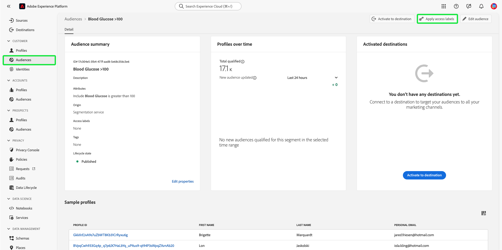

# Guia completo do controle de acesso baseado em atributos

Use o controle de acesso baseado em atributos no Adobe Experience Platform para oferecer a si mesmo e a outros clientes preocupados com a privacidade de várias marcas maior flexibilidade para gerenciar o acesso dos usuários. O acesso a objetos individuais, como campos de esquema e públicos-alvo, pode ser concedido com políticas baseadas nos atributos e na função do objeto. Esse recurso permite conceder ou revogar o acesso a objetos individuais para usuários específicos da Experience Platform em sua organização.

Essa funcionalidade permite categorizar campos de esquema, públicos-alvo etc. com rótulos que definem escopos organizacionais ou de uso de dados. Você pode aplicar esses mesmos rótulos a jornadas, Ofertas e outros objetos no Adobe Journey Optimizer. Em paralelo, os administradores podem definir políticas de acesso em torno dos campos de esquema do Experience Data Model (XDM) e gerenciar melhor quais usuários ou grupos (usuários internos, externos ou de terceiros) podem acessar esses campos.

>[!NOTE]
>
>Este documento se concentra no caso de uso de políticas de controle de acesso. Se você estiver tentando configurar políticas para controlar o **uso** de dados, em vez de quais usuários do Experience Platform têm acesso a eles, consulte o manual completo sobre [governança de dados](../../data-governance/e2e.md).

## Introdução

Este tutorial requer uma compreensão funcional dos seguintes componentes do Experience Platform:

* [[!DNL Experience Data Model (XDM)] Sistema](../../xdm/home.md): a estrutura padronizada pela qual o Experience Platform organiza os dados de experiência do cliente.
   * [Noções básicas sobre a composição de esquema](../../xdm/schema/composition.md): saiba mais sobre os blocos de construção básicos de esquemas XDM, incluindo princípios-chave e práticas recomendadas na composição de esquema.
   * [Tutorial do Editor de esquemas](../../xdm/tutorials/create-schema-ui.md): saiba como criar esquemas personalizados usando a interface do Editor de esquemas.
* [Serviço de segmentação do Adobe Experience Platform](../../segmentation/home.md): o mecanismo de segmentação do [!DNL Experience Platform] usado para criar segmentos de público-alvo a partir dos perfis do cliente com base nos comportamentos e atributos do cliente.

### Visão geral do caso de uso

Você passará por um exemplo de fluxo de trabalho de controle de acesso baseado em atributos, em que você criará e atribuirá funções, rótulos e políticas para configurar se os usuários podem ou não acessar recursos específicos na organização. Este guia usa um exemplo de restrição de acesso a dados confidenciais para demonstrar o fluxo de trabalho. Este caso de uso é descrito abaixo:

Você é um provedor de assistência médica e deseja configurar o acesso aos recursos em sua organização.

* Sua equipe interna de marketing deve ser capaz de acessar os dados do **[!UICONTROL PHI/ Regulated Health Data]**.
* Sua agência externa não pode acessar os dados do **[!UICONTROL PHI/ Regulated Health Data]**.

Para fazer isso, você deve configurar funções, recursos e políticas.

Você vai:

* [Rotular as funções para seus usuários](#label-roles): use o exemplo de um provedor da área de saúde (Grupo Funcional ACME) cujo grupo de marketing trabalhe com agências externas.
* [Rotular os recursos (campos de esquema e públicos-alvo)](#label-resources): atribua o rótulo **[!UICONTROL PHI/ Regulated Health Data]** aos recursos de esquema e públicos-alvo.
* [Ative a política que os vinculará](#policy): habilite a política padrão para impedir o acesso a campos de esquema e públicos-alvo conectando os rótulos dos seus recursos aos rótulos da sua função. Os usuários com rótulos correspondentes receberão acesso ao campo de esquema e ao segmento em todas as sandboxes.

## Permissões

[!UICONTROL Permissions] é a área do Experience Cloud em que os administradores podem definir funções e políticas de usuário para gerenciar permissões de recursos e objetos em um aplicativo de produto.

Através do [!UICONTROL Permissions], você pode criar e gerenciar funções e atribuir as permissões de recurso desejadas para essas funções. O [!UICONTROL Permissions] também permite gerenciar rótulos, sandboxes e usuários associados a uma função específica.

Entre em contato com o administrador do sistema para obter acesso se você não tiver privilégios de administrador.

Depois que você tiver privilégios de administrador, vá para [Adobe Experience Cloud](https://experience.adobe.com/) e entre usando suas credenciais da Adobe. Depois de conectada, a página **[!UICONTROL Overview]** é exibida para sua organização para a qual você tem privilégios de administrador. Esta página mostra os produtos nos quais sua organização está inscrita, juntamente com outros controles para adicionar usuários e administradores à organização. Selecione **[!UICONTROL Permissions]** para abrir o espaço de trabalho para sua integração com o Experience Platform.

O espaço de trabalho de Permissões para a interface do Experience Platform é exibido, abrindo na página **[!UICONTROL Overview]**.

## Aplicar rótulos a uma função {#label-roles}

>[!CONTEXTUALHELP]
>id="platform_permissions_labels_about"
>title="O que são rótulos?"
>abstract="Use rótulos para categorizar conjuntos de dados e campos de acordo com as políticas de uso e acesso aplicáveis. A Adobe Experience Platform fornece vários rótulos de uso de dados <strong>essenciais</strong> definidos pela Adobe e que abrangem uma ampla variedade de restrições comuns aplicáveis à governança de dados. Por exemplo, rótulos sensíveis <strong>S</strong> como os de dados de saúde regulamentados (RHD) permitem categorizar dados referentes a informações de saúde protegidas (PHI). Também é possível definir seus próprios rótulos personalizados para atender às necessidades de sua organização."
>additional-url="https://experienceleague.adobe.com/docs/experience-platform/data-governance/labels/overview.html?lang=pt-BR#understanding-data-usage-labels" text="Visão geral dos rótulos de uso de dados"

Funções são maneiras de categorizar os tipos de usuários que interagem com sua instância do Experience Platform e são blocos fundamentais das políticas de controle de acesso. Uma função tem determinado conjunto de permissões, e os membros da sua organização podem ser atribuídos a uma ou mais funções, dependendo do escopo de acesso de que precisam.

Para começar, selecione **[!UICONTROL Roles]** na navegação à esquerda e **[!UICONTROL ACME Business Group]**.

Em seguida, selecione **[!UICONTROL Labels]** e, em seguida, **[!UICONTROL Add Labels]**.

Uma lista de todos os rótulos na sua organização é exibida. Selecione **[!UICONTROL RHD]** para adicionar o rótulo para **[!UICONTROL PHI/Regulated Health Data]** e selecione **[!UICONTROL Save]**.

>[!NOTE]
>
>Ao adicionar um grupo de organizações a uma função, todos os usuários nesse grupo serão adicionados à função. Quaisquer alterações no grupo de organizações (usuários removidos ou adicionados) serão automaticamente atualizadas na função.

## Aplicar rótulos a campos de esquema {#label-resources}

Agora que você configurou uma função de usuário com o rótulo [!UICONTROL RHD], a próxima etapa é adicionar esse mesmo rótulo aos recursos que você deseja controlar para essa função.

Na navegação superior, selecione o **alternador de aplicativos**, representado pelo ícone , e selecione **[!UICONTROL Experience Platform]**.

Selecione **[!UICONTROL Schemas]** na navegação à esquerda e selecione **[!UICONTROL ACME Healthcare]** na lista de esquemas exibidos.

Em seguida, selecione **[!UICONTROL Labels]** para ver uma lista que exibe os campos associados ao seu esquema. Aqui, é possível atribuir rótulos a um ou vários campos de uma só vez. Selecione os campos **[!UICONTROL BloodGlucose]** e **[!UICONTROL InsulinLevel]** e selecione **[!UICONTROL Apply access and data governance labels]**.

A caixa de diálogo **[!UICONTROL Edit labels]** é exibida, permitindo que você escolha os rótulos que deseja aplicar aos campos de esquema. Para este caso de uso, selecione o rótulo **[!UICONTROL PHI/ Regulated Health Data]** e selecione **[!UICONTROL Save]**.

>[!NOTE]
>
>Quando um rótulo é adicionado a um campo, esse rótulo é aplicado ao recurso principal desse campo (uma classe ou um grupo de campos). Se a classe pai ou o grupo de campos for empregado por outros esquemas, esses esquemas herdarão o mesmo rótulo.

## Aplicar rótulos a públicos

>[!NOTE]
>
>Qualquer público-alvo que utilize um atributo rotulado também deve ser rotulado se você quiser que as mesmas restrições de acesso se apliquem a ele.

Depois de concluir a rotulagem dos campos de esquema, você pode começar a rotular os públicos.

Selecione **[!UICONTROL Audiences]** na navegação à esquerda, na seção **[!UICONTROL Customers]**. Uma lista de públicos-alvo disponíveis em sua organização é exibida. Neste exemplo, os dois públicos a seguir devem ser rotulados como se contivessem dados confidenciais de integridade:

* Glicose no Sangue >100
* Insulina &lt;50

Selecione **[!UICONTROL Blood Glucose >100]** (pelo nome do público, não pela caixa de seleção) para começar a rotular o público.

A tela de segmento **[!UICONTROL Details]** é exibida. Selecione **[!UICONTROL Manage Access]**.

A caixa de diálogo **[!UICONTROL Apply access and data governance labels]** é exibida, permitindo escolher os rótulos que deseja aplicar ao público-alvo. Para este caso de uso, selecione o rótulo **[!UICONTROL PHI/ Regulated Health Data]** e selecione **[!UICONTROL Save]**.

Repita as etapas acima com **[!UICONTROL Insulin <50]**.

>[!NOTE]
>
> Atribua rótulos criados no espaço de trabalho [!UICONTROL Permissions] (como os rótulos de segmento acima) a vários objetos no Adobe Journey Optimizer usando o [Controle de Acesso em Nível de Objeto](https://experienceleague.adobe.com/en/docs/journey-optimizer/using/access-control/object-based-access).&quot;

## Ativar a política de controle de acesso {#policy}

A política de controle de acesso padrão utilizará rótulos para definir quais funções de usuário têm acesso a recursos específicos do Experience Platform. Neste exemplo, o acesso a campos de esquema e públicos-alvo será negado em todas as sandboxes para usuários que não estejam em uma função que tenha os rótulos correspondentes no campo de esquema.

Para ativar a política de controle de acesso, selecione [!UICONTROL Permissions] na navegação à esquerda e **[!UICONTROL Policies]**.

Em seguida, selecione as reticências (`...`) ao lado de **[!UICONTROL Default-Field-Level-Access-Control-Policy]** e uma lista suspensa exibe controles para editar, ativar, excluir ou duplicar a função. Selecione **[!UICONTROL Activate]** na lista suspensa.

A caixa de diálogo ativar política é exibida, solicitando que você confirme a ativação. Selecione **[!UICONTROL Confirm]**.

A confirmação da ativação da política é recebida e você retorna à página [!UICONTROL Policies].

<!-- ## Create an access control policy {#policy}

>[!CONTEXTUALHELP]
>id="platform_permissions_policies_about"
>title="What are policies?"
>abstract="Policies are statements that bring attributes together to establish permissible and impermissible actions. Every organization comes with a default policy that you must activate to define rules for resources like segments and schema fields. Default policies can neither be edited nor deleted. However, default policies can be activated or deactivated."
>additional-url="https://experienceleague.adobe.com/docs/experience-platform/access-control/abac/permissions-ui/policies.html" text="Manage policies"

>[!CONTEXTUALHELP]
>id="platform_permissions_policies_about_create"
>title="Create a policy"
>abstract="Create a policy to define the actions that your users can and cannot take against your segments and schema fields."
>additional-url="https://experienceleague.adobe.com/docs/experience-platform/access-control/abac/permissions-ui/policies.html#create-a-new-policy" text="Create a policy"

>[!CONTEXTUALHELP]
>id="platform_permissions_policies_edit_permitdeny"
>title="Configure permissible and impermissible actions for a policy"
>abstract="A <b>deny access to</b> policy will deny users access when the criteria is met. Combined with <b>The following being false</b> - all users will be denied access unless they meet the matching criteria set. This type of policy allows you to protect a sensitive resource and only allow access to users with matching labels.  A <b>permit access to</b> policy will permit users access when the criteria are met. When combined with <b>The following being true</b> - users will be given access if they meet the matching criteria set. This does not explicitly deny access to users, but adds a permit access. This type of policy allows you to give additional access to resource and in addition to those users who might already have access through role permissions."
>additional-url="https://experienceleague.adobe.com/docs/experience-platform/access-control/abac/permissions-ui/policies.html#edit-a-policy" text="Edit a policy"

>[!CONTEXTUALHELP]
>id="platform_permissions_policies_edit_resource"
>title="Configure permissions for a resource"
>abstract="A resource is the asset or object that a user can or cannot access. Resources can be segments or schemas fields. You can configure write, read, or delete permissions for segments and schema fields."

>[!CONTEXTUALHELP]
>id="platform_permissions_policies_edit_condition"
>title="Edit conditions"
>abstract="Apply conditional statements to your policy to configure user access to certain resources. Select match all to require users to have roles with the same labels as a resource to be permitted access. Select match any to require users to have a role with just one label matching a label on a resource. Labels can either be defined as core or custom labels, with core labels representing labels created and provided by Adobe and custom labels representing labels that you created for your organization."

Access control policies leverage labels to define which user roles have access to specific Experience Platform resources. Policies can either be local or global and can override other policies. In this example, access to schema fields and segments will be denied in all sandboxes for users who don't have the corresponding labels in the schema field.

>[!NOTE]
>
>A "deny policy" is created to grant access to sensitive resources because the role grants permission to the subjects. The written policy in this example **denies** you access if you are missing the required labels.
a
To create an access control policy, select **[!UICONTROL Permissions]** from the left navigation and then select **[!UICONTROL Policies]**. Next, select **[!UICONTROL Create policy]**.

The **[!UICONTROL Create new policy]** dialog appears, prompting you to enter a name and an optional description. Select **[!UICONTROL Confirm]** when finished.

To deny access to the schema fields, use the dropdown arrow and select **[!UICONTROL Deny access to]** and then select **[!UICONTROL No resource selected]**. Next, select **[!UICONTROL Schema Field]** and then select **[!UICONTROL All]**.

The table below shows the conditions available when creating a policy:

| Conditions | Description |
| --- | --- |
| The following being false| When 'Deny access to' is set, access will be restricted if the user does not meet the criteria selected. |
| The following being true| When 'Permit access to' is set, access will be permitted if the user meets the selected criteria. |
| Matches any| The user has a label that matches any label applied to a resource. |
| Matches all| The user has all labels that matches all labels applied to a resource. |
| Core label| A core label is an Adobe-defined label that is available in all Experience Platform instances.|
| Custom label| A custom label is a label that has been created by your organization.|

Select **[!UICONTROL The following being false]** and then select **[!UICONTROL No attribute selected]**. Next, select the user **[!UICONTROL Core label]**, then select **[!UICONTROL Matches all]**. Select the resource **[!UICONTROL Core label]** and finally select **[!UICONTROL Add resource]**.

>[!TIP]
>
>A resource is the asset or object that a subject can or cannot access. Resources can be segments or schemas.

To deny access to the segments, use the dropdown arrow and select **[!UICONTROL Deny access to]** and then select **[!UICONTROL No resource selected]**. Next, select **[!UICONTROL Segment]** and then select **[!UICONTROL All]**.

Select **[!UICONTROL The following being false]** and then select **[!UICONTROL No attribute selected]**. Next, select the user **[!UICONTROL Core label]**, then select **[!UICONTROL Matches all]**. Select the resource **[!UICONTROL Core label]** and finally select **[!UICONTROL Save]**.

Select **[!UICONTROL Activate]** to activate the policy, and a dialog appears which prompts you to confirm activation. Select **[!UICONTROL Confirm]** and then select **[!UICONTROL Close]**.

 -->

## Próximas etapas

Você concluiu a aplicação de rótulos a uma função, campos de esquema e públicos-alvo. A agência externa atribuída a essas funções tem restrições para visualizar esses rótulos e seus valores no esquema, conjunto de dados e exibição de perfil. Esses campos também não podem ser usados na definição do segmento ao usar o Construtor de segmentos.

Para obter mais informações sobre o controle de acesso baseado em atributos, consulte a [visão geral do controle de acesso baseado em atributos](./overview.md).

O vídeo a seguir é destinado a ajudá-lo a entender o controle de acesso baseado em atributos e descreve como configurar funções, recursos e políticas.

>[!VIDEO](https://video.tv.adobe.com/v/345641?learn=on)
