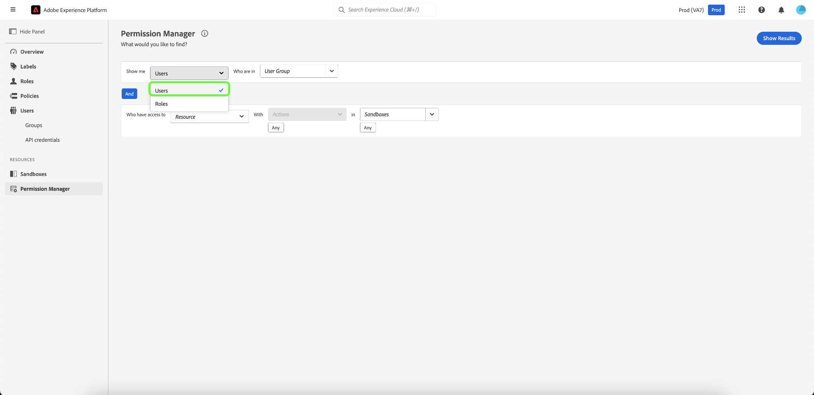

# Gerenciador de permissões

>[!NOTE]
>
>Para acessar [!UICONTROL Permission Manager], você deve ser um administrador de produto. Se você não tiver privilégios de administrador, entre em contato com o administrador do sistema para obter acesso.

Use consultas simples no [!UICONTROL Permission Manager] para criar relatórios concisos que ajudarão você a entender o gerenciamento de acesso e economizar tempo validando permissões de acesso em vários fluxos de trabalho e níveis de granularidade. Você pode utilizar [!UICONTROL Permission Manager] para localizar usuários que pertençam a um grupo de usuários e tenham privilégios de acesso especificados, bem como funções com rótulos específicos.

## Fazer uma pesquisa de usuários em um grupo especificado {#search-users}

>[!CONTEXTUALHELP]
>id="platform_permission_manager"
>title="Gerenciador de permissões"
>abstract="Use os seletores suspensos na página para obter relatórios de nível de acesso de diferentes níveis de granularidade para usuários e funções."
<!-- >additional-url="https://experienceleague.adobe.com/docs/experience-platform/access-control/abac/permissions-manager/permissions.html" text="Permission manager" -->

Usando a lista suspensa, selecione o atributo **[!UICONTROL Users]**.

Em seguida, selecione o **[!UICONTROL User Group]** que deseja pesquisar usando o menu suspenso.

>[!INFO]
>
>[!UICONTROL User Group] não é um campo obrigatório. Você só pode selecionar um grupo de usuários para cada relatório.

Para um relatório mais granular, você pode especificar o recurso com ações em uma sandbox específica. Selecione o **[!UICONTROL Resource]**, **[!UICONTROL Actions]** e **[!UICONTROL Sandboxes]** usando o menu suspenso e selecione **[!UICONTROL Show Results]**.

>[!INFO]
>
>[!UICONTROL Resource], [!UICONTROL Actions] e [!UICONTROL Sandboxes] não são campos obrigatórios. Uma ação ou sandbox pode ser removida depois de adicionada selecionando o **&#39;x&#39;** ao lado da seleção que você deseja remover.

Uma lista de usuários e seus endereços de email são relatados com base nos critérios selecionados. Use o menu de filtro à esquerda para atualizar os atributos e resultados. Para obter mais informações sobre um usuário específico, selecione o nome do usuário na lista.

## Procurar funções com rótulos específicos {#search-roles}

Usando a lista suspensa, selecione o atributo **[!UICONTROL Roles]**.

>[!INFO]
>
>[!UICONTROL Labels] não é um campo obrigatório. É possível selecionar vários rótulos, que serão listados abaixo desta lista suspensa depois de selecionados. Um rótulo pode ser removido depois de adicionado selecionando o **&#39;x&#39;** ao lado da ação.

Em seguida, selecione o **[!UICONTROL Labels]** que deseja pesquisar usando o menu suspenso.

Para um relatório mais granular, você pode especificar o recurso com ações em uma sandbox específica. Selecione o **[!UICONTROL Resource]**, **[!UICONTROL Actions]** e **[!UICONTROL Sandboxes]** usando o menu suspenso e selecione **[!UICONTROL Show Results]**.

>[!INFO]
>
>[!UICONTROL Resource], [!UICONTROL Actions] e [!UICONTROL Sandboxes] não são campos obrigatórios. Somente um [!UICONTROL Resource] pode ser selecionado para cada relatório. Uma ação ou sandbox pode ser removida depois de adicionada selecionando o **&#39;x&#39;** ao lado da seleção que você deseja remover.

Uma lista de funções é relatada com base nos critérios selecionados. Use o menu de filtro à esquerda para atualizar os atributos e resultados. Para obter mais informações sobre uma função específica, selecione a função na lista.

As seguintes informações são exibidas para cada função que corresponde aos seus critérios:

| Atributo | Descrição |
| --- | --- |
| Descrição | Uma breve descrição da função. |
| Rótulos | Uma lista de rótulos associados à função. |
| Sandboxes | Uma lista de Sanboxes contendo esta função. |
| Modificado em | A data e a marca de data e hora de quando a função foi atualizada pela última vez. |
| Criação em | A data e o carimbo de data e hora de quando a função foi criada. |
| Criado por | Detalhes do criador da função. |

## Próximas etapas

Agora você aprendeu a gerar relatórios para usuários e funções. Para saber mais sobre o controle de acesso baseado em atributos, consulte a [visão geral do controle de acesso baseado em atributos](../overview.md).
