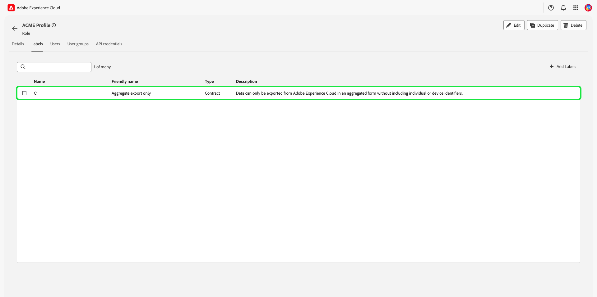
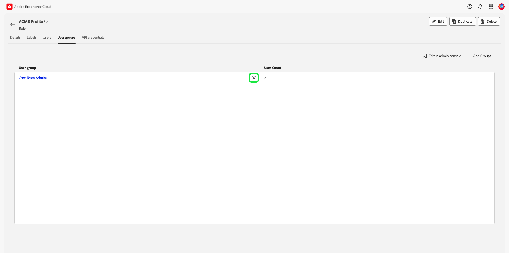

# Gerenciar permissões para uma função

>[!IMPORTANT]
>
>O controle de acesso baseado em atributos está disponível em uma versão limitada para clientes de assistência médica com base nos EUA. Esse recurso estará disponível para todos os clientes da Real-time Customer Data Platform assim que for totalmente lançado.

Permissões é a área do Experience Cloud, onde os administradores podem definir funções de usuário e políticas de acesso para gerenciar permissões de acesso para recursos e objetos em um aplicativo de produto.

Por meio das Permissões, é possível criar e gerenciar funções, bem como atribuir as permissões de recurso desejadas para essas funções. As permissões também permitem gerenciar rótulos, sandboxes e usuários associados a uma função específica.

Imediatamente após [criação de uma nova função](#create-a-new-role), você retornará ao **[!UICONTROL Funções]** guia . Se você estiver editando permissões para uma função existente, selecione a função no **[!UICONTROL Funções]** guia . Como alternativa, use a opção de filtro para filtrar os resultados e encontrar uma função.

## Filtrar funções

Selecione o ícone de funil () para exibir uma lista de controles de filtro para ajudar a limitar os resultados.

Os seguintes filtros estão disponíveis para funções na interface do usuário:

| Filtro | Descrição |
| --- | --- |
| [!UICONTROL Criado entre] | Selecione uma data inicial e/ou uma data final para definir um intervalo de datas para filtrar os resultados. |
| [!UICONTROL Criado por] | Filtre por criador de função selecionando um usuário na lista suspensa. |
| [!UICONTROL Modificado entre] | Selecione uma data inicial e/ou uma data final para definir um intervalo de datas para filtrar os resultados. |
| [!UICONTROL Modificado por] | Filtre por modificador de função selecionando um usuário na lista suspensa. |

Para remover um filtro, selecione o &quot;X&quot; no ícone de comprimido do filtro em questão ou selecione **[!UICONTROL Limpar tudo]** para remover todos os filtros.

## Detalhes da função

Selecione a função no **[!UICONTROL Funções]** , que abrirá a página de detalhes da função.

A guia de detalhes fornece uma visão geral da função. A visão geral exibe o nome da função, a descrição da função, o nome do usuário que criou e modificou a função, quando ela foi criada e modificada e as permissões anexadas à função. O nome da função e a descrição da função podem ser modificados, se necessário.

## Gerenciar rótulos para uma função

Selecione o **[!UICONTROL Rótulos]** para abrir a página rótulos de funções, em seguida, selecione **[!UICONTROL Adicionar rótulos]** para atribuir rótulos à função.

Rótulos estão listados nesta página. A lista exibe o nome do rótulo, o nome amigável, a categoria e sua descrição.

Selecione os rótulos na lista que deseja adicionar à função, em seguida, selecione **[!UICONTROL Salvar]**

Os rótulos adicionados aparecem em **[!UICONTROL Rótulos]** guia .

Para remover um rótulo de uma função, selecione o **X** ícone ao lado do nome dos rótulos.

## Gerenciamento de sandboxes para a função

Selecione o **[!UICONTROL Sandboxes]** para abrir a página sandboxes de funções. Aqui você pode ver uma lista de sandboxes que foram adicionadas à função .

Para adicionar mais sandboxes a uma função, selecione **[!UICONTROL Editar]**.

A próxima tela solicita que você escolha quais permissões de recurso existem em sandboxes para incluir na função usando a lista suspensa. Quando terminar, selecione **[!UICONTROL Salvar e sair]**.

## Gerenciamento de usuários para a função

Selecione o **[!UICONTROL Usuários]** para abrir a página de usuários de funções, em seguida, selecione **[!UICONTROL Adicionar usuários]** para atribuir usuários à função.

Selecione os usuários na lista que deseja adicionar à função. Como alternativa, use a barra de pesquisa para pesquisar o usuário inserindo seu nome ou endereço de email, em seguida, selecione **[!UICONTROL Salvar]**

Usuários adicionados aparecem em **[!UICONTROL Usuários]** guia .

Para remover um usuário de uma função, selecione o **X** ícone ao lado do nome do usuário.

## Gerenciar credenciais da API para a função

Selecione o **[!UICONTROL Credenciais da API]** para abrir a página credenciais da API de funções e selecione **[!UICONTROL Adicionar credenciais da API]** para atribuir credenciais da API à função.

Selecione as credenciais da API na lista que deseja adicionar à função, em seguida, selecione **[!UICONTROL Salvar]**

Adição de credenciais da API em **[!UICONTROL Credenciais da API]** guia .

Para remover as credenciais da API de uma função, selecione a variável **X** ícone ao lado do nome da credencial da API.

O **[!UICONTROL Remover credenciais da API]** for exibida, solicitando que você confirme a exclusão.

Você será retornado ao **[!UICONTROL Credenciais da API]** guia .

## Gerenciar grupos de usuários para funções

Os grupos de usuários são vários usuários que foram agrupados e têm acesso para executar as mesmas funções.

Selecione o **[!UICONTROL Grupos de usuários]** para abrir a página de grupos de usuários de funções e, em seguida, selecione **[!UICONTROL Adicionar grupos]** para atribuir grupos de usuários à função.

Selecione os grupos de usuários na lista que você deseja adicionar à função. Como alternativa, use a barra de pesquisa para pesquisar o grupo de usuários inserindo o nome do grupo e, em seguida, selecione **[!UICONTROL Salvar]**

O grupo de usuários adicionado aparece em **[!UICONTROL Grupos de usuários]** guia .

Para remover um grupo de usuários de uma função, selecione o **X** ícone ao lado do nome do grupo de usuários.

O **[!UICONTROL Remover grupo de usuários]** for exibida, solicitando que você confirme a exclusão.

Você será retornado ao **[!UICONTROL Grupos de usuários]** guia .

## Próximas etapas

Com as permissões estabelecidas, você pode prosseguir para a próxima etapa para [gerenciar usuários](users.md).
