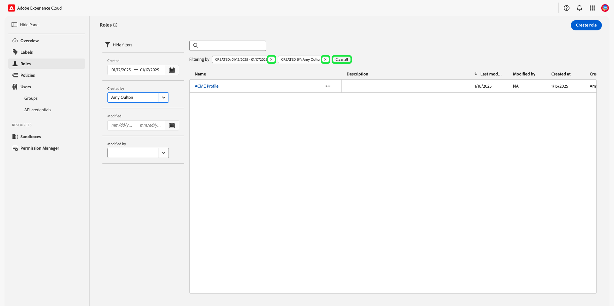
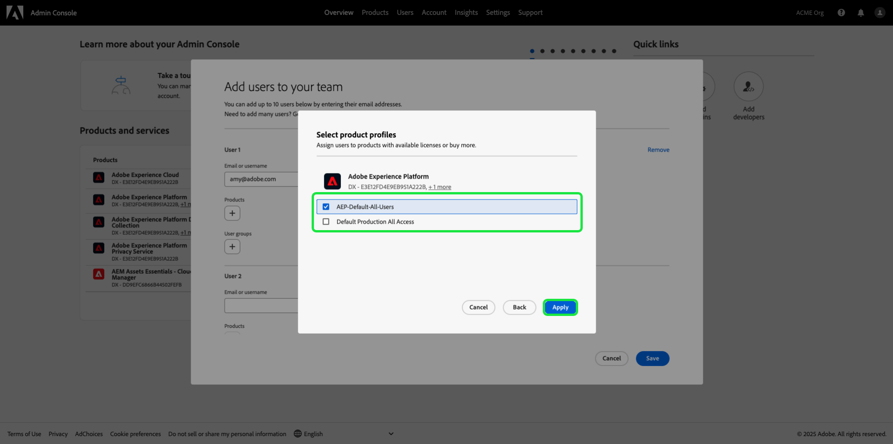

# Gerenciar permissões de uma função {#manage-role-permissions}

>[!CONTEXTUALHELP]
>id="platform_permissions_roles_about"
>title="O que são funções?"
>abstract="As funções definem o acesso que um(a) admin, especialista ou usuário final tem aos recursos em sua organização. Elas categorizam os usuários que interagem com a instância da Experience Platform e são elementos essenciais das políticas de controle de acesso. Uma função tem um determinado conjunto de permissões, e os membros da organização podem ter uma ou mais funções atribuídas, dependendo do escopo do acesso de visualização ou gravação necessário."
>additional-url="https://experienceleague.adobe.com/docs/experience-platform/access-control/abac/permissions-ui/roles.html?lang=pt-BR" text="Gerenciar funções"

>[!IMPORTANT]
>
>O controle de acesso usa a ID do usuário (uma ID exclusiva interna atribuída a um usuário) para conceder permissões. Quando uma organização for migrada do Adobe ID para a Business ID, todas as permissões definidas para os usuários serão perdidas, pois as alterações na ID do usuário e o controle de acesso usarão a ID do usuário recém-gerada. Se sua organização tiver migrado para a Business ID, entre em contato com o representante da Adobe para migrar sua ID de usuário da Adobe ID para a Business ID.

Permissões é a área do Experience Cloud em que os administradores podem definir funções de usuário e políticas de acesso para gerenciar permissões de acesso para recursos e objetos em um aplicativo de produto.

Através das Permissões, é possível criar e gerenciar funções, bem como atribuir as permissões de recurso desejadas para essas funções. As permissões também permitem gerenciar rótulos, sandboxes e usuários associados a uma função específica.

Imediatamente após [criar uma nova função](#create-a-new-role), você retornará à guia **[!UICONTROL Roles]**. Se você estiver editando permissões para uma função existente, selecione a função na guia **[!UICONTROL Roles]**. Como alternativa, use a opção de filtro para filtrar os resultados para localizar uma função.

## Filtrar funções

Selecione o ícone do funnel () para exibir uma lista de controles de filtro para ajudar a limitar os resultados.

Os seguintes filtros estão disponíveis para funções na interface do usuário do:

| Filtro | Descrição |
| --- | --- |
| [!UICONTROL Created between] | Selecione uma data inicial e/ou final para definir um intervalo de datas para filtrar os resultados. |
| [!UICONTROL Created by] | Filtre por criador de função selecionando um usuário na lista suspensa. |
| [!UICONTROL Modified between] | Selecione uma data inicial e/ou final para definir um intervalo de datas para filtrar os resultados. |
| [!UICONTROL Modified by] | Filtre por modificador de função selecionando um usuário na lista suspensa. |

Para remover um filtro, selecione o &quot;X&quot; no ícone de preenchimento do filtro em questão ou selecione **[!UICONTROL Clear all]** para remover todos os filtros.

## Detalhes da função {#role-details}

>[!CONTEXTUALHELP]
>id="platform_permissions_roles_details"
>title="Visão geral da função"
>abstract="A caixa de diálogo de visão geral exibe os detalhes da função, incluindo os recursos e as sandboxes que uma determinada função tem permissão para acessar. Para gerenciar rótulos, usuários, grupos de usuários e credenciais de API da função, navegue até a guia correspondente no espaço de trabalho da função."
>additional-url="https://experienceleague.adobe.com/pt-br/docs/experience-platform/access-control/abac/permissions-ui/permissions#manage-labels-for-a-role" text="Gerenciar rótulos de uma função"
>additional-url="https://experienceleague.adobe.com/pt-br/docs/experience-platform/access-control/abac/permissions-ui/permissions#manage-users-for-a-role" text="Gerenciar usuários de uma função"

Selecione a função na guia **[!UICONTROL Roles]**, que abrirá o painel [!UICONTROL Details] da função.

O painel [!UICONTROL Details] fornece uma visão geral da função. A visão geral exibe o nome da função, a descrição, o criador e o último modificador, juntamente com as datas de criação e modificação. Ele também mostra as permissões anexadas à função e a lista de sandboxes atribuídas. O nome e a descrição da função podem ser modificados, se necessário.

## Gerenciar rótulos de uma função

Selecione a guia **[!UICONTROL Labels]** para abrir o espaço de trabalho de rótulos de funções e selecione **[!UICONTROL Add labels]** para atribuir rótulos à função.

A caixa de diálogo **[!UICONTROL Apply Access and Data Governance Labels]** é exibida, apresentando uma lista de rótulos. A lista exibe o nome do rótulo, o nome amigável, a categoria e sua descrição.

Selecione os rótulos da lista que você deseja adicionar à função e selecione **[!UICONTROL Save]**

Os rótulos adicionados aparecem na guia **[!UICONTROL Labels]**.

Para remover um rótulo de uma função, selecione o rótulo e **[!UICONTROL Remove Labels]**.

## Gerenciar sandboxes para uma função

Selecione a guia **[!UICONTROL Details]** e navegue até a seção **[!UICONTROL Sandboxes]**. Selecione **[!UICONTROL View All]** para ver a lista completa de sandboxes adicionadas à função.

Para adicionar mais sandboxes a uma função, selecione **[!UICONTROL Edit]** na parte superior direita da interface.

A próxima tela solicita que você escolha quais recursos de sandboxes incluir na função usando a lista suspensa. Quando terminar, selecione **[!UICONTROL Save]** e depois **[!UICONTROL Close]**.

## Gerenciar usuários de uma função

Selecione a guia **[!UICONTROL Users]** para abrir o espaço de trabalho de funções [!UICONTROL Users] e selecione **[!UICONTROL Add Users]** para atribuir usuários à função.

A caixa de diálogo **[!UICONTROL Add Users]** é exibida. Selecione os usuários da lista que você deseja adicionar à função. Como alternativa, use a barra de pesquisa para procurar o usuário digitando seu nome ou endereço de email e selecione **[!UICONTROL Save]**

Os usuários adicionados aparecem na guia **[!UICONTROL Users]**.

Para remover um usuário de uma função, selecione o ícone **X** ao lado do nome do usuário.

O vídeo a seguir tem como objetivo ajudá-lo a entender a criação de uma nova função e o gerenciamento de usuários para essa função.

>[!VIDEO](https://video.tv.adobe.com/v/3475978/?captions=por_br&learn=on)

## Gerenciar credenciais de API para uma função {#manage-api-credentials-for-role}

>[!CONTEXTUALHELP]
>id="platform_permissions_apicredentials_about"
>title="O que são credenciais de API?"
>abstract="As credenciais de API são atribuídas às funções para conceder aos usuários e desenvolvedores acesso às APIs da Experience Platform. Ao usar as APIs da Experience Platform, é possível executar operações CRUD (criação, leitura, atualização e exclusão) básicas em dados de forma programática, como configurar atributos calculados, acessar dados e entidades, exportar dados, excluir dados ou lotes desnecessários e muito mais."
>additional-url="https://experienceleague.adobe.com/pt-br/docs/experience-platform/landing/platform-apis/api-guide" text="Guia da API da Experience Platform"

>[!IMPORTANT]
>
> Para usar e gerenciar credenciais de API em [!UICONTROL Permissions], os usuários devem ter privilégios de administrador do sistema.

Para usar as APIs do Experience Platform como um usuário ou desenvolvedor, um administrador do sistema precisa adicionar credenciais de API, além de um conjunto de permissões fornecido por uma função. Para obter um guia completo sobre como criar e atribuir credenciais de API, bem como as permissões necessárias, consulte o tutorial passo a passo em [autenticar e acessar APIs do Experience Platform](../../../landing/api-authentication.md#generate-credentials).

Selecione a guia **[!UICONTROL API credentials]** para abrir o espaço de trabalho de credenciais da API de funções e selecione **[!UICONTROL Add API credentials]** para atribuir credenciais da API à função.

A caixa de diálogo **[!UICONTROL Add API credentials]** é exibida. Selecione as credenciais de API na lista para adicionar à função e selecione **[!UICONTROL Save]**

As credenciais de API adicionadas aparecem na guia **[!UICONTROL API credentials]**.

Para remover uma credencial de API de uma função, selecione o ícone **X** ao lado do nome da credencial de API.

A caixa de diálogo **[!UICONTROL Remove API credentials]** é exibida, solicitando que você confirme a exclusão. Selecione **[!UICONTROL Confirm]** para concluir a remoção da credencial selecionada.

Você retornará à guia **[!UICONTROL API credentials]**.

## Gerenciar grupos de usuários para uma função {#manage-user-groups}

>[!CONTEXTUALHELP]
>id="platform_permissions_usergroups_about"
>title="O que são grupos de usuários?"
>abstract="Grupos de usuários são coleções de vários usuários que compartilham o acesso às mesmas funções. O acesso aos recursos em uma organização é gerenciado por meio de funções atribuídas a grupos de usuários."
>additional-url="https://experienceleague.adobe.com/pt-br/docs/experience-platform/access-control/abac/permissions-ui/roles" text="Gerenciar funções"

Os grupos de usuários são vários usuários que foram agrupados e têm acesso para executar as mesmas funções.

Selecione a guia **[!UICONTROL User groups]** para abrir o espaço de trabalho de grupos de usuários da função e selecione **[!UICONTROL Add Groups]** para atribuir grupos de usuários à função.

A caixa de diálogo **[!UICONTROL Add Groups]** é exibida. Selecione os grupos de usuários na lista que você deseja adicionar à função. Como alternativa, use a barra de pesquisa para procurar o grupo de usuários digitando o nome do grupo e selecione **[!UICONTROL Save]**

O grupo de usuários adicionado aparece na guia **[!UICONTROL User groups]**.

Para remover um grupo de usuários de uma função, selecione o ícone **X** ao lado do nome do grupo de usuários.

A caixa de diálogo **[!UICONTROL Remove user group]** é exibida, solicitando que você confirme a exclusão. Selecione **[!UICONTROL Confirm]** para remover o grupo de usuários selecionado.

Você retornará à guia **[!UICONTROL User groups]**.

## Adicionar usuários ao Experience Platform

Como administrador do sistema, você pode conceder acesso de desenvolvedor a um usuário para que ele possa [criar integrações](../../../landing/api-authentication.md#generate-credentials) na Adobe Developer Console.

Para adicionar uma Experience Platform de usuário, faça logon no [Admin Console](https://adminconsole.adobe.com) e selecione **[!UICONTROL Add users]**.

A caixa de diálogo **[!UICONTROL Add users to your team]** é exibida. Insira o endereço de email do usuário, o nome (opcional) e o sobrenome (opcional). Depois selecione **[!UICONTROL Products]**.

A caixa de diálogo **[!UICONTROL Select products]** é exibida. Selecione **[!UICONTROL Adobe Experience Platform]**.

A caixa de diálogo **[!UICONTROL Select product profiles]** é exibida. Selecione **[!UICONTROL AEP-Default-All-Users]** e depois **[!UICONTROL Save]**.

Revise as informações e selecione **[!UICONTROL Save]** para adicionar o usuário.

## Próximas etapas

Com as permissões estabelecidas, você pode prosseguir para a próxima etapa para [gerenciar usuários](users.md).
