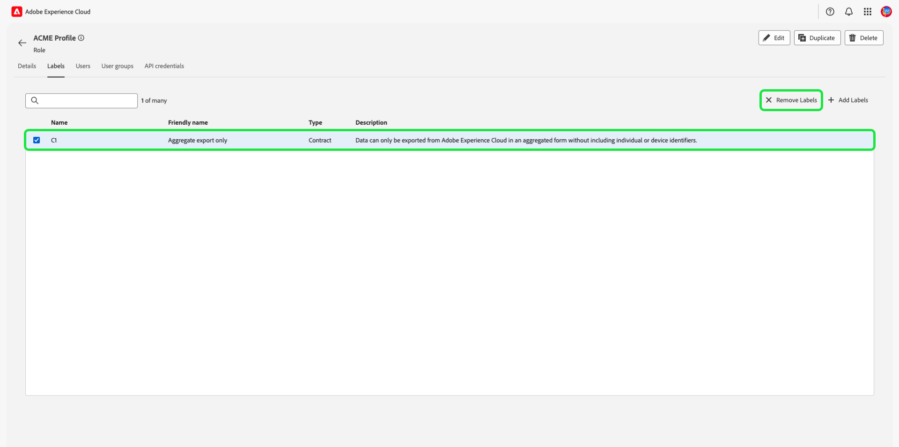

# Gerenciar permissões de uma função

>[!IMPORTANT]
>
>O controle de acesso usa a ID do usuário (uma ID exclusiva interna atribuída a um usuário) para conceder permissões. Quando uma organização for migrada do Adobe ID para a Business ID, todas as permissões definidas para os usuários serão perdidas, pois as alterações na ID do usuário e o controle de acesso usarão a ID do usuário recém-gerada. Se sua organização migrou para a Business ID, entre em contato com o representante da Adobe para migrar sua ID de usuário da Adobe ID para a Business ID.

Permissões é a área do Experience Cloud em que os administradores podem definir funções de usuário e políticas de acesso para gerenciar permissões de acesso para recursos e objetos em um aplicativo de produto.

Através das Permissões, é possível criar e gerenciar funções, bem como atribuir as permissões de recurso desejadas para essas funções. As permissões também permitem gerenciar rótulos, sandboxes e usuários associados a uma função específica.

Imediatamente após [criar uma nova função](#create-a-new-role), você retornará à guia **[!UICONTROL Funções]**. Se você estiver editando permissões para uma função existente, selecione a função na guia **[!UICONTROL Funções]**. Como alternativa, use a opção de filtro para filtrar os resultados para localizar uma função.

## Filtrar funções

Selecione o ícone de funil () para exibir uma lista de controles de filtro para ajudar a limitar os resultados.

Os seguintes filtros estão disponíveis para funções na interface do usuário do:

| Filtro | Descrição |
| --- | --- |
| [!UICONTROL Criado entre] | Selecione uma data inicial e/ou final para definir um intervalo de datas para filtrar os resultados. |
| [!UICONTROL Criado por] | Filtre por criador de função selecionando um usuário na lista suspensa. |
| [!UICONTROL Modificado entre] | Selecione uma data inicial e/ou final para definir um intervalo de datas para filtrar os resultados. |
| [!UICONTROL Modificado por] | Filtre por modificador de função selecionando um usuário na lista suspensa. |

Para remover um filtro, selecione o &quot;X&quot; no ícone de preenchimento do filtro em questão ou selecione **[!UICONTROL Limpar tudo]** para remover todos os filtros.

## Detalhes da função

Selecione a função na guia **[!UICONTROL Funções]**, que abrirá a página de detalhes da função.

A guia de detalhes fornece uma visão geral da função. A visão geral exibe o nome da função, a descrição da função, o nome do usuário que criou e modificou a função, quando a função foi criada e modificada e as permissões anexadas à função. O nome e a descrição da função podem ser modificados, se necessário.

## Gerenciar rótulos para uma função

Selecione a guia **[!UICONTROL Rótulos]** para abrir a página de rótulos de funções, em seguida, selecione **[!UICONTROL Adicionar rótulos]** para atribuir rótulos à função.

Os rótulos estão listados nesta página. A lista exibe o nome do rótulo, o nome amigável, a categoria e sua descrição.

Selecione os rótulos da lista que você deseja adicionar à função e selecione **[!UICONTROL Salvar]**

Os rótulos adicionados aparecem na guia **[!UICONTROL Rótulos]**.

Para remover um rótulo de uma função, selecione o ícone **X** ao lado do nome dos rótulos.

## Gerenciamento de sandboxes para a função

Selecione a guia **[!UICONTROL Sandboxes]** para abrir a página sandboxes de funções. Aqui você pode ver uma lista de sandboxes que foram adicionadas à função.

Para adicionar mais sandboxes a uma função, selecione **[!UICONTROL Editar]**.

A próxima tela solicita que você escolha quais permissões de recurso existem nas sandboxes para incluir na função usando a lista suspensa. Quando terminar, selecione **[!UICONTROL Salvar e sair]**.

## Gerenciando usuários para a função

Selecione a guia **[!UICONTROL Usuários]** para abrir a página de usuários de funções e selecione **[!UICONTROL Adicionar usuários]** para atribuir usuários à função.

Selecione os usuários da lista que você deseja adicionar à função. Como alternativa, use a barra de pesquisa para procurar o usuário digitando seu nome ou endereço de email e selecione **[!UICONTROL Salvar]**

Os usuários adicionados aparecem na guia **[!UICONTROL Usuários]**.

Para remover um usuário de uma função, selecione o ícone **X** ao lado do nome dos usuários.

O vídeo a seguir tem como objetivo ajudá-lo a entender a criação de uma nova função e o gerenciamento de usuários para essa função.

>[!VIDEO](https://video.tv.adobe.com/v/336081/?learn=on)

## Gerenciar credenciais de API para a função {#manage-api-credentials-for-role}

Selecione a guia **[!UICONTROL Credenciais da API]** para abrir a página de credenciais da API de funções e selecione **[!UICONTROL Adicionar credenciais da API]** para atribuir credenciais da API à função.

Selecione as credenciais de API na lista que você deseja adicionar à função e selecione **[!UICONTROL Salvar]**

As credenciais de API adicionadas aparecem na guia **[!UICONTROL Credenciais de API]**.

Para remover credenciais de API de uma função, selecione o ícone **X** ao lado do nome da credencial da API.

A caixa de diálogo **[!UICONTROL Remover credenciais de API]** é exibida, solicitando que você confirme a exclusão.

Você retornará à guia **[!UICONTROL Credenciais da API]**.

## Gerenciar grupos de usuários para funções

Os grupos de usuários são vários usuários que foram agrupados e têm acesso para executar as mesmas funções.

Selecione a guia **[!UICONTROL Grupos de usuários]** para abrir a página de grupos de usuários de funções e selecione **[!UICONTROL Adicionar grupos]** para atribuir grupos de usuários à função.

Selecione os grupos de usuários na lista que você deseja adicionar à função. Como alternativa, use a barra de pesquisa para procurar o grupo de usuários digitando o nome do grupo e selecione **[!UICONTROL Salvar]**

O grupo de usuários adicionado aparece na guia **[!UICONTROL Grupos de usuários]**.

Para remover um grupo de usuários de uma função, selecione o ícone **X** ao lado do nome do grupo de usuários.

A caixa de diálogo **[!UICONTROL Remover grupo de usuários]** é exibida, solicitando que você confirme a exclusão.

Você retornará à guia **[!UICONTROL Grupos de usuários]**.

## Adicionar usuários ao Experience Platform por meio de uma função

Para adicionar um usuário a uma função, faça logon no Admin Console e selecione **[!UICONTROL Adicionar usuários]**

A caixa de diálogo **[!UICONTROL Adicionar usuários à sua equipe]** é exibida. Insira o endereço de email do usuário, o nome (opcional) e o sobrenome (opcional).

Selecione o ícone de lápis para selecionar produtos e grupos de usuários, selecione **[!UICONTROL Adobe Experience Platform]**, selecione **[!UICONTROL AEP-Padrão-Todos-Usuários]** e **[!UICONTROL Salvar]**.

## Próximas etapas

Com as permissões estabelecidas, você pode prosseguir para a próxima etapa para [gerenciar usuários](users.md).
