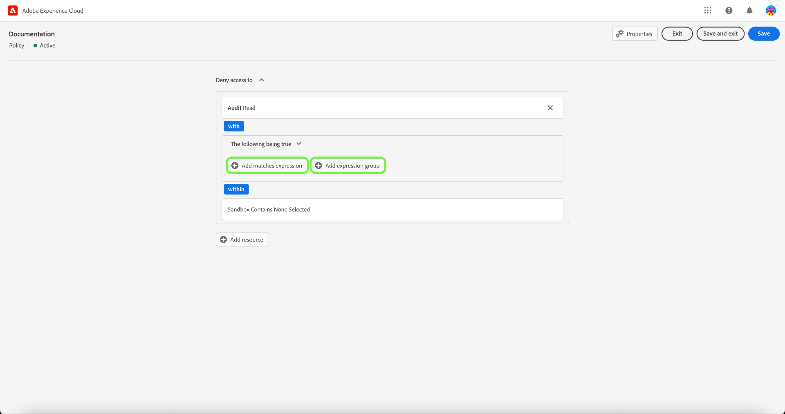
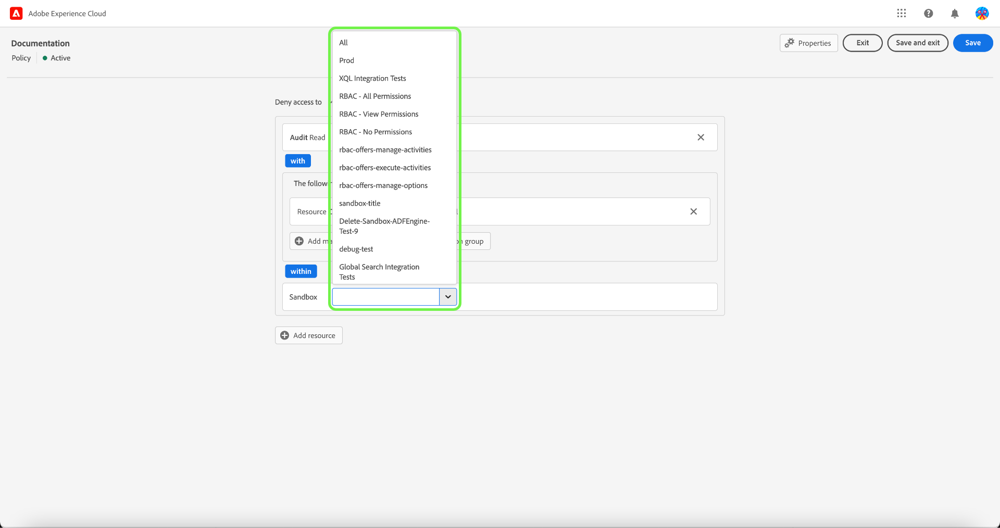
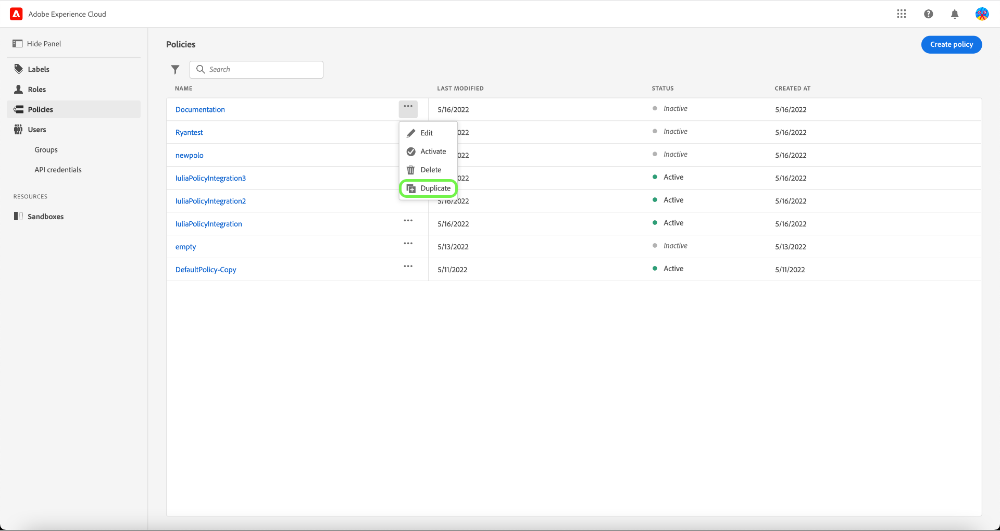
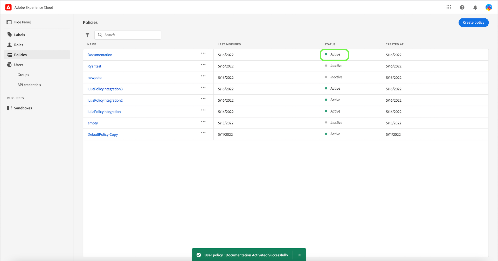

# Gerenciar políticas

>[!IMPORTANT]
>
>O controle de acesso baseado em atributos está disponível em uma versão limitada para clientes de assistência médica com base nos EUA. Esse recurso estará disponível para todos os clientes da Real-time Customer Data Platform assim que for totalmente lançado.

Políticas são declarações que reúnem atributos para estabelecer ações admissíveis e não permissíveis. As políticas podem ser locais ou globais e podem substituir outras políticas.

## Criar uma nova política

Para criar uma nova política, selecione a **[!UICONTROL Políticas]** na barra lateral e selecione **[!UICONTROL Criar Política]**.

O **[!UICONTROL Criar uma nova política]** for exibida, solicitando a inserção de um nome e uma descrição opcional. Quando terminar, selecione **[!UICONTROL Confirmar]**.

Usando a seta suspensa, selecione se desejar **Permitir acesso a** () um recurso ou **Negar acesso a** () um recurso.

Em seguida, selecione o recurso que deseja incluir na política usando o menu suspenso e o tipo de acesso de pesquisa, leitura ou gravação.

Em seguida, usando a seta suspensa, selecione a condição que deseja aplicar a essa política, **Sendo verdadeiro o seguinte** () ou **Sendo falso** ().

Selecione o ícone de mais para **Adicionar expressão de correspondências** ou **Adicionar grupo de expressões** para o recurso .

Usando a lista suspensa, selecione o **Recurso**.

Em seguida, usando a lista suspensa, selecione o **Corresponde**.

Em seguida, usando a lista suspensa, selecione o **Usuário**.

Finalmente, selecione o **Sandbox** que você gostaria que as condições da política fossem aplicadas usando o menu suspenso.

Selecionar **Adicionar recurso** para adicionar mais recursos. Depois de concluído, selecione **[!UICONTROL Salvar e sair]**.

A nova política foi criada com êxito e você é redirecionado para a função **[!UICONTROL Políticas]** , onde você verá a política recém-criada na lista.

## Editar uma política

Para editar uma política existente, selecione a política no **[!UICONTROL Políticas]** guia . Como alternativa, use a opção de filtro para filtrar os resultados e encontrar a política que deseja editar.

Em seguida, selecione as reticências (`…`) ao lado do nome das políticas e uma lista suspensa exibe controles para editar, desativar, excluir ou duplicar a função. Selecione editar na lista suspensa.

A tela de permissões de política é exibida. Faça as atualizações e selecione **[!UICONTROL Salvar e sair]**.

A política foi atualizada com êxito e você é redirecionado para a função **[!UICONTROL Políticas]** guia .

## Duplicar uma política

Para duplicar uma política existente, selecione a política no **[!UICONTROL Políticas]** guia . Como alternativa, use a opção de filtro para filtrar os resultados e encontrar a política que deseja editar.

Em seguida, selecione as reticências (`…`) ao lado de um nome de política e uma lista suspensa exibe controles para editar, desativar, excluir ou duplicar a função. Selecione duplicata na lista suspensa.

O **[!UICONTROL Política duplicada]** for exibida, solicitando que você confirme a duplicação.

A nova política aparece na lista como uma cópia do original no **[!UICONTROL Políticas]** guia .

## Excluir uma política

Para excluir uma política existente, selecione a política no **[!UICONTROL Políticas]** guia . Como alternativa, use a opção de filtro para filtrar os resultados e encontrar a política que deseja excluir.

Em seguida, selecione as reticências (`…`) ao lado de um nome de política e uma lista suspensa exibe controles para editar, desativar, excluir ou duplicar a função. Selecione excluir na lista suspensa.

O **[!UICONTROL Excluir política do usuário]** for exibida, solicitando que você confirme a exclusão.

Você volta ao **[!UICONTROL políticas]** e uma confirmação do pop-up de exclusão é exibida.

## Ativar uma política

Para ativar uma política existente, selecione a política no **[!UICONTROL Políticas]** guia . Como alternativa, use a opção de filtro para filtrar os resultados e encontrar a política que deseja excluir.

Em seguida, selecione as reticências (`…`) ao lado de um nome de política e uma lista suspensa exibe controles para editar, ativar, excluir ou duplicar a função. Selecione ativar na lista suspensa.

O **[!UICONTROL Ativar política do usuário]** for exibida, solicitando que você confirme a ativação.

Você volta ao **[!UICONTROL políticas]** e uma confirmação do pop-up de ativação é exibida. O status da política é mostrado como ativa.

## Próximas etapas

Com uma nova política criada, você pode prosseguir para a próxima etapa para [gerenciar permissões para uma função](permissions.md).
