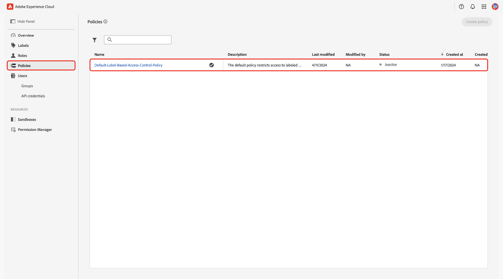
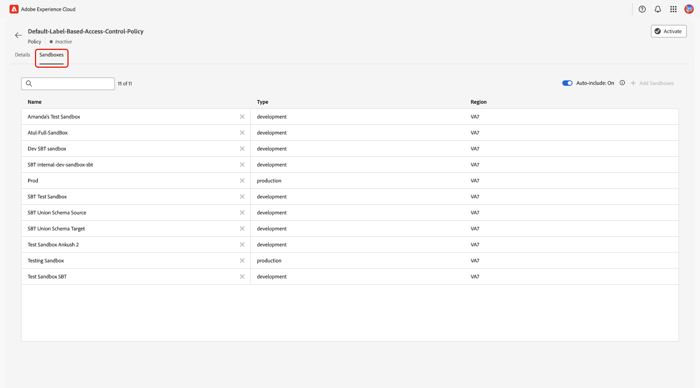
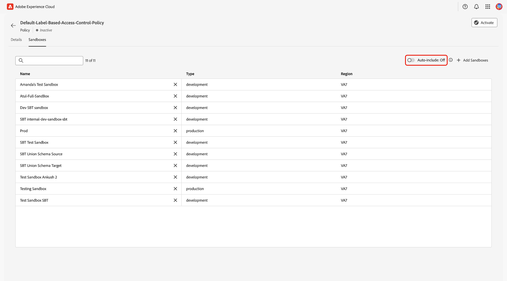
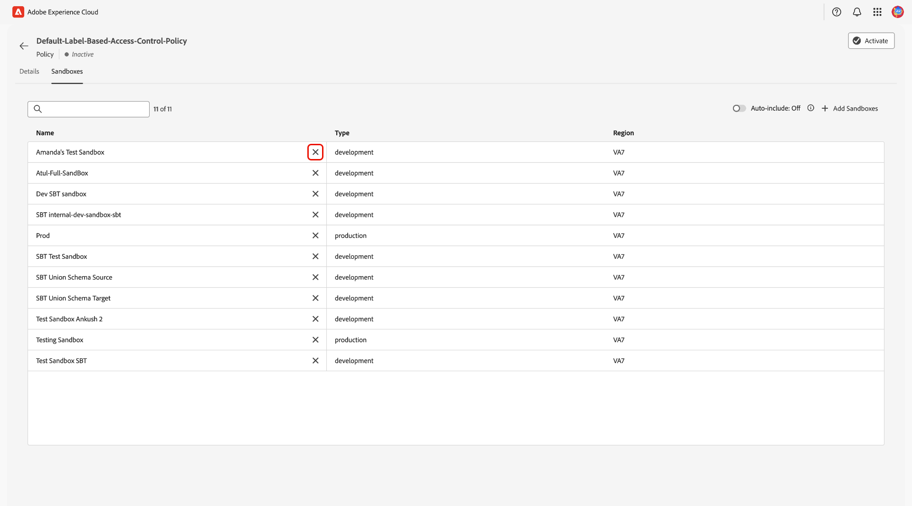
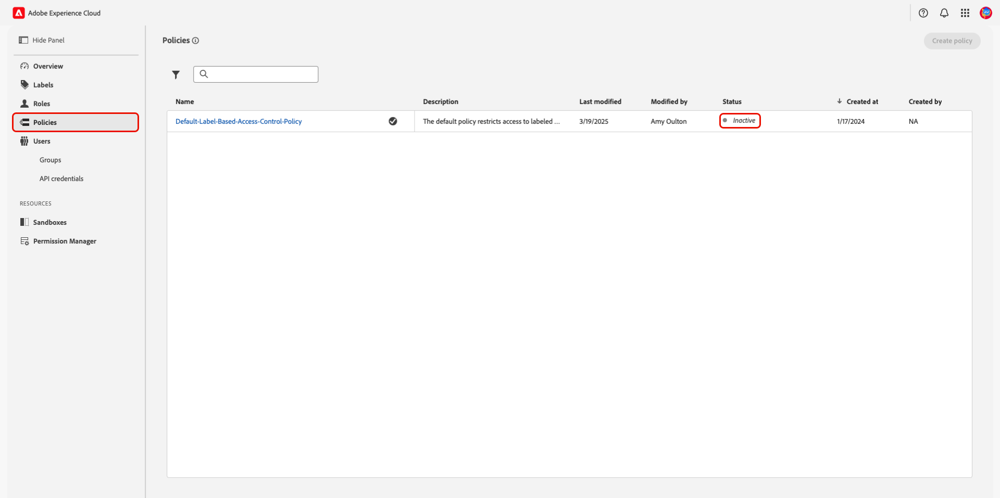
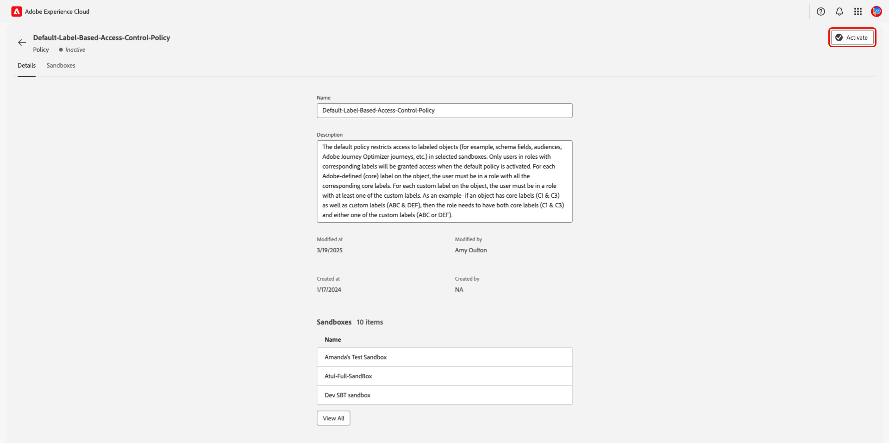

# Gerenciar políticas de controle de acesso

As políticas de controle de acesso são declarações que reúnem atributos para estabelecer ações permitidas e inadmissíveis. A Adobe fornece uma política padrão que pode ser ativada imediatamente ou quando sua organização estiver pronta para começar a controlar o acesso a objetos específicos com base em [rótulos](./labels.md){target="_blank"}. A política padrão, **[!UICONTROL Default-Label-Based-Access-Control-Policy]**, usa rótulos aplicados a recursos para negar acesso, a menos que os usuários estejam em uma função com um rótulo correspondente.

>[!IMPORTANT]
>
>As políticas de controle de acesso não devem ser confundidas com as políticas de uso de dados, que controlam como os dados são usados no Adobe Experience Platform. Consulte o manual sobre como criar [políticas de uso de dados](../../../data-governance/policies/create.md){target="_blank"} para obter mais informações.

## Configurar política para uma sandbox {#configure-policy}

>[!NOTE]
>
>A política **[!UICONTROL Default-Label-Based-Access-Control-Policy]** é a única disponível para configuração no momento.

Para começar a configurar uma política, navegue até **[!UICONTROL Permissions]** no [Adobe Experience Cloud](https://experience.adobe.com/){target="_blank"}. Selecione **[!UICONTROL Policies]** no painel esquerdo. Selecione o **[!UICONTROL Default-Label-Based-Access-Control-Policy]** na lista.

{zoomable="yes"}

O espaço de trabalho de detalhes da política será exibido. Selecione **[!UICONTROL Sandboxes]**. Uma lista de sandboxes associadas à política é exibida.

{zoomable="yes"}

### Adicionar política a todas as sandboxes {#add-policy-to-all}

>[!IMPORTANT]
>
>Por padrão, **[!UICONTROL Auto-include]** está ativado, o que significa que todas as sandboxes atuais e futuras são automaticamente adicionadas à política.

Desative o recurso **[!UICONTROL Auto-include]** para impedir que sandboxes futuras sejam adicionadas automaticamente à política. A desativação do recurso **não** removerá sandboxes da política.

{zoomable="yes"}

Se **[!UICONTROL Auto-include]** não estiver ativo em uma política, você poderá usar o botão para ativá-lo novamente. A caixa de diálogo **[!UICONTROL Enable Auto-include]** é exibida solicitando que você confirme sua seleção. Selecione **[!UICONTROL Enable]** para concluir a definição de configuração.

>[!NOTE]
>
>As sandboxes removidas da política enquanto **[!UICONTROL Auto-include]** era desativado serão adicionadas novamente.

{zoomable="yes"}

### Selecionar sandboxes manualmente para uma política {#manually-select-sandboxes}

Para adicionar ou remover manualmente sandboxes a uma política, a **[!UICONTROL Auto-include]** alternância **deve** estar desativada.

#### Adicionar sandboxes

Para adicionar sandboxes a uma política, selecione **[!UICONTROL Add Sandboxes]**.

{zoomable="yes"}

A caixa de diálogo **[!UICONTROL Add Sandboxes]** é exibida. Selecione as sandboxes que deseja adicionar à política e selecione **[!UICONTROL Save]**.

{zoomable="yes"}

>[!NOTE]
>
>Se todas as sandboxes disponíveis já tiverem sido adicionadas à política, você verá a mensagem &quot;Você não tem nada na biblioteca&quot; na caixa de diálogo.

#### Remover sandboxes

Para remover sandboxes de uma política, localize a sandbox que deseja remover da lista e selecione o ícone **X**.

{zoomable="yes"}

Uma caixa de diálogo de confirmação será exibida. Selecione **[!UICONTROL Confirm]** para concluir a remoção da sandbox da política.

{zoomable="yes"}

## Ativar uma política {#activate-policy}

>[!CONTEXTUALHELP]
>id="platform_permissions_policies_about"
>title="O que são políticas?"
>abstract="Políticas são declarações que reúnem atributos para estabelecer ações permitidas e não permitidas. Cada organização possui uma política padrão que você deve ativar para começar a controlar o acesso a objetos específicos com base em rótulos. Os rótulos aplicados aos recursos negam o acesso, a menos que os usuários sejam atribuídos a uma função com um rótulo correspondente. As políticas não podem ser editadas ou excluídas, mas podem ser ativadas ou desativadas."
>additional-url="https://experienceleague.adobe.com/pt-br/docs/experience-platform/access-control/abac/permissions-ui/labels" text="Gerenciar rótulos"

Para ativar uma política existente, selecione a política na guia **[!UICONTROL Policies]** em **[!UICONTROL Permissions]**. O status de ativação da política está visível na seção **[!UICONTROL Status]**.

{zoomable="yes"}

O espaço de trabalho de detalhes da política será exibido. Selecione **[!UICONTROL Activate]**.

{zoomable="yes"}

A caixa de diálogo **[!UICONTROL Activate Policy]** é exibida. Selecione **[!UICONTROL Confirm]** para concluir a ativação da política.

{zoomable="yes"}

## Próximas etapas

Com uma política ativada, você pode prosseguir para a próxima etapa para [gerenciar permissões para uma função](permissions.md).

<!--
Policies are applied at the sandbox level to control which sandboxes enforce label-based access control. By default, the **[!UICONTROL Auto-include]** feature is turned on, which means all current and future sandboxes are automatically added to the policy. When **[!UICONTROL Auto-include]** is turned off, only the sandboxes you manually add will be subject to the policy's access control rules.

To begin configuring a policy's sandboxes, navigate to **[!UICONTROL Permissions]** in [Adobe Experience Cloud](https://experience.adobe.com/){target="_blank"}. Select **[!UICONTROL Policies]** from the left panel, then select the **[!UICONTROL Default-Label-Based-Access-Control-Policy]** from the list.

The policy's details workspace appears. Select the **[!UICONTROL Sandboxes]** tab to view the list of sandboxes associated with the policy and access the sandbox configuration options.

### Manage Auto-include {#manage-auto-include}

To control which sandboxes are included in a policy, you can toggle the **[!UICONTROL Auto-include]** feature on or off. When you toggle off **[!UICONTROL Auto-include]**, future sandboxes will not be automatically added to the policy. However, toggling off the feature **will not** remove any sandboxes that are already included in the policy.

To re-enable **[!UICONTROL Auto-include]**, use the toggle to turn it back on. The **[!UICONTROL Enable Auto-include]** dialog appears prompting you to confirm your selection. Select **[!UICONTROL Enable]** to complete the configuration setting.

>[!NOTE]
>
>When you re-enable **[!UICONTROL Auto-include]**, any sandboxes you previously removed from the policy will be re-added.

### Manually manage sandboxes {#manually-manage-sandboxes}

When **[!UICONTROL Auto-include]**is turned off, you can manually add or remove specific sandboxes from the policy. This gives you precise control over which sandboxes enforce the policy's access control rules.

>[!NOTE]
>
>To manually add or remove sandboxes, the **[!UICONTROL Auto-include]** toggle **must** be off.

**To add sandboxes:**

Select **[!UICONTROL Add Sandboxes]** from the policy's sandbox workspace.

The **[!UICONTROL Add Sandboxes]** dialog appears, displaying your library of available sandboxes. Select the sandbox(es) you wish to add to the policy and then select **[!UICONTROL Save]**.

>[!NOTE]
>
>If all available sandboxes are already included in the policy, you will see a "You have nothing in your library" message within the dialog.

**To remove sandboxes:**

Find the sandbox you wish to remove from the list and select the **X** icon next to its name.

A confirmation dialog will appear. Select **[!UICONTROL Confirm]** to finish removing the sandbox from the policy.

-->