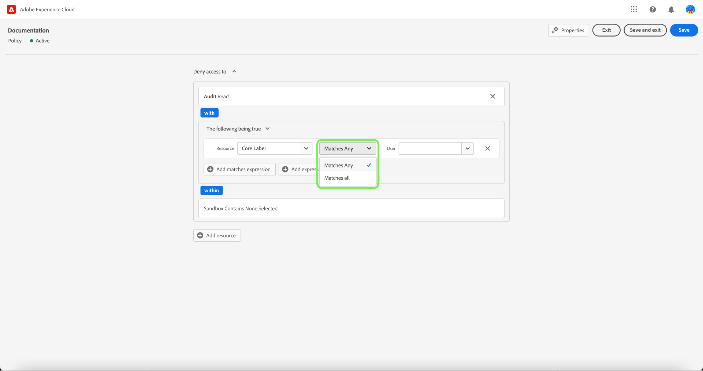
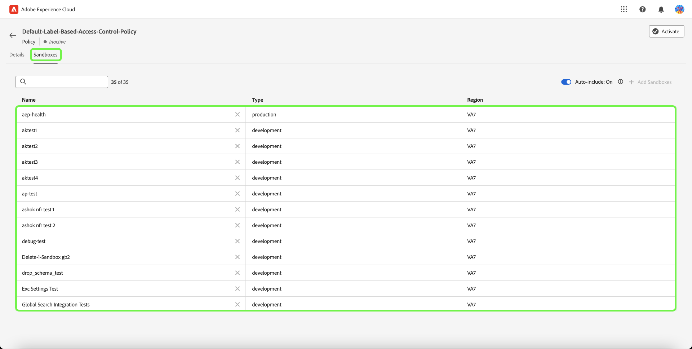

# Gerenciar políticas de controle de acesso

As políticas de controle de acesso são declarações que reúnem atributos para estabelecer ações permitidas e inadmissíveis. As políticas de acesso podem ser locais ou globais e podem substituir outras políticas. O Adobe fornece uma política padrão que pode ser ativada imediatamente ou sempre que a organização estiver pronta para começar a controlar o acesso a objetos específicos com base em rótulos. A política padrão usa rótulos aplicados a recursos para negar acesso, a menos que os usuários estejam em uma função com um rótulo correspondente.

>[!IMPORTANT]
>
>As políticas de acesso não devem ser confundidas com as políticas de uso de dados, que controlam como os dados são usados no Adobe Experience Platform, em vez de quais usuários na organização têm acesso a eles. Consulte o manual sobre criação de [políticas de uso de dados](../../../data-governance/policies/create.md) para obter mais informações.

<!-- ## Create a new policy

To create a new policy, select the **[!UICONTROL Policies]** tab in the sidebar and select **[!UICONTROL Create Policy]**.

The **[!UICONTROL Create a new policy]** dialog appears, prompting you to enter a name, and an optional description. When finished, select **[!UICONTROL Confirm]**.

Using the dropdown arrow select if you would like to **Permit access to** () a resource or **Deny access to** () a resource.

Next, select the resource that you would like to include in the policy using the dropdown menu and search access type, read or write.

Next, using the dropdown arrow select the condition you would like to apply to this policy, **The following being true** () or **The following being false** ().

Select the plus icon to **Add matches expression** or **Add expression group** for the resource. 

Using the dropdown, select the **Resource**.

Next, using the dropdown select the **Matches**.

Next, using the dropdown, select the type of label (**[!UICONTROL Core label]** or **[!UICONTROL Custom label]**) to match the label assigned to the User in roles.

Finally, select the **Sandbox** that you would like the policy conditions to apply to, using the dropdown menu.

Select **Add resource** to add more resources. Once finished, select **[!UICONTROL Save and exit]**.

The new policy is successfully created, and you are redirected to the **[!UICONTROL Policies]** tab, where you will see the newly created policy appear in the list. 

## Edit a policy

To edit an existing policy, select the policy from the **[!UICONTROL Policies]** tab. Alternatively, use the filter option to filter the results to find the policy you want to edit.

Next, select the ellipsis (`…`) next to the policies name, and a dropdown displays controls to edit, deactivate, delete, or duplicate the role. Select edit from the dropdown.

The policy permissions screen appears. Make the updates then select **[!UICONTROL Save and exit]**.

The policy is successfully updated, and you are redirected to the **[!UICONTROL Policies]** tab.

## Duplicate a policy

To duplicate an existing policy, select the policy from the **[!UICONTROL Policies]** tab. Alternatively, use the filter option to filter the results to find the policy you want to edit.

Next, select the ellipsis (`…`) next to a policies name, and a dropdown displays controls to edit, deactivate, delete, or duplicate the role. Select duplicate from the dropdown.

The **[!UICONTROL Duplicate policy]** dialog appears, prompting you to confirm the duplication. 

The new policy appears in the list as a copy of the original on the **[!UICONTROL Policies]** tab.

## Delete a policy

To delete an existing policy, select the policy from the **[!UICONTROL Policies]** tab. Alternatively, use the filter option to filter the results to find the policy you want to delete.

Next, select the ellipsis (`…`) next to a policies name, and a dropdown displays controls to edit, deactivate, delete, or duplicate the role. Select delete from the dropdown.

The **[!UICONTROL Delete user policy]** dialog appears, prompting you to confirm the deletion. 

You are returned to the **[!UICONTROL policies]** tab and a confirmation of deletion pop over appears.

 -->

## Configurar política para uma sandbox

>[!IMPORTANT]
>
>Por padrão, a variável [!UICONTROL Incluir automaticamente] o recurso está ativado para todos os clientes, o que significa que todas as sandboxes são adicionadas à política.

>[!NOTE]
>
>A variável **[!UICONTROL Default-Label-Based-Access-Control-Policy]** no momento, a política é a única disponível para configuração.

Para exibir sandboxes associadas a uma política, selecione a política na **[!UICONTROL Políticas]** guia.

Em seguida, selecione a política e, em seguida, **[!UICONTROL Sandboxes]** guia. Uma lista de sandboxes associadas à política é exibida.

### Adicionar política a todas as sandboxes

Use o **[!UICONTROL Incluir automaticamente]** ativar/desativar **[!UICONTROL Sandboxes]** para ativar a política para todas as sandboxes.

![A variável [!UICONTROL Sandboxes] guia mostrando o [!UICONTROL Incluir automaticamente] alternar.](../../images/flac-ui/abac-policies-auto-include.png)

A variável **[!UICONTROL Ativar inclusão automática]** será exibida solicitando que você confirme a seleção. Selecionar **[!UICONTROL Ativar]** para concluir a definição de configuração.

![A variável [!UICONTROL Ativar inclusão automática] realce da caixa de diálogo [!UICONTROL Ativar].](../../images/flac-ui/abac-policies-auto-include-enable.png)

>[!SUCCESS]
>
>A política é ativada para todas as sandboxes existentes e será adicionada automaticamente a qualquer nova sandbox quando ela estiver disponível.

### Adicionar política para selecionar sandboxes

>[!IMPORTANT]
>
>Sandboxes futuras não serão incluídas na política por padrão se a variável [!UICONTROL Incluir automaticamente] está desligado. Será necessário gerenciar e adicionar sandboxes manualmente à política.

Use o **[!UICONTROL Incluir automaticamente]** ativar/desativar **[!UICONTROL Sandboxes]** para desativar a política para todas as sandboxes.

![A variável [!UICONTROL Sandboxes] guia mostrando o [!UICONTROL Incluir automaticamente] alternar.](../../images/flac-ui/abac-policies-auto-include.png)

No **[!UICONTROL Sandboxes]** selecione **[!UICONTROL Adicionar sandboxes]** para selecionar sandboxes às quais essa política será aplicada.

![A variável [!UICONTROL Sandboxes] guia mostrando uma lista de sandboxes adicionadas à política.](../../images/flac-ui/abac-policies-sandboxes-tab-add.png)

Uma lista de sandboxes é exibida. Selecione a sandbox que deseja adicionar na lista. Como alternativa, use a barra de pesquisa para pesquisar a sandbox. Selecione **[!UICONTROL Salvar]**.

![A variável [!UICONTROL Adicionar sandboxes] página que mostra uma lista de sandboxes existentes disponíveis para adicionar à política.](../../images/flac-ui/abac-policies-sandboxes-list.png)

>[!SUCCESS]
>
>As sandboxes selecionadas foram adicionadas com sucesso à política.

### Remover sandboxes de uma política

Para remover uma sandbox, selecione a **X** ícone ao lado do nome da sandbox.

![A variável [!UICONTROL Sandboxes] mostrando uma lista de sandboxes, destacando a [!UICONTROL X] para excluir.](../../images/flac-ui/abac-policies-remove-sandbox-x.png)

A variável **[!UICONTROL Remover]** será exibida solicitando que você confirme a seleção. Selecionar **[!UICONTROL Confirmar o]** para concluir a remoção.

![A variável [!UICONTROL Remover] realce da caixa de diálogo [!UICONTROL Confirmar o].](../../images/flac-ui/abac-policies-remove-sandbox.png)

>[!SUCCESS]
>
>A sandbox selecionada foi removida com sucesso da política.

## Ativar uma política

Para ativar uma política existente, selecione a política na **[!UICONTROL Políticas]** guia.

Em seguida, selecione as reticências (`…`) ao lado de um nome de política, e uma lista suspensa exibe controles para editar, ativar, excluir ou duplicar a função. Selecione ativar na lista suspensa.

A variável **[!UICONTROL Ativar política]** será exibida, solicitando que você confirme a ativação.

Você retornará à janela **[!UICONTROL políticas]** e uma confirmação do pop-over de ativação será exibida. O status da política é exibido como ativo.

## Próximas etapas

Com uma política ativada, você pode prosseguir para a próxima etapa para [gerenciar permissões para uma função](permissions.md).
