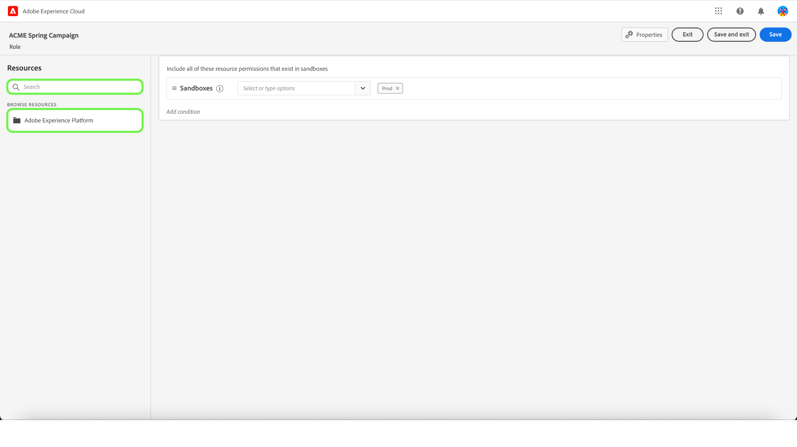
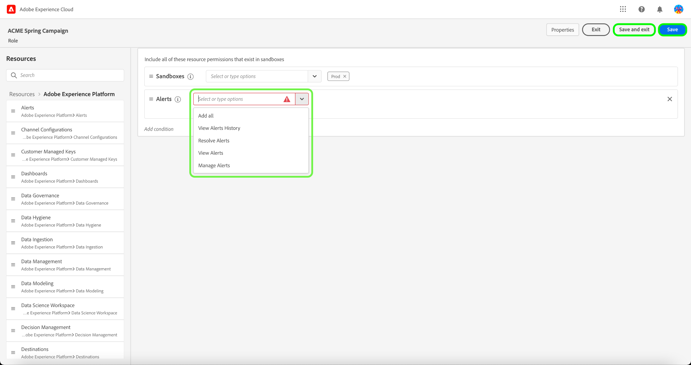

# Gerenciar funções

>[!IMPORTANT]
>
>O controle de acesso baseado em atributos está disponível em uma versão limitada para clientes de assistência médica com base nos EUA. Esse recurso estará disponível para todos os clientes da Real-time Customer Data Platform assim que for totalmente lançado.

As funções definem o acesso que um administrador, especialista ou usuário final tem aos recursos em sua organização. Em um ambiente de controle de acesso baseado em funções, o provisionamento de acesso do usuário é agrupado por meio de responsabilidades e necessidades comuns. Uma função tem um determinado conjunto de permissões e os membros da organização podem ser atribuídos a uma ou mais funções, dependendo do escopo de acesso de exibição ou gravação necessário.

## Criar uma nova função

Para criar uma nova função, selecione a **[!UICONTROL Funções]** na barra lateral e selecione **[!UICONTROL Criar função]**.

O **[!UICONTROL Criar uma nova função]** for exibida, solicitando a inserção de um nome e uma descrição opcional.

Quando terminar, selecione **[!UICONTROL Confirmar]**.

Em seguida, selecione as permissões de recurso que deseja incluir na função usando o menu suspenso.

Para adicionar recursos adicionais, selecione **[!UICONTROL Adobe Experience Platform]** no painel de navegação esquerdo, que exibe uma lista de recursos. Como alternativa, insira o nome do recurso na barra de pesquisa no painel de navegação esquerdo.

Clique e arraste o recurso relevante e solte no painel principal.

Selecione as permissões de recurso que deseja incluir na função usando o menu suspenso. Repita isso para todos os recursos que deseja incluir para a função . Quando terminar, selecione **[!UICONTROL Salvar e sair]**.

A nova função foi criada com êxito e você é redirecionado para a função **[!UICONTROL Funções]** , onde você verá a função recém-criada aparecer na lista.

Veja as seções em [gerenciamento de permissões para uma função](#manage-permissions-for-a-role) para obter mais detalhes sobre como gerenciar permissões de função depois de criadas.

## Duplicar uma função

Para duplicar uma função existente, selecione a função no **[!UICONTROL Funções]** guia . Como alternativa, use a opção de filtro para filtrar os resultados e encontrar a função que deseja duplicar.

Em seguida, selecione **[!UICONTROL Duplicar]** na parte superior direita da tela.

O **[!UICONTROL Função duplicada]** for exibida, solicitando que você confirme a duplicação.

Em seguida, você será levado à página de detalhes da função, onde poderá alterar o nome e as permissões da função. Os Detalhes, Rótulos e Sandboxes são duplicados da função anterior. Os usuários precisarão ser adicionados por meio da guia usuários . Você pode visualizar o [gerenciar permissões para uma função](permissions.md) documento para saber mais sobre como adicionar Detalhes, Rótulos, Sandboxes e Usuários a uma função.

Clique na seta para a esquerda para retornar ao **[!UICONTROL Funções]** guia .

A nova função aparecerá na lista na **[!UICONTROL Funções]** página.

## Excluir uma função

Selecione as reticências (`…`) ao lado do nome de uma função, e uma lista suspensa exibe controles para editar, excluir ou duplicar a função. Selecione excluir na lista suspensa.

O **[!UICONTROL Excluir função de usuário]** for exibida, solicitando que você confirme a exclusão.

Você será retornado ao **[!UICONTROL Funções]** guia .

## Próximas etapas

Com uma nova função criada, você pode prosseguir para a próxima etapa para [gerenciar permissões para uma função](permissions.md).
