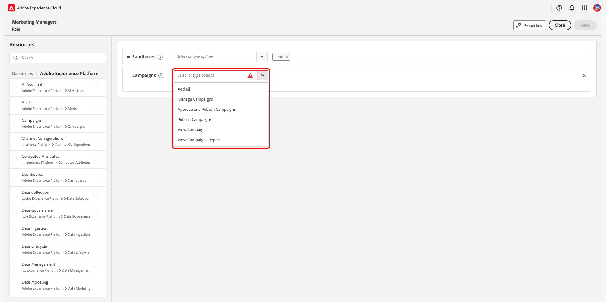
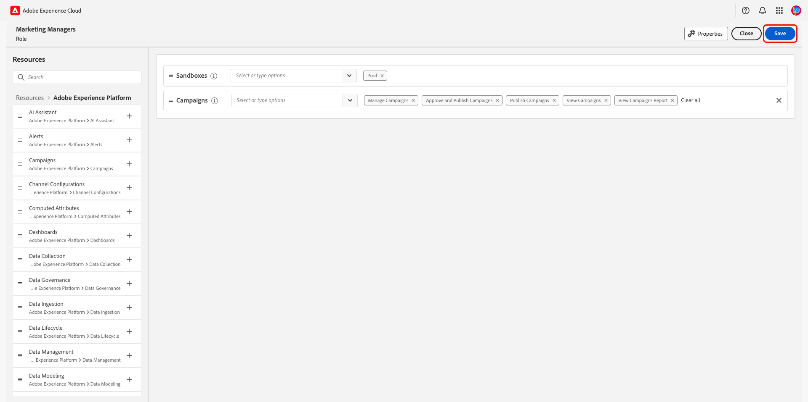
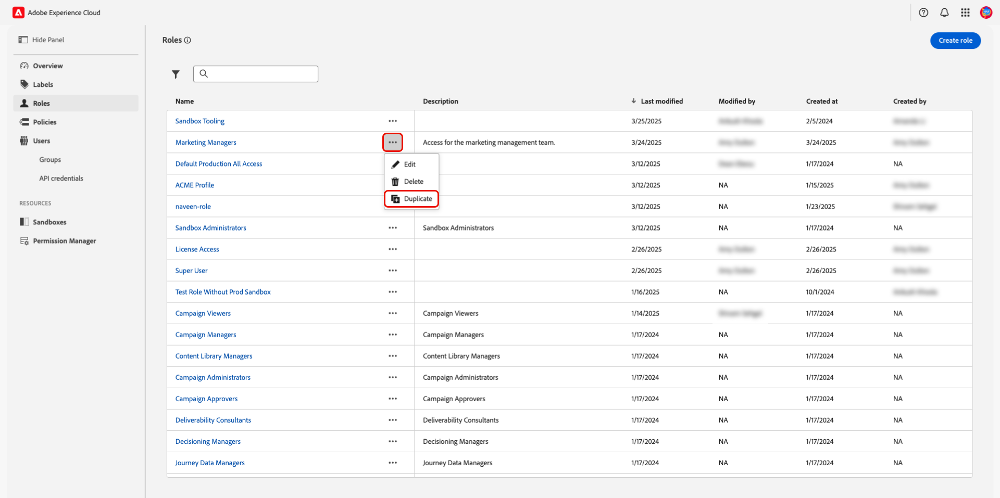
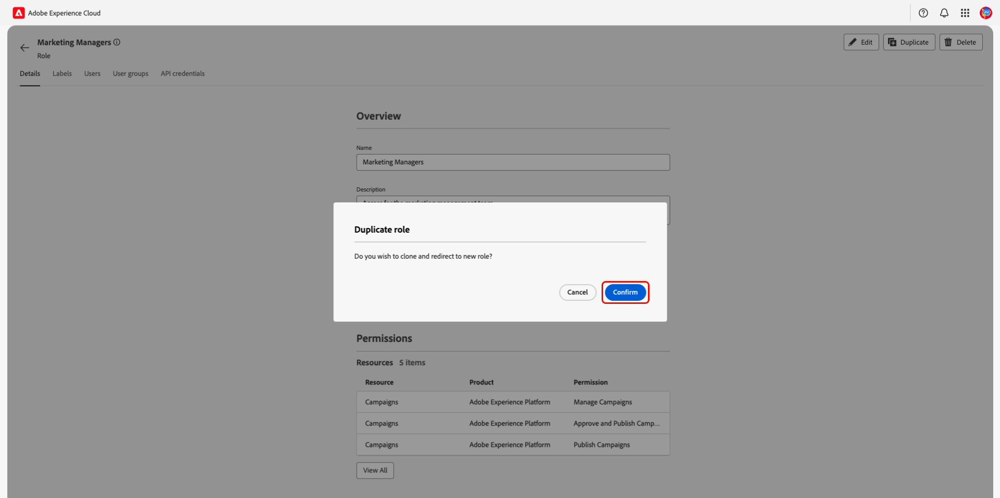
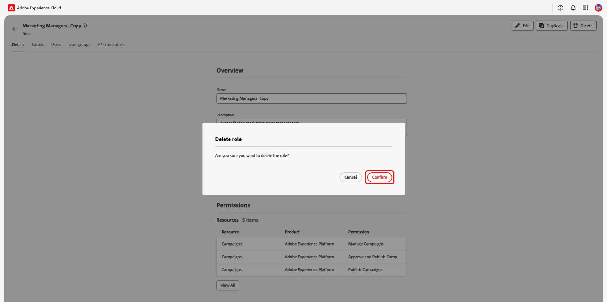

# Gerenciar funções

<!-- UPDATE ROLES WITH A MORE COMPREHENSIVE EXPLANATION -->

Para começar a gerenciar funções, navegue até **[!UICONTROL Permissions]** no [Adobe Experience Cloud](https://experience.adobe.com/){target="_blank"} e selecione **[!UICONTROL Roles]** no painel esquerdo.

## Criar uma nova função {#create-new-role}

>[!CONTEXTUALHELP]
>id="platform_permissions_roles_about_create"
>title="Criar nova função"
>abstract="Crie novas funções para categorizar melhor os usuários que interagem com sua instância da Experience Platform. Por exemplo, é possível criar uma função para uma equipe interna de marketing e aplicar o rótulo de dados de saúde regulamentados (RHD) a essa função, permitindo que sua equipe de marketing interna acesse informações de saúde protegidas (PHI). Como alternativa, também é possível criar uma função para uma agência externa e negar o acesso dela aos dados de PHI por não aplicar o rótulo RHD a essa função."
>additional-url="https://experienceleague.adobe.com/docs/experience-platform/access-control/abac/permissions-ui/roles.html" text="Gerenciar uma função"
>additional-url="https://experienceleague.adobe.com/pt-br/docs/experience-platform/access-control/abac/end-to-end-guide#label-roles" text="Aplicar rótulos a uma função"

Para criar uma nova função, selecione **[!UICONTROL Create role]**.

>[!TIP]
>
>As funções somente leitura estão disponíveis prontas para uso. Uma função somente leitura é aquela que concede ao usuário a capacidade de exibir dados, configuração e recursos da interface do usuário sem nenhuma capacidade de alterar o estado do sistema. Os administradores não podem editar essas funções, mas podem associar usuários às funções.

A caixa de diálogo **[!UICONTROL Create new role]** é exibida. Insira um **[!UICONTROL Name]** para a função e, opcionalmente, um **[!UICONTROL Description]** e selecione **[!UICONTROL Confirm]**.

O espaço de trabalho **[!UICONTROL Resources]** é exibido. Localize o recurso necessário rolando a tela ou inserindo o nome do recurso na barra de pesquisa no painel esquerdo. Adicione recursos selecionando o  ao lado do nome do recurso.

<!-- ADD IN NOTE ABOUT THE DEFAULT SANDBOX - THIS SHOULD BE MENTIONED IN THE HIGHER LEVEL DOCS, WE MAY BE ABLE TO LINK TO IT -->

O recurso é adicionado ao espaço de trabalho principal. Selecione a lista suspensa ao lado do nome do recurso e selecione as permissões que deseja adicionar à função. Você pode escolhê-las individualmente, selecionar **[!UICONTROL Add all]** ou localizar permissões específicas digitando o nome da permissão na barra de pesquisa.

Continue selecionando todos os recursos e permissões que deseja adicionar à função. Quando terminar, selecione **[!UICONTROL Save]**.

Você receberá um alerta mostrando que a função foi salva com sucesso. Selecione **[!UICONTROL Close]** para retornar ao espaço de trabalho **[!UICONTROL Roles]**.

A nova função foi criada com êxito, e você será redirecionado para a página **[!UICONTROL Roles]**, onde verá que a função recém-criada aparece na lista.

<!-- The following video is intended to support your understanding of creating a new role and managing users for that role.

>[!VIDEO](https://video.tv.adobe.com/v/336081/?learn=on) -->

## Duplicar uma função

Duplicar uma função copiará os detalhes, as permissões, os rótulos e as sandboxes. Usuários, grupos de usuários e credenciais de API **não** copiados e precisarão ser adicionados manualmente à função.

Para duplicar uma função existente, encontre a função que deseja duplicar na guia **[!UICONTROL Roles]**. Selecione o  ao lado do nome da função e selecione **[!UICONTROL Duplicate]** no menu suspenso.

A caixa de diálogo de confirmação de duplicação será exibida. Selecione **[!UICONTROL Confirm]** para concluir a duplicação da função. A nova função será salva com o mesmo nome com `_Copy` adicionado como sufixo.

Como alternativa, você pode duplicar uma função no espaço de trabalho de uma função individual. Selecione a função que deseja duplicar no espaço de trabalho **[!UICONTROL Roles]** e selecione **[!UICONTROL Duplicate]**.

A caixa de diálogo de confirmação de duplicação será exibida. Selecione **[!UICONTROL Confirm]** para concluir a duplicação da função. Você será redirecionado para a nova função.

## Excluir uma função

Para excluir uma função, encontre a função que deseja excluir na guia **[!UICONTROL Roles]**. Selecione o  ao lado do nome da função e selecione **[!UICONTROL Delete]** no menu suspenso.

A caixa de diálogo de confirmação de exclusão será exibida. Selecione **[!UICONTROL Confirm]** para concluir a exclusão da função.

Como alternativa, você pode deletar uma atribuição de dentro do espaço de trabalho de uma atribuição individual. Selecione a função que deseja excluir do espaço de trabalho **[!UICONTROL Roles]** e selecione **[!UICONTROL Delete]**.

A caixa de diálogo de confirmação de exclusão será exibida. Selecione **[!UICONTROL Confirm]** para concluir a exclusão da função.

<!-- ADD PERMISSIONS TO THIS PAGE -->

## Próximas etapas

Com uma nova função criada, você pode prosseguir para a próxima etapa para [gerenciar permissões para uma função](permissions.md).
