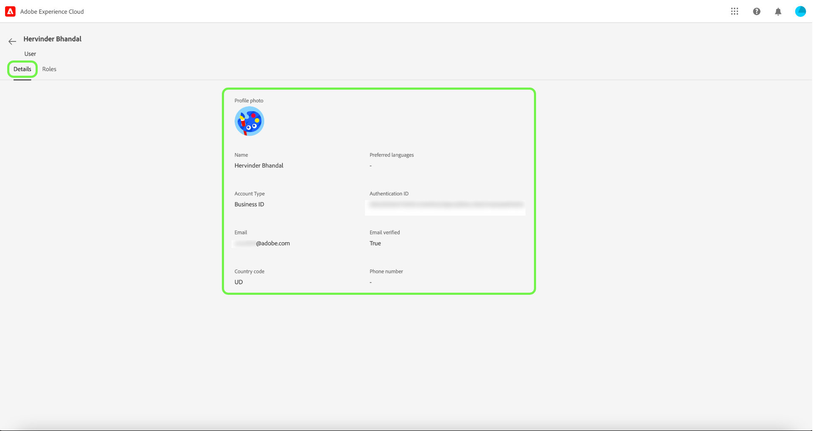
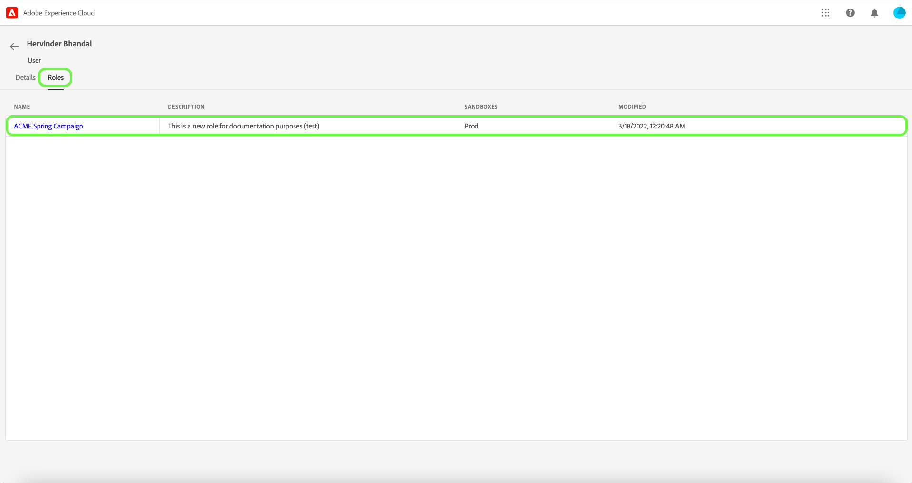

# Gerenciar usuários

>[!IMPORTANT]
>
>O controle de acesso baseado em atributos está disponível em uma versão limitada para clientes de assistência médica com base nos EUA. Esse recurso estará disponível para todos os clientes da Real-time Customer Data Platform assim que for totalmente lançado.

Se quiser exibir os detalhes do usuário e as funções às quais ele está atribuído, selecione a **[!UICONTROL Usuários]** guia .

Uma lista de usuários é exibida. Selecione o usuário que deseja visualizar na lista. Como alternativa, use a barra de pesquisa para pesquisar o usuário inserindo seu nome ou endereço de email.

A guia de detalhes fornece uma visão geral do usuário. A visão geral exibe o nome dos usuários, o tipo de conta, o email, a ID de autenticação, as informações de contato e os detalhes da localização.

Selecione o **[!UICONTROL Funções]** para exibir as funções às quais o usuário está atribuído.

## Próximas etapas

Agora você aprendeu a visualizar os detalhes do usuário e as funções às quais ele está adicionado no momento. Para saber mais sobre o controle de acesso baseado em atributos, consulte o [visão geral do controle de acesso baseado em atributos](../overview.md).
