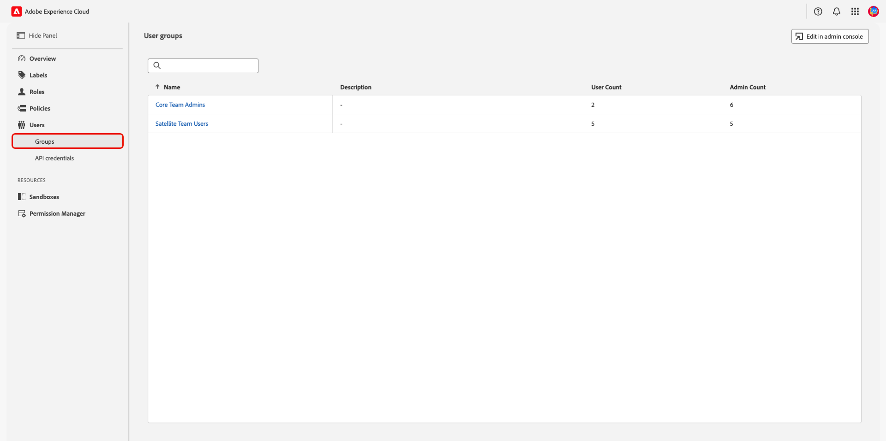
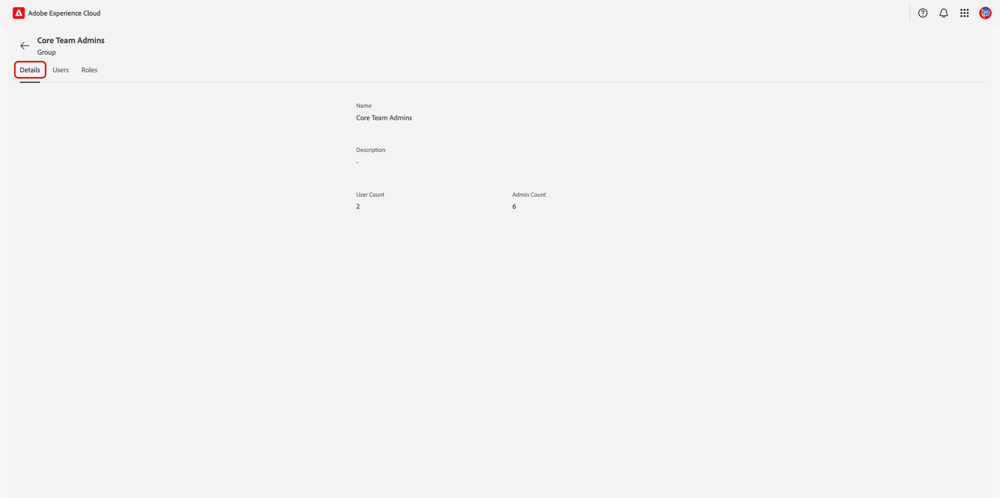
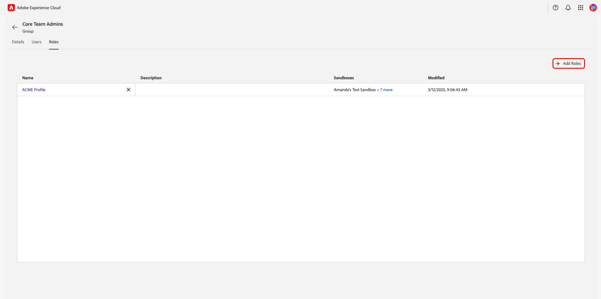
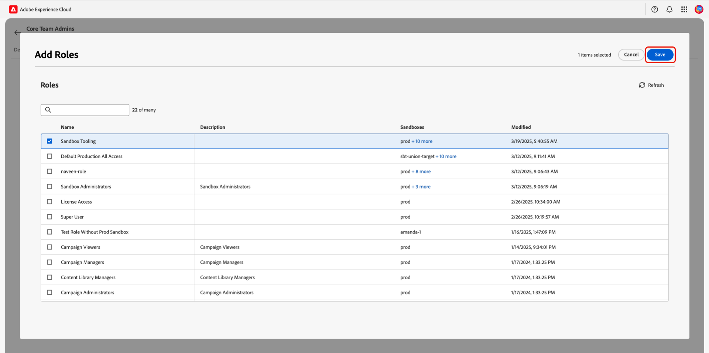
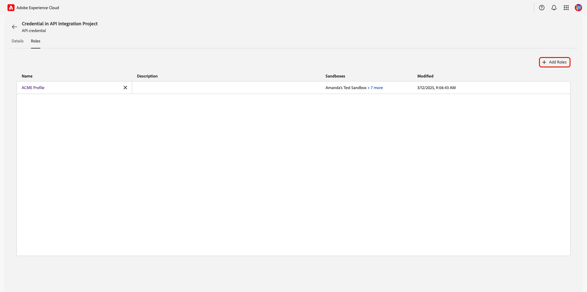
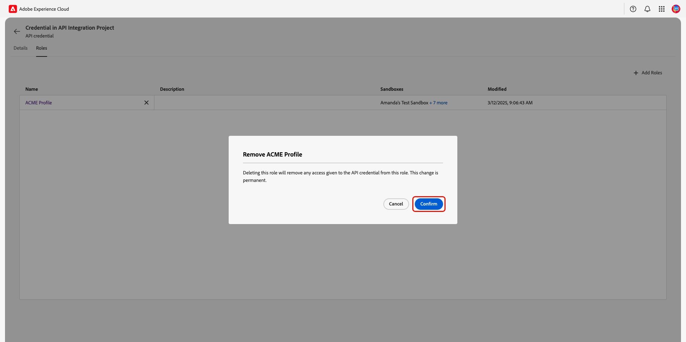

# Gerenciar usuários e adicionar grupos de usuários {#manage-users}

>[!CONTEXTUALHELP]
>id="platform_permissions_users_about"
>title="O que são usuários?"
>abstract="Usuários são pessoas que têm acesso à Experience Platform. O acesso de um usuário individual aos recursos de uma organização é gerenciado por meio de funções."
>additional-url="https://experienceleague.adobe.com/pt-br/docs/experience-platform/access-control/abac/permissions-ui/roles" text="Gerenciar funções"

Os usuários são os indivíduos que têm acesso ao Adobe Experience Platform. O acesso de um usuário individual aos recursos de uma organização é gerenciado por meio de [funções](./roles.md){target="_blank"}. Uma organização também pode criar [grupos de usuários](#user-groups) para fornecer acesso contínuo a vários usuários ao mesmo tempo. Os usuários são gerenciados no Admin Console e os usuários associados ao cartão de produto do Adobe Experience Platform são exibidos como parte da lista de usuários no Experience Platform.

## Gerenciar usuários

<!-- ADD LINKS INTO IMPORTANT NOTE BELOW
>[!IMPORTANT]
>
>[!UICONTROL Permissions] manages access control for existing Experience Platform users. To add users to Experience Platform, navigate to Adobe Admin Console through the **[!UICONTROL Edit in admin console]** option. To learn how to add users through the Admin Console, follow the [adding users to Experience Platform](...){#target="_blank"} guide.
-->

Para exibir os usuários de sua organização, navegue até **[!UICONTROL Permissions]** no [Adobe Experience Cloud](https://experience.adobe.com/){target="_blank"}. Selecione **[!UICONTROL Users]** no painel esquerdo.

{zoomable="yes"}

Uma lista de usuários é exibida. Selecione o usuário que deseja visualizar na lista. Como alternativa, use a barra de pesquisa para procurar o usuário inserindo seu nome ou endereço de email.

A guia **[!UICONTROL Details]** fornece uma visão geral do usuário. A visão geral exibe o status do usuário **[!UICONTROL Name]**, **[!UICONTROL Preferred languages]**, **[!UICONTROL Account Type]**, **[!UICONTROL Authentication ID]**, **[!UICONTROL Email]**, **[!UICONTROL Email verified]**, **[!UICONTROL Country code]** e **[!UICONTROL Phone number]**.

{zoomable="yes"}

Selecione a guia **[!UICONTROL Roles]** para exibir as funções às quais o usuário está atribuído.

{zoomable="yes"}

### Adicionar uma função a um usuário {#add-user-role}

Para adicionar uma função ao usuário, selecione **[!UICONTROL Add Roles]**.

{zoomable="yes"}

A caixa de diálogo **[!UICONTROL Add Roles]** é exibida. Selecione as funções que deseja adicionar ao usuário e selecione **[!UICONTROL Save]**.

{zoomable="yes"}

### Remover uma função de um usuário {#remove-user-role}

Para remover uma função do usuário, selecione o **X** ao lado do nome da função.

<!-- ADD LINKS INTO IMPORTANT NOTE BELOW

>[!NOTE]
>
>Role's that have been added to a user through a user group cannot be removed through the user's role workspace. Role's that have been added through a user group will have an [!Info icon](/help/images/icons/info.png) beside the **X** containing information about the associated user group. To remove the role, the role would need to be [removed from the user group](#remove-user-group-role).
-->

{zoomable="yes"}

Uma caixa de diálogo de confirmação é exibida. Selecione **[!UICONTROL Confirm]** para concluir a remoção da função.

{zoomable="yes"}

## Gerenciar grupos de usuários {#user-groups}

Os grupos de usuários são vários usuários que foram agrupados e têm acesso para executar as mesmas funções.

<!-- ADD LINKS INTO IMPORTANT NOTE BELOW
>[!IMPORTANT]
>
>[!UICONTROL Permissions] manages access control for existing Experience Platform user groups. To add user groups to Experience Platform, navigate to Admin Console through the **[!UICONTROL Edit in admin console]** option. To learn how to add user groups in the Admin Console, follow the [adding user groups to Experience Platform](...){#target="_blank"} guide.
 -->

Para exibir os usuários de sua organização, navegue até **[!UICONTROL Permissions]** no [Adobe Experience Cloud](https://experience.adobe.com/){target="_blank"}.Selecione **[!UICONTROL Groups]** na seção **[!UICONTROL Users]** do painel esquerdo.

{zoomable="yes"}

Uma lista de grupos de usuários é exibida. Selecione o grupo que deseja exibir na lista.

A guia **[!UICONTROL Details]** fornece uma visão geral do grupo de usuários. A visão geral exibe os **[!UICONTROL Name]**, **[!UICONTROL Description]**, **[!UICONTROL User Count]** e **[!UICONTROL Admin count]** dos grupos.

{zoomable="yes"}

Selecione a guia **[!UICONTROL Users]** para exibir uma lista de usuários atribuídos ao grupo.

{zoomable="yes"}

Selecione a guia **[!UICONTROL Roles]** para exibir a lista de funções atualmente atribuídas ao grupo.

{zoomable="yes"}

### Adicionar funções a um grupo de usuários {#add-user-group-role}

Para adicionar uma nova função ao grupo, selecione **[!UICONTROL Add Roles]**.

{zoomable="yes"}

A caixa de diálogo **[!UICONTROL Add Roles]** é exibida. Selecione as funções que deseja adicionar e selecione **[!UICONTROL Save]**. As funções serão adicionadas para todos os usuários pertencentes ao grupo de usuários.

{zoomable="yes"}

### Remover funções de um grupo de usuários {#remove-user-group-role}

Para remover uma função do grupo de usuários, selecione o **X** ao lado do nome da função.

{zoomable="yes"}

Uma caixa de diálogo de confirmação é exibida. Selecione **[!UICONTROL Confirm]** para concluir a remoção da função.

{zoomable="yes"}

## Credenciais da API

>[!IMPORTANT]
>
>Somente administradores do sistema têm a capacidade de exibir e gerenciar credenciais de API nas Permissões.

Para usar as APIs do Experience Platform como um usuário ou desenvolvedor, um administrador do sistema precisa adicionar credenciais de API, além de um conjunto de permissões fornecido por uma função. As permissões permitem atribuir credenciais de API criadas anteriormente e atribuídas ao produto Experience Platform para funções. Para obter um guia completo sobre como criar e atribuir credenciais de API, bem como as permissões necessárias, consulte o tutorial passo a passo em [autenticar e acessar APIs do Experience Platform](/help/landing/api-authentication.md){target="_blank"}.

Para exibir as credenciais da API da sua organização associadas ao Experience Platform, navegue até **[!UICONTROL Permissions]** no [Adobe Experience Cloud](https://experience.adobe.com/){target="_blank"}. Selecione **[!UICONTROL API Credentials]** na seção **[!UICONTROL Users]** do painel esquerdo.

{zoomable="yes"}

>[!NOTE]
>
> Para exibir as Credenciais de API da sua organização em todos os produtos da organização, ou para obter mais informações sobre a credencial, selecione **[!UICONTROL Edit in admin console]**.

Uma lista de credenciais de API é exibida. Selecione a credencial de API que deseja exibir na lista.

A guia **[!UICONTROL Details]** fornece uma visão geral da credencial da API. A visão geral exibe as credenciais **[!UICONTROL Name]**, **[!UICONTROL Modified]** data, **[!UICONTROL Modified By]** atributo, **[!UICONTROL Created]** data, **[!UICONTROL Created by]** atributo, **[!UICONTROL API key]**, **[!UICONTROL Technical ID]** e **[!UICONTROL Email]**.

{zoomable="yes"}

Selecione a guia **[!UICONTROL Roles]**. Uma lista de funções associadas à credencial de API é exibida.

{zoomable="yes"}

### Adicionar uma função a uma credencial de API {#add-api-credential-role}

Para adicionar uma função à credencial de API, selecione **[!UICONTROL Add Roles]**.

{zoomable="yes"}

A caixa de diálogo **[!UICONTROL Add Roles]** é exibida. Selecione as funções que deseja adicionar ao usuário e selecione **[!UICONTROL Save]**.

{zoomable="yes"}

### Remover uma função de uma credencial de API {#remove-api-credential-role}

Para remover uma função da credencial de API, selecione **X** ao lado do nome da credencial de API.

{zoomable="yes"}

Uma caixa de diálogo de confirmação é exibida. Selecione **[!UICONTROL Confirm]** para concluir a remoção da função.

{zoomable="yes"}

## Próximas etapas

Agora você sabe como exibir os detalhes e as funções de um usuário, grupo de usuários e credencial de API. Para saber mais sobre o controle de acesso baseado em atributos, consulte a [visão geral do controle de acesso baseado em atributos](../overview.md).

<!--
The following video is intended to support your understanding of developer and API credentials.

>[!VIDEO](https://video.tv.adobe.com/v/3446403/?captions=por_br&learn=on)
-->