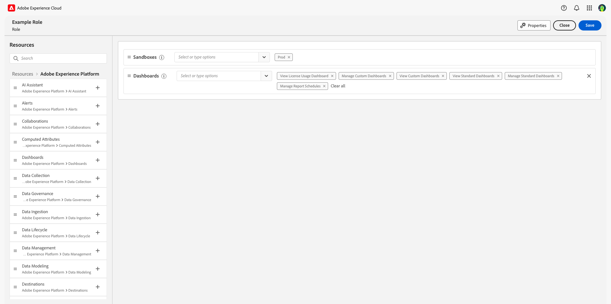

# Visão geral do controle de acesso

O controle de acesso do Adobe Experience Platform é fornecido por meio de **[!UICONTROL Permissions]** em [Adobe Experience Cloud](https://experience.adobe.com/). Essa funcionalidade aproveita funções e políticas, que vinculam usuários com permissões e sandboxes.

## Hierarquia e fluxo de trabalho do controle de acesso

Para configurar o controle de acesso para o Experience Platform, você deve ter privilégios de administrador do sistema ou do produto para uma organização que tenha um produto da Experience Platform. A função mínima que pode conceder ou retirar permissões é um administrador de produto. Outras funções de administrador que podem gerenciar permissões são administradores do sistema (sem restrições). Consulte o artigo da Central de ajuda da Adobe em [funções administrativas](https://helpx.adobe.com/br/enterprise/using/admin-roles.html) para obter mais informações.

>[!NOTE]
>
>A partir deste ponto, qualquer menção a &quot;administrador&quot; neste documento se refere a um administrador de produto ou superior (conforme descrito acima).

Um workflow de alto nível para obter e atribuir permissões de acesso pode ser resumido da seguinte maneira:

- Após o licenciamento do Adobe Experience Platform ou de um Aplicativo/Serviço de Aplicativo que usa o Experience Platform, um email é enviado ao administrador especificado durante o licenciamento.
- O administrador faz logon no [Adobe Admin Console](#adobe-admin-console) e seleciona **Adobe Experience Platform** da lista de produtos na página de visão geral.
- Para conceder acesso ao Experience Platform, é recomendável que o administrador adicione usuários ao perfil de produto padrão: `AEP-Default-All-Users`.
- Nas Permissões do Experience Platform, o administrador pode criar novas funções ou editar as permissões e os usuários de qualquer função existente.
- Ao criar ou editar uma função, o administrador adiciona usuários à função usando a guia **[!UICONTROL users]** e concede permissões a esses usuários (como &quot;[!UICONTROL Read Datasets]&quot; ou &quot;[!UICONTROL Manage Schemas]&quot;) ao editar as permissões da função. Da mesma forma, o administrador pode atribuir acesso a sandboxes usando a mesma opção de edição.
- Quando os usuários fazem logon na interface do usuário do Experience Platform, o acesso aos recursos do Experience Platform é orientado pelas permissões concedidas a eles na etapa anterior. Por exemplo, se um usuário não tiver a permissão [!UICONTROL View Datasets], a guia **[!UICONTROL Datasets]** no menu lateral não estará visível para esse usuário.

Para obter etapas mais detalhadas sobre como gerenciar o controle de acesso no Experience Platform, consulte o [guia do usuário de controle de acesso](./ui/overview.md).

Todas as chamadas para APIs do Experience Platform são validadas em relação a permissões e retornarão erros se as permissões apropriadas não forem encontradas no contexto do usuário atual. Na interface do usuário, os elementos serão ocultos ou alterados dependendo das permissões concedidas ao usuário atual.

## Permissões {#platform-permissions}

O [!UICONTROL Permissions] fornece um local central para gerenciar o acesso à Experience Platform para sua organização. Através do [!UICONTROL Permissions], você pode conceder a grupos de usuários permissões de acesso para vários recursos do Experience Platform, como o [!UICONTROL Manage Datasets], [!UICONTROL View Datasets] ou [!UICONTROL Manage Profiles].

### Funções

Na seção [!UICONTROL Roles], as permissões são atribuídas a usuários por meio do uso de funções. As funções permitem conceder permissões a um ou vários usuários e também contêm acesso ao escopo das sandboxes atribuídas a eles por meio de funções. Os usuários podem ser atribuídos a uma ou várias funções pertencentes à sua organização.

### Funções padrão

O Experience Platform vem com duas funções padrão pré-configuradas. A tabela a seguir descreve o que é fornecido em cada perfil padrão, incluindo a sandbox à qual eles concedem acesso, bem como as permissões que concedem no escopo dessa sandbox.

| Função | Acesso à sandbox | Permissões |
| --- | --- | --- |
| Acesso total à produção padrão | Prod | Todas as permissões aplicáveis ao Experience Platform, exceto as permissões de Administração de sandbox. |
| Administradores de sandbox | N/D | Fornece acesso à sandbox `Prod` e às permissões de Administração de sandbox. |

## Sandboxes e permissões

As sandboxes de não produção são uma forma de virtualização de dados que permitem isolar dados de outras sandboxes e são normalmente usadas para experimentos de desenvolvimento, testes ou avaliações. As permissões de uma função concedem aos usuários da função acesso aos recursos do Experience Platform nos ambientes de sandbox aos quais eles receberam acesso. Uma licença padrão do Experience Platform concede cinco sandboxes (uma de produção e quatro de não produção). Você pode adicionar pacotes de dez sandboxes de não produção até um máximo de 75 sandboxes no total. Entre em contato com o administrador da organização ou com o representante de vendas da Adobe para obter mais detalhes.

Para obter mais informações sobre sandboxes na Experience Platform, consulte a [visão geral das sandboxes](../sandboxes/home.md).

### Acesso a sandboxes

O acesso a sandboxes é gerenciado por meio de funções. Para obter etapas detalhadas sobre como habilitar o acesso a uma sandbox para uma função, consulte o [guia de funções de controle de acesso baseado em atributo](./abac/ui/roles.md).

É possível conceder aos usuários acesso a uma ou mais sandboxes em uma função. Se um usuário estiver incluído em duas ou mais funções, ele terá acesso a todas as sandboxes incluídas nessas funções.

A permissão &quot;Gerenciamento de sandbox&quot; permite que os usuários gerenciem, visualizem ou redefinam sandboxes.

### Permissões de recurso {#permissions}

As permissões de recursos concedem acesso a recursos específicos do Experience Platform. Os recursos são divididos em categorias que contêm um conjunto de permissões relevantes, que podem ser atribuídas individualmente a funções.

No [!UICONTROL Permissions], o espaço de trabalho de recursos de uma função exibe as sandboxes e permissões que estão ativas para essa função:

A tabela a seguir descreve as categorias de recursos disponíveis para o Experience Platform e aplicativos gerenciados por meio de Permissões:

| Categoria | Descrição |
| --- | --- |
| [!DNL Adobe Mix Modeler] | Configurar, gerenciar e exibir permissões para [!DNL Adobe Mix Modeler]. |
| [!DNL AI Assistant] | Configurar permissões para [!DNL AI Assistant]. |
| [!DNL Alerts] | Configure, gerencie e visualize permissões para alertas e histórico de alertas. |
| [!DNL B2B Account Lists] | Configure permissões de gerenciamento, visualização e publicação para listas de contas B2B, incluindo ações como adicionar, remover, importar e excluir contas de listas de contas. |
| [!DNL B2B Admin Configurations] | Configure permissões de gerenciamento e visualização para configurações do administrador B2B, incluindo conexões de gerenciamento de ativos digitais, repositórios de ativos e eventos. |
| [!DNL B2B Assets] | Configure permissões de gerenciamento e visualização para ativos B2B, incluindo emails, SMS, páginas de aterrissagem, fragmentos, modelos e imagens. |
| [!DNL B2B Buying Groups] | Configure permissões de gerenciamento e visualização para grupos de compra B2B, incluindo recursos como interesses de solução, modelos de funções e status do grupo de compra. |
| [!DNL B2B Channel Configurations] | Configure permissões de gerenciamento e visualização para configurações de canal B2B, incluindo configurações como limites de comunicação, credenciais da API e configurações de segurança. |
| [!DNL B2B Dashboards] | Configure permissões de exibição para painéis B2B, incluindo recursos como envolvimento de conta, estágios de grupo de compra, contas de surging e cobertura de contato. |
| [!DNL B2B Journeys] | Configure permissões de gerenciamento, visualização e publicação para jornadas B2B, incluindo recursos como ações de conta e pessoa, ouvintes de eventos e caminhos divididos. |
| [!DNL Campaigns] | Configure permissões de gerenciamento, publicação e visualização para campanhas no Journey Optimizer. |
| [!DNL Channel Configurations] | Configure recursos de gerenciamento, visualização e exportação de configurações de canal, como subdomínios, pools de IP, predefinições de mensagem, registros PTR, listas de supressão, configurações de página de aterrissagem, configurações de SMS e roteamento de arquivos. |
| [!DNL Collaborations] | Configure permissões de gerenciamento e visualização para os recursos do Real-time Customer Data Profile Collaboration. |
| [!DNL Computed Attributes] | Configure as permissões de gerenciamento e visualização para rascunhar ou publicar atributos computados. |
| [!DNL Customer Managed Keys] | Configure permissões de gerenciamento para chaves gerenciadas pelo cliente. |
| [!DNL Dashboards] | Configure permissões de gerenciamento e visualização para painéis padrão, personalizados e licenciados. |
| [!DNL Data Collection] | Configurar permissões de gerenciamento e visualização para sequências de dados. |
| [!DNL Data Governance] | Configure, gerencie, aplique e visualize permissões para recursos de Governança de dados, como rótulos, políticas e logs de atividades. |
| [!DNL Data Ingestion] | Configure permissões de gerenciamento e visualização para recursos de assimilação de dados, como fontes e compartilhamento de público-alvo. |
| [!DNL Data Lifecycle] | Configure permissões de gerenciamento e visualização para recursos de higiene de dados. |
| [!DNL Data Management] | Configure permissões de gerenciamento e visualização para recursos de gerenciamento de dados, como conjuntos de dados e monitoramento de conjuntos de dados e fluxos. |
| [!DNL Data Modeling] | Configure permissões de gerenciamento e visualização para recursos de modelagem de dados, como esquemas, relacionamentos e metadados de identidade. |
| [!DNL Data Science Workspace] | Configurar permissões de gerenciamento para [!DNL Data Science Workspace]. |
| [!DNL Decision Management] | Configure permissões de gerenciamento e visualização para decisões, ofertas e recursos de estratégia de classificação na gestão de decisões. |
| [!DNL Destinations] | Configure permissões de gerenciamento e visualização para destinos, incluindo recursos como ativação e criação com o Destinations SDK. |
| [!DNL Federated Data] | Configure permissões de gerenciamento e exibição para recursos de dados federados. |
| [!DNL Identity Management] | Configure permissões de gerenciamento e visualização para recursos do Serviço de identidade, como namespaces de identidade e o gráfico de identidade. |
| [!DNL Intelligent Service] | Configure permissões de gerenciamento e visualização para a IA de atribuição e a IA do cliente no serviço inteligente. |
| [!DNL IP Warmup Configurations] | Configure e visualize permissões para planos de aquecimento de IP e visualize permissões para visualizar relatórios de aquecimento de IP. |
| [!DNL Journey Optimizer Library] | Configure permissões de gerenciamento para itens de biblioteca no Adobe Journey Optimizer. |
| [!DNL Journey Optimizer Rules] | Configure permissões de gerenciamento e visualização para regras de frequência no Adobe Journey Optimizer. |
| [!DNL Journeys] | Configure permissões de gerenciamento, publicação e exibição para o jornada, incluindo recursos como relatórios do jornada, eventos, fontes de dados e ações. |
| [!DNL Messages] | Configure permissões de gerenciamento, publicação e visualização de mensagens, incluindo recursos como pré-visualização e teste de mensagens. |
| [!DNL Privacy Service] | Configure permissões de gerenciamento e visualização para recursos do Privacy Service. |
| [!DNL Profile Management] | Configure permissões de gerenciamento, visualização, exportação e avaliação para recursos do serviço de perfil, como públicos, perfis e políticas de mesclagem. |
| [!DNL Prospects] | Configure permissões de gerenciamento e visualização para esquemas, perfis e públicos-alvo de clientes potenciais, incluindo recursos como a exibição da opção de cliente potencial. |
| [!DNL Query Service] | Configure permissões de gerenciamento para recursos de serviço de consulta, como consultas SQL estruturadas e de credencial sem expiração. |
| [!DNL Reports] | Configurar permissões de exibição para relatórios de canal. |
| [!DNL Run and Operate] | Configure permissões de exibição para recursos de Execução e Operação, como verificações de integridade e agendamentos de trabalhos. |
| [!DNL Sandbox Administration] | Configure permissões de gerenciamento, visualização e redefinição ao administrar sandboxes. |
| [!DNL Traits Configuration] | Configure e visualize características por meio da interface do usuário de atributos computados. |
| [!DNL Translation Services] | Configure permissões de gerenciamento e visualização para serviços de tradução para projetos, tarefas, revisões, internas, configurações e provedores. |

A tabela a seguir descreve as permissões disponíveis para o Experience Platform na função, com descrições dos recursos específicos do Experience Platform aos quais eles concedem acesso. Para obter etapas detalhadas sobre como adicionar permissões a uma função, consulte o [guia de funções de controle de acesso baseado em atributo](./abac/ui/roles.md).

| Categoria | Permissão | Descrição |
| --- | --- | --- |
| [!DNL Adobe Mix Modeler] | [!UICONTROL Manage Adobe Mix Modeler Harmonized Data] | A capacidade de visualizar e modificar dados harmonizados. |
| [!DNL Adobe Mix Modeler] | [!UICONTROL View Adobe Mix Modeler Harmonized Data] | Acesso somente leitura a dados harmonizados. |
| [!DNL Adobe Mix Modeler] | [!UICONTROL Manage Adobe Mix Modeler Models Configurations] | A capacidade de exibir e modificar configurações de modelos. |
| [!DNL Adobe Mix Modeler] | [!UICONTROL View Adobe Mix Modeler Models Configurations] | Acesso somente leitura a configurações de modelos. |
| [!DNL Adobe Mix Modeler] | [!UICONTROL Manage Adobe Mix Modeler Models Plans Configurations] | A capacidade de exibir e modificar configurações de planos. |
| [!DNL Adobe Mix Modeler] | [!UICONTROL View Adobe Mix Modeler Models Plans Configurations] | Acesso somente leitura a configurações de planos. |
| [!DNL AI Assistant] | [!UICONTROL Enable AI Assistant] | Capacidade de fazer as perguntas de [[!DNL [AI assistant]]](../ai-assistant/access.md). |
| [!DNL AI Assistant] | [!UICONTROL View Operational Insights] | Acesso para obter respostas a consultas de [insights operacionais](../ai-assistant/home.md##operational-insights). |
| [!DNL AI Assistant] | [!UICONTROL Generate Content] | Habilitar usuários a gerar conteúdo usando o [!DNL AI Assistant]. |
| [!DNL AI Assistant] | [!UICONTROL Manage Brand Kit] | Habilitar usuários a criar diretrizes de marca usando o [!DNL AI Assistant]. |
| [!DNL Alerts] | [!UICONTROL View Alerts History] | Acesso somente leitura para o histórico de alertas. |
| [!DNL Alerts] | [!UICONTROL Resolve Alerts] | Acesso para ler, editar e excluir alertas. |
| [!DNL Alerts] | [!UICONTROL View Alerts] | Acesso somente leitura para alertas. |
| [!DNL Alerts] | [!UICONTROL Manage Alerts] | Acesso para ler, criar, editar e excluir alertas. |
| [!DNL B2B Account Lists] | [!UICONTROL Manage B2B Account Lists] | Capacidade de exibir e acessar **[!UICONTROL Account Lists]** na navegação à esquerda. Os usuários com acesso a **[!UICONTROL Account Lists]** devem ter acesso a todas as funções CRUD das Listas de Contas: `/accounts-list`. |
| [!DNL B2B Admin Configurations] | [!UICONTROL Manage B2B Admin Configurations] | Capacidade de exibir e acessar **[!UICONTROL B2B Admin Configurations]** na navegação à esquerda. Os usuários com acesso a **[!UICONTROL B2B Admin Configurations]** devem ter acesso a todas as funções CRUD de Credenciais de API de SMS: `/admin-configs`. |
| [!DNL B2B Assets] | [!UICONTROL Manage B2B Assets] | Capacidade de exibir e acessar **[!UICONTROL Assets]** na navegação à esquerda. Os usuários com acesso a **[!UICONTROL Assets]** devem ter acesso a todas as funções CRUD do Assets: `/assets-listing`. |
| [!DNL B2B Assets] | [!UICONTROL Manage B2B Templates] | Capacidade de exibir e acessar **[!UICONTROL Templates]** na navegação à esquerda. Os usuários com acesso a **[!UICONTROL Templates]** devem ter acesso a todas as funções CRUD de Modelos: `/b2b-content-templates`. |
| [!DNL B2B Assets] | [!UICONTROL Manage B2B Fragments] | Capacidade de exibir e acessar **[!UICONTROL Fragments]** na navegação à esquerda. Os usuários com acesso a **[!UICONTROL Fragments]** devem ter acesso a todas as funções CRUD de fragmentos: `/fragments`. |
| [!DNL B2B Buying Groups] | [!UICONTROL Manage B2B Buying Groups] | Capacidade de exibir e acessar **[!UICONTROL Buying Groups]** na navegação à esquerda. Os usuários com acesso a **[!UICONTROL Buying Groups]** devem ter acesso a todas as funções CRUD de Grupos de Compra: `/buying-groups`. |
| [!DNL B2B Dashboards] | [!UICONTROL Manage B2B Engagement Dashboards] | Capacidade de exibir e acessar **[!UICONTROL Dashboard]** na navegação à esquerda. Os usuários com acesso a **[!UICONTROL Dashboards]** devem ter acesso a todas as funções CRUD de Painéis: `/insights-dashboard`. |
| [!DNL B2B Channel Configurations] | [!UICONTROL Manage B2B Channels Configurations] | Capacidade de exibir e acessar **[!UICONTROL Channels]** na navegação à esquerda. Os usuários com acesso a **[!UICONTROL Channels]** devem ter acesso a todas as funções de Canais CRUD: `/channels-config`. |
| [!DNL B2B Journeys] | [!UICONTROL Manage B2B Account Journeys] | Capacidade de exibir e acessar **[!UICONTROL Account Journeys]** na navegação à esquerda. Os usuários com acesso a **[!UICONTROL Account Journeys]** devem ter acesso a todas as funções CRUD do Account Jornada: `/account-journeys`. |
| [!DNL Campaigns] | [!UICONTROL Manage Campaigns] | Acesso para ler, criar, editar e excluir campanhas. |
| [!DNL Campaigns] | [!UICONTROL Approve and Publish Campaigns] | A capacidade de aprovar e publicar campanhas. |
| [!DNL Campaigns] | [!UICONTROL Publish Campaigns] | Capacidade de publicar campanhas. |
| [!DNL Campaigns] | [!UICONTROL View Campaigns] | Acesso somente leitura às campanhas. |
| [!DNL Campaigns] | [!UICONTROL View Campaigns Report] | Acesso somente leitura aos relatórios da campanha. |
| [!DNL Channel Configurations] | [!UICONTROL View Messages General Settings] | Acesso somente leitura a configurações gerais de mensagens. |
| [!DNL Channel Configurations] | [!UICONTROL Manage Subdomains Delegations] | Acesso para ler, criar, editar e excluir delegações de subdomínio. |
| [!DNL Channel Configurations] | [!UICONTROL Manage IP Pools] | Acesso para ler, criar e editar pools de IP. |
| [!DNL Channel Configurations] | [!UICONTROL Manage Messages General Settings] | Acesso para ler, criar, editar e excluir configurações gerais de mensagens. |
| [!DNL Channel Configurations] | [!UICONTROL Manage Messages Presets] | Acesso para ler, criar, editar e excluir predefinições de mensagens. |
| [!DNL Channel Configurations] | [!UICONTROL View Messages Presets] | Acesso somente leitura a predefinições de mensagens. |
| [!DNL Channel Configurations] | [!UICONTROL Manage PTR Records] | Acesso para ler e editar registros PTR. |
| [!DNL Channel Configurations] | [!UICONTROL View PTR Records] | Acesso somente leitura a registros PTR. |
| [!DNL Channel Configurations] | [!UICONTROL Manage Suppression] | Acesso para ler, criar, editar e excluir regras de supressão. |
| [!DNL Channel Configurations] | [!UICONTROL View Suppression List] | Acesso somente leitura à lista de supressão. |
| [!DNL Channel Configurations] | [!UICONTROL Export Suppression List] | Acesso para exportar a lista de supressão como um arquivo CSV. |
| [!DNL Channel Configurations] | [!UICONTROL Manage Landing Page Settings] | Acesso para ler, criar, editar e excluir configurações de página de aterrissagem. |
| [!DNL Channel Configurations] | [!UICONTROL Manage SMS Settings] | Acesso para ler, criar, editar e excluir configurações de SMS. |
| [!DNL Channel Configurations] | [!UICONTROL Manage SMS Subdomains] | Acesso para ler, criar, editar e excluir subdomínios de SMS. |
| [!DNL Channel Configurations] | [!UICONTROL Manage File Routing] | Acesso para ler, criar, editar e excluir roteamentos de arquivos. |
| [!DNL Channel Configurations] | [!UICONTROL View File Routing] | Acesso somente leitura a roteamentos de arquivos. |
| [!DNL Channel Configurations] | [!UICONTROL Manage Seedlist] | A capacidade de criar e editar a Seedlist. |
| [!DNL Channel Configurations] | [!UICONTROL Manage Language Settings] | A capacidade de criar e editar as configurações de idioma. |
| [!DNL Channel Configurations] | [!UICONTROL Manage Web Subdomains] | A capacidade de criar e editar subdomínios da Web do CJM. |
| [!DNL Channel Configurations] | [!UICONTROL Manage Push Credentials] | A capacidade de criar, editar e excluir credenciais de push. |
| [!DNL Collaborations] | [!UICONTROL Manage Collaboration Instances] | Exibir, criar, atualizar e excluir as instâncias de colaboração de uma organização. Descubra as instâncias de colaboração de outras organizações. |
| [!DNL Collaborations] | [!UICONTROL Read Collaboration Instances] | Leia as instâncias de colaboração de uma organização e descubra as instâncias de colaboração de outras organizações. |
| [!DNL Collaborations] | [!UICONTROL Manage Connection Invites] | Exibir, criar e excluir convites de conexão iniciados por sua organização. Aceitar e recusar convite de conexão iniciado por outras organizações. |
| [!DNL Collaborations] | [!UICONTROL Read Connection Invites] | Acesso somente leitura a convites de conexão. |
| [!DNL Collaborations] | [!UICONTROL Manage Collaboration Connections] | Um anunciante pode exibir, criar e atualizar configurações, bem como enviar e excluir conexões. Um editor pode exibir, aceitar ou recusar conexões. |
| [!DNL Collaborations] | [!UICONTROL Read Collaboration Connections] | Acesso somente leitura a conexões. |
| [!DNL Collaborations] | [!UICONTROL Manage Audience Data] | Integre e descubra públicos-alvo. Atualize públicos-alvo públicos, privados e personalizados e gerencie configurações de metadados do Audience Inventory. |
| [!DNL Collaborations] | [!UICONTROL Read Audience Data] | Leia e descubra públicos-alvo. |
| [!DNL Collaborations] | [!UICONTROL Manage Measurement Data] | Integrar, atualizar e excluir dados de medição. |
| [!DNL Collaborations] | [!UICONTROL Read Measurement Data] | Acesso somente leitura aos dados de medição. |
| [!DNL Collaborations] | [!UICONTROL Manage Projects] | Exiba, crie, atualize e exclua projetos para qualquer uma das atividades de descoberta, compartilhamento, ativação e medição. |
| [!DNL Collaborations] | [!UICONTROL Read Projects] | Visualize projetos para qualquer uma das atividades de descoberta, compartilhamento, ativação e medição. |
| [!DNL Collaborations] | [!UICONTROL Read User Activities] | Acesso somente leitura às atividades do usuário. |
| [!DNL Collaborations] | [!UICONTROL Export User Activities] | Exportar atividades do usuário. |
| [!DNL Collaborations] | [!UICONTROL Read Collaboration Credit Monitoring] | Monitoramento de crédito no nível da organização e da instância. |
| [!DNL Computed Attributes] | [!UICONTROL View Computed attributes] | Acesso somente leitura para a guia de atributos calculados, inventário e detalhes. |
| [!DNL Computed Attributes] | [!UICONTROL Manage Computed attributes] | Acesso para ler, criar, excluir rascunhos e desativar atributos calculados. |
| [!DNL Customer Managed Keys] | [!UICONTROL Manage Customer Managed Keys] | Acesso para exibir e configurar chaves gerenciadas pelo cliente. |
| [!DNL Dashboards] | [!UICONTROL View License Usage Dashboard] | Acesso somente leitura para exibir o painel de uso de licença. |
| [!DNL Dashboards] | [!UICONTROL Manage Standard Dashboards] | Adicione atributos personalizados que ainda não estão no data warehouse. |
| [!DNL Dashboards] | [!UICONTROL View Standard Dashboards] | Acesso somente leitura aos painéis Perfis, Destinos e Segmentos. Também permite o acesso a Painéis na navegação à esquerda e na guia Inventário de painéis e integrações. |
| [!DNL Dashboards] | [!UICONTROL Manage Custom Dashboards] | Acesso para criar ou editar um painel. |
| [!DNL Dashboards] | [!UICONTROL View Custom Dashboards] | Acesso somente leitura a painéis definidos pelo usuário. |
| [!DNL Dashboards] | [!UICONTROL Manage Report Schedules] | Capacidade de criar agendamentos. |
| [!DNL Dashboards] | [!UICONTROL Export Dashboard Data] | Controla a capacidade de um usuário de exportar dados tabulares de painéis do modo profissional de consulta. |
| [!DNL Data Collection] | [!UICONTROL Manage Datastreams] | Acesso para ler, criar e editar fluxos de dados. |
| [!DNL Data Collection] | [!UICONTROL View Datastreams] | Acesso somente leitura a sequências de dados. |
| [!DNL Data Governance] | [!UICONTROL Manage Usage Labels] | Acesso para ler, criar e excluir rótulos de uso. |
| [!DNL Data Governance] | [!UICONTROL Manage Data Usage Policies] | Acesso para ler, criar, editar e excluir políticas de uso de dados. |
| [!DNL Data Governance] | [!UICONTROL View Data Usage Policies] | Acesso somente leitura para políticas de uso de dados pertencentes à sua organização. |
| [!DNL Data Governance] | [!UICONTROL View User Activity Log] | Acesso somente leitura para exibir [logs de auditoria](../landing/governance-privacy-security/audit-logs/overview.md) registrados de atividades do Experience Platform. |
| [!DNL Data Governance] | [!UICONTROL View Privacy Console] | Acesso somente leitura aos consoles de privacidade. |
| [!DNL Data Ingestion] | [!UICONTROL Manage Sources] | Acesso para ler, criar, editar e desativar fontes. |
| [!DNL Data Ingestion] | [!UICONTROL View Sources] | Acesso somente leitura a fontes disponíveis na guia **[!UICONTROL Catalog]** e fontes autenticadas na guia **[!UICONTROL Browse]**. |
| [!DNL Data Ingestion] | [!DNL Manage Audience Share Connections] | Acesse para criar, aceitar e recusar o compartilhamento de parceiros para conectar duas organizações e habilitar os fluxos do [!DNL Segment Match]. |
| [!DNL Data Ingestion] | [!DNL Manage Audience Share] | Acesso para ler, criar, editar e publicar feeds do [!DNL Segment Match] com parceiros ativos. |
| [!DNL Data Lifecycle] | [!UICONTROL View Data Lifecycle] | Acesso somente leitura para o ciclo de vida dos dados. |
| [!DNL Data Lifecycle] | [!UICONTROL Manage Data Lifecycle] | Acesso para ler, criar, editar e excluir o ciclo de vida dos dados. |
| [!DNL Data Modeling] | [!UICONTROL Manage Schemas] | Acesso para ler, criar, editar e excluir esquemas e recursos relacionados. |
| [!DNL Data Modeling] | [!UICONTROL View Schemas] | Acesso somente leitura a esquemas e recursos relacionados. |
| [!DNL Data Modeling] | [!UICONTROL Manage Relationships] | Acesso para ler, criar, editar e excluir relacionamentos de esquema. |
| [!DNL Data Modeling] | [!UICONTROL Manage Identity Metadata] | Acesso para ler, criar, editar e excluir metadados de identidade de esquemas. |
| [!DNL Data Management] | [!UICONTROL Manage Datasets] | Acesso para ler, criar, editar e excluir conjuntos de dados. Acesso somente leitura para esquemas. |
| [!DNL Data Management] | [!UICONTROL View Datasets] | Acesso somente leitura para conjuntos de dados e esquemas. |
| [!DNL Data Management] | [!UICONTROL Data Monitoring] | Acesso somente leitura a conjuntos de dados e fluxos de monitoramento. |
| [!DNL Data Science Workspace] | [!UICONTROL Manage Data Science Workspace] | Acesso para ler, criar, editar e excluir em [!DNL Data Science Workspace]. |
| [!DNL Decision Management] | [!UICONTROL Manage Experience Decisioning] | Capacidade de gerenciar entidades de decisão de experiência. |
| [!DNL Decision Management] | [!UICONTROL View Experience Decisioning] | Acesso somente leitura a entidades do Experience Decisioning. |
| [!DNL Decision Management] | [!UICONTROL Manage Decisions] | Acesso para ler, criar, editar e excluir entidades de decisão. |
| [!DNL Decisions Management] | [!UICONTROL View Decisions] | Acesso somente leitura a entidades de decisão. |
| [!DNL Decision Management] | [!UICONTROL Manage Offers] | Acesso para ler, criar, editar e excluir todas as ofertas e componentes. Acesso somente leitura a decisões e coleções. |
| [!DNL Decsion Management] | [!UICONTROL Manage Ranking Strategies] | Acesso para ler, criar, editar e excluir relatórios personalizados e usar recursos de ação. |
| [!DNL Destinations] | [!UICONTROL View Destinations] | Acesso somente leitura para exibir os destinos disponíveis na guia **[!UICONTROL Catalog]** e os destinos autenticados na guia **[!UICONTROL Browse]**. |
| [!DNL Destinations] | [!UICONTROL Manage Destinations] | Acesso para ler, criar e excluir conexões de destino e contas de destino. |
| [!DNL Destinations] | [!UICONTROL Activate Destinations] | Capacidade de ativar dados para destinos ativos que foram criados. Esta permissão também requer que [!UICONTROL View Destinations] ou [!UICONTROL Manage Destinations] seja concedida ao usuário que ativará os destinos. |
| [!DNL Destinations] | [!UICONTROL Activate Segment without Mapping] | A capacidade de ativar públicos para destinos existentes, sem exibir a [etapa de mapeamento](../destinations/ui/activate-batch-profile-destinations.md#mapping). Os usuários podem adicionar e remover públicos-alvo em workflows de ativação, mas não podem adicionar ou remover atributos ou identidades mapeadas. Essa permissão também exige que a permissão [!UICONTROL View Destinations] seja concedida ao usuário que ativará os dados para destinos. |
| [!DNL Destinations] | [!UICONTROL Manage and Activate Dataset Destinations] | Capacidade de ler, criar, editar e desativar fluxos de exportação do conjunto de dados. Capacidade de também ativar dados para conjuntos de dados ativos que foram criados. Essa permissão também exige que a permissão [!UICONTROL View Destinations] seja concedida ao usuário que ativará os dados para destinos. |
| [!DNL Destinations] | [!UICONTROL Destination Authoring] | Capacidade de criar destinos usando o [Adobe Experience Platform Destination SDK](../destinations/destination-sdk/overview.md). |
| [!DNL Federated Data] | [!UICONTROL Manage Federated Data] | A capacidade de acessar todos os recursos de dados federados, como criar esquemas, modelos e composições. |
| [!DNL Identity Management] | [!UICONTROL Manage Identity Namespaces] | Acesso para ler, criar, editar e excluir namespaces de identidade. |
| [!DNL Identity Management] | [!UICONTROL View Identity Namespaces] | Acesso somente leitura para namespaces de identidade. |
| [!DNL Identity Management] | [!UICONTROL View Identity Graph] | Acesso somente leitura para gráficos de identidade. |
| [!DNL Identity Management] | [!UICONTROL Manage Identity Settings] | Acesso para ler, criar e editar configurações de identidade. |
| [!DNL Identity Management] | [!UICONTROL View Identity Settings] | Acesso somente leitura às configurações de identidade. |
| [!DNL Intelligent Services] | [!UICONTROL View Attribution AI] | Acesso somente leitura para configurações e insights da IA de atribuição. |
| [!DNL Intelligent Services] | [!UICONTROL Manage Attribution AI] | Acesso para ler, criar, editar e excluir modelos de IA de atribuição. |
| [!DNL Intelligent Services] | [!UICONTROL View Customer AI] | Acesso para ler ou visualizar os modelos de IA do cliente. |
| [!DNL Intelligent Services] | [!UICONTROL Manage Customer AI] | Acesso para criar, atualizar, excluir, ativar ou desativar modelos de IA do cliente. |
| [!DNL IP Warmup Configurations] | [!UICONTROL View IP Warmup Plans] | Acesso somente leitura a planos de aquecimento de IP. |
| [!DNL IP Warmup Configurations] | [!UICONTROL Manage IP Warmup Plans] | A capacidade de gerenciar planos de aquecimento de IP. |
| [!DNL IP Warmup Configurations] | [!UICONTROL View IP Warmup Reports] | Acesso somente leitura a relatórios de aquecimento de IP. |
| [!DNL Journeys] | [!UICONTROL Manage Journeys] | Acesso para ler, criar, editar e excluir jornadas. |
| [!DNL Journeys] | [!UICONTROL View Journeys] | Acesso somente leitura a jornadas. |
| [!DNL Journeys] | [!UICONTROL View Journeys Report] | Acesso somente leitura ao relatório do jornada. |
| [!DNL Journeys] | [!UICONTROL Manage Journeys Events, Data Sources and Actions] | Acesso para ler, criar, editar e excluir eventos, fontes de dados ou ações. |
| [!DNL Journeys] | [!UICONTROL View Journeys Events, Data Sources and Actions] | Acesso somente leitura a eventos, fontes de dados ou ações. |
| [!DNL Journeys] | [!UICONTROL Approve and Publish Journeys] | Capacidade de aprovar e publicar jornadas quando uma política é aplicada. |
| [!DNL Journeys] | [!UICONTROL Publish Journeys] | Capacidade de publicar jornadas. |
| [!DNL Journey Optimizer Library] | [!UICONTROL Manage Library Items] | A capacidade de adicionar e excluir expressões salvas. |
| [!DNL Journey Optimizer Library] | [!UICONTROL Publish Fragments] | A capacidade de publicar fragmentos de conteúdo. |
| [!DNL Journey Optimizer Library] | [!UICONTROL Simulate Content] | Acesso à opção de conteúdo simular para visualização e prova. |
| [!DNL Journey Optimizer Rules] | [!UICONTROL View Frequency Rules] | Acesso somente leitura às regras de frequência. |
| [!DNL Journey Optimizer Rules] | [!UICONTROL Manage Frequency Rules] | Acesso para ler, criar, editar ou excluir regras de frequência. |
| [!DNL Messages] | [!UICONTROL Manage Messages] | Acesso para ler, criar, editar e excluir mensagens. |
| [!DNL Messages] | [!UICONTROL View Messages] | Acesso somente leitura a mensagens. |
| [!DNL Messages] | [!UICONTROL View Messages Report] | Acesso para ler e editar relatórios de mensagens. |
| [!DNL Messages] | [!UICONTROL Publish Messages] | Capacidade de publicar mensagens. |
| [!DNL Messages] | [!UICONTROL Manage Messages Preview and Test] | Capacidade de aprovar e publicar mensagens quando uma política é aplicada. |
| [!DNL Privacy Service] | [!UICONTROL Manage Privacy Service] | Acesso a workflows de privacidade de leitura e gravação. |
| [!DNL Privacy Service] | [!UICONTROL View Privacy Service] | Acesso somente leitura a workflows de privacidade. |
| [!DNL Profile Management] | [!UICONTROL Manage Profiles] | Acesso para ler, criar, editar e excluir conjuntos de dados usados para perfis de clientes. Acesso somente leitura aos perfis disponíveis. |
| [!DNL Profile Management] | [!UICONTROL View Profiles] | Acesso somente leitura aos perfis disponíveis. |
| [!DNL Profile Management] | [!UICONTROL Manage Segments] | Acesso para ler, criar, editar e excluir públicos. |
| [!DNL Profile Management] | [!UICONTROL View Segments] | Acesso somente leitura aos públicos-alvo disponíveis. |
| [!DNL Profile Management] | [!UICONTROL Manage Merge Policies] | Acesso para ler, criar, editar e excluir políticas de mesclagem. |
| [!DNL Profile Management] | [!UICONTROL View Merge Policies] | Acesso somente leitura às políticas de mesclagem disponíveis. |
| [!DNL Profile Management] | [!UICONTROL Import Audiences] | Capacidade de usar o fluxo de trabalho de upload do CSV para importar novos públicos. |
| [!DNL Profile Management] | [!UICONTROL Export Audience Segment] | Capacidade de exportar um público avaliado para um conjunto de dados. |
| [!DNL Profile Management] | [!UICONTROL Evaluate a Segment to an Audience] | Capacidade de gerar perfis para um público-alvo avaliando uma definição de segmento. |
| [!DNL Profile Management] | [!UICONTROL View B2B AI] | Acesso somente leitura às definições e configurações para todos os serviços de IA/ML B2B. |
| [!DNL Profile Management] | [!UICONTROL Manage B2B AI] | Acesso para ler, criar, editar e excluir configurações e configurações para todos os serviços de IA/ML B2B. |
| [!DNL Profile Management] | [!UICONTROL View B2B Profile] | Acesso somente leitura a perfis de entidade B2B (como Conta, Oportunidade e assim por diante), configurações e configurações para todos os serviços de IA/ML B2B e widgets do painel B2B. |
| [!DNL Profile Management] | [!UICONTROL Manage B2B Profile] | Acesso para ler, criar, editar e excluir perfis de entidade B2B (como Conta, Oportunidade e assim por diante). Acesso somente leitura para definições e configurações para todos os serviços de IA/ML B2B e widgets do painel B2B. |
| [!DNL Profile Management] | [!UICONTROL Manage Lookalikes] | Capacidade de criar ou excluir públicos-alvo semelhantes. |
| [!DNL Profile Management] | [!UICONTROL View B2B Experience] | Capacidade de exibir perfis e atributos B2B. |
| [!DNL Profile Management] | [!UICONTROL View Profile Settings] | Acesso somente leitura a todas as configurações do perfil. |
| [!DNL Profile Management] | [!UICONTROL Manage Profile Settings] | Acesso para ler e editar todas as configurações de perfil. |
| [!DNL Prospects] | [!UICONTROL View Prospects] | Acesso somente leitura a esquemas, perfis, públicos-alvo e a opção de prospecto. |
| [!DNL Prospects] | [!UICONTROL Manage Prospects] | Capacidade de criar e gerenciar esquemas, perfis e públicos-alvo de clientes potenciais. Acesso somente leitura à opção de cliente potencial. |
| [!DNL Query Service] | [!UICONTROL Manage Queries] | Acesso para ler, criar, editar e excluir consultas SQL estruturadas para dados do Experience Platform. |
| [!DNL Query Service] | [!UICONTROL Manage Query Service Integration] | Acesso para criar, atualizar e excluir credenciais sem expiração para acesso ao Serviço de consulta. |
| [!DNL Query Service] | [!UICONTROL Manage Query Sessions] | Capacidade de remover sessões existentes. |
| [!DNL Query Service] | [!UICONTROL Manage Allow List] | Capacidade de gerenciar restrições de IP para sua organização. |
| [!DNL Reports] | [!UICONTROL View Channel Reports] | A capacidade de exibir e modificar relatórios de canal. |
| [!DNL Run and Operate] | [!UICONTROL View Health Checks] | Acesso somente leitura a verificações de integridade. |
| [!DNL Run and Operate] | [!UICONTROL View Job Schedules] | Acesso somente leitura a agendamentos de trabalhos. |
| [!DNL Sandbox Administration] | [!UICONTROL Manage Sandboxes] | Acesso para ler, criar, editar e excluir sandboxes. |
| [!DNL Sandbox Administration] | [!UICONTROL View Sandboxes] | Acesso somente leitura para sandboxes que pertencem à sua organização. |
| [!DNL Sandbox Administration] | [!UICONTROL Reset a Sandbox] | Capacidade de redefinir uma sandbox. |
| [!DNL Sandbox Administration] | [!UICONTROL Manage Packages] | Acesso para criar, importar ou exportar pacotes. |
| [!DNL Sandbox Administration] | [!UICONTROL Share Packages] | Acesso para compartilhar pacotes em diferentes organizações. |
| [!DNL Traits Configurations] | [!UICONTROL View Traits] | Acesso somente leitura para características. |
| [!DNL Traits Configurations] | [!UICONTROL Manage Traits] | Acesso para gerenciar características. |
| [!DNL Translation Service] | [!UICONTROL Manage Translation Projects] | A capacidade de gerenciar projetos de tradução. |
| [!DNL Translation Service] | [!UICONTROL View Translation Projects] | Acesso somente leitura a projetos de tradução. |
| [!DNL Translation Service] | [!UICONTROL Manage Translation Tasks] | A capacidade de gerenciar tarefas de tradução. |
| [!DNL Translation Service] | [!UICONTROL View Translation Tasks] | Acesso somente leitura a tarefas de tradução. |
| [!DNL Translation Service] | [!UICONTROL Manage Translation Reviews] | A capacidade de gerenciar revisões de tradução. |
| [!DNL Translation Service] | [!UICONTROL View Translation Reviews] | Acesso somente leitura a revisões de tradução. |
| [!DNL Translation Service] | [!UICONTROL Manage Translation In-house] | A capacidade de gerenciar a tradução internamente. |
| [!DNL Translation Service] | [!UICONTROL View Translation In-house] | Acesso somente leitura à tradução interna. |
| [!DNL Translation Service] | [!UICONTROL Manage Translation Settings] | A capacidade de os administradores gerenciarem configurações de tradução. |
| [!DNL Translation Service] | [!UICONTROL Manage Translation Providers] | A capacidade de gerenciar provedores de tradução. |

## Próximas etapas

Ao ler este guia, você foi apresentado aos principais princípios de controle de acesso no Experience Platform. Agora você pode continuar com o [guia do usuário de controle de acesso baseado em atributos](./abac/overview.md) para obter etapas detalhadas sobre como usar o Experience Cloud para criar funções e atribuir permissões para o Experience Platform.
