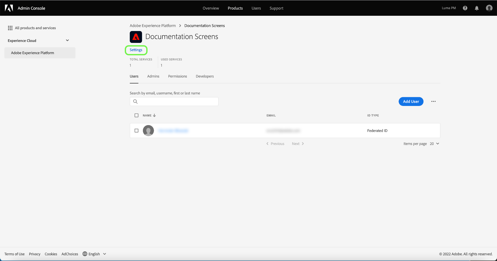

# Gerenciar detalhes e serviços adicionais para um perfil de produto

Você pode configurar os detalhes de um perfil e o acesso a serviços adicionais no menu **[!UICONTROL Configurações do perfil]**. Para acessar o menu, selecione **[!UICONTROL Settings]** na página **[!UICONTROL Product Profile]**.

O menu **[!UICONTROL Editar perfil de produto]** é exibido, começando na guia **[!UICONTROL Editar detalhes do perfil]**. Essa guia permite inserir e editar o nome e a descrição do perfil. Você também pode modificar seu nome de exibição, bem como as configurações de notificação por email para sua conta.

Selecione **[!UICONTROL Next]** para acessar a página **[!UICONTROL Ativar serviços]**.

O menu **[!UICONTROL Ativar serviços]** permite modificar o acesso de um perfil a serviços [!DNL Platform] adicionais que foram configurados inicialmente quando o perfil foi criado. Dependendo da sua assinatura [!DNL Platform], esses serviços podem incluir:

- [!DNL Data Science Workspace]
- [!DNL Query Service]
- [!DNL Real-Time Customer Data Platform] Interface do usuário (somente para CDP em tempo real)
- Interface do usuário B2B

Clique no botão de alternância no lado direito de um serviço específico para ativá-lo ou desativá-lo. Você também pode marcar a caixa de seleção **[!UICONTROL Todos em]** para ativar ou desativar todos os serviços listados.

Quando terminar, selecione **[!UICONTROL Save]**.

Os clientes autorizados para a B2B ou B2P Edition têm acesso à interface B2B. A interface B2B pode ser provisionada para usuários por meio do [!UICONTROL Ativar menu de serviços]. Selecione a alternância ao lado de [!UICONTROL B2B UI] para habilitar o serviço para um perfil de produto específico e selecione **[!UICONTROL Salvar]**.

A alternância da interface B2B permite que os usuários visualizem workflows B2B ao gerenciar Contas e Oportunidades, bem como criem segmentos relacionados a B2B. Para obter mais informações, consulte a documentação em [[!DNL Real-time Customer Data Platform B2B Edition]](../../rtcdp/b2b-overview.md).

