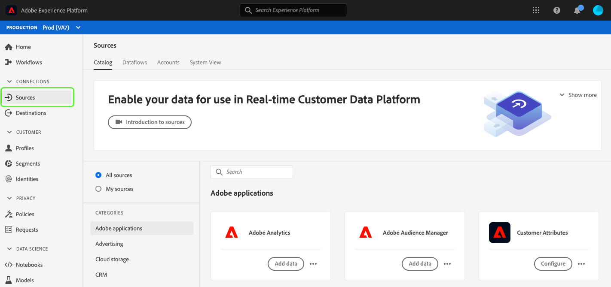

# Soluções de acessibilidade personalizadas para o Experience Platform

O Adobe Experience Platform é aprimorado continuamente para atender às necessidades de todos os tipos de usuários e aderir aos padrões mundiais que incluem indivíduos com deficiências visuais, auditivas, de mobilidade ou outras. Este documento descreve soluções de acessibilidade personalizadas na interface do usuário do Experience Platform.

## Visão geral da página inicial e da interface do usuário

A interface de usuário do Experience Platform atende às taxas de contraste necessárias para texto normal, gráficos e componentes de interface do usuário. As cores da interface do usuário também foram escolhidas para oferecer suporte à acessibilidade para todos os usuários, incluindo aqueles com deficiências visuais.

Na Platform, os elementos da interface do usuário clicáveis ou acionáveis com um ponteiro também podem ser engajados usando um teclado. Isso inclui a navegação à esquerda, players de vídeo, tabelas e muito mais.

O Experience Platform se esforça para atender aos padrões internacionais de acessibilidade, incluindo as Web Content Accessibility Guidelines 2.1 Nível A e Nível AA e os padrões Web Web Web Accessibility Initiative - Accessible Rich Internet Applications (WAI-ARIA).

## Navegação à esquerda

A navegação à esquerda na interface do usuário do Experience Platform é acessível pelo teclado e fornece contraste de cores em estados normais, de passar o mouse e de seleção que atendem aos padrões de acessibilidade.

Na tela inicial, os usuários podem ir para a navegação à esquerda. Selecionar **Shift + Tab** retorna o usuário à tela inicial.

Com a navegação à esquerda em foco, **Guia** leva os usuários para a interação expandir e recolher. A capacidade de expandir ou recolher a navegação à esquerda é ativada com **Inserir (Retorno)**.

Com a navegação à esquerda em foco, as teclas de seta para cima e para baixo navegam até cada item na navegação e alternam continuamente (em outras palavras, o foco não é deslocado até que o usuário saia da navegação à esquerda). O foco é mostrado para itens de navegação quando selecionado. A seleção atual é mostrada com um realce e um texto em negrito. Ao selecionar um item de navegação à esquerda, **Inserir (Retorno)** abre o item de interface selecionado no painel direito, no entanto, o foco permanece na navegação à esquerda até que o usuário afaste-se.

Alguns recursos na Platform não estão habilitados para todos os usuários. Esses itens aparecem na navegação, mas não podem ser selecionados. Ao navegar com um teclado, esses itens são ignorados durante a navegação de seta e não podem ser selecionados usando **Inserir (Retorno)**.

## Caixa de diálogo Vídeo incorporado

Os vídeos podem ser exibidos no Experience Platform usando a navegação pelo teclado para realçar e selecionar um link de vídeo disponível. Isso abre uma caixa de diálogo de vídeo incorporada na interface do usuário da Platform.

## Acessibilidade do teclado da caixa de diálogo de vídeo

A caixa de diálogo de vídeo incorporado também pode ser navegada usando o teclado. A tabela a seguir descreve a navegação completa pelo teclado disponível para a caixa de diálogo de vídeo incorporado.

| Elemento da caixa de diálogo | Acessibilidade do teclado | Descrição |
|---|---|---|
| Reproduzir e pausar | Guia Barra de espaço | Uso **Guia** para definir o foco no botão reproduzir. **Barra de espaço** inicia a reprodução do vídeo e pausa a reprodução dele. |
| Depurador | Guia Seta para a esquerda Seta para a direita | Quando o vídeo estiver sendo reproduzido, use **Guia** para focalizar o depurador. Com o depurador em foco, **teclas de seta para a esquerda e direita** ignore a reprodução de vídeo 5 segundos, respectivamente. |
| Mudo | Guia Barra de espaço | Uso **Guia** para focalizar o elemento de volume mudo. Uso **barra de espaço** para ativar ou desativar o som da reprodução de vídeo. |
| Volume | Guia Seta para a esquerda Seta para a direita | Uso **Guia** para focalizar no elemento de volume. **Teclas de seta para a esquerda e direita** aumentar e diminuir o volume, respectivamente. |
| [!UICONTROL Legendas codificadas] (&quot;cc&quot;) | Guia Enter Seta para cima Seta para baixo | **Guia** para [!UICONTROL Legendas codificadas] (&quot;cc&quot;). Uso **Enter** para abrir o menu e **teclas de seta para cima e para baixo** para selecionar um idioma para legendas. **Enter** confirma sua seleção. |
| [!UICONTROL Qualidade] | Guia Enter Seta para cima Seta para baixo | Uso **Guia** para focalizar o [!UICONTROL Qualidade] elemento. Uso **Enter** para abrir o menu e a janela **teclas de seta para cima e para baixo** para selecionar a qualidade do vídeo. **Enter** confirma sua seleção. |
| Tela cheia | Guia Barra de espaço ou Enter Escape | Uso **Guia** para focalizar o elemento de tela cheia. Uso **barra de espaço ou Enter** para ativar a visualização em tela cheia. **Escape** (&quot;esc&quot;) sai do modo de tela cheia. |
| Fechar | Guia Barra de espaço ou Enter | Uso **Guia** para focalizar o botão fechar. Uso **barra de espaço ou Enter** para sair da caixa de diálogo de vídeo. |

>[!NOTE]
>
>A qualquer momento durante a reprodução, a tecla escape (&quot;esc&quot;) pode ser usada para fechar a caixa de diálogo de vídeo incorporada.

## Arrastar e soltar arquivo

No Experience Platform, todas as zonas de arrastar e soltar para seleção de arquivos são acessíveis pelo teclado. Usar **Guia** para destacar **[!UICONTROL Escolher arquivos]** e usando **Enter ou barra de espaço** para selecioná-lo, chama a interface de seleção de arquivos do sistema operacional.

Depois que um arquivo é carregado, um ícone de exclusão se torna navegável pelo teclado para remover o arquivo selecionado e carregar um novo. Os usuários podem usar **Guia** para focalizar no ícone excluir e **Enter ou barra de espaço** para selecioná-la. Depois que o arquivo for removido, **[!UICONTROL Escolher arquivos]** O está automaticamente em foco e pode ser selecionado.

Como alternativa, se o arquivo carregado não estiver no formato correto, um ícone de erro será exibido junto com uma mensagem de erro e a variável **[!UICONTROL Escolher arquivos]** botão está em foco e pode ser selecionado.

Usar um mouse para selecionar a zona de arrastar e soltar também chama a interface de seleção de arquivos, ou um usuário de mouse pode selecionar um arquivo e arrastar até a zona para começar o upload.

## Procurar tabela

Todas as tabelas na interface do usuário do Experience Platform podem ser acessadas pelo teclado. Procurar e interagir com linhas e colunas da tabela é possível por meio de uma série de atalhos de teclado:

* No cabeçalho da tabela, use o **seta para baixo** para navegar na tabela. Os cabeçalhos da tabela podem ser selecionados ao navegar via **Guia**, e você poderá alterar a ordem de classificação usando **barra de espaço**.
* **Teclas de seta para cima e para baixo** move para cima e para baixo nas linhas da tabela.
* Quando uma linha é selecionada ou está em foco, usando **Enter** na linha fornece detalhes no painel direito.
* Quando uma linha for selecionada ou estiver em foco, use **teclas de seta** para percorrer cada item na linha.
* Uso **Enter** para selecionar um item na linha. Os usuários com leitores de tela são avisados se uma nova janela precisar ser aberta.
* Ao ampliar para 200% ou mais, você pode ver a **inspetor de trilhos** ícone à medida que o painel direito é recolhido para fornecer mais espaço de visualização à tabela.

### Procurar acessibilidade do teclado da tabela

| Acessibilidade do teclado | Descrição |
|---|---|
| HOME (Função + seta para a esquerda) | Quando a linha é focalizada, leva os usuários para o primeiro item na linha |
| END (Função + seta para a direita) | Quando a linha é focalizada, leva os usuários para o último item da linha |
| Página para cima | Atravessa 10 linhas para cima na tabela (por página) |
| Página para baixo | Atravessa 10 linhas para baixo na tabela (por página) |
| Control + HOME | Vai para a primeira linha da tabela |
| Control+END | Vai para o primeiro trabalho na tabela por página |

## Interface do Editor de esquemas

A interface do Editor de esquemas é acessível pela seguinte funcionalidade:

* O Editor de esquemas é compatível com a navegação pelo teclado, incluindo o uso de **Guia** à navegação pelos elementos da interface do usuário.
* **Guia** insere o campo de pesquisa e, em seguida, na árvore de esquema.
* A árvore de esquema suporta o uso de teclas de seta para navegar pela interface da árvore de esquema
   * **Setas para cima e para baixo** pode ser usado para percorrer a árvore.
   * **Setas para a esquerda e direita** pode ser usado para expandir e recolher nós ou se mover entre ações em linha na árvore de esquema.
* **Inserir (Retorno)** ativa detalhes de nós individuais no painel de detalhes à direita.
* A variável **Início** A tecla retorna à parte superior da árvore.
* A variável **Fim** A tecla navega até a parte inferior da árvore.
* A árvore de esquema também inclui rótulos ARIA para leitores de tela.

## Interface do construtor de segmentos

Ao usar a interface do Construtor de segmentos para criar, editar e interagir com segmentos no Experience Platform, os seguintes recursos melhoram a acessibilidade:

* A interface do usuário do Construtor de segmentos pode ser acessada pela navegação pelo teclado.
* Os leitores de tela devem reconhecer as tags de marcação para cabeçalhos e podem anunciar o cabeçalho junto com seu nível.
* Outras tecnologias de assistência podem alterar a exibição visual de uma página, usando cabeçalhos codificados corretamente para exibir um outline ou uma exibição alternativa.

Agora é possível recolher ou expandir os painéis esquerdo e direito da tela do construtor de segmentos para obter mais espaço na tela. Esse recurso é particularmente útil, pois oferece capacidade de função completa com 200% de zoom.

## Editor do serviço de consulta

Os seguintes recursos de acessibilidade estão disponíveis no editor do Serviço de consulta:

* O contraste de cores na interface do editor do Serviço de consulta atende à conformidade de acessibilidade.
* A navegação pelo teclado é suportada fora da interface do editor. A interface do usuário do editor é um Espelho de código incorporado.

## Guia Exibição de sistema em Origens e Destinos

Ao navegar pelo **[!UICONTROL Exibição do sistema]** em Origens e Destinos, a seguinte funcionalidade melhora a acessibilidade:

* **Guia** define o foco para a primeira placa de conexão de origem
   * **Guia** novamente para focalizar no botão dentro do cartão
   * Selecionar **Enter** para ativar o botão de chamada para ação dentro do cartão
* Selecionar **Enter** no cartão de conexão também ativa mais detalhes no painel direito
   * Quando o painel direito é ativado, o foco é definido para essa área. **Guia** focaliza em **Fechar** para o painel direito do painel. Selecionar **Guia** move novamente o foco pelo painel direito
   * Se houver mais de uma placa de conexão de origem, **Guia** passa pelas conexões
   * Uso **teclas de seta (para cima, para baixo, para a esquerda e para a direita)** para percorrer a lista de origens
   * Selecionar **Guia** para definir o foco no painel direito
