# Manual de gerenciamento de tags

As tags permitem gerenciar taxonomias de metadados para classificar objetos de negócios para facilitar a descoberta e a categorização. As tags podem ajudar a identificar atributos taxonômicos importantes para os públicos-alvo com os quais suas equipes trabalharão, para que possam encontrá-los mais rapidamente e também agrupar públicos-alvo comuns em um descritor. É recomendado identificar categorias de tags comuns, como regiões geográficas, unidades de negócios, linhas de produtos, projetos, equipes, intervalos de tempo (trimestres, meses, anos) ou qualquer outra coisa que possa ajudar a aplicar um significado e facilitar a descoberta de públicos-alvo pela sua equipe. 

## Criação de uma tag {#create-tag}

Para criar uma nova tag, selecione **[!UICONTROL tags]** no painel de navegação esquerdo e selecione a categoria de tag desejada.

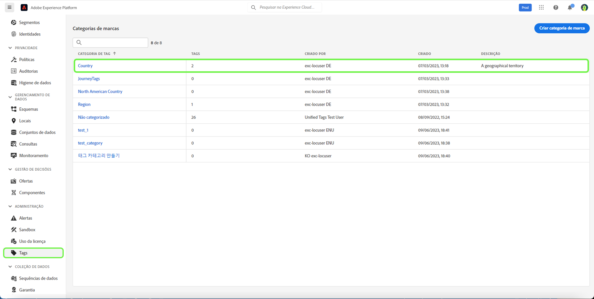

Selecionar **[!UICONTROL Criar tag]** para criar uma nova tag.

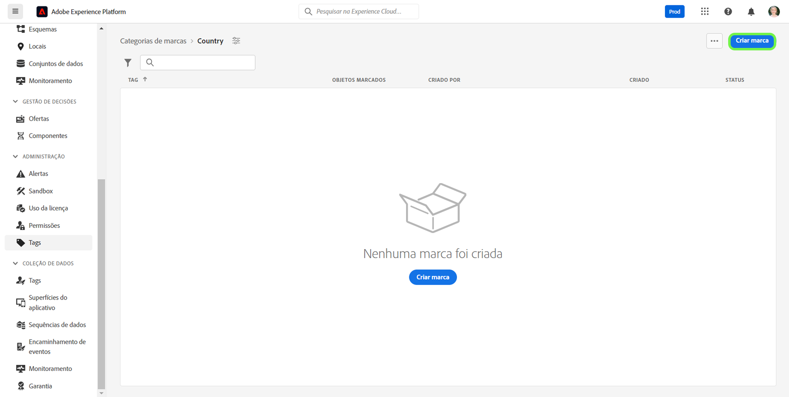

A caixa de diálogo **[!UICONTROL Criar tag]** será exibida, solicitando a inserção de um nome de tag exclusivo. Quando terminar, clique em **[!UICONTROL Salvar]**.

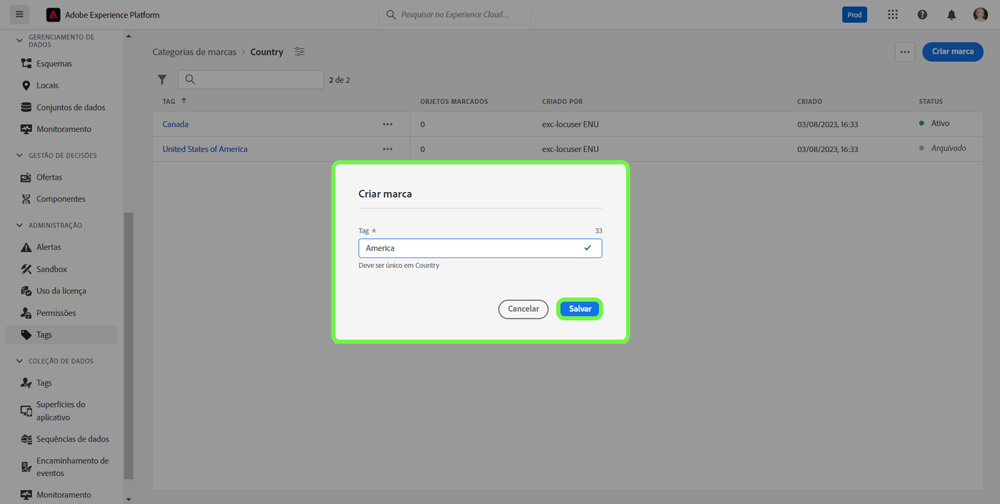

A nova tag foi criada com sucesso e você será redirecionado para a tela de tags, onde a tag recém-criada aparecerá na lista.

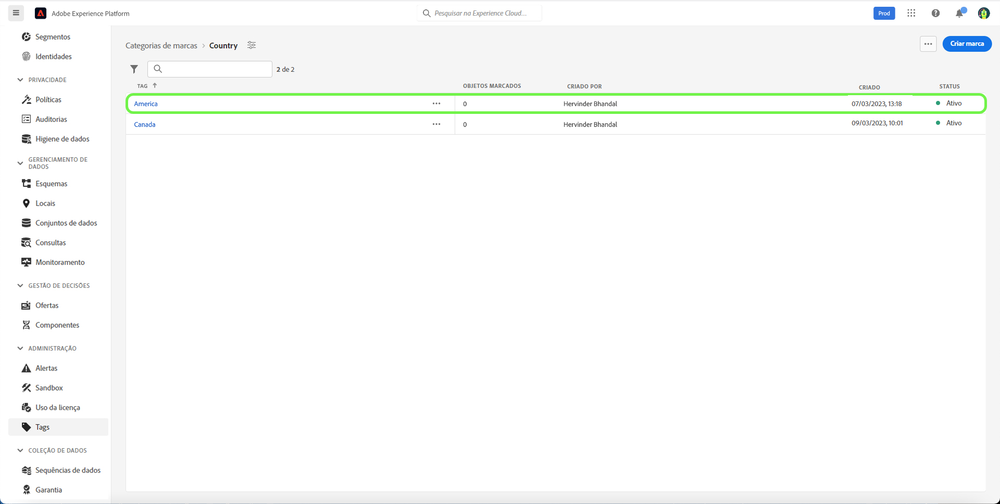

## Edição de uma tag {#edit-tag}

A edição de uma tag ajuda quando há erros ortográficos, atualizações da convenção de nomeação ou da terminologia. A edição de uma tag manterá sua associação com qualquer objeto no qual ela esteja aplicada no momento.

Para editar uma tag já existente, na lista de categorias de tags, clique nas reticências (`...`) ao lado do nome da tag que deseja editar. Um menu suspenso exibe os controles para editar, mover ou arquivar a tag. Selecionar **[!UICONTROL Editar]** na lista suspensa.

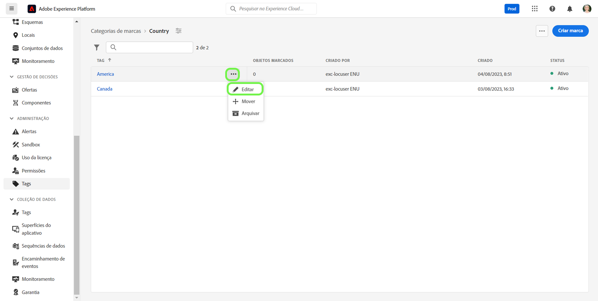

A caixa de diálogo **[!UICONTROL Editar tag]** será exibida, solicitando a edição do nome da tag. Quando terminar, clique em **[!UICONTROL Salvar]**.

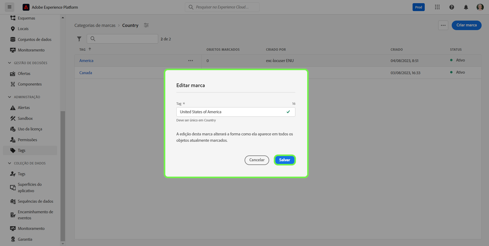

O nome da tag foi atualizado com sucesso e você será redirecionado para a tela tags, onde a tag atualizada aparecerá na lista.

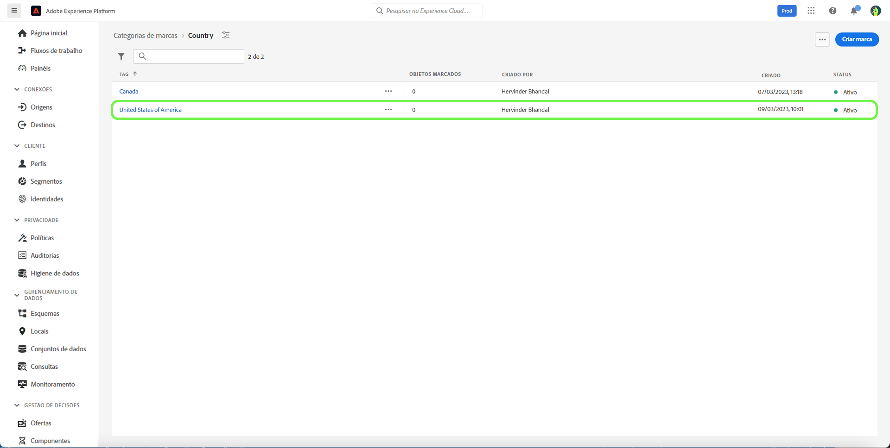

## Deslocamento de uma tag entre categorias {#move-tag}

As tags podem ser deslocadas para outras categorias de tag. Deslocar uma tag manterá sua associação com qualquer objeto no qual ela esteja aplicada no momento.

Para mover uma tag já existente, na lista de categorias de tag, clique nas reticências (`...`) ao lado do nome da tag que deseja deslocar. Um menu suspenso exibe os controles para editar, mover ou arquivar a tag. Selecionar **[!UICONTROL Editar]** no menu suspenso.

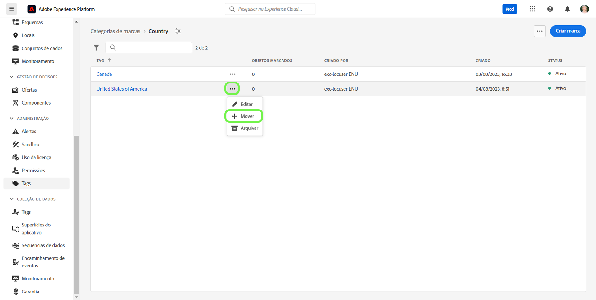

A caixa de diálogo **[!UICONTROL Deslocar tag]** será exibida, solicitando a seleção da categoria para onde a tag selecionada deverá ser deslocada.

É possível rolar a tela e selecionar itens da lista ou usar o recurso de pesquisa para inserir o nome da categoria. Quando terminar, clique em **[!UICONTROL Deslocar]**.

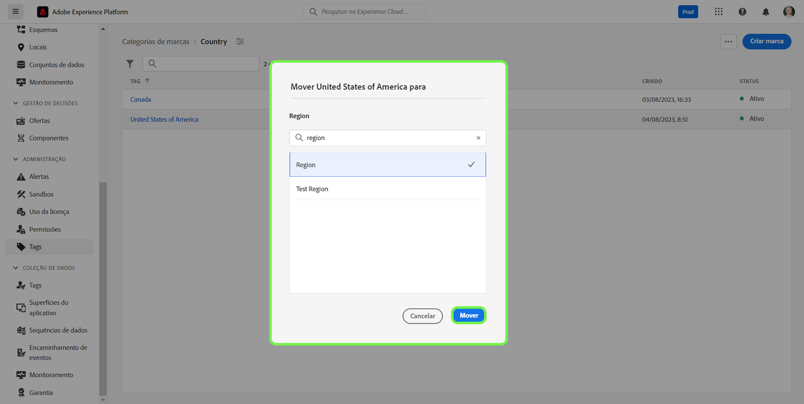

A tag foi deslocada com sucesso e você será redirecionado para a tela tags, onde você verá a lista atualizada na qual a tag não está mais exibida.

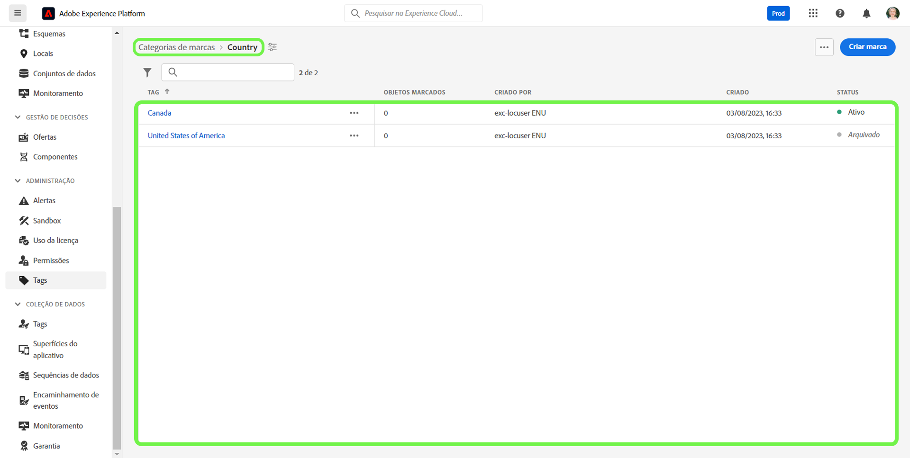

A tag agora aparecerá na categoria de tag selecionada anteriormente.

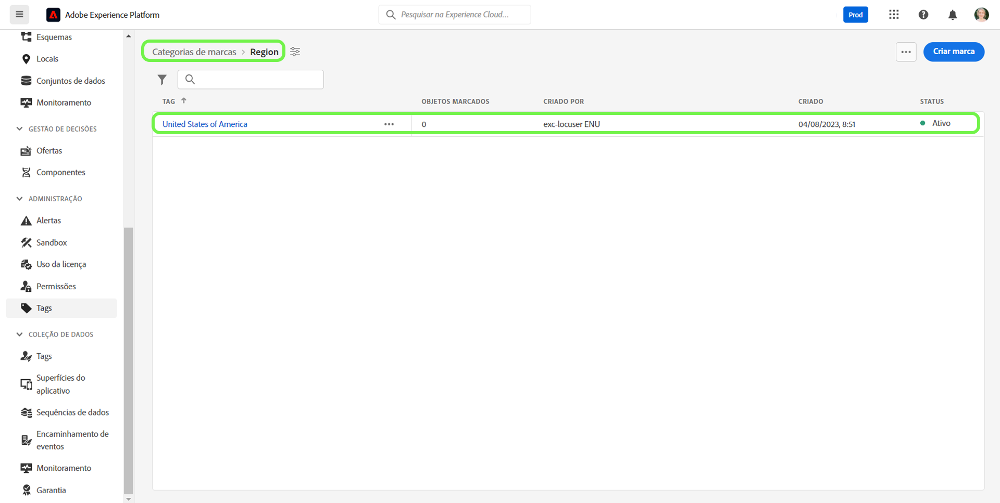

## Arquivamento de uma tag {#archive-tag}

O status de uma tag pode ser alternado entre ativa e arquivada. As tags arquivadas não são removidas dos objetos nos quais já foram aplicadas, mas não podem mais ser aplicadas a novos objetos. Cada tag terá o mesmo status em todos os objetos. Isso é particularmente útil quando desejar manter as associações atuais da tag nos objetos, mas não quiser que ela seja usada no futuro.

Para arquivar uma tag já existente, na lista de categorias de tags, clique nas reticências (`...`) ao lado do nome da tag que você deseja arquivar. Um menu suspenso exibe os controles para editar, mover ou arquivar a tag. Selecione **[!UICONTROL Arquivar]** no menu suspenso.

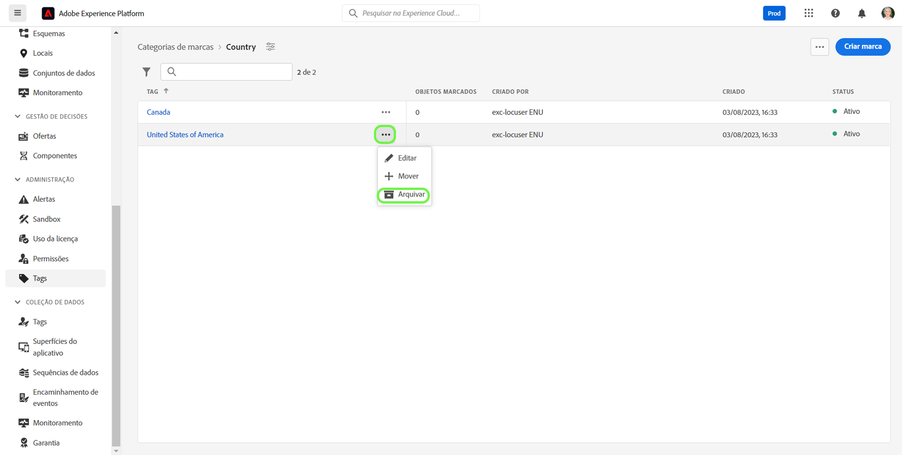

A caixa de diálogo **[!UICONTROL Arquivar tag]** será exibida, solicitando a confirmação do arquivamento da tag. Selecione **[!UICONTROL Arquivar]**.

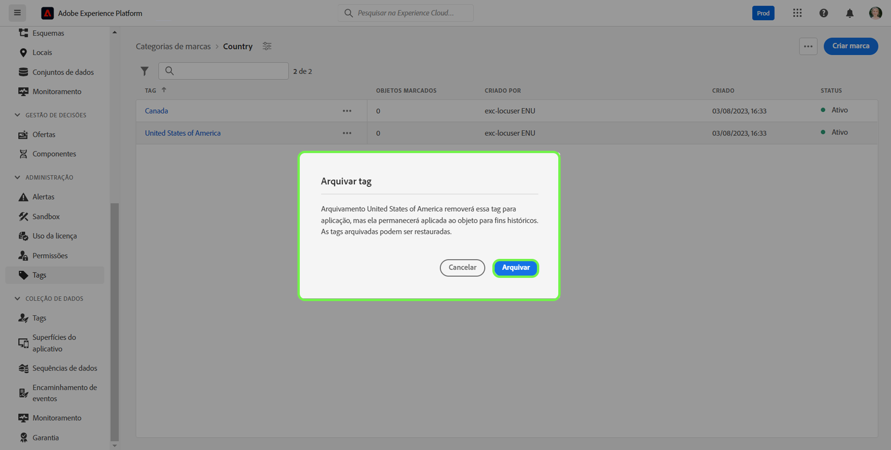

A tag foi arquivada com sucesso e você será redirecionado para a tela de tags. Você verá que a lista de tags atualizada agora mostra o status da tag como `Archived`.

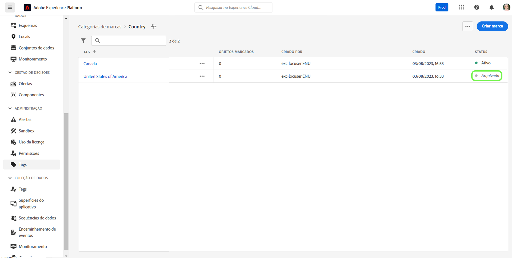

## Restauração de uma tag arquivada {#restore-archived-tag}

Se quiser aplicar uma tag `Archived` para novos objetos, ela deve estar no estado `Active`. Restaurar uma tag arquivada fará com que ela volte a seu estado `Active`.

Para restaurar uma tag arquivada, na lista de categorias de tags, clique nas reticências (`...`) ao lado do nome da tag que deseja restaurar. Um menu suspenso exibe os controles para restaurar ou excluir a tag. Selecione **[!UICONTROL Restaurar]** no menu suspenso.

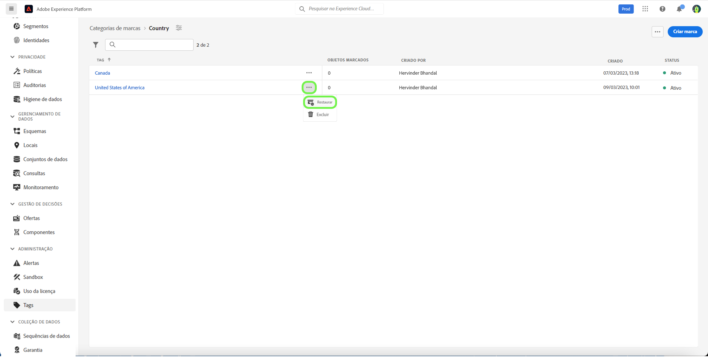

A caixa de diálogo **[!UICONTROL Restaurar tag]** será exibida, solicitando a confirmação da restauração da tag. Selecione **[!UICONTROL Restaurar]**.

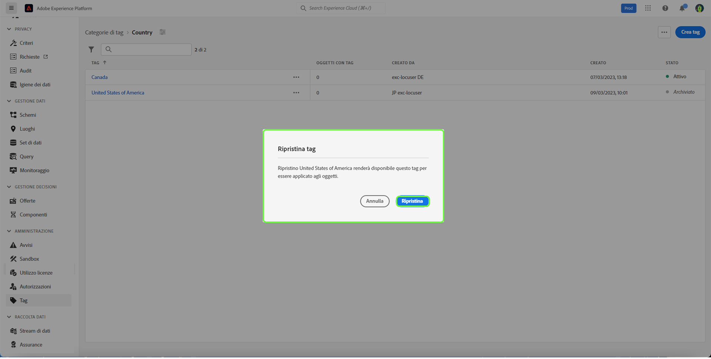

A tag foi restaurada com sucesso e você será redirecionado para a tela de tags. Você verá que a lista de tags atualizada agora mostra o status da tag como `Active`.

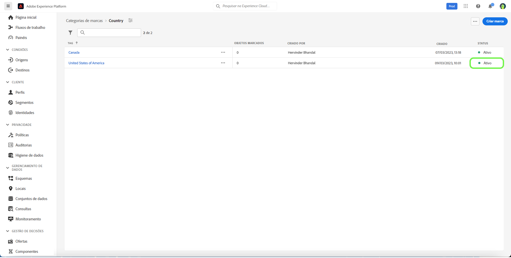

## Exclusão de uma tag {#delete-tag}

>[!NOTE]
>
>Somente as tags que estão no estado `Archived` e não estão associadas a nenhum objeto, podem ser excluídas.

A exclusão de uma tag a removerá completamente do sistema.

Para excluir uma tag arquivada, na lista de categorias de tags, clique nas reticências (`...`) ao lado do nome da tag que deseja excluir. Um menu suspenso exibe os controles para restaurar ou excluir a tag. Selecione **[!UICONTROL Excluir]** no menu suspenso.

A caixa de diálogo **[!UICONTROL Excluir tag]** será exibida, solicitando a confirmação da exclusão da tag. Clique em **[!UICONTROL Excluir]**.

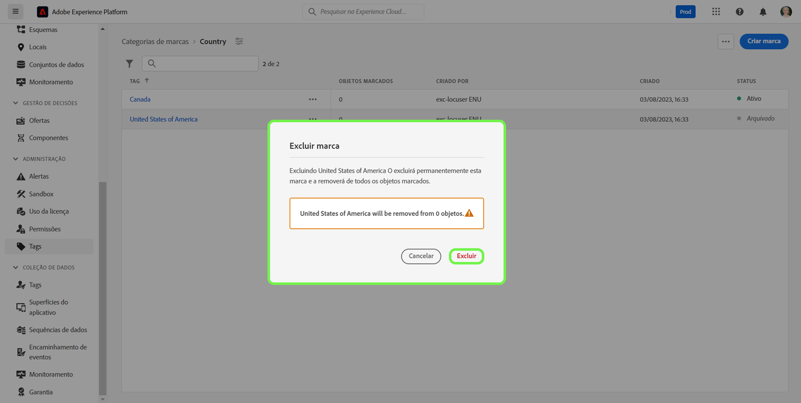

A tag foi excluída com sucesso e você será redirecionado para a tela de tags. A tag não aparecerá mais na lista pois foi completamente removida.

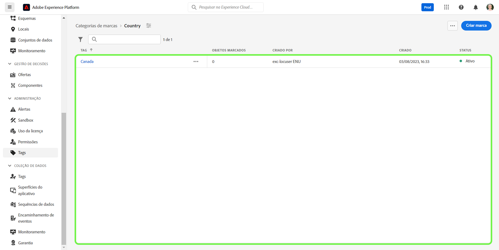

## Visualização de objetos marcados {#view-tagged}

Cada tag tem uma página de detalhes, que pode ser acessada no inventário de tags. Esta página lista todos os objetos que atualmente têm essa tag aplicada, permitindo que os usuários vejam os objetos relacionados de diferentes aplicativos e recursos em uma única visualização.

Para exibir a lista de objetos com a tag, localize a tag em uma categoria de tag e a selecione.

A caixa de diálogo [!UICONTROL Objetos marcados] será exibida, mostrando um inventário de objetos com a tag.

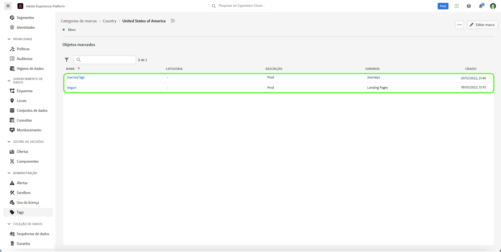

## Próximas etapas

Você aprendeu a gerenciar tags. Para obter uma visão geral de alto nível das tags na Experience Platform, consulte a [documentação da visão geral das tags](../overview.md).
