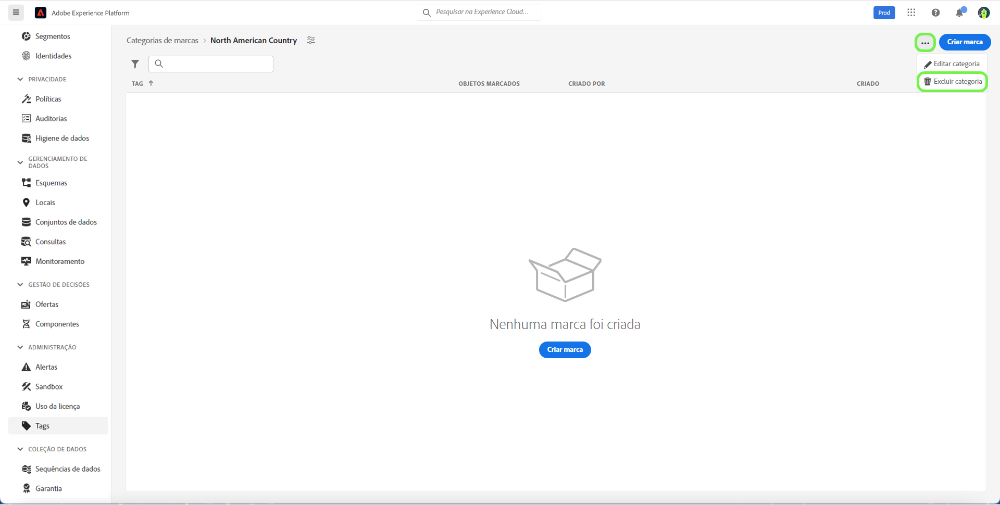

# Guia de categorias de tag

As categorias de tags agrupam tags em conjuntos significativos para fornecer mais contexto e esclarecer melhor a finalidade da tag. Qualquer tag que tenha uma categoria terá o nome da tag precedido pelo nome da categoria e dois pontos.

## Criar uma categoria de tag {#create-tag-category}

Para criar uma nova categoria, selecione **[!UICONTROL tags]** na navegação à esquerda, selecione [!UICONTROL Criar categoria de tag].

A variável **[!UICONTROL Criar categoria de tag]** será exibida, solicitando que você insira um nome de Categoria exclusivo e uma descrição opcional. Quando terminar, selecione **[!UICONTROL Salvar]**.

A nova categoria de tag foi criada com sucesso e você será redirecionado para a página de criação de tag, na qual será possível atribuir novas tags. Para obter mais informações sobre a criação de tags, consulte a [gerenciamento de tags](./managing-tags.md#create-a-tag-create-tag) documento.

## Editar categoria de tag {#edit-tag-category}

>[!NOTE]
>
>A edição ou renomeação de uma categoria de tag mantém a associação da tag com quaisquer objetos nos quais elas são aplicadas no momento.

Para editar uma categoria de tag, selecione **[!UICONTROL tags]** na navegação à esquerda, selecione a categoria de tag que deseja editar.

Na categoria de tag, selecione as reticências (`...`) ao lado de [!UICONTROL Criar tag]. Uma lista suspensa exibe controles para editar categoria ou excluir, selecione **[!UICONTROL Editar categoria]**.

A variável **[!UICONTROL Editar categoria]** será exibida, solicitando que você atualize o nome da categoria e a descrição opcional. Quando terminar, selecione **[!UICONTROL Salvar]**.

A categoria de tag foi atualizada com sucesso e você será redirecionado para a categoria de tag.

## Excluir categoria de tag {#delete-tag-category}

>[!NOTE]
>
>Antes de excluir uma categoria de tag, ela deve estar vazia e sem tags.

Para excluir uma categoria de tag, selecione **[!UICONTROL tags]** na navegação à esquerda, selecione a categoria de tag que deseja excluir.

Na categoria de tag, selecione as reticências (`...`) ao lado de [!UICONTROL Criar tag]. Uma lista suspensa exibe controles para editar categoria ou excluir, selecione **[!UICONTROL Excluir categoria]**.

A variável **[!UICONTROL Excluir categoria]** será exibida, solicitando que você confirme a exclusão da categoria da tag. Selecionar **[!UICONTROL Excluir]** para confirmar.

A categoria de etiqueta foi excluída com sucesso e você é redirecionado para a página inventário da categoria de etiqueta. A categoria de tag não aparece mais na lista e foi completamente removida.

## Próximas etapas

Agora você aprendeu a gerenciar categorias de tags. Você pode prosseguir para a próxima etapa para [gerenciamento de tags](./managing-tags.md).
