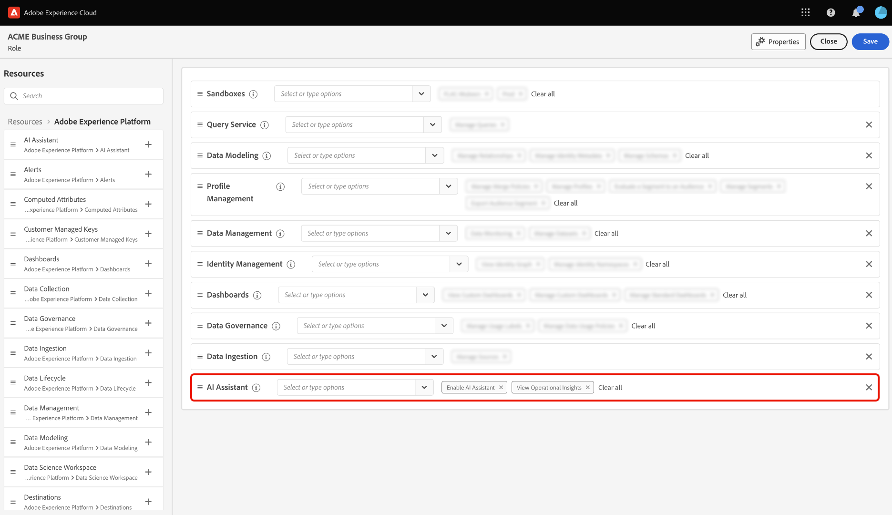

# Acessar o assistente de IA no Experience Platform

Você pode acessar o Assistente de IA em vários aplicativos na Adobe Experience Cloud.

>[!IMPORTANT]
>
>Se você receber uma mensagem pop-up na interface de permissões do usuário que informa que sua organização deve primeiro concordar com termos legais adicionais para obter acesso ao Assistente de IA, entre em contato com a equipe de conta da Adobe para obter orientação sobre esses termos.

## Introdução {#get-started}

Você deve concluir duas etapas de pré-requisito antes de acessar o Assistente de IA.

1. Sua organização deve primeiro concordar com termos legais. Para obter mais informações, entre em contato com a equipe de conta da Adobe.
2. Seus administradores devem conceder permissões suficientes para acessar o Assistente de IA.

Se nenhuma dessas duas etapas de pré-requisito for concluída, você verá as seguintes mensagens ao selecionar o ícone de bate-papo do Assistente do AI na interface do usuário do Experience Platform.

>[!BEGINTABS]

>[!TAB Sua organização não pode usar o Assistente de IA]

Você verá a seguinte mensagem se estiver usando uma organização que não seja legalmente qualificada para usar o Assistente de IA. Nesse cenário, você deve entrar em contato com a equipe de conta da Adobe para resolver o problema de acesso.

>[!TAB Você não tem as permissões certas]

Se sua organização estiver legalmente qualificada para usar o Assistente de IA e você ainda não conseguir acessar o recurso, você verá a seguinte mensagem na interface do usuário do Experience Platform. Esse cenário significa que você não tem permissões suficientes para acessar o recurso e deve entrar em contato com seus administradores para resolver as permissões.

>[!ENDTABS]

## Obter acesso ao Assistente de IA

O acesso ao AI Assistant é regido pelos seguintes parâmetros:

* **Acessar o aplicativo:** Você pode acessar o Assistente de IA no Adobe Experience Platform, Adobe Real-Time CDP, Adobe Journey Optimizer e [Customer Journey Analytics](https://experienceleague.adobe.com/pt-br/docs/analytics-platform/using/ai-assistant).
<!-- * **Contractual access:** Your company must agree to certain [!DNL GenAI]-related legal terms before your organization can use AI Assistant. Contact your organization's administrator or your Adobe Account Team if you are not able to access AI Assistant.  -->
* **Permissões:** Use a [Interface do usuário de permissões](../access-control/abac/ui/permissions.md) para conceder ou revogar acesso ao Assistente de IA em sua organização. Para usar o Assistente de IA, um determinado usuário deve pertencer a uma função provisionada com as permissões **Habilitar Assistente de IA** e **Exibir Insights Operacionais**.
   * Como administrador, você pode adicionar o **Habilitar o Assistente de IA** a uma determinada função e adicionar um usuário a essa função, para permitir que ele acesse o Assistente de IA em sua organização. **Observação**: essa permissão permite que o usuário acesse o Assistente de IA, pois ela não concede a ele nenhuma capacidade administrativa para conceder a outros o acesso ao Assistente de IA.
   * Como administrador, você pode adicionar o **Exibir Insights Operacionais** a uma determinada função e adicionar um usuário a essa função, para permitir que ele use os recursos de insights operacionais do Assistente de IA. Os insights operacionais estão atualmente na versão beta.

Use a [interface de permissões](../access-control/abac/ui/roles.md) para conceder permissões para usar o Assistente de IA no Experience Platform e no Journey Optimizer. Para obter informações sobre como acessar o Assistente de IA no Customer Journey Analytics. Leia a documentação no [Customer Journey Analytics](https://experienceleague.adobe.com/pt-br/docs/analytics-platform/using/ai-assistant).

Depois de ter as permissões necessárias, você pode acessar o Assistente do AI selecionando o ícone do Assistente do AI no cabeçalho superior do aplicativo que está usando.

Assista ao vídeo a seguir para saber como configurar o acesso ao AI Assistant para suas organizações e usuários.

>[!VIDEO](https://video.tv.adobe.com/v/3475924/?captions=por_br&learn=on)

## Próximas etapas

Após concluir o acesso ao Assistente de IA, você pode continuar usando o recurso durante seus fluxos de trabalho. Leia o [guia da interface do usuário do Assistente de IA](./ui-guide.md) para obter mais informações.
