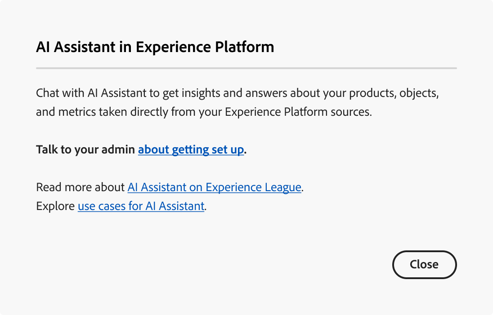
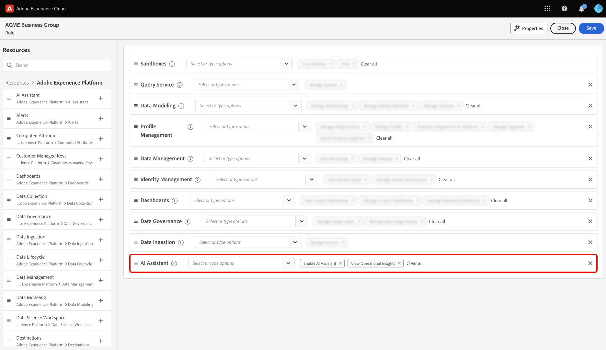
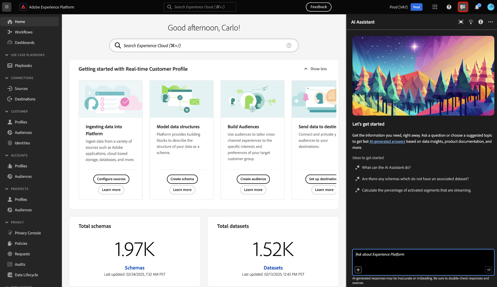

# Acessar o assistente de IA (herdado) no Experience Platform

>[!IMPORTANT]
>
>Este documento se aplica ao Assistente de IA (herdado). Para obter informações sobre o Assistente de IA (Próxima Geração), leia o [Guia da Interface do Usuário do Assistente de IA](https://experienceleague.adobe.com/pt-br/docs/experience-cloud-ai/experience-cloud-ai/ai-assistant/ai-assistant-ui) na documentação do [AI no Experience Cloud](https://experienceleague.adobe.com/pt-br/docs/experience-cloud-ai/experience-cloud-ai/home).

Consulte a tabela a seguir para obter uma comparação do Assistente de IA (Herdado) e do Assistente de IA (Próxima geração):

| Área de recurso | Assistente de IA (herdado) | Assistente de IA (Next-Gen) |
| --- | --- | --- |
| Experiência do usuário | O Assistente de IA (herdado) está disponível somente no painel direito. | O AI Assistant (Next-Gen) está disponível no painel direito e na experiência de tela cheia imersiva. |
| Escopo dos recursos | Você pode usar o Assistente de IA (Herdado) para obter conhecimento sobre o produto e insights operacionais. | Você pode usar o Assistente de IA (Next-Gen) para obter conhecimento sobre produtos, insights operacionais, habilidades agênicas avançadas e execução de tarefas em várias etapas. |
| Arquitetura da plataforma | O Assistente de IA (herdado) não foi criado na pilha do Agent Orchestrator. | O AI Assistant (Next-Gen) é disponibilizado pelo [Adobe Experience Platform Agent Orchestrator](https://experienceleague.adobe.com/pt-br/docs/experience-cloud-ai/experience-cloud-ai/agents/agent-orchestrator), permitindo extensibilidade e coordenação avançada entre recursos. |
| Cobertura do aplicativo | O Assistente de IA (herdado) é uma implementação específica do aplicativo. | Você pode usar o Assistente de IA (Next-Gen) para obter uma experiência unificada de assistente de IA em todos os aplicativos da Adobe Experience Cloud. |
| Modelo de acesso e permissão | Modelo de acesso com escopo de aplicativo alinhado aos limites individuais do produto. | Todos os usuários obtêm acesso ao AI Assistant (Next-Gen) e aos agentes associados da Experience Platform. **Nota**: <ul><li>**Adobe Experience Manager**: o administrador deve conceder a você permissão para acessar o Assistente de IA (Próxima Geração) por meio da [Adobe Admin Console](https://helpx.adobe.com/br/enterprise/using/admin-console.html).</li><li>**Customer Journey Analytics**: o administrador deve conceder a você permissão para acessar o Assistente de IA por meio do [Controle de Acesso do Customer Journey Analytics](https://experienceleague.adobe.com/pt-br/docs/analytics-platform/using/technotes/access-control?lang=en). Isso permite fazer perguntas sobre conhecimento do produto e insights de dados. |

Você pode acessar o Assistente de IA (herdado) em vários aplicativos na Adobe Experience Cloud.

>[!NOTE]
>
>Se você receber uma mensagem pop-up na interface de permissões do usuário que informa que sua organização deve primeiro concordar com termos legais adicionais para obter acesso ao Assistente de IA (herdado), entre em contato com a equipe de conta da Adobe para obter orientação sobre esses termos.

## Introdução {#get-started}

Você deve concluir duas etapas de pré-requisito antes de acessar o Assistente de IA (Herdado).

1. Sua organização deve primeiro concordar com termos legais. Para obter mais informações, entre em contato com a equipe de conta da Adobe.
2. Seus administradores devem conceder permissões suficientes para acessar o Assistente de IA (Herdado).

Se nenhuma dessas duas etapas de pré-requisito for concluída, você verá as seguintes mensagens ao selecionar o ícone de bate-papo do Assistente de IA (herdado) na interface do usuário do Experience Platform.

>[!BEGINTABS]

>[!TAB Sua organização não pode usar o Assistente de IA (Herdado)]

Você verá a seguinte mensagem se estiver usando uma organização que não seja legalmente qualificada para usar o Assistente de IA (herdado). Nesse cenário, você deve entrar em contato com a equipe de conta da Adobe para resolver o problema de acesso.

>[!TAB Você não tem as permissões certas]

Se sua organização estiver legalmente qualificada para usar o Assistente de IA (herdado) e você ainda não conseguir acessar o recurso, você verá a seguinte mensagem na interface do usuário do Experience Platform. Esse cenário significa que você não tem permissões suficientes para acessar o recurso e deve entrar em contato com seus administradores para resolver as permissões.

>[!ENDTABS]

## Obter acesso ao Assistente de IA (herdado) {#get-access-to-ai-assistant}

O acesso ao AI Assistant (herdado) é regido pelos seguintes parâmetros:

* **Acessar o aplicativo:** Você pode acessar o Assistente de IA (Herdado) no Adobe Experience Platform, Adobe Real-Time CDP, Adobe Journey Optimizer e [Customer Journey Analytics](https://experienceleague.adobe.com/pt-br/docs/analytics-platform/using/ai-assistant).
<!-- * **Contractual access:** Your company must agree to certain [!DNL GenAI]-related legal terms before your organization can use AI Assistant (Legacy). Contact your organization's administrator or your Adobe Account Team if you are not able to access AI Assistant (Legacy).  -->
* **Permissões:** Use a [Interface do usuário de Permissões](../access-control/abac/ui/permissions.md) para conceder ou revogar acesso ao Assistente de IA (Herdado) em sua organização. Para usar o Assistente de IA (Herdado), um determinado usuário deve pertencer a uma função provisionada com as permissões **Habilitar Assistente de IA** e **Exibir Insights Operacionais**.
   * Como administrador, você pode adicionar o **Habilitar o Assistente de IA** a uma determinada função e adicionar um usuário a essa função, permitindo que ele acesse o Assistente de IA (Herdado) na sua organização. **Observação**: essa permissão permite que o usuário em questão acesse o Assistente de IA (Herdado); ela não concede a ele nenhuma capacidade administrativa para conceder a outros o acesso ao Assistente de IA (Herdado).
   * Como administrador, você pode adicionar o **Exibir Insights Operacionais** a uma determinada função e adicionar um usuário a essa função, para permitir que ele use os recursos de insights operacionais do Assistente de IA (Herdado).

Use a [interface de permissões](../access-control/abac/ui/roles.md) para conceder permissões para usar o Assistente de IA (Herdado) no Experience Platform e no Journey Optimizer. Para obter informações sobre como acessar o Assistente de IA (herdado) no Customer Journey Analytics. Leia a documentação no [Customer Journey Analytics](https://experienceleague.adobe.com/pt-br/docs/analytics-platform/using/ai-assistant).

Depois de ter as permissões necessárias, você pode acessar o Assistente de IA (Herdado) selecionando o ícone  no cabeçalho superior do aplicativo que você está usando.

Assista ao vídeo a seguir para saber como configurar o acesso ao Assistente de IA (herdado) para suas organizações e usuários.

>[!VIDEO](https://video.tv.adobe.com/v/3436470/?learn=on)

## Próximas etapas

Após concluir o acesso ao Assistente de IA (Herdado), você pode prosseguir para o uso do recurso durante seus fluxos de trabalho, leia o [guia da interface do usuário do Assistente de IA (Herdado)](./ui-guide.md) para obter mais informações.
