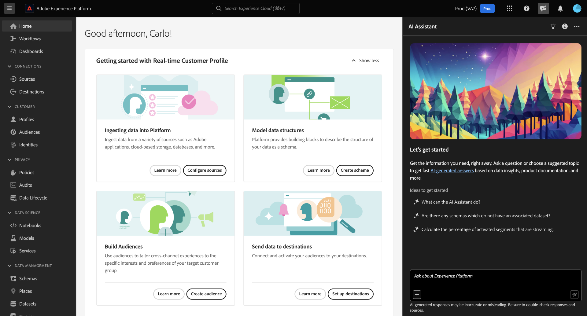
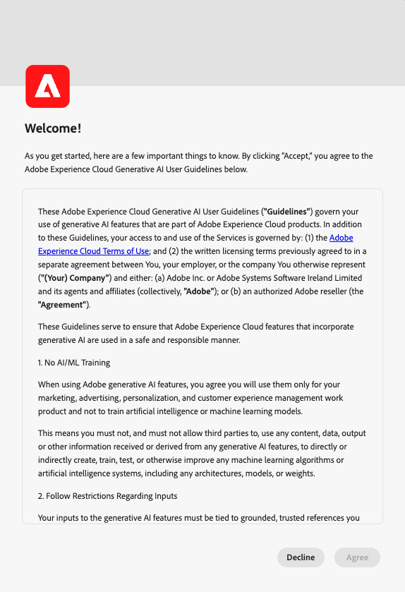

# Assistente de IA (herdado) no Adobe Experience Platform

>[!IMPORTANT]
>
>Este documento se aplica ao Assistente de IA (herdado). Para obter informações sobre o Assistente de IA (Próxima Geração), leia o [Guia da Interface do Usuário do Assistente de IA](https://experienceleague.adobe.com/en/docs/experience-cloud-ai/experience-cloud-ai/ai-assistant/ai-assistant-ui) na documentação do [AI no Experience Cloud](https://experienceleague.adobe.com/en/docs/experience-cloud-ai/experience-cloud-ai/home).

Consulte a tabela a seguir para obter uma comparação do Assistente de IA (Herdado) e do Assistente de IA (Próxima geração):

| Área de recurso | Assistente de IA (herdado) | Assistente de IA (Next-Gen) |
| --- | --- | --- |
| Experiência do usuário | O Assistente de IA (herdado) está disponível somente no painel direito. | O AI Assistant (Next-Gen) está disponível no painel direito e na experiência de tela cheia imersiva. |
| Escopo dos recursos | Você pode usar o Assistente de IA (Herdado) para obter conhecimento sobre o produto e insights operacionais. | Você pode usar o Assistente de IA (Next-Gen) para obter conhecimento sobre produtos, insights operacionais, habilidades agênicas avançadas e execução de tarefas em várias etapas. |
| Arquitetura da plataforma | O Assistente de IA (herdado) não foi criado na pilha do Agent Orchestrator. | O AI Assistant (Next-Gen) é disponibilizado pelo [Adobe Experience Platform Agent Orchestrator](https://experienceleague.adobe.com/pt-br/docs/experience-cloud-ai/experience-cloud-ai/agents/agent-orchestrator), permitindo extensibilidade e coordenação avançada entre recursos. |
| Cobertura do aplicativo | O Assistente de IA (herdado) é uma implementação específica do aplicativo. | Você pode usar o Assistente de IA (Next-Gen) para obter uma experiência unificada de assistente de IA em todos os aplicativos da Adobe Experience Cloud. |
| Modelo de acesso e permissão | Modelo de acesso com escopo de aplicativo alinhado aos limites individuais do produto. | Todos os usuários obtêm acesso ao AI Assistant (Next-Gen) e aos agentes associados da Experience Platform. **Nota**: <ul><li>**Adobe Experience Manager**: o administrador deve conceder a você permissão para acessar o Assistente de IA (Próxima Geração) por meio da [Adobe Admin Console](https://helpx.adobe.com/br/enterprise/using/admin-console.html).</li><li>**Customer Journey Analytics**: o administrador deve conceder a você permissão para acessar o Assistente de IA por meio do [Controle de Acesso do Customer Journey Analytics](https://experienceleague.adobe.com/en/docs/analytics-platform/using/technotes/access-control?lang=en). Isso permite fazer perguntas sobre conhecimento do produto e insights de dados. |

O vídeo a seguir é destinado a fornecer suporte à sua compreensão do Assistente de IA.

>[!VIDEO](https://video.tv.adobe.com/v/3429845?learn=on)

Leia este documento para saber mais sobre o Assistente de IA (herdado) na Adobe Experience Platform.

O Assistente de IA (herdado) no Adobe Experience Platform é uma experiência de conversação que você pode usar para acelerar seus fluxos de trabalho em aplicativos do Adobe. Você pode usar o Assistente de IA (herdado) para entender melhor o conhecimento sobre o produto, solucionar problemas ou pesquisar informações e encontrar insights operacionais. O Assistente de IA (herdado) é compatível com Experience Platform, Real-Time Customer Data Platform, Adobe Journey Optimizer e Customer Journey Analytics.

>[!IMPORTANT]
>
>Você deve concordar com um [contrato de usuário](https://www.adobe.com/legal/licenses-terms/adobe-dx-gen-ai-user-guidelines.html?lang=pt-BR) antes de usar o Assistente de IA (Herdado). O contrato de usuário também contém o contrato público beta. Para que você possa usar os recursos adicionais do Assistente de IA (Herdado) conforme eles são implantados na capacidade beta.

+++Selecione para exibir a interface do contrato do usuário

+++

## Entendendo o assistente de IA {#understanding-ai-assistant}

O Assistente de IA (herdado) responde às perguntas enviadas consultando um banco de dados e, em seguida, traduzindo os dados do banco de dados em uma resposta legível.

Essa representação interna de dados subjacentes também é conhecida como **[!DNL Knowledge Graph]** - uma Web abrangente de conceitos, dados e metadados para uma determinada resposta.

[!DNL Knowledge Graph] consiste em subgráficos que são referenciados sempre que as consultas são enviadas:

* Insights operacionais do cliente.
* Insights operacionais do cliente em várias meta lojas.
* Documentação do Experience League.

Há duas classes de perguntas a serem consideradas antes de consultar o Assistente de IA (Herdado):

### Conhecimento do produto {#product-knowledge}

O conhecimento do produto refere-se a conceitos e tópicos fundamentados na documentação do Experience League. As perguntas sobre o conhecimento do produto podem ser especificadas mais detalhadamente nos seguintes subgrupos:

| Conhecimento do produto | Exemplos |
| --- | --- |
| Aprendizado apontado | <ul><li>Qual é a diferença entre uma identidade e uma chave primária ou estrangeira?</li><li>O que são públicos-alvo semelhantes?</li></ul> |
| Abrir descoberta | <ul><li>Como posso exportar esse conjunto de dados?</li><li>Existem esquemas para clientes de assistência médica?</li></ul> |
| Solução de problemas | <ul><li>Por que não posso ativar um esquema de propriedade da Adobe para o perfil?</li><li>Por que não posso excluir um segmento?</li></ul> |

{style="table-layout:auto"}

Assista ao vídeo a seguir para obter informações adicionais sobre o conhecimento do produto Assistente de IA (herdado):

>[!VIDEO](https://video.tv.adobe.com/v/3438032/?learn=on)

### Insights operacionais {#operational-insights}

Os insights operacionais se referem às respostas que o Assistente de IA (Herdado) gera sobre seus objetos de metadados (atributos, públicos, fluxos de dados, conjuntos de dados, destinos, jornadas, esquemas e fontes), incluindo contagens, pesquisas e impacto de linhagem. Ele não analisa dados na sandbox.

* Quantos conjuntos de dados eu tenho?
* Quantos atributos de esquema nunca foram usados?
* Quais públicos-alvo foram ativados?

Você pode fazer perguntas sobre o Assistente de IA (herdado) e seus insights operacionais nos seguintes domínios:

| Domínio | Metadados compatíveis | Metadados incompatíveis |
| --- | --- | --- |
| Atributos | <ul><li>Pesquisa de nome de atributo</li><li>Atributo - relacionamento de esquema</li><li>Relação atributo-conjunto de dados</li><li>Atributo - relacionamento de público</li><li>Relação atributo-destino</li></ul> | <ul><li>Classe de atributo</li><li>Auditoria</li><li>Status de desativação</li><li>Rótulos</li><li>Valor armazenado em atributos</li></ul> |
| Públicos-alvo | <ul><li>Contagem de público-alvo</li><li>Tipo de público-alvo (streaming ou lote)</li><li>Datas de criação/modificação</li><li>Status de ativação</li><li>Contagem de perfis</li><li>Duplicar públicos</li><li>Pesquisa de definição de público</li><li>Público-alvo - relacionamento com o público-alvo</li><li>Público-alvo - relação de atributo</li><li>Público-alvo - relação do conjunto de dados</li><li>Público-alvo - relacionamento de destino</li><li>Pesquisa de nome</li><li>Pesquisa de nome e ID | <ul><li>Sobreposições de públicos-alvo</li><li>Ativação de público-alvo</li><li>Público-alvo - relacionamentos de campanha</li><li>Auditoria</li><li>Criar/modificar</li><li>Rótulos</li><li>Tendências de qualificação de perfil</li></ul> |
| Fluxos de dados | <ul><li>Contagens de fluxo de dados</li><li>Status do fluxo de dados</li><li>Fluxo de dados - relação do conjunto de dados</li><li>Fluxo de dados - relacionamento de origem</li></ul> | <ul><li>Criação/modificação</li><li>Relações fluxo-lote de dados</li><li>Contagem de perfis de assimilação</li></ul> |
| Conjuntos de dados | <ul><li>Contagem do conjunto de dados</li><li>Status de habilitação do perfil</li><li>Data de criação/modificação</li><li>Relação entre conjunto de dados e esquema</li><li>Conjunto de dados - relacionamento de público-alvo</li><li>Conjunto de dados - relação de atributo</li><li>Relação entre conjunto de dados e fluxo de dados</li><li>Tamanho do conjunto de dados</li><li>Número de linhas</li><li>Pesquisa de nome </li><li>Pesquisa de nome e ID</li></ul> | <ul><li>Auditoria</li><li>Criado por</li><li>Relação entre conjunto de dados e lote</li><li>Criação/modificação do conjunto de dados</li><li>Número de perfis</li><li>Pesquisa de valor</li></ul> |
| Destinos | <ul><li>Contagens de destino configuradas</li><li>Relação destino - público</li><li>Relação de atributo de destino</li></ul> | <ul><li>Configuração de conta</li><li>Informações de credencial da conta</li><li>Perfis únicos ativados</li></ul> |
| Jornadas | <ul><li>Contagens</li><li>Pesquisa de nome</li><li>Pesquisa de nome e ID</li><li>Status da jornada</li><li>Status acionado (público-alvo vs. eventos)</li><li>Datas de criação/modificação</li><li>Frequência recorrente</li></ul> | <ul><li>Atributos - Relacionamentos de jornada</li><li>Auditoria</li><li>Criação/modificação</li><li>Criado por</li><li>Eventos</li><li>Jornada - conjunto de dados</li><li>Jornada - esquema</li><li>Ofertas</li><li>Tendências de qualificação de perfil</li><li>Eventos de etapa</li></ul> |
| Esquemas | <ul><li>Contagens de esquema</li><li>Data de criação/modificação</li><li>Esquema - Relação de atributo</li><li>Relação esquema - conjunto de dados</li><li>Esquema - relacionamento de público</li><li>Status de habilitação do perfil</li><li>Pesquisa de nome</li><li>Pesquisa de nome e ID</li></ul> | <ul><li>Auditoria</li><li>Criação/modificação</li><li>Criado por</li><li>Grupos de campos</li><li>Identidades</li><li>Namespaces de identidade</li><li>Rótulos</li><li>Número de perfis</li></ul> |
| Fontes | <ul><li>Contagens de conta</li><li>Status da conta</li><li>Fluxos de dados ativos/inativos para cada conta</li><li>Source connector - relação de fluxo de dados</li><li>Relação conta Source - fluxo de dados</li></ul> | <ul><li>Informações de credenciais da conta</li><li>Configuração de conta</li><li>Métricas de assimilação de dados</li><li>Número de perfis</li><li>Source - relacionamentos em lote</li></ul> |

{style="table-layout:auto"}

Para perguntas sobre insights operacionais, as respostas podem não refletir o estado atual da interface do usuário. Os dados que sustentam essas perguntas são atualizados uma vez a cada 24 horas. Por exemplo, as alterações que os usuários fazem no Real-Time CDP durante o dia são sincronizadas com os armazenamentos de dados à noite e, em seguida, ficam disponíveis para perguntas do usuário de manhã. Você precisará fazer logon em uma sandbox para consultar sobre dados específicos relacionados a objetos.

Assista ao vídeo a seguir para obter mais informações sobre os insights operacionais do Assistente de IA (herdado):

>[!VIDEO](https://video.tv.adobe.com/v/3444031?learn=on&enablevpops)

### Escopo do recurso {#feature-scope}

Atualmente, o escopo do Assistente de IA (herdado) é o seguinte:

* [Conhecimento do produto](./home.md#product-knowledge): o AI Assistant (herdado) pode responder a perguntas de conhecimento do produto do Experience Platform, Real-Time Customer Data Platform e Adobe Journey Optimizer. Você também pode se aprofundar em tópicos de conhecimento do produto para o Customer Journey Analytics, mas somente por meio da interface do usuário do Customer Journey Analytics.
* [Insights operacionais](./home.md#operational-insights): você pode fazer perguntas ao Assistente de IA (Herdado) sobre insights operacionais nos seguintes objetos de dados: atributos, públicos, fluxos de dados, conjuntos de dados, destinos, jornadas, esquemas e fontes.

## Próximas etapas

Agora que você tem uma compreensão geral do Assistente de IA (herdado), pode continuar e usar o Assistente de IA (herdado) durante os fluxos de trabalho. Consulte a seguinte documentação para obter mais informações:

* [Guia da interface do usuário do Assistente de IA (herdado)](./ui-guide.md)
* [Acesso ao recurso](./access.md)
* [Guia de perguntas](./questions.md)
* [Privacidade, segurança e governança no AI Assistant (herdado)](./privacy.md)
* [Perguntas frequentes](./faq.md)
