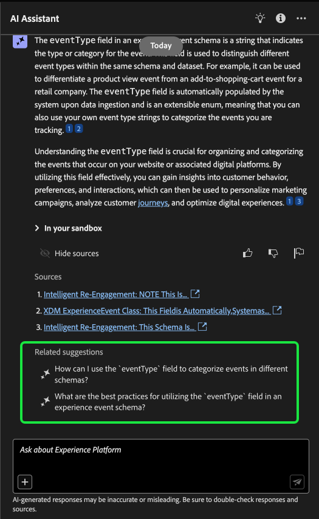
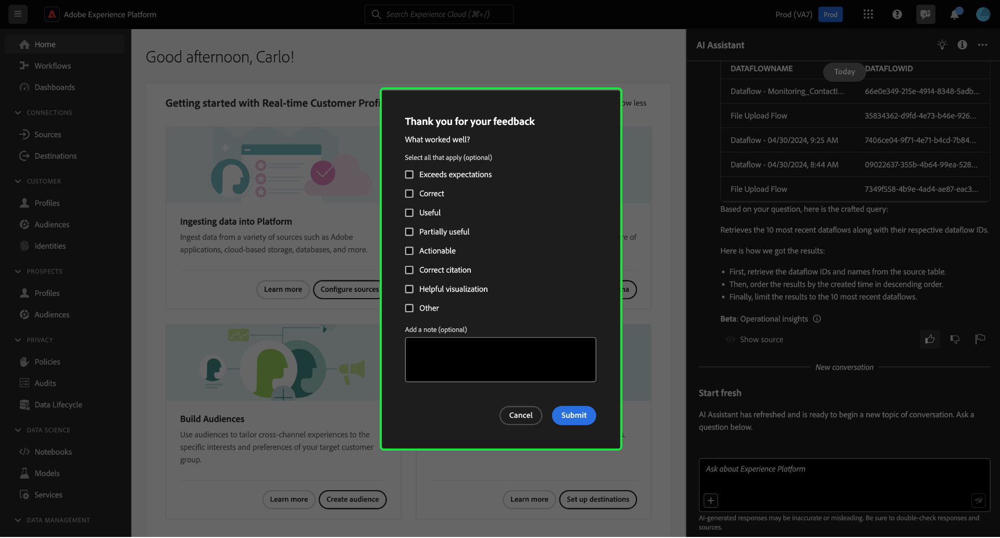

# Guia da interface do assistente de IA

Leia este guia para saber como usar o Assistente de IA na interface do usuário do Adobe Experience Platform.

## Acessar o assistente de IA na interface do usuário do Experience Platform

Para iniciar o Assistente de IA, selecione o **[!UICONTROL Ícone do Assistente de IA]** no cabeçalho superior da interface do Experience Platform.

A interface do Assistente de IA é exibida, fornecendo imediatamente informações para começar. Você pode usar as opções fornecidas em [!UICONTROL Ideias para começar] para responder a perguntas e comandos como:

* [!UICONTROL Quais dos meus públicos-alvo são ativados?]
* [!UICONTROL O que é um esquema?]
* [!UICONTROL Conte-me alguns casos de uso comuns do Real-Time CDP]

## Guia da interface do assistente de IA

>[!NOTE]
>
>O fluxo de trabalho a seguir é um exemplo que usa o processo de criação de esquema do evento de experiência para ilustrar como você pode usar o Assistente de IA ao usar a interface do usuário do Experience Platform.

Considere um caso de uso em que você esteja criando uma **Esquema de evento de troca de dispositivo**. Durante o processo de criação do schema de evento de experiência, você encontra o `eventType` campo. &quot;Nesse ponto, você tem a opção de sair do workflow e consultar a [noções básicas de uma composição de esquema](../xdm/schema/composition.md) ou você pode usar o AI Assistant para recuperar respostas para suas perguntas e encontrar recursos adicionais por meio dos links de documentação recomendados pelo AI Assistant.&quot;

Para começar, digite sua pergunta na caixa de texto fornecida. No exemplo abaixo, o Assistente de IA recebe a pergunta: &quot;**O que é o campo eventType em um esquema ExperienceEvent?**&quot;

O Assistente de IA consulta sua base de conhecimento e calcula uma resposta. Após alguns minutos, o Assistente de IA retorna uma resposta e sugestões relacionadas que você pode usar como prompts de acompanhamento.

Depois de receber uma resposta do Assistente de IA, você pode selecionar entre várias opções para decidir como deseja continuar.

### Recursos do Assistente de IA {#features}

Esta seção descreve os diferentes recursos do Assistente de IA que você pode usar durante os fluxos de trabalho no Experience Platform.

### Exibir objetos de dados operacionais {#view-operational-data-objects}

Dependendo da sua consulta, o Assistente de IA fornece informações adicionais relacionadas aos dados da sandbox. Para exibir como a resposta à sua consulta se aplica à sandbox específica, selecione **[!UICONTROL Em sua sandbox].**

Ao visualizar dados pertencentes à sua sandbox, o Assistente de IA pode fornecer links diretos para páginas específicas da interface do usuário que exibem seus dados consultados.

+++Selecione para exibir o exemplo

Neste exemplo, o Assistente de IA retorna informações adicionais sobre os esquemas XDM existentes na sandbox, incluindo a contagem total e os cinco campos mais usados.

+++

### Exibir citações {#view-citations}

Você pode verificar as respostas retornadas pelo Assistente de IA revisando as citações disponíveis com cada resposta de conhecimento do produto.

+++Selecione para exibir um exemplo de como exibir fontes

Para exibir citações e validar a resposta do Assistente de IA, selecione **[!UICONTROL Mostrar fontes]**.

O Assistente de IA atualiza a interface e fornece links para a documentação que corroboram a resposta inicial. Além disso, quando as citações são ativadas, o Assistente de IA atualiza a resposta para incluir notas de rodapé a fim de indicar as partes específicas da resposta que fazem referência à documentação fornecida.

Você também pode usar as sugestões que o Assistente de IA oferece em **[!UICONTROL Sugestões relacionadas]** para explorar mais tópicos relacionados à sua pergunta original.

+++

### Insights operacionais {#operational-insights}

Você deve estar em uma sandbox ativa para que o Assistente de IA responda suficientemente a uma pergunta sobre seus insights operacionais.

+++Selecione para exibir um exemplo de uma pergunta de insights operacionais

No exemplo abaixo, o Assistente de IA é solicitado a fazer a seguinte consulta: **&quot;Mostrar os fluxos de dados criados usando a origem do Amazon S3&quot;**.

O Assistente de IA responde com uma tabela listando seus fluxos de dados e as IDs correspondentes. Para exibir toda a tabela de dados, selecione o ícone de expansão na parte superior direita.

Uma exibição expandida da tabela é exibida, fornecendo uma lista mais abrangente de fluxos de dados com base nos parâmetros da sua consulta.

Quando solicitado com uma pergunta sobre insights operacionais, o Assistente de IA fornece uma explicação de como ele calculou a resposta. No exemplo abaixo, o Assistente de IA descreve as etapas executadas para identificar os fluxos de dados criados usando o [!DNL Amazon S3] origem.

Você também pode fornecer filtros e modificações às suas perguntas e instruir o Assistente de IA a renderizar as descobertas com base nos filtros incluídos. Por exemplo, você pode solicitar que o Assistente de IA mostre uma tendência da contagem de definições de segmento na ordem de sua data de criação, remover definições de segmento com total de perfis zero e usar nomes de meses em vez de números inteiros ao exibir os dados.

**Nota:** Atualmente, as respostas dos insights operacionais estão na versão beta. Selecione o ícone de dica de ferramenta na interface do assistente do AI para exibir o aviso Beta e para obter um link para a documentação.

+++

### Usar preenchimento automático {#use-auto-complete}

Você pode usar a função de preenchimento automático para receber uma lista de objetos de dados que existem na sandbox. As recomendações de preenchimento automático estão disponíveis para os seguintes domínios: públicos-alvo, esquemas, conjuntos de dados, fontes e destinos.

+++Selecione para exibir um exemplo de preenchimento automático

Você pode usar o preenchimento automático incluindo o símbolo de mais (**`+`**) na sua query. Como alternativa, você também pode selecionar o sinal de mais (**`+`**) localizado na parte inferior da caixa de entrada de texto. Uma janela é exibida com uma lista de objetos de dados recomendados da sandbox.

+++

### Usar voltas múltiplas {#use-multi-turn}

Você pode usar os recursos de várias rodadas do Assistente de IA para ter uma conversa mais natural durante sua experiência. O Assistente de IA pode responder perguntas de acompanhamento, fornecidas. contexto pode ser deduzido de uma interação anterior.

+++Selecione para exibir um exemplo de curva múltipla

No exemplo abaixo, o Assistente de IA é solicitado primeiro a fornecer o número total de fluxos de dados e, em seguida, é solicitado a listar os 10 fluxos de dados mais recentes.

Para redefinir, selecione as reticências (**`...`**) na interface do Assistente de IA e selecione **[!UICONTROL Iniciar nova conversa]**. Isso informa ao Assistente de IA que você pretende alterar tópicos e pode ser particularmente útil ao solucionar problemas de consultas que estão falhando ou fazendo referência a informações incorretas.

+++

### Usar capacidade de descoberta {#use-discoverability}

Você pode usar o recurso de descoberta do Assistente do AI para exibir uma lista de assuntos gerais, agrupados em entidades, que o Assistente do AI suporta.

+++Selecione para exibir o exemplo de descoberta

Para exibir a capacidade de descoberta, selecione o ícone de lâmpada no cabeçalho superior da interface do Assistente do AI.

Em seguida, selecione uma categoria e, em seguida, selecione um prompt na lista fornecida. Você pode usar esse recurso para ter uma ideia melhor dos tipos de perguntas que o Assistente de IA pode responder. Você também pode atualizar os prompts pré-existentes com detalhes específicos que pertencem à sua sandbox usando texto livre ou [preenchimento automático](#use-auto-complete).

+++

## Fornecer feedback {#feedback}

Você pode fornecer feedback sobre sua experiência com o Assistente de IA usando as opções fornecidas com a resposta.

Para fornecer feedback, selecione polegares para cima, polegares para baixo ou um sinalizador depois de receber uma resposta do Assistente de IA e, em seguida, insira seu feedback na caixa de texto fornecida.

+++Selecione para exibir mais exemplos

>[!BEGINTABS]

>[!TAB Polegar para cima]

Selecione o ícone de miniatura para fornecer feedback sobre o que aconteceu de bom com a sua experiência com o Assistente de IA.

>[!TAB Polegar para baixo]

Selecione o ícone com miniaturas para fornecer feedback sobre o que pode ser melhorado com base na sua experiência com o Assistente de IA. Durante essa etapa, você também pode fornecer comentários específicos sobre a sua experiência. O feedback fornecido nos comentários é revisado diariamente.

>[!TAB Sinalizador]

Selecione o ícone de sinalizador para fornecer mais relatórios sobre a experiência usando o Assistente de IA.

>[!ENDTABS]

+++
