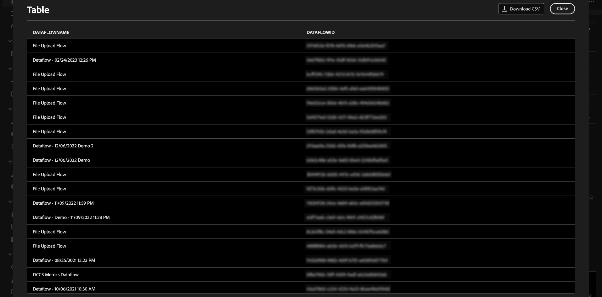
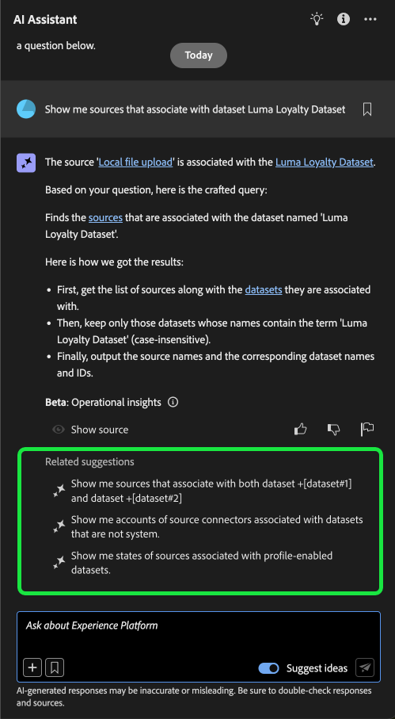

# Guia da interface do assistente de IA

Leia este guia para saber como usar o Assistente de IA na interface do usuário do Adobe Experience Platform.

## Acessar o assistente de IA na interface do usuário do Experience Platform

Para iniciar o Assistente de IA, selecione o **[!UICONTROL ícone do Assistente de IA]** no cabeçalho superior da interface do Experience Platform.

A interface do Assistente de IA é exibida, fornecendo imediatamente informações para começar. Você pode usar as opções fornecidas em [!UICONTROL Ideias para começar] para responder perguntas e comandos como:

* [!UICONTROL Quais dos meus públicos-alvo estão ativados?]
* [!UICONTROL O que é um esquema?]
* [!UICONTROL Conte-me alguns casos de uso comuns para o Real-Time CDP]

## Guia da interface do assistente de IA

>[!NOTE]
>
>O fluxo de trabalho a seguir é um exemplo que usa o processo de criação de esquema do evento de experiência para ilustrar como você pode usar o Assistente de IA ao usar a interface do usuário do Experience Platform.

Considere um caso de uso em que você esteja criando um **Esquema de Evento de Comércio de Dispositivo**. Durante o processo de criação do esquema do evento de experiência, você encontra o campo `eventType`. &quot;Neste ponto, você tem a opção de sair do fluxo de trabalho e consultar a documentação de [noções básicas da composição de um esquema](../xdm/schema/composition.md) ou pode usar o Assistente de IA para recuperar respostas para suas perguntas e encontrar recursos adicionais por meio dos links de documentação recomendados pelo Assistente de IA.&quot;

Para começar, digite sua pergunta na caixa de texto fornecida. No exemplo abaixo, o Assistente de IA recebe a pergunta: &quot;**Qual é o campo eventType em um esquema ExperienceEvent?**&quot;

O Assistente de IA consulta sua base de conhecimento e calcula uma resposta. Após alguns minutos, o Assistente de IA retorna uma resposta e sugestões relacionadas que você pode usar como prompts de acompanhamento.

Depois de receber uma resposta do Assistente de IA, você pode selecionar entre várias opções para decidir como deseja continuar.

### Recursos do Assistente de IA {#features}

Esta seção descreve os diferentes recursos do Assistente de IA que você pode usar durante os fluxos de trabalho no Experience Platform.

### Exibir objetos de dados operacionais {#view-operational-data-objects}

Dependendo da sua consulta, o Assistente de IA fornece informações adicionais relacionadas aos dados da sandbox. Para exibir como a resposta à sua consulta se aplica à sua sandbox específica, selecione **[!UICONTROL Na sua sandbox].**

Ao visualizar dados pertencentes à sua sandbox, o Assistente de IA pode fornecer links diretos para páginas específicas da interface do usuário que exibem seus dados consultados.

+++Selecione para exibir o exemplo

Neste exemplo, o Assistente de IA retorna informações adicionais sobre os esquemas XDM existentes na sandbox, incluindo a contagem total e os cinco campos mais usados.

+++

### Exibir citações {#view-citations}

Você pode verificar as respostas retornadas pelo Assistente de IA revisando as citações disponíveis com cada resposta de conhecimento do produto.

+++Selecione para exibir um exemplo de como exibir fontes

Para exibir citações e validar a resposta do Assistente de IA, selecione **[!UICONTROL Mostrar fontes]**.

O Assistente de IA atualiza a interface e fornece links para a documentação que corroboram a resposta inicial. Além disso, quando as citações são ativadas, o Assistente de IA atualiza a resposta para incluir notas de rodapé a fim de indicar as partes específicas da resposta que fazem referência à documentação fornecida.

+++

### Insights operacionais {#operational-insights}

Você deve estar em uma sandbox ativa para que o Assistente de IA responda suficientemente a uma pergunta sobre seus insights operacionais.

+++Selecione para exibir um exemplo de uma pergunta de insights operacionais

No exemplo abaixo, o Assistente de IA é solicitado com a seguinte consulta: **&quot;Mostrar fluxos de dados criados usando a origem S3 do Amazon&quot;**.

O Assistente de IA responde com uma tabela listando seus fluxos de dados e as IDs correspondentes. Selecione o ícone de download () para baixar a tabela como um arquivo CSV. Para exibir a tabela inteira, selecione o ícone de expansão ().

Uma exibição expandida da tabela é exibida, fornecendo uma lista mais abrangente de fluxos de dados com base nos parâmetros da sua consulta.

Quando solicitado com uma pergunta sobre insights operacionais, o Assistente de IA fornece uma explicação de como ele calculou a resposta. No exemplo abaixo, o Assistente de IA descreve as etapas executadas para identificar os fluxos de dados criados usando a origem [!DNL Amazon S3].

Você também pode fornecer filtros e modificações às suas perguntas e instruir o Assistente de IA a renderizar as descobertas com base nos filtros incluídos. Por exemplo, você pode solicitar que o Assistente de IA mostre uma tendência da contagem de definições de segmento na ordem de sua data de criação, remover definições de segmento com total de perfis zero e usar nomes de meses em vez de números inteiros ao exibir os dados.

+++

### Verificar respostas dos insights operacionais {#verify-responses}

Você pode verificar cada resposta relacionada às perguntas dos insights operacionais usando uma consulta SQL fornecida pelo Assistente de IA.

+++Selecione para exibir um exemplo de verificação das respostas dos insights operacionais

Depois de receber uma resposta para uma pergunta de insights operacionais, selecione **[!UICONTROL Mostrar fontes]** e selecione **[!UICONTROL Exibir consulta de origem]**.

Quando consultado sobre uma pergunta de insights operacionais, o Assistente de IA fornece uma consulta SQL que pode ser usada para verificar o processo necessário para calcular sua resposta. Esta consulta de origem é somente para fins de verificação e não tem suporte no Serviço de consulta.

+++

### Usar preenchimento automático de entidade {#use-entity-auto-complete}

Você pode usar a função de preenchimento automático para receber uma lista de objetos de dados que existem na sandbox. As recomendações de preenchimento automático estão disponíveis para os seguintes domínios: públicos-alvo, esquemas, conjuntos de dados, jornadas, fontes e destinos.

+++Selecione para exibir um exemplo de preenchimento automático

Você pode usar o preenchimento automático incluindo o símbolo de mais (**`+`**) na sua consulta. Como alternativa, você também pode selecionar o sinal de adição (**`+`**) localizado na parte inferior da caixa de entrada de texto. Uma janela é exibida com uma lista de objetos de dados recomendados da sandbox.

+++

### Usar voltas múltiplas {#use-multi-turn}

Você pode usar os recursos de várias rodadas do Assistente de IA para ter uma conversa mais natural durante sua experiência. O Assistente de IA pode responder perguntas de acompanhamento, fornecidas. contexto pode ser deduzido de uma interação anterior.

+++Selecione para exibir um exemplo de curva múltipla

No exemplo abaixo, o Assistente de IA é solicitado primeiro a fornecer o número total de fluxos de dados e, em seguida, é solicitado a listar os 10 fluxos de dados mais recentes.

+++

### Iniciar uma nova conversa

Você pode alterar tópicos com o Assistente de IA redefinindo e iniciando uma nova conversa.

+++Selecione para exibir um exemplo de redefinição da conversa

Para redefinir, selecione as reticências (**`...`**) na interface do Assistente de IA e selecione **[!UICONTROL Iniciar nova conversa]**. Isso informa ao Assistente de IA que você pretende alterar tópicos e pode ser particularmente útil ao solucionar problemas de consultas que estão falhando ou fazendo referência a informações incorretas.

+++

### Usar capacidade de descoberta {#use-discoverability}

Você pode usar o recurso de descoberta do Assistente do AI para exibir uma lista de assuntos gerais, agrupados em entidades, que o Assistente do AI suporta.

+++Selecione para exibir o exemplo de descoberta

Para exibir a capacidade de descoberta, selecione o ícone de lâmpada no cabeçalho superior da interface do Assistente do AI.

Em seguida, selecione uma categoria e, em seguida, selecione um prompt na lista fornecida. Você pode usar esse recurso para ter uma ideia melhor dos tipos de perguntas que o Assistente de IA pode responder. Você também pode atualizar os prompts pré-existentes com detalhes específicos que pertencem à sua sandbox usando texto livre ou [preenchimento automático](#use-auto-complete).

+++

### Usar preenchimento automático de perguntas {#use-question-autocomplete}

Você pode usar o recurso de preenchimento automático de perguntas do Assistente do AI para selecionar uma pergunta em uma lista de recomendações do Assistente do AI.

+++Selecione para exibir o exemplo de preenchimento automático de perguntas

Para exibir o painel de perguntas sugeridas, digite pelo menos sete (7) caracteres na caixa de entrada. Em seguida, selecione a pergunta que é relevante para você no menu exibido.

Talvez seja necessário atualizar espaços reservados em algumas instâncias em que uma pergunta sugerida envolve insights operacionais. Por exemplo, talvez seja necessário adicionar o nome específico de um conjunto de dados ou um público-alvo se a sugestão do Assistente de IA incluir espaços reservados.

Os espaços reservados são realçados em azul. Selecione o espaço reservado para começar a atualizar seu valor. Para obter melhores resultados em espaços reservados numéricos, certifique-se de usar dígitos em vez de texto. Você também pode usar o recurso de preenchimento automático de entidade para atualizar os valores de espaço reservado. Não é possível enviar uma pergunta que tenha espaços reservados não preenchidos.

**OBSERVAÇÃO**: as sugestões estão habilitadas por padrão. Selecione o botão **[!UICONTROL Sugerir ideias]** para desabilitar o recurso.

+++

### Usar sugestões relacionadas {#use-related-suggestions}

Você pode usar a seção sugestões relacionadas de cada resposta do Assistente de IA para continuar sua conversa.

+++Selecione para exibir o exemplo de sugestões relacionadas

Sugestões relacionadas são retornadas com cada resposta do Assistente de IA. Para continuar a conversa, selecione qualquer uma das sugestões na seção de sugestões relacionada.

Semelhante ao preenchimento automático dos espaços reservados em questão, será necessário atualizar os espaços reservados incluídos nas sugestões relacionadas antes de enviar a consulta.

+++

## Fornecer feedback {#feedback}

Você pode fornecer feedback sobre sua experiência com o Assistente de IA usando as opções fornecidas com a resposta.

Para fornecer feedback, selecione polegares para cima, polegares para baixo ou um sinalizador depois de receber uma resposta do Assistente de IA e, em seguida, insira seu feedback na caixa de texto fornecida.

+++Selecione para exibir mais exemplos

>[!BEGINTABS]

>[!TAB Polegar para cima]

Selecione o ícone de miniatura para fornecer feedback sobre o que aconteceu de bom com a sua experiência com o Assistente de IA.

>[!TAB Polegar para baixo]

Selecione o ícone com miniaturas para fornecer feedback sobre o que pode ser melhorado com base na sua experiência com o Assistente de IA. Durante essa etapa, você também pode fornecer comentários específicos sobre a sua experiência. O feedback fornecido nos comentários é revisado diariamente.

>[!TAB Sinalizador]

Selecione o ícone de sinalizador para fornecer mais relatórios sobre a experiência usando o Assistente de IA.

>[!ENDTABS]

+++
