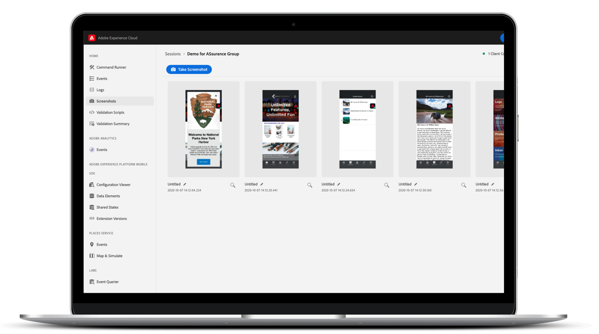

# Adobe Experience Platform Assurance

O Adobe Experience Platform Assurance é um produto da [Adobe Experience Cloud](https://www.adobe.com/br/experience-cloud.html) que ajuda a inspecionar, testar, simular e validar a maneira como você coleta dados ou fornece experiências em seu aplicativo móvel.

>[!IMPORTANT]
>
> O projeto Griffon agora é conhecido como **Assurance**.
>
> O projeto Griffon agora está disponível para **todos(as)** os(as) clientes da Adobe Experience Cloud como “Assurance”. Para saber mais sobre essa transição, leia o [guia de acesso do usuário](./user-access.md).

>[!INFO]
>
>As APIs públicas do Assurance estão disponíveis.
>
>[As APIs do Assurance](https://developer.adobe.com/adobe-assurance-public-apis/) são uma coleção de APIs que permitem realizar testes e depurar aplicativos móveis e da Web utilizando o SDK móvel do Adobe Assurance.

## Disponibilidade geral

A partir de 15 de outubro de 2022, o Assurance estará disponível para todas as soluções da Adobe Experience Cloud.

### O que está mudando?

No dia 15 de outubro, o acesso ao Assurance será gerenciado pelo Admin Console. Leia o [guia de acesso do usuário](./user-access.md) para garantir acesso ininterrupto.

Não são esperadas outras alterações ou interrupções nas integrações, sessões e eventos existentes do Assurance. O acesso ao Assurance pode continuar em [https://griffon.adobe.com](https://griffon.adobe.com) **ou** você pode acessar (e adicionar aos favoritos) [https://experience.adobe.com/assurance](https://experience.adobe.com/assurance).

## O que o Assurance pode fazer por você?

### Configuração rápida

Comece rápido com poucas linhas de código. Para aplicativos móveis, o Assurance funciona com o SDK móvel da Adobe Experience Platform para ajudar você a inspecionar, simular e validar eventos de aplicativo, sinais de localização, parâmetros de configuração, logs de SDK, informações de dispositivo e muito mais.

### Facilidade de conexão

Com o Assurance, conectar seu aplicativo ao Experience Platform é simples e confiável. Você não precisa usar proxies ([MiTM](https://en.wikipedia.org/wiki/Man-in-the-middle_attack)) nem outros recursos complexos de rede: conectar seu aplicativo ao Assurance é tão fácil quanto digitalizar um QR code ou pressionar um botão.

### Inspeção, simulação e validação em tempo real

Depois de se conectar ao Assurance, você pode inspecionar eventos e atividades de aplicativos transmitidos em tempo real, além de ter acesso a recursos de filtragem e pesquisa para eliminar ruídos. Os eventos contêm detalhes sobre validação, depuração e solução de problemas da implementação do aplicativo móvel. O Assurance também permite fazer capturas de tela, simular sinais de localização e muito mais em tempo real.

### Integração com a Adobe Experience Cloud

O contexto dos dados e experiências do lado do cliente são definidos de acordo com as configurações de regras de relatórios, atividades e campanhas em nossas interfaces para profissionais de marketing. Para ajudar você a ligar os pontos entre os dois lados, estamos fazendo a integração com soluções da Adobe Experience Cloud, como Adobe Experience Platform, Adobe Analytics, Adobe Target, Places Service e muito mais.

## Recursos

### Eventos, logs e muito mais do SDK móvel da Adobe Experience Platform

O Assurance ajuda a inspecionar eventos brutos de SDK gerados pelo SDK móvel da Adobe Experience Platform. Todos os eventos coletados pelo SDK estão disponíveis para inspeção. Os eventos do SDK são carregados em uma exibição de lista classificada por tempo. Cada evento tem uma exibição detalhada que fornece mais detalhes. Você também tem acesso a exibições adicionais para procurar uma configuração de SDK, elementos de dados, estados compartilhados e versões de extensão do SDK.

### Adobe Analytics

A exibição Adobe Analytics > Eventos do Analytics tem por objetivo mostrar eventos relacionados com a implementação móvel do Adobe Analytics. A exibição de lista mostra o ciclo de vida ou os eventos de ação/estado, o &quot;status&quot; pós-processado, juntamente com os detalhes do evento necessários em uma exibição formatada especialmente. O status de pós-processamento mostra como o evento foi processado pelo Adobe Analytics após a aplicação das regras de processamento no evento.

### Adobe Analytics para mídia de streaming

A exibição Adobe Analytics > Eventos do Media Analytics mostra eventos para a implementação da análise de áudio e vídeo. A exibição detalhada dos eventos apresenta metadados padrão e personalizados que são rastreados para cada sessão de reprodução. Além disso, é possível visualizar o status de pós-processamento e os dados de análise de mídia pós-processados, como o tempo gasto com a mídia ou a duração total do buffer.

### Places (serviços de localização)

Os serviços de localização são uma exibição do dispositivo que mostra os eventos de entrada e saída de um local para facilitar a validação de usuários. Essa exibição fornece uma interface conveniente para visualizar pontos de dados específicos de um local, a fim de realizar inspeções de clientes para uma depuração contextualizada.

## O Assurance é seguro?

O Assurance adota as seguintes medidas de segurança:

* O Assurance e sua interface web possuem um handshake seguro baseado em PIN para realizar uma conexão. É necessário criar um handshake de forma explícita, o que impede que conexões “acidentais” do Assurance sejam criadas por um usuário final.
* Somente conexões entre o Assurance e sua interface web que sejam pertencentes à mesma ID de organização da Adobe Experience Cloud são permitidas.
* Os eventos dos SDKs móveis da Adobe Experience Platform são transportados por HTTPS.
* Os SDKs móveis do Assurance e da Adobe Experience Platform usam TLS 1.2
* As sessões do Assurance são excluídas após 30 dias.
* Os dados de sessão do Assurance são criptografados em repouso, seguindo as práticas recomendadas de armazenamento.

## Introdução

Para configurar o Assurance, primeiro você precisará instalar a extensão do Assurance em seu aplicativo. Para saber como fazer isso, leia o tutorial de [implementação da extensão do Assurance](https://developer.adobe.com/client-sdks/documentation/platform-assurance-sdk/#add-the-aep-assurance-extension-to-your-app).

Depois de adicionar o Assurance no aplicativo, você pode criar uma sessão do Assurance que pode ser conectada ao dispositivo. Para saber como usar o Assurance, leia o [guia de utilização do Assurance](./tutorials/using-assurance.md).
