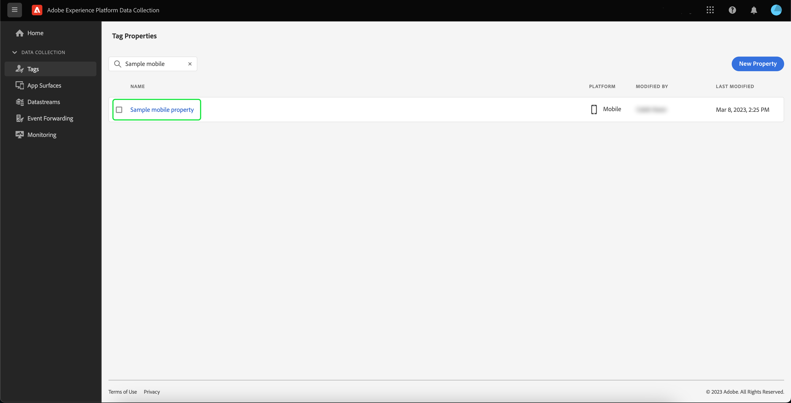

# Implementação da extensão Adobe Experience Platform Assurance

Este tutorial explica como instalar e implementar a extensão do Platform Assurance no SDK móvel. Para obter instruções sobre como adicionar a extensão Assurance à sua aplicação, leia o [Visão geral da extensão do Adobe Experience Platform Assurance](https://developer.adobe.com/client-sdks/documentation/platform-assurance-sdk/#add-the-aep-assurance-extension-to-your-app).

## Introdução

Para instalar e implementar a extensão Assurance, você precisará acessar os seguintes serviços:

- O [Interface do usuário da coleta de dados do Adobe Experience Platform](https://experience.adobe.com/#/data-collection/)
- [Adobe Experience Platform Assurance](https://experience.adobe.com/assurance)

## Criar uma propriedade móvel

>[!NOTE]
>
>Se você já tiver uma propriedade móvel, poderá prosseguir para a próxima etapa.

Na interface do usuário da coleta de dados, selecione **[!UICONTROL Tags]**. Uma lista de propriedades móveis e da Web é exibida, com informações sobre as propriedades que pertencem à sua organização. Selecionar **[!UICONTROL Nova propriedade]** para criar uma nova propriedade.

O **[!UICONTROL Criar propriedade]** será exibida. Insira o nome da nova propriedade e selecione **[!UICONTROL Celular]** como sua plataforma. Depois de inserir seus detalhes, selecione **[!UICONTROL Salvar]** para criar a propriedade móvel.

>[!NOTE]
>
>O **[!UICONTROL Privacidade]** definir faz **not** afetam a coleta de dados do Assurance.

## Instalar a extensão Assurance

Selecione a propriedade móvel na qual deseja instalar a extensão Assurance.

O **detalhes da propriedade móvel** será exibida. Selecionar **[!UICONTROL Extensões]** para exibir uma lista das extensões associadas à propriedade móvel no momento.

Selecionar **[!UICONTROL Catálogo]** para ver uma lista de extensões que podem ser adicionadas à propriedade móvel. Com o filtro , localize a variável **[!UICONTROL Garantia da AEP]** e selecione **[!UICONTROL Instalar]**.

## Próximas etapas

Agora que você instalou a extensão Assurance em sua propriedade móvel, pode começar a usar o Assurance em seus aplicativos. Para saber como adicionar a extensão Assurance ao seu aplicativo, leia o [Visão geral da extensão do Adobe Experience Platform Assurance](https://developer.adobe.com/client-sdks/documentation/platform-assurance-sdk/#add-the-aep-assurance-extension-to-your-app). Para saber como usar o Controle de qualidade, leia o [usando o guia de Controle](./using-assurance.md).
