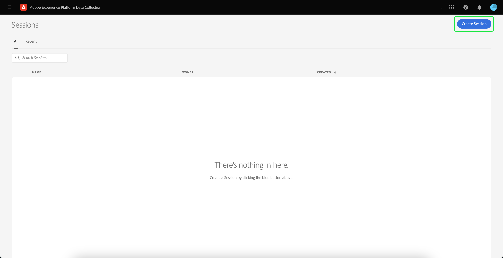

# Uso do Adobe Experience Platform Assurance

Este tutorial explica como usar o Adobe Experience Platform Assurance. Para obter instruções sobre como instalar e implementar a extensão Adobe Experience Platform Assurance, leia o tutorial em [implementação da extensão Assurance](./implement-assurance.md).

## Criar sessões

Depois de fazer logon na [Interface de usuário de garantia](https://experience.adobe.com/assurance), você pode selecionar **[!UICONTROL Criar sessão]** para começar a criar uma sessão.

O **[!UICONTROL Criar nova sessão]** será exibida. Revise as instruções fornecidas e continue selecionando **[!UICONTROL Iniciar]**.

Agora você pode inserir um nome para identificar a sessão e, em seguida, fornecer um **[!UICONTROL URL básica]** (URL de deep linking para seu aplicativo). Após fornecer esses detalhes, selecione **[!UICONTROL Próximo]**.

>[!INFO]
>
>O URL base é a definição raiz usada para iniciar seu aplicativo a partir de um URL. Um URL de sessão é gerado pelo qual você pode iniciar a sessão de Controle. Um exemplo de valor pode ser: `myapp://default` No **[!UICONTROL URL básica]** digite a definição do deep link básico do seu aplicativo.

## Conectar-se a uma sessão

Depois de criar uma sessão, verifique se é possível visualizar o **[!UICONTROL Criar nova sessão]** agora mostra um link, um código QR e um PIN.

Se esta caixa de diálogo for exibida, você pode usar o aplicativo de câmera do seu dispositivo para digitalizar o código QR e abrir seu aplicativo ou copiar o link e abrir em seu aplicativo. Quando seu aplicativo é iniciado, a tela de entrada do PIN deve ser exibida sobreposta. Digite o PIN na etapa anterior e pressione **[!UICONTROL Connect]**.

Você pode verificar se o aplicativo está conectado ao Controle quando o ícone do Adobe Experience Platform (Adobe vermelho &quot;A&quot;) é exibido no aplicativo.

## Exportar uma sessão

Para exportar uma sessão de Controle, na página de detalhes das sessões do seu aplicativo, selecione **[!UICONTROL Exportar para JSON]** em uma sessão:

A opção de exportação respeita os resultados do filtro de pesquisa e apenas exporta os eventos exibidos na visualização de evento. Por exemplo, se você pesquisou eventos de &quot;rastreamento&quot; e, em seguida, selecionou **[!UICONTROL Exportar para JSON]**, somente os resultados do evento &quot;track&quot; são exportados.
