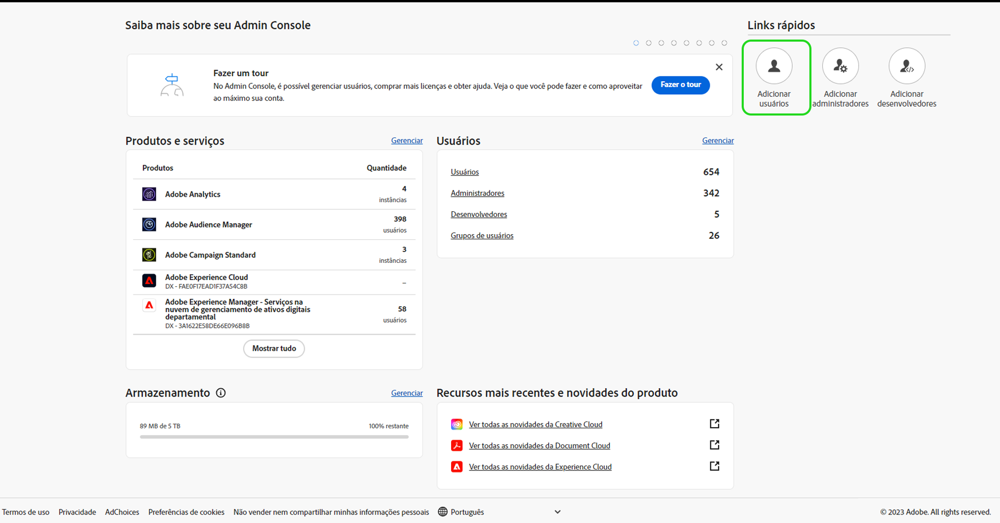
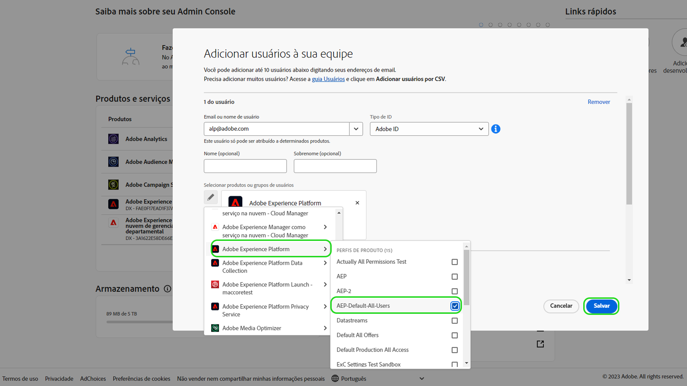

# Acesso do usuário

>[!WARNING]
>
>Observe que o acesso do usuário ao Assurance está mudando. Como o Assurance deixa o beta (Project Griffon) disponível de modo geral (como Assurance) para todos os clientes da Adobe Experience Cloud, o acesso ao Assurance será gerenciado por meio da [Admin Console](https://helpx.adobe.com/br/enterprise/using/admin-console.html).
>
>Se precisar de assistência, entre em contato com o administrador do Adobe Experience Cloud da sua empresa.

Para receber ou manter acesso ininterrupto ao Assurance, verifique se as seguintes etapas foram concluídas no Admin Console:

## Adicionar usuários ao Experience Platform por meio de um perfil de produto

Para adicionar um usuário a um perfil de produto, faça logon no Admin Console e selecione **Adicionar usuários**.

A variável **Adicionar usuários à sua equipe** será exibida. Nesta caixa de diálogo, você pode inserir os detalhes do usuário que deseja adicionar. Insira o endereço de email do usuário, o nome (opcional) e o sobrenome (opcional).

Selecione o ícone de lápis para escolher os produtos e grupos de usuários. Aqui, selecione **Adobe Experience Platform**, depois **AEP-Padrão-Todos-Usuários**, seguido por **Salvar**.

