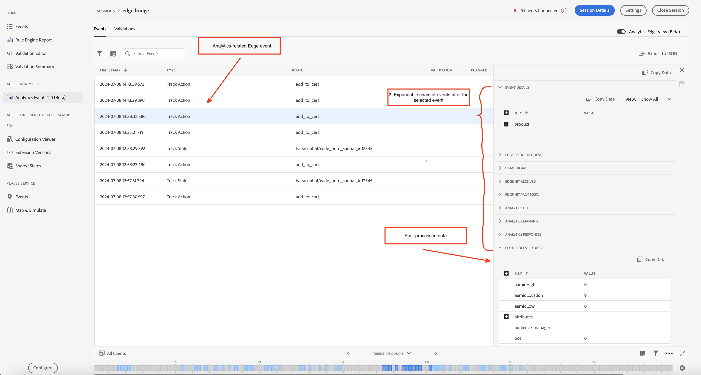

# Analytics Events 2.0 no Assurance

O Analytics Events 2.0 fornece uma visualização mais avançada dos eventos do SDK para os usuários que depuram e validam a implementação do Adobe Analytics. O modo de exibição mostra eventos enviados para o Adobe Analytics a partir do [SDK Edge Network do Adobe Experience Platform](https://developer.adobe.com/client-sdks/edge/edge-network/), bem como do [SDK móvel do Adobe Experience Platform](https://developer.adobe.com/client-sdks/solution/adobe-analytics/). A visualização também apresenta um painel de detalhes, que fornece contexto sobre como o evento foi processado pelo SDK do cliente e pelos serviços upstream depois que ele deixou o dispositivo.

## Introdução

Para usar essa visualização, conclua as seguintes etapas:

1. [Configurar o Adobe Experience Platform Assurance](../tutorials/implement-assurance.md).
2. [Criar e conectar-se a uma sessão do Assurance](../tutorials/using-assurance.md).
3. Na interface do usuário do Assurance, no menu de exibição de navegação à esquerda **Página inicial**, selecione **Analytics Events 2.0 (Beta)**. Se você não vir essa opção, selecione **Configurar** na parte inferior esquerda da janela, adicione o **Analytics Events 2.0 (Beta)** e selecione **Salvar**.

## Exibição do Analytics Edge

Use a exibição do Analytics Edge se estiver usando o **Edge Network** ou o **Edge Bridge** extensões móveis. Essa exibição é ativada quando o switch de alternância &quot;Analytics Edge (Beta)&quot; no canto superior direito é ativado, exibindo os eventos do Analytics enviados pela rede Edge na sessão atual. Isso inclui todos os eventos que foram acionados pela extensão do Lifecycle, pela extensão do Edge e/ou pela extensão do Edge Bridge.

A visualização Edge do Analytics contém informações sobre eventos do Edge relacionados ao Analytics e eventos do Lifecycle despachados pelo cliente. Ao escolher um evento na lista, o painel de exibição de detalhes do evento à direita exibe os eventos que foram processados pelo SDK do cliente e pelo serviço upstream depois que eles deixaram o dispositivo. Isso permite visualizar facilmente a cadeia de eventos resultante de uma chamada.

O evento **Dados pós-processados** na lista confirma que os dados foram processados com êxito e enviados para a Adobe Analytics. Se esse evento ou qualquer dado processado estiver ausente, os usuários poderão expandir cada evento na lista para exibir informações detalhadas de depuração.

### Exibição de detalhes do evento do Analytics Edge

Para um evento de solicitação do Edge ou um evento de rastreamento do Analytics, a exibição detalhada contém as seguintes partes:

* Detalhes do evento: um evento de solicitação de borda do SDK de origem.
* Solicitação de Bridge do Edge: um evento exclusivamente para o fluxo de trabalho de extensão do Bridge do Edge.
* Sequência de dados: um evento representado pela sequência de dados para esta sessão.
* Ocorrência de Edge recebida: representa a ocorrência recebida do Edge.
* Ocorrência do Edge processada: representa a ocorrência processada no Edge.
* Ocorrência do Analytics: representa a ocorrência recebida do Analytics.
* Mapeamento do Analytics: representa o status do mapeamento de dados no Analytics.
* Analytics respondido: o status da resposta do Analytics.
* Dados pós-processamento: informações no evento que contém o mapeamento de revars, evars e props.

### Validação do Analytics Edge

A visualização de validação do Analytics Edge permite ver facilmente os resultados nos scripts de validação relacionados ao Analytics Edge. Os erros exibidos pelos validadores podem conter links para onde devem ser corrigidos ou exibir eventos que estão em um estado de erro.

## Exibição de eventos do Analytics

Use a Exibição de Eventos do Analytics se estiver usando a extensão móvel **Adobe Analytics**. Essa visualização permite que você veja facilmente os Eventos do Analytics enviados do cliente conectado, incluindo Rastrear ação, Rastrear estado e Eventos do ciclo de vida. Essa exibição fica ativa enquanto o botão &quot;Analytics Edge (Beta)&quot; na parte superior direita está desativado.

Ao selecionar um dos eventos do Analytics na tabela de eventos, os detalhes de como o evento foi processado podem ser exibidos no painel direito.

### Status pós-processado

Depois que o SDK fizer uma solicitação de rede com o Adobe Analytics, o status informará se o Assurance conseguiu recuperar as informações de pós-processamento da solicitação do Adobe Analytics. A exibição Eventos do Analytics deve permanecer ativa enquanto o status de pós-processamento estiver em operação após a solicitação ser acionada.

Observe que para recuperar informações de pós-processamento, o usuário conectado precisa ter acesso ao conjunto de relatórios correspondente.

| Status | Descrição |
| :----- | :---------- |
| `Queued` | A solicitação de rede está buscando as informações de pós-processamento. |
| `Processed` | A solicitação de rede foi bem-sucedida e as informações de pós-processamento foram recebidas. |
| `Delayed` | O número máximo de tentativas de solicitações para buscar as informações de pós-processamento foi excedido. |
| `Error` | Um erro causou a falha na solicitação de rede. Mais detalhes sobre o erro são exibidos na exibição dos detalhes do evento. |
| `Unauthorized` | O usuário não tem acesso ao conjunto de relatórios do Adobe Analytics. |
| `Unavailable` | A solicitação do Adobe Analytics não tem um evento `AnalyticsResponse` correspondente. |
| `No Debug Flag` | A versão atual do Adobe Analytics ou do Assurance SDK pode não ser compatível com o recurso de depuração do Analytics. Para obter mais informações, leia o [Manual de solução de problemas](../troubleshooting.md). |
| `Expired` | O evento `AnalyticsTrack` ou `LifecycleStart` tem mais de 24 horas. |

### Exibição dos detalhes do evento

Para um evento de rastreamento do Analytics, a exibição detalhada contém as seguintes partes:

* Um evento de solicitação do Analytics do SDK de origem.
* Metadados e dados de contexto da solicitação, como ID do conjunto de relatórios, versões de extensão do SDK e dados de contexto.
* Informações pós-processadas sobre o evento do Analytics que contêm o mapeamento de revars, evars e props.

### Validação da visualização do Analytics

A visualização de validação permite ver facilmente os resultados nos scripts de validação relacionados ao Analytics. Os erros exibidos pelos validadores podem conter links para onde devem ser corrigidos ou exibir eventos que estão em um estado de erro.

