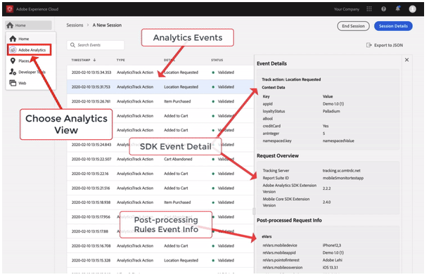

# Visualização do Adobe Analytics no Assurance

>[!IMPORTANT]
>
>A Exibição de Eventos do Analytics está consolidada no **plug-in de Eventos do Analytics 2.0 (Beta)**.  Ele será removido da Garantia no futuro próximo. Recomendamos usar o **plug-in do Analytics Events 2.0 (Beta)** para a depuração do Analytics nas sessões do Assurance.

A integração do Adobe Experience Platform Assurance com o Adobe Analytics fornece uma visualização mais avançada dos eventos do SDK para quem estiver depurando e validando a implementação do Adobe Analytics. A visualização mostra agora os eventos de ciclo de vida e de ação/estado enviados para o Adobe Analytics a partir do [SDK da Adobe Experience Platform](https://developer.adobe.com/client-sdks/documentation/adobe-analytics/). A visualização também apresenta detalhes de “resposta” que fornecem informações sobre como os eventos foram processados após a aplicação de cada regra de processamento do respectivo conjunto de relatórios.

## Introdução

Antes de continuar, verifique se você tem os seguintes serviços:

- A [Interface da coleção de dados da Adobe Experience Platform](https://experience.adobe.com/#/data-collection/)
- [Adobe Experience Platform Assurance](https://experience.adobe.com/assurance)

Para saber como instalar o Assurance em seu aplicativo, leia o [manual de implementação do Assurance](../tutorials/implement-assurance.md).

## Status pós-processado

Depois que o SDK fizer uma solicitação de rede com o Adobe Analytics, o status informará se o Assurance conseguiu recuperar as informações de pós-processamento da solicitação do Adobe Analytics.

Observe que para recuperar informações de pós-processamento, o usuário conectado precisa ter acesso ao conjunto de relatórios correspondente.

| Status | Descrição |
| :----- | :---------- |
| `Queued` | A solicitação de rede está buscando as informações de pós-processamento. |
| `Processed` | A solicitação de rede foi bem-sucedida e as informações de pós-processamento foram recebidas. |
| `Delayed` | O número máximo de tentativas de solicitações para buscar as informações de pós-processamento foi excedido. |
| `Error` | Um erro causou a falha na solicitação de rede. Mais detalhes sobre o erro são exibidos na exibição dos detalhes do evento. |
| `Unauthorized` | O usuário não tem acesso ao conjunto de relatórios do Adobe Analytics. |
| `Unavailable` | A solicitação do Adobe Analytics não tem um evento `AnalyticsResponse` correspondente. |
| `No Debug Flag` | A versão atual do Adobe Analytics ou do Assurance SDK pode não ser compatível com o recurso de depuração do Analytics. Para obter mais informações, leia o [Manual de solução de problemas](../troubleshooting.md). |
| `Expired` | O evento `AnalyticsTrack` ou `LifecycleStart` tem mais de 24 horas. |

## Exibição dos detalhes do evento

Para um evento de rastreamento do Analytics, a visualização detalhada contém as seguintes partes valiosas:

- Um evento de solicitação do Analytics do SDK de origem.
- Os metadados e dados de contexto do OOTB da solicitação, como ID de conjunto de relatórios, versões da extensão do SDK, dados de contexto do OOTB e assim por diante.
- As informações pós-processadas sobre o evento do Analytics que contêm o mapeamento de revars, evars, props e assim por diante.
