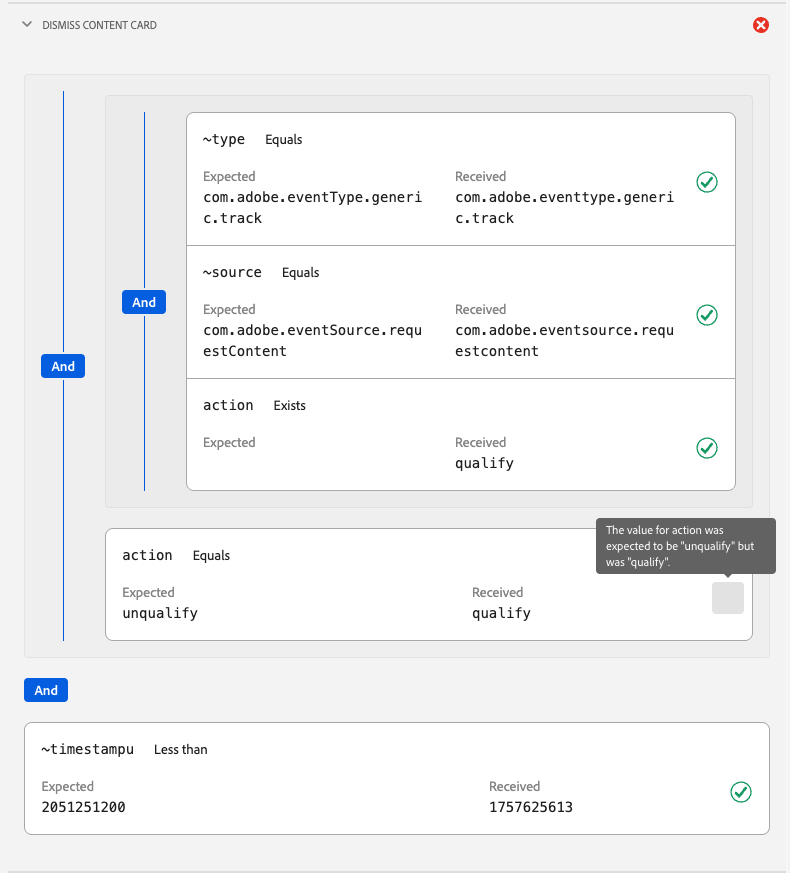
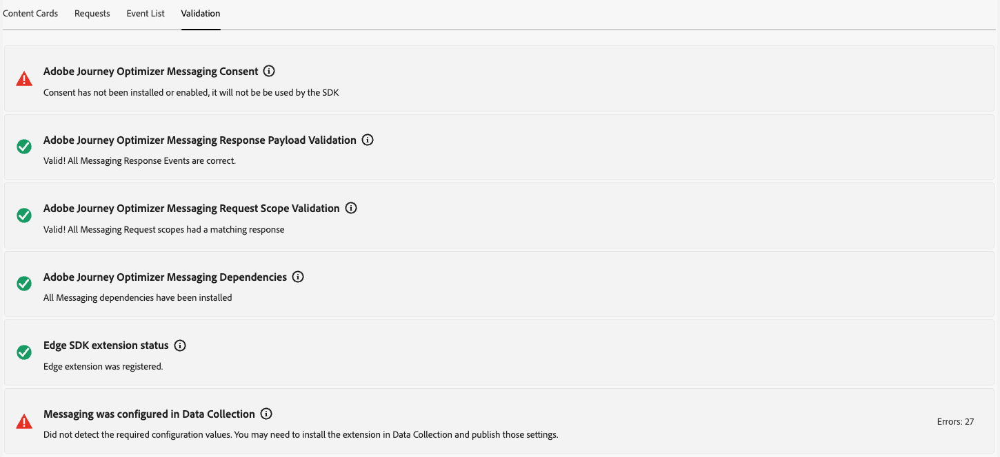

# Exibição de Cartões de conteúdo no Assurance

A exibição de Mensagens no aplicativo no Adobe Experience Platform Assurance fornece a capacidade de validar seu aplicativo, monitorar os cartões de conteúdo entregues ao dispositivo e pré-visualizar cartões.

## Cartões de conteúdo

Na parte superior da guia **[!UICONTROL Cartões de Conteúdo]** está uma lista suspensa de **[!UICONTROL Cartão de Conteúdo]**. Isso lista todos os cartões de conteúdo que foram recebidos na sessão do Assurance. Se um cartão não estiver nessa lista, significa que o aplicativo nunca o recebeu.

Selecionar um cartão de conteúdo mostrará muitas informações sobre ele, conforme descrito nas seções abaixo.

### Visualização do cartão

No painel direito há um painel **[!UICONTROL Visualização do cartão]** que mostra como um cartão é renderizado em modelos comuns — Imagem pequena, Imagem grande e Somente imagem.

Use o botão **[!UICONTROL Tema]** para exibir o cartão no modo claro ou escuro.

### Guias disponíveis

Na seção à esquerda, as guias disponíveis dependem do cartão selecionado. Se o cartão incluir regras, você verá três guias: **[!UICONTROL Informações]**, **[!UICONTROL Interações]** e **[!UICONTROL Analisar regras]**.

Se o cartão não incluir regras, você verá duas guias: **[!UICONTROL Informações]** e **[!UICONTROL Interações]**.

### Guia Informações

A guia **[!UICONTROL Informações]** mostra a seção **[!UICONTROL Propriedades do Cartão]** na parte superior, incluindo medalhas para o **[!UICONTROL Estado Atual]** (acionador, exibição, descarte, desqualificação) além de metadados como **[!UICONTROL Modelo]** (Imagem Pequena, Imagem Grande ou Somente Imagem), **[!UICONTROL Superfície]** e qualquer par de valores-chave personalizado.

Abaixo disso, a seção **[!UICONTROL Propriedades da campanha]** mostra informações carregadas do Adobe Journey Optimizer (AJO).

Você também pode selecionar **[!UICONTROL Exibir campanha]** para abrir o cartão no AJO para inspeção ou edição.

### Guia Interações

A guia **[!UICONTROL Interações]** resume o ciclo de vida de cada cartão como uma sequência de medalhas: ele sempre começa com **[!UICONTROL acionador]**, seguido por qualquer resultado produzido pelas regras—**[!UICONTROL exibir]**, **[!UICONTROL dispensar]** ou **[!UICONTROL desqualificar]**.

### Guia Analisar regras

A guia **[!UICONTROL Analisar]** mostra uma tabela de eventos com até três colunas de regras —**[!UICONTROL Exibir]**, **[!UICONTROL Dispensar]** e **[!UICONTROL Desqualificar]** — com base nas regras do cartão. Se o cartão definir apenas uma regra, somente essa coluna será exibida.

Cada linha representa um evento de sessão e cada coluna indica se a regra do cartão correspondeu às condições desse evento. Uma pontuação de 0% significa que nenhuma condição foi correspondida; 100% é uma correspondência completa (a regra seria acionada).

Se o evento corresponder a uma condição, ele mostrará uma marca de seleção verde. Se o evento não corresponder, ele mostrará um ícone vermelho.

Use o controle deslizante **[!UICONTROL Limite de Correspondência]** para filtrar eventos por porcentagem mínima de correspondência.

Ao selecionar um evento, um painel de detalhes é aberto à direita com uma opção listando as três regras: **[!UICONTROL Exibir]**, **[!UICONTROL Ignorar]** e **[!UICONTROL Desqualificar]**.

Expanda qualquer seção para ver as condições da regra, quais condições corresponderam e a porcentagem de correspondência calculada para esse resultado.

## Guia Solicitações

A guia **[!UICONTROL Solicitações]** mostra quais Cartões de Conteúdo foram solicitados e em qual superfície.

Use o botão **[!UICONTROL Exibir Cartão]** para voltar para a guia de informações de um cartão de conteúdo específico.

## Guia Lista de eventos

A guia **[!UICONTROL Lista de eventos]** mostra eventos de sessão relevantes para Cartões de conteúdo, incluindo solicitações/respostas de apresentação do AJO, eventos de ciclo de vida do cartão e rastreamento de interação. Pesquise, filtre, classifique e personalize colunas e exporte resultados.

Selecionar um evento abre um painel de detalhes do lado direito com a carga bruta e os atributos principais. Você também pode sinalizar eventos para acompanhamento. Essa exibição é útil para correlacionar solicitações, resultados de regras e interações na sessão.

## Guia Validação

A guia **[!UICONTROL Validação]** executa validações em relação à sessão atual, verificando se o aplicativo foi configurado corretamente para envio de mensagens:

