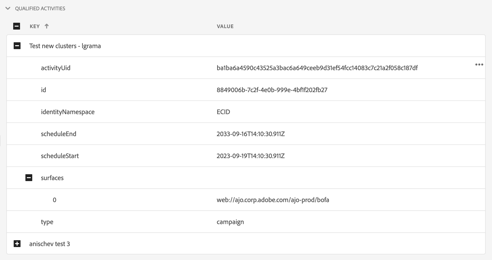

# Edge Delivery View in Assurance

A exibição **[!UICONTROL Edge Delivery]** dentro do **[!UICONTROL Adobe Experience Platform Assurance]** fornece a capacidade de inspecionar e validar a entrega de borda de [!UICONTROL Entrada do AJO] de mensagens para seus aplicativos móveis e da Web. Este modo de exibição é particularmente útil para solucionar problemas da entrega de [!UICONTROL campanhas e jornadas da Web e móveis] da AJO.

## Introdução

Antes de continuar, verifique se você tem acesso aos seguintes serviços:

- A [Interface da coleção de dados da Adobe Experience Platform](https://experience.adobe.com/#/data-collection/)
- [Adobe Experience Platform Assurance](https://experience.adobe.com/assurance)

Para saber como instalar o **[!UICONTROL Assurance]** em seu aplicativo, leia o [guia de implementação do Assurance](../tutorials/implement-assurance.md).

## Use o Assurance com o Edge Delivery

Depois de abrir uma sessão do **[!UICONTROL Assurance]**, você poderá adicionar a exibição **[!UICONTROL Edge Delivery]** ao **[!UICONTROL Assurance]**. Na parte inferior do painel esquerdo, selecione **[!UICONTROL Configurar]** para adicionar a exibição **[!UICONTROL Edge Delivery]** e **Salvar**.

Depois de adicionado, selecione o modo de exibição **[!UICONTROL Edge Delivery]** na seção **[!UICONTROL Adobe Journey Optimizer]** para validar a entrega de borda de entrada.

## Lista de solicitações

No painel principal da exibição, a lista de solicitações de entrega de borda é exibida. Esta lista mostra todas as [!UICONTROL solicitações de AJO] de entrada feitas à Experience Edge e processadas pelo **[!UICONTROL Serviço de Entrega de Entrada]**, incluindo solicitações para recuperar decisões de personalização, bem como rastrear interações de apresentação de personalização (como exibição, clique, gatilho ou descarte).

As solicitações são ordenadas por carimbo de data e hora, com as solicitações mais recentes na parte superior. Além do carimbo de data e hora, a lista também inclui uma coluna ID de solicitação, bem como Tipo de solicitação, que pode ser uma das seguintes:

- **[!UICONTROL Entrega de experiência]**: uma solicitação para recuperar decisões de personalização
- **[!UICONTROL Interações de experiência]**: uma solicitação para rastrear interações de apresentação de personalização
- **[!UICONTROL Entrega de experiência e interações]**: uma solicitação para recuperar decisões de personalização, incluindo também interações de apresentação de personalização
- **[!UICONTROL Visualizar Entrega]**: uma solicitação para recuperar decisões de personalização de Visualização

As solicitações também podem ser filtradas inserindo um termo de pesquisa na barra de pesquisa na parte superior da lista. Isso é útil ao filtrar por valores específicos, como IDs.

## Visualizações detalhadas de solicitações

Depois que uma solicitação é selecionada na exibição principal, informações detalhadas sobre a solicitação selecionada são exibidas à direita. Essa exibição inclui as seguintes seções:

### Visão geral da solicitação

Esta seção fornece uma visão geral de alto nível da solicitação selecionada, incluindo [!UICONTROL ID da organização], [!UICONTROL cluster Edge], [!UICONTROL ID da solicitação] e [!UICONTROL Tipo de solicitação], [!UICONTROL ID da sandbox], [!UICONTROL Nome da sandbox], [!UICONTROL ID da sequência de dados], bem como a lista de superfícies de solicitação no caso de solicitações de [!UICONTROL Entrega de experiência].

### Perfil

Esta seção fornece informações sobre os dados de perfil usados ao processar a solicitação, incluindo o mapa de identidade, a associação do segmento e as configurações de consentimento.\
A seção [!UICONTROL Perfil] é muito útil quando problemas como entrega não funcionam como esperado devido à associação de segmento ausente ou atrasada ou configurações de consentimento de recusa.

### Atividades qualificadas

Esta seção fornece uma lista de atividades que foram qualificadas para a solicitação selecionada, incluindo o tipo de atividade, as IDs, o namespace de identidade, as superfícies, a agenda e os públicos-alvo. Informações mais detalhadas sobre a atividade podem ser encontradas na [seção de rastreamento de execução bruta](#execution).

### Atividades não qualificadas

Esta seção fornece uma lista de atividades que foram excluídas de serem qualificadas. Além do tipo de atividade, IDs, namespaces de identidade, superfícies, agendamentos e públicos-alvo, esta seção também inclui uma lista de motivos pelos quais a atividade foi desqualificada.

### Detalhes da mensagem

Esta seção fornece informações detalhadas sobre as mensagens que foram entregues para a solicitação selecionada. Inclui IDs de mensagem, fragmentos, políticas de decisão, parâmetros [!UICONTROL Offer decisioning], bem como o contexto de seleção da mensagem.

### Interações

Esta seção fornece informações detalhadas sobre as interações que foram rastreadas na solicitação selecionada. Inclui o tipo de interação (em `propositionEventType`), bem como metadados de proposta associados, como metadados de atividade (em `scopeDetails.activity`) e token de evento de proposta (em `scopeDetails.characteristics.eventToken`).

### Rastreamentos brutos

Esta seção fornece os rastreamentos brutos da solicitação selecionada. Inclui o rastreamento completo da solicitação, incluindo a solicitação real como recebida no **[!UICONTROL Serviço de Entrega de Entrada]**, rastreamento de execução e rastreamento de resposta. Isso é útil para a solução de problemas avançada, como o não funcionamento esperado do delivery devido à indisponibilidade do Serviço de delivery, dados ausentes ou incorretos, ou para entender o fluxo completo do processamento de solicitações.

#### Solicitação

O rastreamento de solicitação inclui a solicitação completa, pois foi recebida pelo **[!UICONTROL Serviço de Entrega de Entrada]** **[!UICONTROL Konductor]** upstream. Inclui os cabeçalhos de solicitação, o corpo e outros metadados. Por exemplo, a carga XDM da solicitação pode ser inspecionada no campo `event.body.xdm`.

#### Execução

O rastreamento de execução inclui o rastreamento completo da solicitação, pois foi processada pelo **[!UICONTROL Serviço de Entrega de Entrada]**. Ela mostra o contexto de execução, a qualificação de atividade, a seleção de mensagens e outras etapas de processamento. Quaisquer erros ou avisos ocorridos durante o processamento da solicitação podem ser encontrados nos campos `context.messages` e `context.exceptions`. Informações detalhadas sobre a qualificação da atividade podem ser encontradas nos campos `context.qualifiedActivitiesDetailed` e `context.unqualifiedActivitiesDetailed`.

#### Resposta

O rastreamento de resposta inclui a resposta completa, pois foi retornada pelo **[!UICONTROL Serviço de Entrega de Entrada]** downstream para **[!UICONTROL Konductor]**. Ele inclui os cabeçalhos de resposta, o corpo e outros metadados. O corpo completo da resposta pode ser inspecionado copiando a mensagem com id `1` para a área de transferência com o botão **[!UICONTROL Copiar Valor]** e colando-a em um visualizador JSON.

