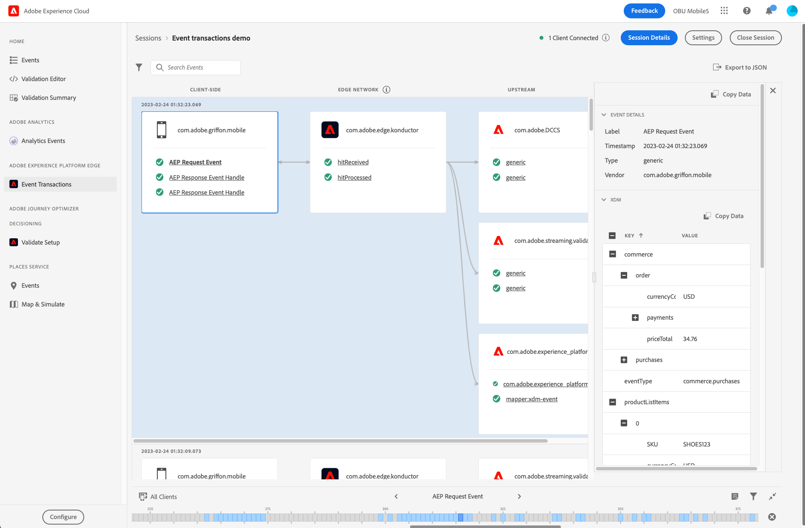

# Exibição Transações do evento

A exibição Transações do evento no Adobe Experience Platform Assurance permite validar e depurar a implementação do cliente de Rede de borda e ver os resultados da validação upstream quase em tempo real.

## Configurar o Assurance para o fluxo de trabalho da Rede de borda

Depois de [configurar o Assurance](../tutorials/implement-assurance.md), certifique-se de que implementou as versões mais recentes das extensões do Assurance e da Rede de borda no aplicativo.

Para exibir os eventos, selecione no menu do lado esquerdo **[!UICONTROL Transações do Evento]** na seção **[!UICONTROL Adobe Experience Platform Edge]**.

Se não vir essa opção, selecione **[!UICONTROL Configurar]** na parte inferior esquerda da janela, adicione a exibição **[!UICONTROL Transações do evento]**, e clique em **[!UICONTROL Salvar]**.

## Introdução ao uso da exibição Transações do evento

Nesta seção, acostume-se com a exibição Transação do evento e saiba como usá-la com eficiência para validação de ponta a ponta em fluxos de trabalho da Rede de borda.

### Fluxo de processamento do evento

A exibição Transações do Evento exibe três colunas na ordem do fluxo de processamento do evento:

- **[!UICONTROL Lado do cliente]**: essa coluna exibe os eventos processados ou recebidos no lado do cliente, acessíveis ao SDK móvel. Isso inclui os eventos que foram criados usando uma chamada de API, como `Edge.sendEvent`, e os identificadores de eventos de resposta recebidos pelo cliente do servidor da Rede de borda, se houver. Exemplos de eventos do lado do cliente:
   - O Evento de solicitação da AEP é o evento enviado por meio da extensão de Borda e contém o XDM e os dados opcionais de forma livre.
   - O identificador de evento de resposta da AEP é o identificador de evento recebido da Rede de borda em resposta a um evento de solicitação da AEP. Um evento de solicitação pode receber nenhum, um ou vários identificadores de evento de resposta.
   - A resposta de erro da AEP pode ser vista no caso de um erro, por exemplo, se o conteúdo de XDM não puder ser processado, ou se um dos serviços upstream retornar um erro ou aviso.
- **[!UICONTROL Rede de borda]**: essa coluna exibe o evento recebido no lado do servidor pela Rede de borda por meio de uma solicitação de rede e quais dados e metadados ele continha.
- **[!UICONTROL Upstream]**: essa coluna exibe os eventos recebidos pelos serviços upstream configurados, incluindo informações detalhadas sobre os resultados do processamento e/ou validação para o evento recebido.
Observe que essa coluna é dinâmica e pode exibir diferentes tipos de informações, dependendo de dois fatores principais:
   - A configuração da sequência de dados e os serviços habilitados nela.
   - O tipo de evento enviado para a Rede de borda.

### Inspecionar eventos

Os eventos mostrados na exibição Transações do evento fornecem informações sobre o formato e o conteúdo dos dados que estão sendo processados em cada estado, bem como detalhes relevantes sobre avisos ou erros encontrados quando os dados são processados upstream. A exibição ajuda a restringir as informações de depuração no nível de evento/solicitação e a identificar erros no início do ciclo de desenvolvimento.

#### Expandir os detalhes do evento

Para inspecionar um evento, selecione-o na exibição. Essa ação expande a exibição **[!UICONTROL Detalhes do evento]** no lado direito da tela.
Os dados aninhados são exibidos em formato de árvore. É possível inspecionar valores-chave aninhados selecionando o botão **+** (mais) à esquerda do nome da chave.

#### Avisos ou erros da inspeção

Cada nome de evento é prefixado com um ícone que indica o status de alto nível do processamento desse evento:

- Se o evento foi processado com sucesso, uma marca de seleção verde será exibida.
- Se forem detectados avisos ou erros, será exibido um sinal de aviso. Selecione o evento relacionado para saber mais sobre a causa do aviso ou erro na exibição **[!UICONTROL Detalhes do evento]**.

### Configurações

É possível verificar o identificador de sequência de dados usado no momento selecionando a dica de ferramenta de informações próxima ao cabeçalho da coluna **[!UICONTROL Rede de borda]**.

>[!INFO]
>
>Quando vários clientes se conectarem à mesma sessão do Assurance e IDs de sequência de dados diferentes forem usadas, todos serão exibidos aqui. No entanto, isso não significa que sua implementação atual esteja usando várias sequências de dados. Somente a ID da sequência de dados atual definida na tag (propriedade móvel) utilizada pelo aplicativo é usada para processar novos eventos desse cliente. Ao testar casos de uso mais complicados com diferentes configurações e vários clientes conectados, pode ser útil usar sessões do Assurance separadas para simplificar o processo de validação.
