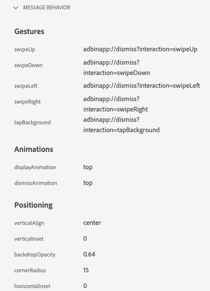

# Exibição de mensagens no aplicativo no Assurance

A exibição de mensagens no aplicativo no Adobe Experience Platform Assurance permite validar o aplicativo, monitorar as mensagens no aplicativo entregues ao seu dispositivo e simular mensagens nele.

## Mensagens no dispositivo

Na parte superior da guia **[!UICONTROL Mensagens no dispositivo]** há uma lista suspensa **[!UICONTROL Mensagem]**. Ela incluirá todas as mensagens recebidas na sessão do Assurance. Se uma mensagem não estiver nessa lista, significa que o aplicativo nunca a recebeu.


Selecionar uma mensagem mostrará muitas informações sobre ela, conforme descrito nas seções abaixo.

### Visualização da mensagem

No painel direito, há a janela **[!UICONTROL Visualização da mensagem]** que mostra uma visualização da mensagem. Selecionar **[!UICONTROL Simular no dispositivo]** enviará essa mensagem para todos os dispositivos que estão conectados à sessão no momento.


### Comportamento da mensagem

Abaixo da janela **[!UICONTROL Visualização da mensagem]** fica a guia **[!UICONTROL Comportamento da mensagem]**. Aqui estão todos os detalhes sobre como a mensagem é exibida. Essas informações incluem informações de posicionamento, animações, gestos de deslizar na tela e configurações de aparência.



### Guia Informações

Na seção à esquerda, há quatro guias que mostram detalhes sobre a mensagem. A guia **[!UICONTROL Informações]** mostra informações carregadas do Adobe Journey Optimizer (AJO) sobre a campanha da mensagem.

Também é possível selecionar **[!UICONTROL Exibir campanha]** para abrir a mensagem no AJO para inspeção ou edição.


### Guia Regras

A guia **[!UICONTROL Regras]** mostra o que é necessário para que essa mensagem seja exibida. Ela fornece insight sobre exatamente o que acionará a exibição de uma mensagem. Neste exemplo:


O exemplo mostra três condições diferentes para a regra. Se você selecionar um evento (de uma lista de eventos, da guia Analisar ou na linha do tempo), ele será avaliado em relação a essas regras. Se o evento corresponder a uma condição, ela mostrará uma marca de seleção verde:


Se o evento não corresponder, ela mostrará um ícone vermelho:


Se todas as três condições corresponderem ao evento atual, a mensagem será exibida.

### Guia Analisar

A guia **[!UICONTROL Analisar]** fornece insights adicionais sobre as regras. Aqui, filtramos cada evento na sessão com base na proximidade entre a regra da mensagem e o evento.


No exemplo da seção da **[!UICONTROL Guia Regras]**, há três condições na regra. Esta guia mostra a porcentagem de correspondência de cada evento com a regra. A maioria dos eventos têm 33% de correspondência (uma das três condições) e o restante têm 100% de correspondência.

Como resultado, é possível encontrar eventos que estão próximos de corresponder, mas que não correspondem totalmente à regra.


O controle deslizante **[!UICONTROL Limite de correspondência]** permite filtrar quais eventos devem ser exibidos. Por exemplo, ele pode ser definido para 50% - 90% para obter uma lista de eventos que correspondem exatamente a duas das três condições.

### Guia Interações

A guia **[!UICONTROL Interações]** mostra uma lista de eventos de interação que foram enviados ao Edge para fins de rastreamento.


Geralmente, há quatro eventos de interação sempre que uma mensagem é exibida:

```
trigger > display > interact > dismiss
```

A interação “interagir” tem um valor “ação” adicional associado a ela. Os valores possíveis incluem “clicado” ou “cancelar”.

A coluna de validação mostra se o evento de interação foi recebido e processado corretamente pelo Edge.

## Validação

A guia **[!UICONTROL Validação]** executa validações em relação à sessão atual, verificando se o aplicativo foi configurado corretamente para Mensagens no aplicativo:


Se algum erro for encontrado, os detalhes sobre como corrigi-lo serão fornecidos.

## Lista de eventos


A guia **[!UICONTROL Lista de eventos]** fornece uma olhada rápida em todos os eventos na sessão do Assurance relacionados às Mensagens no aplicativo. Alguns dos eventos que podem estar aqui incluem:

* Solicitações para recuperar mensagens e respostas
* Exibir eventos de mensagem
* Eventos de rastreamento de interação

Neste visualização, é possível usar muitos dos recursos padrão da lista de eventos, incluindo pesquisa, a aplicação de filtros, a adição ou remoção de colunas e a exportação de dados.

Selecione um evento para exibir os detalhes brutos do evento no painel direito.

No painel de detalhes direito, o evento selecionado pode ser sinalizado, o que é útil para marcar algo que deve ser revisado por outra pessoa.
