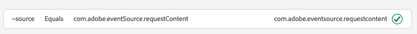

# Exibição de mensagens no aplicativo no Assurance

A visualização de mensagens no aplicativo no Adobe Experience Platform Assurance fornece a capacidade de validar o aplicativo, monitorar mensagens no aplicativo que são entregues ao dispositivo e simular mensagens para o dispositivo.

## Mensagens no dispositivo

Na parte superior do **[!UICONTROL Mensagens no dispositivo]** é uma **[!UICONTROL Mensagem]** lista suspensa. Isso incluirá todas as mensagens recebidas na sessão de Controle. Se uma mensagem não estiver nessa lista, significa que o aplicativo nunca a recebeu.


Selecionar uma mensagem mostrará muitas informações sobre ela, conforme descrito nas seções abaixo.

### Visualização de mensagem

No painel direito há um **[!UICONTROL Visualização de mensagem]** , que mostra uma pré-visualização da mensagem. Selecionar **[!UICONTROL Simular no dispositivo]** enviará essa mensagem para qualquer dispositivo conectado à sessão no momento.


### Comportamento da mensagem

Abaixo do **[!UICONTROL Visualização de mensagem]** o painel é o **[!UICONTROL Comportamento da mensagem]** guia . Isso tem todos os detalhes sobre como a mensagem é exibida. Essas informações incluem informações de posicionamento, animações, gestos de deslizamento e configurações de aparência.


### Guia Informações

Na seção à esquerda, há quatro guias que mostram detalhes sobre a mensagem. O **[!UICONTROL Informações]** mostra informações carregadas do Adobe Journey Optimizer (AJO) sobre a campanha de mensagem.

Você também pode selecionar **[!UICONTROL Exibir campanha]** para abrir a mensagem no AJO para inspeção ou edição.


### Guia Regras

O **[!UICONTROL Regras]** mostra o que precisa acontecer para que essa mensagem seja exibida. Isso fornece informações sobre exatamente o que acionará uma mensagem a ser exibida. Olhando para este exemplo:


O exemplo mostra três condições diferentes para a regra. Se você selecionar um evento (em uma lista de eventos, na guia Analisar ou na linha do tempo), ele será avaliado em relação a essas regras. Se o evento corresponder a uma condição, exibirá uma marca de seleção verde:



Se o evento não corresponder, ele mostrará um ícone vermelho:


Se todas as três condições corresponderem ao evento atual, a mensagem será exibida.

### Guia Analisar

O **[!UICONTROL Analisar]** A guia fornece insights adicionais sobre as regras. Aqui, filtramos cada evento na sessão com base no fechamento da regra de mensagem que corresponde ao evento.


No exemplo da variável **[!UICONTROL Guia Regras]** , há três condições na regra. Essa guia mostra qual porcentagem da regra corresponde a cada evento. A maioria dos eventos corresponde a 33% (uma das três condições) e o restante corresponde a 100%.

Como resultado, você pode encontrar eventos que estão próximos da correspondência, mas que não correspondem totalmente à regra.


O **[!UICONTROL Limite de correspondência]** permite filtrar quais eventos devem ser exibidos. Por exemplo, isso pode ser definido como 50% - 90% para obter uma lista de eventos que correspondem a exatamente duas das três condições.

### Guia Interações

O **[!UICONTROL Interações]** mostra uma lista de eventos de interação que foram enviados para o Edge para fins de rastreamento.


Normalmente, há quatro eventos de interação sempre que uma mensagem é exibida:

```
trigger > display > interact > dismiss
```

A interação &quot;interagir&quot; tem um valor de &quot;ação&quot; adicional associado. Os valores possíveis incluem &quot;clicado&quot; ou &quot;cancelar&quot;.

A coluna de validação mostra se o evento de interação foi recebido e processado corretamente pelo Edge.

## Validação

O **[!UICONTROL Validação]** A guia executa validações em relação à sessão atual, verificando se o aplicativo foi configurado corretamente para mensagens no aplicativo:


Se forem encontrados erros, serão fornecidos detalhes sobre como corrigir esses erros.

## Lista de eventos


O **[!UICONTROL Lista de eventos]** A guia fornece uma visão rápida de todos os eventos na sessão de Controle relacionados a Mensagens no aplicativo. Alguns dos eventos que você pode ver aqui são:

* Solicitações e respostas para recuperar mensagens
* Exibir eventos de mensagem
* Eventos de rastreamento de interação

Nesta visualização, você pode usar muitos dos recursos padrão da lista de eventos, incluindo a aplicação de pesquisas, a aplicação de filtros, a adição ou remoção de colunas e a exportação de dados.

Selecione um evento para exibir os detalhes brutos do evento no painel direito.

No painel de detalhes direito, o evento selecionado pode ser sinalizado, o que é útil para marcar algo que deve ser revisado por outra pessoa.
