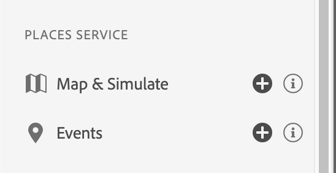

# Exibição do Places Service no Assurance

A variável **[!UICONTROL Places]** a exibição permite inspecionar eventos de entrada e saída de local na interface da Web do Adobe Experience Platform Assurance e fornece uma visualização inovadora no dispositivo. Dependendo dos workflows de negócios, essas visualizações úteis fornecem uma interface conveniente para exibir pontos de dados específicos do local para inspeção na Web/cliente para depuração no contexto.

Sabemos que usar o contexto de localização com suas experiências no aplicativo pode torná-las mais envolventes. No entanto, a depuração e a validação de acionadores de local podem ser penosas. Usar essas exibições e revisar os dados coletados no dispositivo ajuda a aliviar essa dor.

## Usar o Assurance com o Places Service

Para começar, conclua as seguintes etapas:

1. [Configurar o Assurance](../tutorials/implement-assurance.md).
2. Para exibir os eventos, no menu do lado esquerdo, selecione a **Exibição de eventos** no **Serviço de Places** seção.

