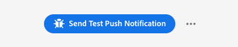
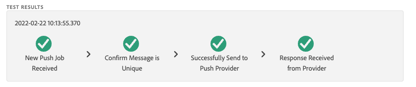

# Exibição de depuração de push

A Exibição de depuração de push no Adobe Experience Platform Assurance permite validar a configuração de push do seu aplicativo e enviar uma mensagem de teste para o seu dispositivo.

## Clientes

A lista suspensa de clientes tem uma lista de cada cliente único que se conectou a esta sessão do Assurance. Um cliente é um dispositivo exclusivo ou uma instalação de aplicativo exclusiva para um dispositivo. Por exemplo, se um dispositivo Android e um dispositivo iOS tiverem sido conectados à sessão, esses clientes aparecerão na lista suspensa Clientes.

Depois de reinstalar e reconectar o aplicativo em um dispositivo, outro cliente será exibido. Se um dispositivo com esse nome já existir, a nova lista suspensa anexará um #2 ao nome.

Esta visualização só é ativada para um único cliente, portanto, selecionar um cliente diferente alterará os detalhes na tela.

## Validar configuração

A variável **[!UICONTROL Validar configuração]** A guia valida e fornece detalhes adicionais sobre a configuração de push do aplicativo. Há três painéis que executam validações. Eles exibirão uma marca de seleção verde se todas as validações forem bem-sucedidas. Se houver três marcas de seleção verdes, o aplicativo foi configurado corretamente para mensagens por push, está gravando tokens de push no perfil do usuário e tem uma superfície de aplicativo associada configurada.

Se algo não estiver funcionando como o esperado, haverá um alerta com detalhes sobre como corrigir esse problema:

### Detalhes do cliente

Esse painel verifica se o dispositivo está configurado corretamente. Isso inclui configurar a extensão na interface da Coleção de dados, inicializar a extensão e seus pré-requisitos no aplicativo e capturar o token de push do dispositivo.

Se for válido, o painel exibirá a ECID do dispositivo, o token de push e o nome e tipo da sandbox da borda.

### Detalhes do perfil

Depois que o cliente estiver configurado corretamente, esse painel verificará se o dispositivo está gravando no perfil. Também valida se o token de push no perfil corresponde ao do dispositivo.

Se for válido, o painel mostrará a ECID do dispositivo, o token de push, a ID do aplicativo, a plataforma de mensagens e se o token de push foi incluído na lista de negação. O token pode ser incluído na lista de negação por vários motivos, como o usuário ter desinstalado o aplicativo ou ter desativado as mensagens de push para o aplicativo.

Por fim, na parte inferior do painel há um link que abrirá esse perfil específico em uma nova guia.

### Credenciais e configuração da AppStore

Este painel valida se a ID do aplicativo e a plataforma de mensagens que foi salva no perfil têm uma superfície de aplicativo correspondente criada. Uma superfície de aplicativo é onde as credenciais de push do aplicativo são carregadas.

Se for válido, o perfil exibirá o nome da superfície do aplicativo, a ID do aplicativo e o nome do serviço de mensagens.

Por fim, na parte inferior do painel há um link que abrirá essa superfície específica do aplicativo em uma nova guia.

## Enviar push de teste

A variável **[!UICONTROL Enviar push de teste]** pode ser usada para enviar uma mensagem de teste para seu dispositivo.

Há vários painéis que podem ser configurados para testar diferentes recursos de push do iOS e do Android. Após a configuração, selecione **[!UICONTROL Enviar notificação por push de teste]** para enviar a mensagem.

### Mensagem

No **[!UICONTROL Mensagem]** você pode fornecer um título e um corpo para a mensagem. O recurso de notificação silenciosa também pode ser ativado aqui.

### Destino de push

A variável **[!UICONTROL Destino de push]** permite personalizar qual token de push e superfície do aplicativo serão usados ao enviar a mensagem de push.

Essas informações serão fornecidas por padrão se a variável **[!UICONTROL Validar configuração]** A guia mostra três marcas de seleção verdes. No entanto, você pode fornecer seu próprio token de push e superfície de aplicativo, mesmo que o aplicativo não esteja totalmente configurado.

### Comportamento de clique

No **[!UICONTROL Comportamento do clique]** escolha qual deve ser o comportamento quando a notificação por push for clicada no dispositivo. Por padrão, ele abrirá o aplicativo, mas poderá abrir um deep link ou uma página da Web.

Se você optar por usar um deeplink, o desenvolvedor do aplicativo deverá criar um para você.

### Mídia avançada

A variável **[!UICONTROL Mídia avançada]** permite adicionar mídia extra à mensagem, como uma imagem, vídeo ou GIF. O desenvolvedor do aplicativo deve adicionar código ao aplicativo para habilitar esse recurso.

### Botões

A variável **[!UICONTROL Botões]** permite adicionar botões extras à notificação por push. Cada botão pode abrir o aplicativo, abrir um deep link no aplicativo ou abrir uma página da Web.

O desenvolvedor do aplicativo deve adicionar código ao aplicativo para habilitar esse recurso.

### Dados personalizados

A variável **[!UICONTROL Dados personalizados]** permite adicionar dados personalizados à notificação por push. Cada par de chave/valor é enviado como metadados junto com a mensagem e pode ser usado pelos desenvolvedores para criar experiências avançadas e adicionar rastreamento adicional.

## Resultados do teste

Depois de enviar uma mensagem, a variável **[!UICONTROL Resultados do teste]** recebe dados dos serviços de push para a mensagem. Aqui você pode ver se a mensagem chegou aos serviços de mensagens da Google/iOS:

Se algum problema ocorrer, ele será exibido aqui:

## Avançado

### Exibir conteúdo da mensagem

Ao lado do **[!UICONTROL Enviar notificação por push de teste]** é um conjunto de reticências com um menu pop-up. Aqui, é possível visualizar o conteúdo da mensagem. Isso permite que você veja a mensagem exata que será enviada para o serviço remoto de mensagens. Você pode revisar esse conteúdo ou até mesmo copiá-lo e colá-lo em uma ferramenta de teste de push de desktop.

