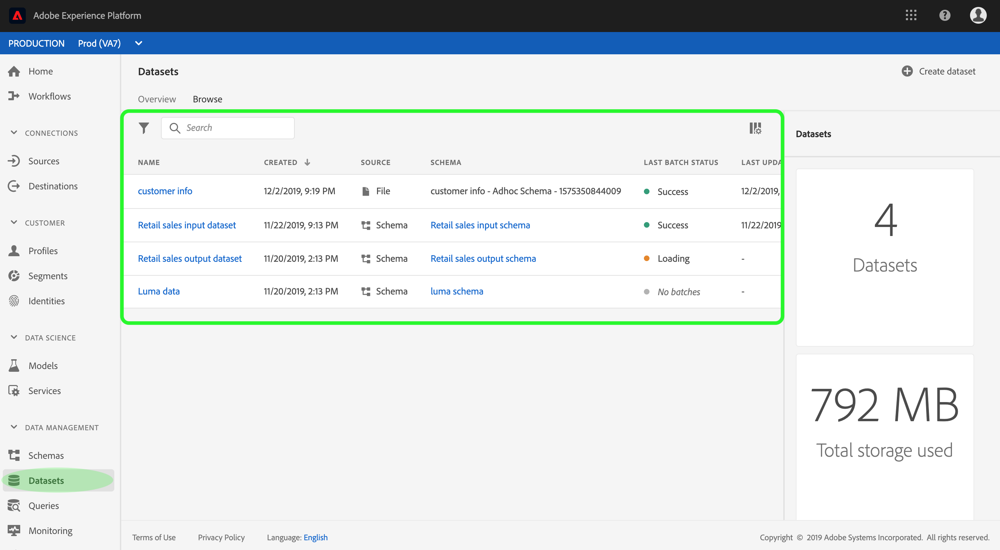

# Guia da interface do usuário de conjuntos de dados

Este guia do usuário fornece instruções sobre como executar ações comuns ao trabalhar com conjuntos de dados na interface do usuário do Adobe Experience Platform.

## Introdução

Este guia do usuário requer uma compreensão prática dos seguintes componentes do Adobe Experience Platform:

* [Conjuntos de dados](overview.md): A construção de armazenamento e gerenciamento para a persistência de dados no  [!DNL Experience Platform].
* [[!DNL Experience Data Model (XDM) System]](../../xdm/home.md): A estrutura padronizada pela qual  [!DNL Experience Platform] organiza os dados de experiência do cliente.
   * [Noções básicas da composição](../../xdm/schema/composition.md) do schema: Saiba mais sobre os elementos básicos dos schemas XDM, incluindo princípios-chave e práticas recomendadas na composição do schema.
   * [Editor](../../xdm/tutorials/create-schema-ui.md) de schemas: Saiba como criar seus próprios schemas XDM personalizados usando a interface  [!DNL Schema Editor] do  [!DNL Platform] usuário.
* [[!DNL Real-time Customer Profile]](../../profile/home.md): Fornece um perfil unificado e em tempo real para o consumidor, com base em dados agregados de várias fontes.
* [[!DNL Adobe Experience Platform Data Governance]](../../data-governance/home.md): Garanta a conformidade com regulamentos, restrições e políticas referentes ao uso de dados do cliente.

## Conjuntos de dados de visualização

Na interface do usuário [!DNL Experience Platform], clique em **[!UICONTROL Conjuntos de dados]** na navegação à esquerda para abrir o painel **[!UICONTROL Conjuntos de dados]**. O painel lista todos os conjuntos de dados disponíveis para sua organização. Os detalhes são exibidos para cada conjunto de dados listado, incluindo seu nome, o schema ao qual o conjunto de dados adere e o status da execução de ingestão mais recente.

Clique no nome de um conjunto de dados para acessar sua tela **[!UICONTROL atividade do conjunto de dados]** e veja os detalhes do conjunto de dados selecionado. A guia atividade inclui um gráfico que visualiza a taxa de mensagens que estão sendo consumidas, bem como uma lista de lotes bem-sucedidos e com falha.

## Pré-visualização de um conjunto de dados

Na tela **[!UICONTROL atividade do conjunto de dados]**, clique em **[!UICONTROL conjunto de dados de Pré-visualização]** próximo ao canto superior direito da tela para pré-visualização de até 100 linhas de dados. Se o conjunto de dados estiver vazio, o link pré-visualização será desativado e, em vez disso, informará que a pré-visualização não está disponível.

Na janela pré-visualização, a visualização hierárquica do schema para o conjunto de dados é mostrada à direita.

Para métodos mais robustos de acesso aos seus dados, [!DNL Experience Platform] fornece serviços de downstream como [!DNL Query Service] e [!DNL JupyterLab] para explorar e analisar dados. Consulte os seguintes documentos para obter mais informações:

* [Visão geral do Serviço de query](../../query-service/home.md)
* [Guia do usuário do JupyterLab](../../data-science-workspace/jupyterlab/overview.md)

## Criar um conjunto de dados {#create}

Para criar um novo conjunto de dados, start clicando em **[!UICONTROL Criar conjunto de dados]** no painel **[!UICONTROL Conjuntos de dados]**.

Na tela seguinte, você verá as duas opções a seguir para criar um novo conjunto de dados:

* [Criar conjunto de dados a partir do schema](#schema)
* [Criar conjunto de dados a partir do arquivo CSV](#csv)

### Criar um conjunto de dados com um schema existente {#schema}

Na tela **[!UICONTROL Criar conjunto de dados]**, clique em **[!UICONTROL Criar conjunto de dados a partir do schema]** para criar um novo conjunto de dados vazio.

A etapa **[!UICONTROL Selecionar schema]** é exibida. Procure a lista de schemas e selecione o schema ao qual o conjunto de dados irá aderir antes de clicar em **[!UICONTROL Next]**.

A etapa **[!UICONTROL Configurar conjunto de dados]** é exibida. Forneça um nome e uma descrição opcional ao conjunto de dados e clique em **[!UICONTROL Concluir]** para criar o conjunto de dados.

### Criar um conjunto de dados com um arquivo CSV {#csv}

Quando um conjunto de dados é criado usando um arquivo CSV, um schema ad hoc é criado para fornecer ao conjunto de dados uma estrutura que corresponda ao arquivo CSV fornecido. Na tela **[!UICONTROL Criar conjunto de dados]**, clique na caixa informando **[!UICONTROL Criar conjunto de dados a partir do arquivo CSV]**.

A etapa **[!UICONTROL Configure]** é exibida. Forneça o conjunto de dados com um nome e uma descrição opcional e clique em **[!UICONTROL Next]**.

A etapa **[!UICONTROL Adicionar dados]** é exibida. Carregue o arquivo CSV arrastando-o e soltando-o no centro da tela ou clique em **[!UICONTROL Procurar]** para explorar o diretório de arquivos. O tamanho do arquivo pode ser de até dez gigabytes. Depois que o arquivo CSV for carregado, clique em **[!UICONTROL Salvar]** para criar o conjunto de dados.

>[!NOTE]
>
>Os nomes das colunas CSV devem ter start com caracteres alfanuméricos e podem conter apenas letras, números e sublinhados.

## Ative um conjunto de dados para o Perfil do cliente em tempo real {#enable-profile}

Cada conjunto de dados tem a capacidade de enriquecer os perfis do cliente com seus dados assimilados. Para isso, o schema que o conjunto de dados segue deve ser compatível para uso em [!DNL Real-time Customer Profile]. Um schema compatível satisfaz os seguintes requisitos:

* O schema tem pelo menos um atributo especificado como uma propriedade de identidade.
* O schema tem uma propriedade de identidade definida como a identidade primária.

Para obter mais informações sobre como ativar um schema para [!DNL Profile], consulte o [guia do usuário do Editor de Schemas](../../xdm/tutorials/create-schema-ui.md).

Para habilitar um conjunto de dados para o Perfil, acesse a tela **[!UICONTROL atividade do conjunto de dados]** e clique na opção **[!UICONTROL Perfil]** na coluna **[!UICONTROL Propriedades]**. Depois de habilitados, os dados ingeridos no conjunto de dados também serão usados para preencher os perfis do cliente.

>[!NOTE]
>
>Se um conjunto de dados já contiver dados e estiver ativado para [!DNL Profile], os dados existentes não serão consumidos automaticamente por [!DNL Profile]. Depois que um conjunto de dados estiver ativado para [!DNL Profile], é recomendável que você reinsira todos os dados existentes para que eles contribuam para os perfis do cliente.

## Gerenciar e aplicar o controle de dados em um conjunto de dados

Rótulos de uso de dados permitem categorizar conjuntos de dados e campos de acordo com as políticas de uso que se aplicam a esses dados. Consulte [Visão geral do Data Governance](../../data-governance/home.md) para saber mais sobre rótulos, ou consulte [o guia do usuário dos rótulos de uso de dados](../../data-governance/labels/overview.md) para obter instruções sobre como aplicar rótulos a conjuntos de dados.

## Excluir um conjunto de dados

É possível excluir um conjunto de dados acessando primeiro sua tela **[!UICONTROL atividade do conjunto de dados]**. Em seguida, clique em **[!UICONTROL Excluir conjunto de dados]** para excluí-lo.

>[!NOTE]
>
>Os conjuntos de dados criados e utilizados por aplicativos e serviços Adobe (como Adobe Analytics, Adobe Audience Manager ou [!DNL Offer Decisioning]) não podem ser excluídos.

Uma caixa de confirmação é exibida. Clique em **[!UICONTROL Excluir]** para confirmar a exclusão do conjunto de dados.

## Excluir um conjunto de dados habilitado para Perfis

Se um conjunto de dados estiver habilitado para [!DNL Profile], a exclusão desse conjunto de dados pela interface do usuário o excluirá do Data Lake e do repositório de Perfis na Plataforma.

Você pode excluir um conjunto de dados somente do armazenamento [!DNL Profile] (deixando os dados no Data Lake) usando a API de Perfil do cliente em tempo real. Para obter mais informações, consulte o [guia de endpoint API de tarefas do sistema de perfis](../../profile/api/profile-system-jobs.md).

## Monitorar ingestão de dados

Na interface do usuário [!DNL Experience Platform], clique em **[!UICONTROL Monitoramento]** na navegação à esquerda. O painel **[!UICONTROL Monitoramento]** permite que você visualização os status dos dados de entrada de lote ou de streaming de ingestão. Para visualização dos status de lotes individuais, clique em **[!UICONTROL Lote end-to-end]** ou **[!UICONTROL Streaming end-to-end]**. Os painéis listas executam todas as execuções de lote ou de streaming, incluindo aquelas que foram bem-sucedidas, falharam ou ainda estão em andamento. Cada listagem fornece detalhes do lote, incluindo a ID do lote, o nome do conjunto de dados do público alvo e o número de registros ingeridos. Se o conjunto de dados do público alvo estiver ativado para [!DNL Profile], o número de registros de identidade e perfil assimilados também será exibido.

Você pode clicar em um **[!UICONTROL ID do lote]** individual para acessar o painel **[!UICONTROL Visão geral do lote]** e ver os detalhes do lote, incluindo registros de erros caso o lote não seja assimilado.

Se desejar excluir o lote, você poderá fazer isso clicando em **[!UICONTROL Excluir lote]** localizado próximo à parte superior direita do painel. Isso também removerá seus registros do conjunto de dados ao qual o lote foi originalmente ingerido.

## Próximas etapas

Este guia do usuário fornece instruções para executar ações comuns ao trabalhar com conjuntos de dados na interface do usuário [!DNL Experience Platform]. Para obter etapas sobre a execução de workflows comuns [!DNL Platform] envolvendo conjuntos de dados, consulte os seguintes tutoriais:

* [Criar um conjunto de dados usando APIs](create.md)
* [Dados do conjunto de dados do query usando a API de acesso a dados](../../data-access/home.md)
* [Configurar um conjunto de dados para o Perfil do cliente em tempo real e o serviço de identidade usando APIs](../../profile/tutorials/dataset-configuration.md)