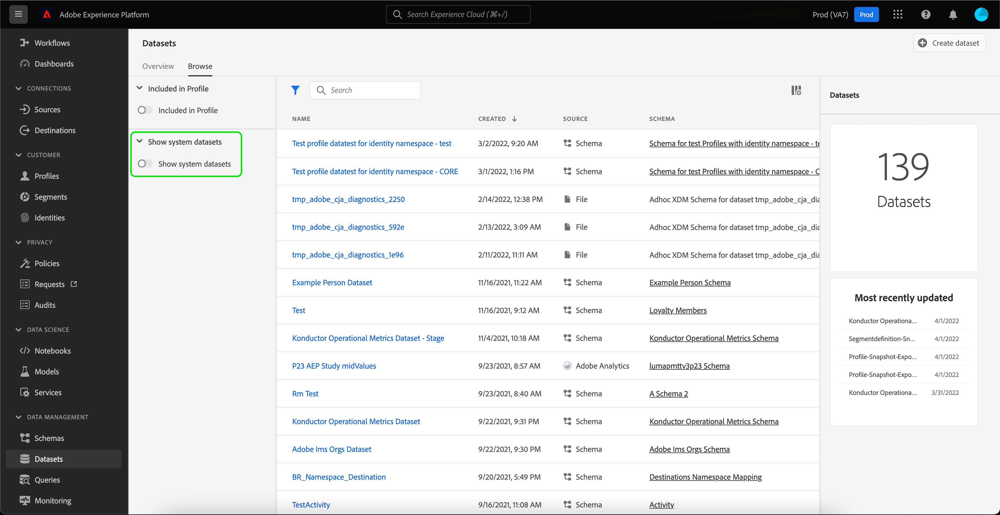
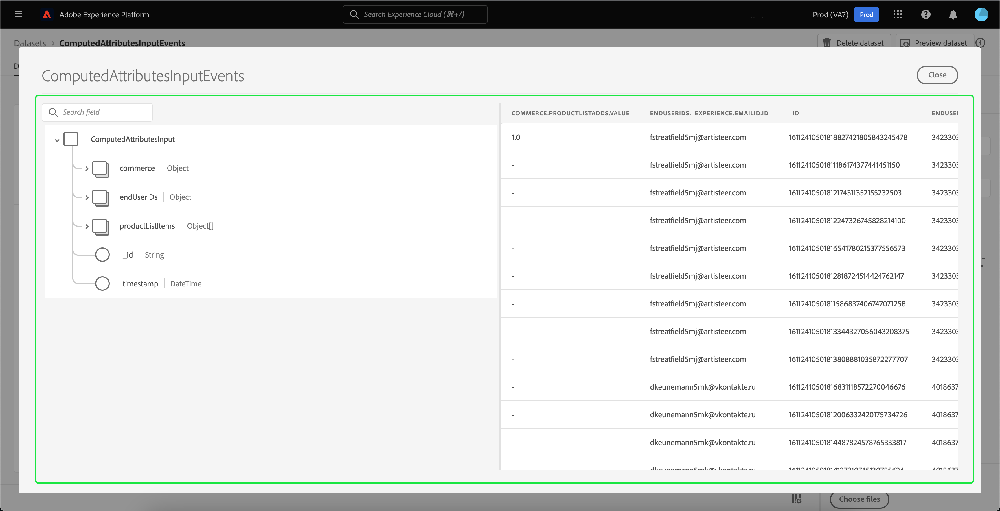
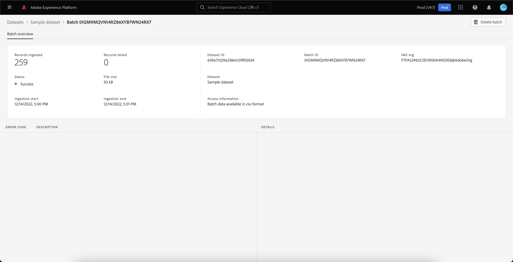

# Guia da interface do usuário de conjuntos de dados

Este guia do usuário fornece instruções sobre como executar ações comuns ao trabalhar com conjuntos de dados na interface do usuário do Adobe Experience Platform.

## Introdução

Este guia do usuário requer uma compreensão funcional dos seguintes componentes do Adobe Experience Platform:

* [Conjuntos de dados](overview.md): A construção de armazenamento e gerenciamento para a persistência de dados em [!DNL Experience Platform].
* [[!DNL Experience Data Model (XDM) System]](../../xdm/home.md): O quadro normalizado pelo qual [!DNL Experience Platform] organiza os dados de experiência do cliente.
   * [Noções básicas da composição do schema](../../xdm/schema/composition.md): Saiba mais sobre os elementos básicos dos esquemas XDM, incluindo princípios-chave e práticas recomendadas na composição do schema.
   * [Editor de esquema](../../xdm/tutorials/create-schema-ui.md): Saiba como criar seus próprios esquemas XDM personalizados usando o [!DNL Schema Editor] no [!DNL Platform] interface do usuário.
* [[!DNL Real-time Customer Profile]](../../profile/home.md): Fornece um perfil de consumidor unificado e em tempo real com base em dados agregados de várias fontes.
* [[!DNL Adobe Experience Platform Data Governance]](../../data-governance/home.md): Assegure a conformidade com regulamentos, restrições e políticas relacionadas ao uso de dados do cliente.

## Exibir conjuntos de dados {#view-datasets}

>[!CONTEXTUALHELP]
>id="platform_datasets_negative_numbers"
>title="Números negativos na atividade do conjunto de dados"
>abstract="Números negativos em registros assimilados significam que um usuário excluiu determinados lotes em um intervalo de tempo selecionado."
>text="Learn more in documentation"

No [!DNL Experience Platform] UI, selecione **[!UICONTROL Conjuntos de dados]** na navegação à esquerda para abrir o **[!UICONTROL Conjuntos de dados]** painel. O painel lista todos os conjuntos de dados disponíveis para sua organização. Os detalhes são exibidos para cada conjunto de dados listado, incluindo seu nome, o esquema ao qual o conjunto de dados adere e o status da execução de assimilação mais recente.

Por padrão, somente os conjuntos de dados assimilados são exibidos. Se quiser ver os conjuntos de dados gerados pelo sistema, habilite o **[!UICONTROL Mostrar conjuntos de dados do sistema]** alternar. Os conjuntos de dados gerados pelo sistema são usados apenas para processar outros componentes. Por exemplo, o conjunto de dados de exportação de perfil gerado pelo sistema é usado para processar o painel de perfil.

Selecione o nome de um conjunto de dados para acessar seu **[!UICONTROL Atividade do conjunto de dados]** e veja os detalhes do conjunto de dados selecionado. A guia activity inclui um gráfico que visualiza a taxa de mensagens que estão sendo consumidas, bem como uma lista de lotes bem-sucedidos e com falha.

## Visualizar um conjunto de dados

No **[!UICONTROL Atividade do conjunto de dados]** , selecione **[!UICONTROL Visualizar conjunto de dados]** próximo ao canto superior direito da tela para visualizar até 100 linhas de dados. Se o conjunto de dados estiver vazio, o link de visualização será desativado e, em vez disso, dirá que a visualização não está disponível.

Na janela de pré-visualização, a exibição hierárquica do esquema do conjunto de dados é mostrada à direita.

Para métodos mais robustos de acesso aos seus dados, [!DNL Experience Platform] fornece serviços downstream como [!DNL Query Service] e [!DNL JupyterLab] para explorar e analisar dados. Consulte os seguintes documentos para obter mais informações:

* [Visão geral do Serviço de query](../../query-service/home.md)
* [Guia do usuário do JupyterLab](../../data-science-workspace/jupyterlab/overview.md)

## Criar um conjunto de dados {#create}

Para criar um novo conjunto de dados, comece selecionando **[!UICONTROL Criar conjunto de dados]** no **[!UICONTROL Conjuntos de dados]** painel.

Na próxima tela, você verá as duas opções a seguir para criar um novo conjunto de dados:

* [Criar conjunto de dados a partir do esquema](#schema)
* [Criar conjunto de dados a partir do arquivo CSV](#csv)

### Criar um conjunto de dados com um esquema existente {#schema}

No **[!UICONTROL Criar conjunto de dados]** , selecione **[!UICONTROL Criar conjunto de dados a partir do esquema]** para criar um novo conjunto de dados vazio.

O **[!UICONTROL Selecionar esquema]** será exibida. Navegue pela lista de esquema e selecione o esquema que o conjunto de dados seguirá antes de selecionar **[!UICONTROL Próximo]**.

O **[!UICONTROL Configurar conjunto de dados]** será exibida. Forneça o conjunto de dados com um nome e uma descrição opcional, em seguida selecione **[!UICONTROL Concluir]** para criar o conjunto de dados.

### Criar um conjunto de dados com um arquivo CSV {#csv}

Quando um conjunto de dados é criado usando um arquivo CSV, um esquema ad hoc é criado para fornecer ao conjunto de dados uma estrutura que corresponda ao arquivo CSV fornecido. No **[!UICONTROL Criar conjunto de dados]** , selecione **[!UICONTROL Criar conjunto de dados a partir do arquivo CSV]**.

O **[!UICONTROL Configurar]** será exibida. Forneça o conjunto de dados com um nome e uma descrição opcional, em seguida selecione **[!UICONTROL Próximo]**.

O **[!UICONTROL Adicionar dados]** será exibida. Carregue o arquivo CSV arrastando-o e soltando-o no centro da tela ou selecione **[!UICONTROL Procurar]** para explorar seu diretório de arquivos. O arquivo pode ter até dez gigabytes de tamanho. Depois que o arquivo CSV for carregado, selecione **[!UICONTROL Salvar]** para criar o conjunto de dados.

>[!NOTE]
>
>Os nomes das colunas CSV devem começar com caracteres alfanuméricos e podem conter somente letras, números e sublinhados.

## Ativar um conjunto de dados para o Perfil do cliente em tempo real {#enable-profile}

Cada conjunto de dados tem a capacidade de enriquecer perfis de clientes com seus dados assimilados. Para fazer isso, o esquema que o conjunto de dados adere deve ser compatível para uso em [!DNL Real-time Customer Profile]. Um schema compatível satisfaz os seguintes requisitos:

* O esquema tem pelo menos um atributo especificado como uma propriedade de identidade.
* O esquema tem uma propriedade de identidade definida como a identidade primária.

Para obter mais informações sobre a ativação de um schema para [!DNL Profile], consulte o [Guia do usuário do Editor de esquemas](../../xdm/tutorials/create-schema-ui.md).

Para ativar um conjunto de dados para o Perfil, acesse seu **[!UICONTROL Atividade do conjunto de dados]** e selecione o **[!UICONTROL Perfil]** alternar dentro do **[!UICONTROL Propriedades]** coluna. Depois de habilitado, os dados assimilados no conjunto de dados também serão usados para preencher perfis do cliente.

>[!NOTE]
>
>Se um conjunto de dados já contiver dados e estiver ativado para [!DNL Profile], os dados existentes não são consumidos automaticamente por [!DNL Profile]. Depois que um conjunto de dados é ativado para [!DNL Profile], é recomendável assimilar novamente todos os dados existentes para contribuir com os perfis do cliente.

## Gerenciar e aplicar o controle de dados em um conjunto de dados

Os rótulos de uso de dados permitem categorizar os conjuntos de dados e campos de acordo com as políticas de uso que se aplicam a esses dados. Consulte a [Visão geral da governança de dados](../../data-governance/home.md) para saber mais sobre rótulos ou consulte o [guia do usuário de rótulos de uso de dados](../../data-governance/labels/overview.md) para obter instruções sobre como aplicar rótulos a conjuntos de dados.

## Excluir um conjunto de dados

É possível excluir um conjunto de dados acessando primeiro seu **[!UICONTROL Atividade do conjunto de dados]** tela. Em seguida, selecione **[!UICONTROL Excluir conjunto de dados]** para excluí-lo.

>[!NOTE]
>
>Conjuntos de dados criados e utilizados por aplicativos e serviços do Adobe (como Adobe Analytics, Adobe Audience Manager ou [!DNL Offer Decisioning]) não pode ser excluído.

Uma caixa de confirmação é exibida. Selecionar **[!UICONTROL Excluir]** para confirmar a exclusão do conjunto de dados.

## Excluir um conjunto de dados habilitado para perfil

Se um conjunto de dados estiver ativado para [!DNL Profile], a exclusão desse conjunto de dados por meio da interface do usuário o excluirá do Data Lake e do armazenamento do Perfil na Platform.

É possível excluir um conjunto de dados do [!DNL Profile] armazene somente (deixando os dados no Data Lake) usando a API do Perfil do cliente em tempo real. Para obter mais informações, consulte o [guia do endpoint da API de tarefas do sistema de perfis](../../profile/api/profile-system-jobs.md).

## Monitorar assimilação de dados

No [!DNL Experience Platform] IU, selecionar **[!UICONTROL Monitoramento]** na navegação à esquerda. O **[!UICONTROL Monitoramento]** O painel permite visualizar os status dos dados de entrada da assimilação em lote ou em fluxo. Para exibir os status de lotes individuais, selecione **[!UICONTROL Lote completo]** ou **[!UICONTROL Streaming completo]**. Os painéis listam todas as execuções de assimilação em lote ou streaming, incluindo aquelas que foram bem-sucedidas, falharam ou ainda estão em andamento. Cada listagem fornece detalhes do lote, incluindo a ID do lote, o nome do conjunto de dados de destino e o número de registros assimilados. Se o conjunto de dados de destino estiver ativado para [!DNL Profile], o número de identidades assimiladas e registros de perfil também é exibido.

Você pode selecionar em um **[!UICONTROL ID em lote]** para acessar o **[!UICONTROL Visão geral do lote]** painel e veja os detalhes do lote, incluindo registros de erro caso o lote não seja assimilado.

Se desejar excluir o lote, é possível fazer isso selecionando **[!UICONTROL Excluir lote]** encontrada perto da parte superior direita do painel. Isso também removerá seus registros do conjunto de dados ao qual o lote foi originalmente assimilado.

## Próximas etapas

Este guia do usuário forneceu instruções para executar ações comuns ao trabalhar com conjuntos de dados na [!DNL Experience Platform] interface do usuário. Para obter as etapas sobre como executar o [!DNL Platform] fluxos de trabalho envolvendo conjuntos de dados, consulte os seguintes tutoriais:

* [Criar um conjunto de dados usando APIs](create.md)
* [Consultar dados do conjunto de dados usando a API de acesso a dados](../../data-access/home.md)
* [Configurar um conjunto de dados para o Perfil do cliente em tempo real e o Serviço de identidade usando APIs](../../profile/tutorials/dataset-configuration.md)
