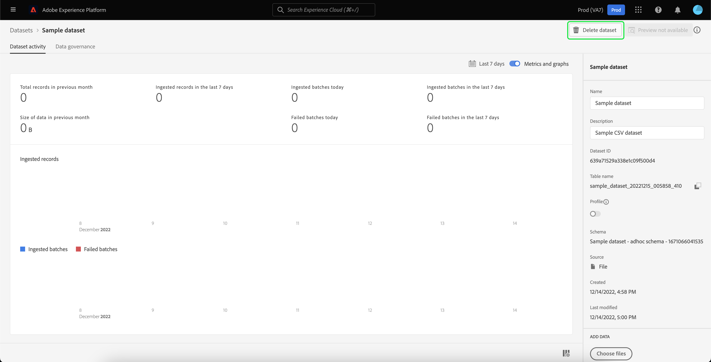

# Guia da interface do usuário de conjuntos de dados

Este guia do usuário fornece instruções sobre como executar ações comuns ao trabalhar com conjuntos de dados na interface do usuário do Adobe Experience Platform.

## Introdução

Este guia do usuário requer uma compreensão funcional dos seguintes componentes do Adobe Experience Platform:

* [Conjuntos de dados](overview.md): a construção de armazenamento e gerenciamento para a persistência de dados em [!DNL Experience Platform].
* [[!DNL Experience Data Model (XDM) System]](../../xdm/home.md): a estrutura padronizada pela qual o [!DNL Experience Platform] organiza os dados de experiência do cliente.
   * [Noções básicas sobre a composição de esquema](../../xdm/schema/composition.md): saiba mais sobre os blocos de construção básicos de esquemas XDM, incluindo princípios-chave e práticas recomendadas na composição de esquema.
   * [Editor de esquemas](../../xdm/tutorials/create-schema-ui.md): saiba como criar seus próprios esquemas XDM personalizados usando o [!DNL Schema Editor] na interface do usuário do [!DNL Platform].
* [[!DNL Real-Time Customer Profile]](../../profile/home.md): Fornece um perfil de consumidor unificado em tempo real com base em dados agregados de várias fontes.
* [[!DNL Adobe Experience Platform Data Governance]](../../data-governance/home.md): garanta a conformidade com regulamentos, restrições e políticas relativos ao uso de dados do cliente.

## Visualizar conjuntos de dados {#view-datasets}

>[!CONTEXTUALHELP]
>id="platform_datasets_negative_numbers"
>title="Números negativos na atividade do conjunto de dados"
>abstract="Números negativos em registros assimilados significam que um usuário excluiu determinados lotes em um intervalo de tempo selecionado."
>text="Learn more in documentation"

>[!CONTEXTUALHELP]
>id="platform_datasets_browse_daysRemaining"
>title="Expiração do conjunto de dados"
>abstract="Esta coluna indica o número de dias que o conjunto de dados de destino tem antes de expirar automaticamente."

Na interface do usuário do [!DNL Experience Platform], selecione **[!UICONTROL Conjuntos de dados]** no menu de navegação esquerdo para abrir o painel **[!UICONTROL Conjuntos de dados]**. O painel lista todos os conjuntos de dados disponíveis para sua organização. Os detalhes são exibidos para cada conjunto de dados listado, incluindo seu nome, o esquema ao qual o conjunto de dados adere e o status da execução de ingestão mais recente.

Selecione o nome de um conjunto de dados na guia [!UICONTROL Procurar] para acessar a tela **[!UICONTROL Atividade do conjunto de dados]** e ver detalhes do conjunto de dados selecionado. A guia Atividade inclui um gráfico que visualiza a taxa de mensagens que estão sendo consumidas, bem como uma lista de lotes bem-sucedidos e com falha.

## Mais ações {#more-actions}

Você pode [!UICONTROL Excluir] ou [!UICONTROL Habilitar um conjunto de dados para o Perfil] da exibição de detalhes do [!UICONTROL Conjunto de Dados]. Para ver as ações disponíveis, selecione **[!UICONTROL ... Mais]** na parte superior direita da interface do usuário. O menu suspenso é exibido.

![O espaço de trabalho dos Conjuntos de Dados com o [!UICONTROL ... Menu suspenso Mais] realçado.](../images/datasets/user-guide/more-actions.png)

Se você selecionar **[!UICONTROL Habilitar um conjunto de dados para o Perfil]**, uma caixa de diálogo de confirmação será exibida. Selecione **[!UICONTROL Habilitar]** para confirmar sua escolha.

>[!NOTE]
>
>Para habilitar um conjunto de dados para o Perfil, o esquema que o conjunto de dados segue deve ser compatível para uso no Perfil do cliente em tempo real. Consulte a seção [Habilitar conjunto de dados para perfil](#enable-profile) para obter mais informações.

Se você selecionar **[!UICONTROL Excluir]**, a caixa de diálogo de confirmação [!UICONTROL Excluir conjunto de dados] será exibida. Selecione **[!UICONTROL Excluir]** para confirmar sua escolha.

>[!NOTE]
>
>Não é possível excluir conjuntos de dados do sistema.

Você também pode excluir ou adicionar um conjunto de dados para uso com o Perfil de Cliente em Tempo Real a partir das ações embutidas encontradas na guia [!UICONTROL Procurar]. Consulte a [seção de ações embutidas](#inline-actions) para obter mais informações.

## Ações embutidas do conjunto de dados {#inline-actions}

A interface dos conjuntos de dados agora oferece uma coleção de ações em linha para cada conjunto de dados disponível. Selecione as reticências (...) de um conjunto de dados que você deseja gerenciar para ver as opções disponíveis em um menu pop-up. As ações disponíveis incluem:

* [[!UICONTROL Visualizar conjunto de dados]](#preview),
* [[!UICONTROL Gerenciar dados e acessar rótulos]](#manage-and-enforce-data-governance)
* [[!UICONTROL Habilitar perfil unificado]](#enable-profile)
* [[!UICONTROL Gerenciar marcas]](#manage-tags)
* [[!UICONTROL Mover para pastas]](#move-to-folders)
* [[!UICONTROL Excluir]](#delete).

Mais informações sobre essas ações disponíveis podem ser encontradas nas respectivas seções. Para saber como gerenciar grandes números de conjuntos de dados simultaneamente, consulte a seção [ações em massa](#bulk-actions).

### Visualizar um conjunto de dados {#preview}

Você pode visualizar os dados de amostra do conjunto de dados nas opções embutidas da guia [!UICONTROL Procurar] e também na exibição [!UICONTROL Atividade do conjunto de dados]. Na guia [!UICONTROL Procurar], selecione as reticências (...) ao lado do nome do conjunto de dados que deseja visualizar. Uma lista de opções de menu é exibida. Em seguida, selecione **[!UICONTROL Visualizar conjunto de dados]** na lista de opções disponíveis. Se o conjunto de dados estiver vazio, o link de visualização será desativado e indicará que a visualização não está disponível.

Isso abre a janela de pré-visualização, onde a visualização hierárquica do esquema do conjunto de dados é mostrada à direita.

Como alternativa, na tela **[!UICONTROL Atividade do conjunto de dados]**, selecione **[!UICONTROL Visualizar conjunto de dados]** próximo ao canto superior direito da tela para visualizar até 100 linhas de dados.

Para métodos mais robustos de acesso aos seus dados, o [!DNL Experience Platform] fornece serviços downstream, como o [!DNL Query Service] e o [!DNL JupyterLab], para explorar e analisar dados. Consulte os seguintes documentos para obter mais informações:

* [Visão geral do Serviço de consulta](../../query-service/home.md)
* [Guia do usuário do JupyterLab](../../data-science-workspace/jupyterlab/overview.md)

### Gerenciar e aplicar a governança de dados em um conjunto de dados {#manage-and-enforce-data-governance}

Você pode gerenciar os rótulos de governança de dados para um conjunto de dados selecionando as opções em linha da guia [!UICONTROL Procurar]. Selecione as reticências (...) ao lado do nome do conjunto de dados que você deseja gerenciar, seguido por **[!UICONTROL Gerenciar dados e acessar rótulos]** no menu suspenso.

Os rótulos de uso de dados, aplicados no nível do esquema, permitem categorizar conjuntos de dados e campos de acordo com as políticas de uso que se aplicam a esses dados. Consulte a [visão geral da Governança de dados](../../data-governance/home.md) para saber mais sobre rótulos ou consulte o [guia do usuário de rótulos de uso de dados](../../data-governance/labels/overview.md) para obter instruções sobre como aplicar rótulos a esquemas para propagação para conjuntos de dados.

## Ativar um conjunto de dados para o Perfil do cliente em tempo real {#enable-profile}

Cada conjunto de dados tem a capacidade de enriquecer os perfis do cliente com seus dados assimilados. Para fazer isso, o esquema que o conjunto de dados segue deve ser compatível para uso em [!DNL Real-Time Customer Profile]. Um esquema compatível satisfaz os seguintes requisitos:

* O esquema tem pelo menos um atributo especificado como uma propriedade de identidade.
* O esquema tem uma propriedade de identidade definida como a identidade principal.

Para obter mais informações sobre como habilitar um esquema para [!DNL Profile], consulte o [guia do usuário do Editor de Esquemas](../../xdm/tutorials/create-schema-ui.md).

Você pode habilitar um conjunto de dados para o Perfil nas opções embutidas da guia [!UICONTROL Procurar] e também na exibição [!UICONTROL Atividade do conjunto de dados]. Na guia [!UICONTROL Procurar] do espaço de trabalho [!UICONTROL Conjuntos de Dados], selecione as reticências de um conjunto de dados que você deseja habilitar para o Perfil. Uma lista de opções de menu é exibida. Em seguida, selecione **[!UICONTROL Habilitar perfil unificado]** na lista de opções disponíveis.

Como alternativa, na tela da **[!UICONTROL Atividade do conjunto de dados]** do conjunto de dados, selecione a opção de alternância **[!UICONTROL Perfil]** na coluna **[!UICONTROL Propriedades]**. Depois de ativados, os dados assimilados no conjunto de dados também serão usados para preencher perfis de clientes.

>[!NOTE]
>
>Se um conjunto de dados já contiver dados e estiver habilitado para [!DNL Profile], os dados existentes não serão consumidos automaticamente por [!DNL Profile]. Depois que um conjunto de dados for habilitado para [!DNL Profile], é recomendável assimilar novamente todos os dados existentes para que ele contribua com os perfis do cliente.

Os conjuntos de dados que foram ativados para o Perfil também podem ser filtrados com esse critério. Consulte a seção sobre como [filtrar conjuntos de dados habilitados por perfil](#filter-profile-enabled-datasets) para obter mais informações.

### Gerenciar tags do conjunto de dados {#manage-tags}

Adicione tags criadas personalizadas para organizar conjuntos de dados e melhorar os recursos de pesquisa, filtragem e classificação. Na guia [!UICONTROL Procurar] do espaço de trabalho [!UICONTROL Conjuntos de Dados], selecione as reticências de um conjunto de dados que você deseja gerenciar, seguido de **[!UICONTROL Gerenciar marcas]** no menu suspenso.

A caixa de diálogo [!UICONTROL Gerenciar tags] é exibida. Insira uma breve descrição para criar uma tag personalizada ou escolha em uma tag pré-existente para rotular seu conjunto de dados. Selecione **[!UICONTROL Salvar]** para confirmar suas configurações.

A caixa de diálogo [!UICONTROL Gerenciar marcas] também pode remover marcas existentes de um conjunto de dados. Basta selecionar o &#39;x&#39; ao lado da tag que deseja remover e selecionar **[!UICONTROL Salvar]**.

Depois que uma tag é adicionada a um conjunto de dados, os conjuntos de dados podem ser filtrados com base na tag correspondente. Consulte a seção sobre como [filtrar conjuntos de dados por marcas](#enable-profile) para obter mais informações.

Para obter mais informações sobre como classificar objetos comerciais para facilitar a descoberta e a categorização, consulte o manual em [gerenciando taxonomias de metadados](../../administrative-tags/ui/managing-tags.md). Este guia detalha como um usuário com permissões apropriadas pode criar tags predefinidas, atribuir categorias a tags e executar todas as operações CRUD relacionadas em tags e categorias de tags na interface do usuário da Platform.

### Mover para pastas {#move-to-folders}

Você pode colocar conjuntos de dados em pastas para melhorar o gerenciamento do conjunto de dados. Para mover um conjunto de dados para uma pasta, selecione as reticências (...) ao lado do nome do conjunto de dados que você deseja gerenciar, seguido por **[!UICONTROL Mover para a pasta]** no menu suspenso.

![O painel [!UICONTROL Conjuntos de Dados] com as reticências e [!UICONTROL Mover para a pasta] realçados.](../images/datasets/user-guide/move-to-folder.png)

A caixa de diálogo [!UICONTROL Mover] conjunto de dados para pasta é exibida. Selecione a pasta para onde deseja mover o público-alvo e selecione **[!UICONTROL Mover]**. Uma notificação pop-up informa que a movimentação do conjunto de dados foi bem-sucedida.

![A caixa de diálogo [!UICONTROL Mover] do conjunto de dados com [!UICONTROL Mover] foi realçada.](../images/datasets/user-guide/move-dialog.png)

>[!TIP]
>
>Você também pode criar pastas diretamente na caixa de diálogo Mover conjunto de dados. Para criar uma pasta, selecione o ícone criar pasta () na parte superior direita da caixa de diálogo.
>
>![A caixa de diálogo [!UICONTROL Mover] do conjunto de dados com o ícone de criação de pasta realçado.](/help/catalog/images/datasets/user-guide/create-folder.png)

Quando o conjunto de dados estiver em uma pasta, você poderá optar por exibir somente os conjuntos de dados que pertencem a uma pasta específica. Para abrir a estrutura de pastas, selecione o ícone mostrar pastas (). Em seguida, selecione a pasta escolhida para ver todos os conjuntos de dados associados.

![Os painéis [!UICONTROL Conjuntos de Dados] com a estrutura de pastas dos conjuntos de dados exibida, o ícone mostrar pastas e uma pasta selecionada realçada.](../images/datasets/user-guide/folder-structure.png)

### Excluir um conjunto de dados {#delete}

Você pode excluir um conjunto de dados das ações embutidas do conjunto de dados na guia [!UICONTROL Procurar] ou na parte superior direita da exibição [!UICONTROL Atividade do conjunto de dados]. No modo de exibição [!UICONTROL Procurar], selecione as reticências (...) ao lado do nome do conjunto de dados que deseja excluir. Uma lista de opções de menu é exibida. Em seguida, selecione **[!UICONTROL Excluir]** no menu suspenso.

Uma caixa de diálogo de confirmação é exibida. Selecione **[!UICONTROL Excluir]** para confirmar.

Como alternativa, selecione **[!UICONTROL Excluir conjunto de dados]** na tela **[!UICONTROL Atividade do conjunto de dados]**.

>[!NOTE]
>
>Os conjuntos de dados criados e utilizados por aplicativos e serviços Adobe (como Adobe Analytics, Adobe Audience Manager ou [!DNL Offer Decisioning]) não podem ser excluídos.

Uma caixa de confirmação é exibida. Selecione **[!UICONTROL Excluir]** para confirmar a exclusão do conjunto de dados.

### Excluir um conjunto de dados habilitado para perfil

Se um conjunto de dados estiver ativado para o Perfil, a exclusão desse conjunto de dados por meio da interface do usuário o excluirá do data lake, do Serviço de identidade e também de quaisquer dados de perfil associados a esse conjunto de dados no Armazenamento de perfis.

Você pode excluir dados de perfil associados a um conjunto de dados do armazenamento [!DNL Profile] (deixando os dados no data lake) usando a API de Perfil de Cliente em Tempo Real. Para obter mais informações, consulte o [manual de ponto de extremidade da API de trabalhos do sistema de perfil](../../profile/api/profile-system-jobs.md).

## Pesquisar e filtrar conjuntos de dados {#search-and-filter}

Para pesquisar ou filtrar a lista de conjuntos de dados disponíveis, selecione o ícone de filtro () na parte superior esquerda do espaço de trabalho. Um conjunto de opções de filtro no painel esquerdo é exibido. Há vários métodos para filtrar seus conjuntos de dados disponíveis. Estes incluem: [[!UICONTROL Mostrar Conjuntos de Dados do Sistema]](#show-system-datasets), [[!UICONTROL Incluídos no perfil]](#filter-profile-enabled-datasets), [[!UICONTROL Marcas]](#filter-by-tag), [[!UICONTROL Data de criação]](#filter-by-creation-date), [[!UICONTROL Data de modificação], [!UICONTROL Criado por]](#filter-by-creation-date) e [[!UICONTROL Esquema]](#filter-by-schema).

A lista de filtros aplicados é exibida acima dos resultados filtrados.

### Mostrar conjuntos de dados do sistema {#show-system-datasets}

Por padrão, somente os conjuntos de dados que você assimilou no são mostrados. Se quiser ver os conjuntos de dados gerados pelo sistema, marque a caixa de seleção **[!UICONTROL Sim]** na seção [!UICONTROL Mostrar conjuntos de dados do sistema]. Os conjuntos de dados gerados pelo sistema são usados apenas para processar outros componentes. Por exemplo, o conjunto de dados de exportação de perfil gerado pelo sistema é usado para processar o painel de perfis.

![As opções de filtro do espaço de trabalho Conjuntos de Dados com a seção [!UICONTROL Mostrar conjuntos de dados do sistema] realçada.](../images/datasets/user-guide/show-system-datasets.png)

### Filtrar conjuntos de dados habilitados para o perfil {#filter-profile-enabled-datasets}

Os conjuntos de dados que foram habilitados para dados de Perfil são usados para preencher perfis de clientes após a assimilação de dados. Consulte a seção sobre [habilitação de conjuntos de dados para o Perfil](#enable-profile) para saber mais.

Para filtrar seu conjunto de dados com base no fato de terem sido habilitados para o Perfil, marque a caixa de seleção [!UICONTROL Sim] nas opções de filtro.

![As opções de filtro do espaço de trabalho de Conjuntos de Dados com a seção [!UICONTROL Incluído no Perfil] realçada.](../images/datasets/user-guide/included-in-profile.png)

### Filtrar conjuntos de dados por tag {#filter-by-tag}

Insira o nome da sua marca personalizada na entrada de [!UICONTROL Marcas] e selecione sua marca na lista de opções disponíveis para pesquisar e filtrar conjuntos de dados que correspondam a essa marca.

![As opções de filtro do espaço de trabalho Conjuntos de Dados com a entrada [!UICONTROL Marcas] e o ícone de filtro destacados.](../images/datasets/user-guide/filter-tags.png)

### Filtrar conjuntos de dados por data de criação {#filter-by-creation-date}

Os conjuntos de dados podem ser filtrados pela data de criação em um período personalizado. Isso pode ser usado para excluir dados históricos ou gerar insights de dados cronológicos e relatórios específicos. Escolha uma [!UICONTROL Data de início] e uma [!UICONTROL Data de término] selecionando o ícone de calendário de cada campo. Depois disso, somente os conjuntos de dados que estão em conformidade com esses critérios aparecerão na guia Procurar.

### Filtrar conjuntos de dados por data de modificação {#filter-by-modified-date}

Semelhante ao filtro para data de criação, é possível filtrar seus conjuntos de dados com base na data em que foram modificados pela última vez. Na seção [!UICONTROL Data de modificação], escolha uma [!UICONTROL Data de início] e uma [!UICONTROL Data de término] selecionando o ícone de calendário para cada campo. Depois disso, somente os conjuntos de dados modificados durante esse período aparecerão na guia Procurar.

### Filtrar por esquema {#filter-by-schema}

Você pode filtrar conjuntos de dados com base no esquema que define sua estrutura. Selecione o ícone suspenso ou insira o nome do schema no campo de texto. Uma lista de correspondências em potencial é exibida. Selecione o schema apropriado na lista.

## Ações em massa {#bulk-actions}

Use ações em massa para aprimorar a eficiência operacional e execute várias ações em vários conjuntos de dados simultaneamente. Você pode economizar tempo e manter uma estrutura de dados organizada com ações em massa, como [Mover para pasta](#move-to-folders), [Editar tags](#manage-tags) e [Excluir](#delete) conjuntos de dados.

Para atuar em mais de um conjunto de dados por vez, selecione conjuntos de dados individuais com a caixa de seleção em cada linha ou selecione uma página inteira com a caixa de seleção do cabeçalho da coluna. Depois de selecionada, a barra de ação em massa é exibida.

Quando você aplica ações em massa a conjuntos de dados, as seguintes condições se aplicam:

* É possível selecionar conjuntos de dados de diferentes páginas da interface do usuário.
* Se você selecionar um filtro, os conjuntos de dados selecionados serão redefinidos.

## Classificar conjuntos de dados por data de criação {#sort}

Os conjuntos de dados na guia [!UICONTROL Procurar] podem ser classificados por datas crescentes ou decrescentes. Selecione os títulos de coluna [!UICONTROL Criado] ou [!UICONTROL Última atualização] para alternar entre crescente e decrescente. Depois de selecionada, a coluna indica isso com uma seta para cima ou para baixo ao lado do cabeçalho da coluna.

## Criar um conjunto de dados {#create}

Para criar um novo conjunto de dados, comece selecionando **[!UICONTROL Criar conjunto de dados]** no painel **[!UICONTROL Conjuntos de dados]**.

Na próxima tela, você verá as duas opções a seguir para criar um novo conjunto de dados:

* [Criar conjunto de dados a partir de esquema](#schema)
* [Criar conjunto de dados a partir de arquivo CSV](#csv)

### Criar um conjunto de dados com um esquema existente {#schema}

Na tela **[!UICONTROL Criar conjunto de dados]**, selecione **[!UICONTROL Criar conjunto de dados a partir do esquema]** para criar um novo conjunto de dados vazio.

A etapa **[!UICONTROL Selecionar esquema]** é exibida. Procure a lista de esquemas e selecione o esquema ao qual o conjunto de dados seguirá antes de selecionar **[!UICONTROL Próximo]**.

A etapa **[!UICONTROL Configurar conjunto de dados]** é exibida. Forneça um nome e uma descrição opcional ao conjunto de dados e selecione **[!UICONTROL Concluir]** para criar o conjunto de dados.

Os conjuntos de dados podem ser filtrados da lista de conjuntos de dados disponíveis na interface do usuário com o filtro de esquema. Consulte a seção sobre como [filtrar conjuntos de dados por esquema](#filter-by-schema) para obter mais informações.

### Criar um conjunto de dados com um arquivo CSV {#csv}

Quando um conjunto de dados é criado usando um arquivo CSV, um esquema ad hoc é criado para fornecer ao conjunto de dados uma estrutura que corresponde ao arquivo CSV fornecido. Na tela **[!UICONTROL Criar conjunto de dados]**, selecione **[!UICONTROL Criar conjunto de dados do arquivo CSV]**.

A etapa **[!UICONTROL Configurar]** é exibida. Forneça um nome e uma descrição opcional ao conjunto de dados e selecione **[!UICONTROL Avançar]**.

A etapa **[!UICONTROL Adicionar dados]** é exibida. Carregue o arquivo CSV arrastando-o e soltando-o no centro da tela ou selecione **[!UICONTROL Procurar]** para explorar o diretório de arquivos. O arquivo pode ter até dez gigabytes. Após carregar o arquivo CSV, selecione **[!UICONTROL Salvar]** para criar o conjunto de dados.

>[!NOTE]
>
>Os nomes das colunas CSV devem começar com caracteres alfanuméricos e podem conter apenas letras, números e sublinhados.

## Monitorar assimilação de dados

Na interface do usuário do [!DNL Experience Platform], selecione **[!UICONTROL Monitoramento]** na navegação à esquerda. O painel de **[!UICONTROL Monitoramento]** permite que você visualize os status dos dados de entrada a partir da assimilação em lote ou por transmissão. Para exibir os status de lotes individuais, selecione **[!UICONTROL Lote de ponta a ponta]** ou **[!UICONTROL Transmissão de ponta a ponta]**. Os painéis listam todas as execuções de assimilação em lote ou por transmissão, incluindo as que foram bem-sucedidas, falharam ou ainda estão em andamento. Cada lista fornece detalhes do lote, incluindo a ID do lote, o nome do conjunto de dados de destino e o número de registros assimilados. Se o conjunto de dados de destino estiver habilitado para [!DNL Profile], o número de registros de identidade e perfil assimilados também será exibido.

Você pode selecionar em um **[!UICONTROL ID do Lote]** individual para acessar o painel **[!UICONTROL Visão geral do lote]** e ver os detalhes do lote, incluindo logs de erros caso o lote não seja assimilado.

Se desejar excluir o lote, selecione **[!UICONTROL Excluir lote]** próximo à parte superior direita do painel. A exclusão de um lote também remove seus registros do conjunto de dados ao qual o lote foi originalmente assimilado.

>[!NOTE]
>
>Se os dados assimilados tiverem sido ativados para Perfil e processados, a exclusão de um lote não excluirá esses dados do armazenamento de Perfil.

## Próximas etapas

Este guia do usuário forneceu instruções para executar ações comuns ao trabalhar com conjuntos de dados na interface do usuário do [!DNL Experience Platform]. Para obter as etapas sobre como executar fluxos de trabalho [!DNL Platform] comuns envolvendo conjuntos de dados, consulte os seguintes tutoriais:

* [Criar um conjunto de dados usando APIs](create.md)
* [Consultar dados do conjunto de dados usando a API de acesso a dados](../../data-access/home.md)
* [Configurar um conjunto de dados para o Perfil do cliente em tempo real e o Serviço de identidade usando APIs](../../profile/tutorials/dataset-configuration.md)
