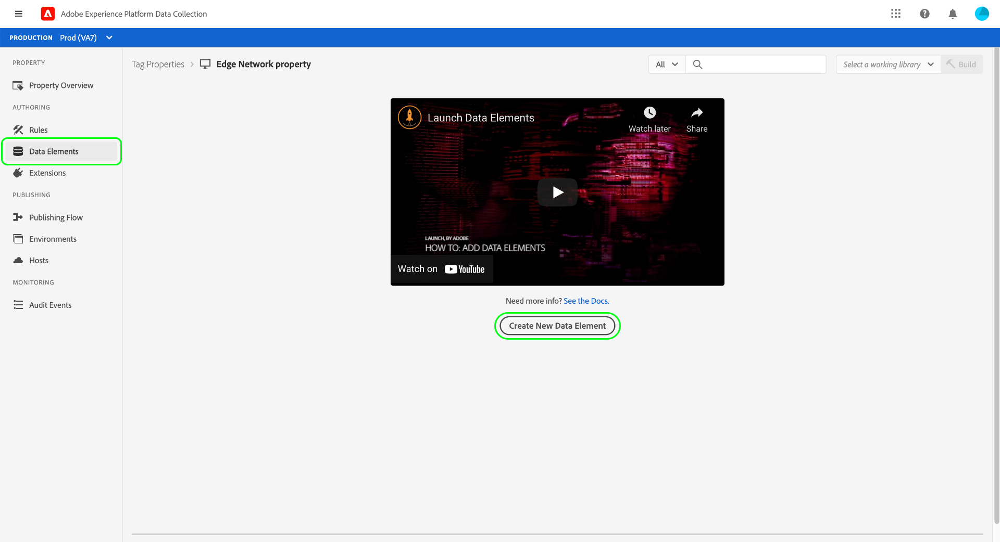
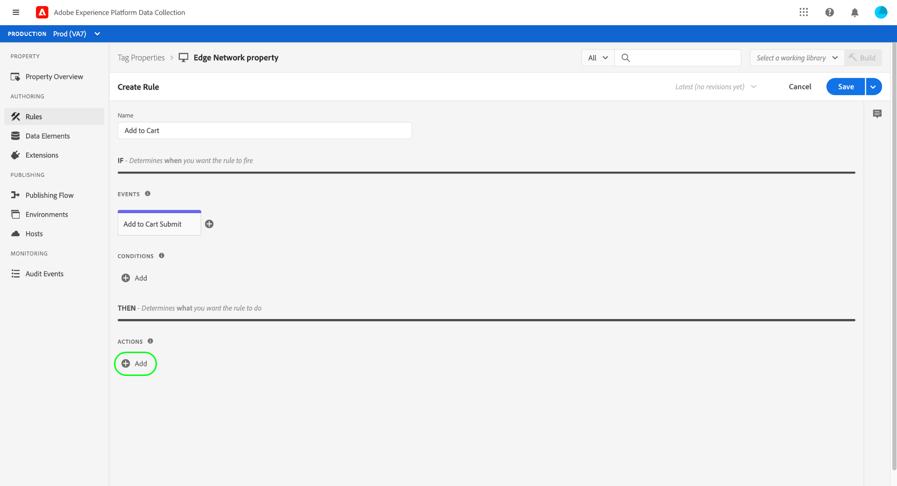

# Visão geral completa da coleta de dados

A Adobe Experience Platform coleta e transfere seus dados para outros produtos Adobe e destinos de terceiros. Para enviar dados do evento de seu aplicativo para o Edge Network do Experience Platform, é importante entender essas tecnologias principais e como configurá-las para fornecer seus dados aos destinos de que você precisa, quando você precisar.

Este guia fornece um tutorial de alto nível sobre como enviar um evento pelo Edge Network usando os recursos de coleção de dados da plataforma. Especificamente, o tutorial aborda as etapas de instalação e configuração da extensão de tag do SDK da Web da Adobe Experience Platform na interface da Coleção de dados (antiga Adobe Experience Platform Launch).

>[!NOTE]
>
>Você também pode optar por instalar e configurar o SDK manualmente se não quiser usar tags, mas as etapas subjacentes ainda devem ser concluídas conforme descrito abaixo.
>
>Todas as etapas que envolvem a interface da Coleção de dados também podem ser executadas na interface do usuário do Experience Platform.

## Pré-requisitos

Este tutorial usa a interface da Coleção de dados para criar um esquema, configurar um fluxo de dados e instalar o SDK da Web. Para executar essas ações na interface do usuário, você deve ter acesso a pelo menos uma propriedade da Web, juntamente com os [direitos de propriedade](../tags/ui/administration/user-permissions.md#property-rights) a seguir:

* Desenvolver
* Gerenciar extensões

Consulte o manual sobre [gerenciamento de permissões para coleta de dados](./permissions.md) para saber como conceder acesso a propriedades e direitos de propriedade.

Para usar os vários produtos de Coleção de dados mencionados neste guia, você também deve ter acesso aos fluxos de dados e a capacidade de criar e gerenciar esquemas. Se precisar de acesso a qualquer um desses recursos, entre em contato com a equipe de conta do Adobe para obter o acesso necessário. Observe que, se você não tiver comprado o Adobe Experience Platform, o Adobe fornecerá o acesso necessário para usar o SDK sem custo adicional.

Se você já tiver acesso à Platform, deve garantir que tenha todas as [permissões](../access-control/home.md#permissions) nas seguintes categorias habilitadas:

* Modelagem de dados
* Identidades

Consulte a [visão geral da interface do controle de acesso](../access-control/ui/overview.md) para saber como conceder permissões dos recursos da plataforma aos usuários.

## Resumo do processo

O processo de configuração da coleta de dados para seu site pode ser resumido da seguinte maneira:

1. [Crie um esquema](#schema) para determinar como seus dados serão estruturados ao serem enviados para o Edge Network.
1. [Crie uma sequência de dados](#datastream) para configurar para quais destinos você deseja que seus dados sejam enviados.
1. [Instale e configure o SDK da Web](#sdk) para enviar dados para a sequência de dados quando determinados eventos ocorrerem no site.

Depois de enviar dados para o Edge Network, você também pode [configurar o encaminhamento de eventos](#event-forwarding), se a sua organização tiver uma licença para ele.

## Criar um esquema {#schema}

O [Experience Data Model (XDM)](../xdm/home.md) é uma especificação de código aberto que fornece estruturas e definições comuns para dados na forma de esquemas. Em outras palavras, o XDM é uma maneira de estruturar e formatar seus dados de uma maneira acionável pelo Edge Network e outros aplicativos da Adobe Experience Cloud.

A primeira etapa na configuração das operações de coleta de dados é criar um esquema XDM para representar seus dados. Em uma etapa posterior deste tutorial, você mapeará os dados que deseja enviar para a estrutura deste esquema.

>[!NOTE]
>
>Os esquemas XDM são muito personalizáveis. Em vez de serem excessivamente prescritivas, as etapas descritas abaixo se concentram especificamente nos requisitos de esquema do SDK da Web. Fora desses parâmetros, você pode definir a estrutura restante dos dados da maneira que desejar.

Na interface, selecione **[!UICONTROL Esquemas]** na navegação à esquerda. Aqui, você pode ver uma lista de esquemas criados anteriormente que pertencem à sua organização. Para continuar, selecione **[!UICONTROL Criar esquema]** e **[!UICONTROL XDM ExperienceEvent]** no menu suspenso.


Uma caixa de diálogo é exibida solicitando que você comece a adicionar grupos de campos ao esquema. Para enviar eventos usando o SDK da Web, você deve adicionar o grupo de campos **[!UICONTROL AEP Web SDK ExperienceEvent Mixin]**. Este grupo de campos contém definições para atributos de dados que são automaticamente coletados pela biblioteca do SDK da Web.

Use a barra de pesquisa para restringir a lista e ajudar a encontrar este grupo de campos mais facilmente. Depois de encontrá-lo, selecione-o na lista antes de selecionar **[!UICONTROL Adicionar grupos de campos]**.


A tela Esquema é exibida, mostrando uma estrutura de árvore do esquema XDM, incluindo os campos fornecidos pelo grupo de campos do SDK da Web.


Selecione o campo raiz na árvore para abrir as **[!UICONTROL Propriedades do esquema]** no painel direito, onde você pode fornecer um nome e uma descrição opcional para o esquema.


Para adicionar mais campos ao esquema, selecione **[!UICONTROL Adicionar]** na seção **[!UICONTROL Grupos de campos]** no painel esquerdo.


>[!NOTE]
>
>Consulte o manual sobre [adição de grupos de campos](../xdm/ui/resources/schemas.md#add-field-groups) na documentação do XDM para obter etapas detalhadas sobre como pesquisar por diferentes grupos de campos para atender aos seus casos de uso.
>
>A prática recomendada é adicionar campos apenas para os dados que você planeja enviar pelo Edge Network. Depois de adicionar campos a um esquema e salvá-lo, somente alterações aditivas poderão ser feitas no esquema após isso. Consulte a seção sobre as [regras de evolução do esquema](../xdm/schema/composition.md#evolution) para obter mais informações.

Depois de adicionar os campos necessários, selecione **[!UICONTROL Salvar]** para salvar o esquema.


## Criar um fluxo de dados {#datastream}

Um fluxo de dados é uma configuração que informa ao Edge Network para onde você deseja que seus dados sejam enviados. Especificamente, um fluxo de dados especifica para quais produtos do Experience Cloud você deseja enviar os dados e como você deseja que os dados sejam manipulados e armazenados em cada produto.

>[!NOTE]
>
>Se você quiser usar o [encaminhamento de eventos](../tags/ui/event-forwarding/overview.md) (supondo que sua organização esteja licenciada para a funcionalidade), será necessário habilitá-lo para uma sequência de dados da mesma forma que habilita os produtos Adobe. Detalhes sobre este processo são abordados em uma [seção posterior](#event-forwarding).

Selecione **[!UICONTROL Datastreams]** na navegação à esquerda. Aqui, você pode selecionar uma sequência de dados existente na lista para editar, ou criar uma nova configuração selecionando **[!UICONTROL Nova sequência de dados]**.


Os requisitos de configuração para uma sequência de dados dependem dos produtos e recursos para os quais você está enviando dados. Para obter informações detalhadas sobre as opções de configuração de cada produto, consulte a [visão geral dos fluxos de dados](../datastreams/overview.md).

## Instalar e configurar o SDK da Web {#install}

Depois de criar um esquema e um fluxo de dados, a próxima etapa é instalar e configurar o SDK da Web da plataforma para começar a enviar dados para o Edge Network.

>[!NOTE]
>
>Esta seção usa a interface da Coleção de dados para configurar a extensão de tag do SDK da Web, mas você também pode instalá-la e configurá-la usando código bruto. Consulte os seguintes guias para obter mais informações:
>
>* [Instalar o SDK](/help/web-sdk/install/overview.md)
>* [Configurar o SDK](/help/web-sdk/commands/configure/overview.md)
>
>Observe também que mesmo que você queira usar apenas o encaminhamento de eventos, ainda é necessário instalar e configurar o SDK conforme descrito antes de configurar o encaminhamento de eventos em uma [etapa posterior](#event-forwarding).

O processo pode ser resumido da seguinte forma:

1. [Instale o SDK da Web da Adobe Experience Platform em uma propriedade de marca](#install-sdk) para obter acesso a seus recursos.
1. [Crie um elemento de dados Objeto XDM](#data-element) para mapear variáveis no seu site para a estrutura do esquema XDM criado anteriormente.
1. [Crie uma regra](#rule) para informar ao SDK quando ele deve enviar dados para o Edge Network.
1. [Crie e instale uma biblioteca](#library) para implementar a regra no seu site.

### Instalar o SDK em uma propriedade de tag {#install-sdk}

Selecione **[!UICONTROL Tags]** na navegação à esquerda para mostrar uma lista de propriedades de tags. Você pode escolher uma propriedade existente para editar, se desejar, ou pode selecionar **[!UICONTROL Nova propriedade]**.


Se estiver criando uma nova propriedade, forneça um nome descritivo e defina a [!UICONTROL Plataforma] como **[!UICONTROL Web]**. Forneça o domínio completo para a propriedade da Web e selecione **[!UICONTROL Salvar]**.


A página de visão geral da propriedade é exibida. Aqui, selecione **[!UICONTROL Extensões]** na navegação à esquerda e **[!UICONTROL Catálogo]**. Localize a listagem do SDK da Web da Platform (opcionalmente, usando a barra de pesquisa para restringir os resultados) e selecione **[!UICONTROL Instalar]**.


A página de configuração do SDK é exibida. A maioria dos valores obrigatórios é preenchida automaticamente com padrões que você pode alterar se desejar.


No entanto, antes de instalar o SDK, é necessário selecionar uma sequência de dados para que ela saiba para onde enviar seus dados. Em **[!UICONTROL Datastreams]**, use o menu suspenso para selecionar a sequência de dados configurada em uma [etapa anterior](#datastream). Depois de definir a sequência de dados, selecione **[!UICONTROL Salvar]** para concluir a instalação do SDK na propriedade.


### Criar um elemento de dados XDM {#data-element}

Para que o SDK envie dados para o Edge Network, esses dados devem ser mapeados para o esquema XDM criado em uma [etapa anterior](#schema). Esse mapeamento é realizado por meio do uso de um elemento de dados.

Na interface, selecione **[!UICONTROL Elementos de Dados]** e **[!UICONTROL Criar Novo Elemento de Dados]**.



Na próxima tela, selecione **[!UICONTROL Adobe Experience Platform Web SDK]** na lista suspensa [!UICONTROL Extensão] e selecione **[!UICONTROL objeto XDM]** para o tipo de elemento de dados.


A caixa de diálogo de configuração é exibida para o tipo de objeto XDM. A caixa de diálogo seleciona automaticamente a sandbox da Platform e, aqui, é possível ver todos os esquemas criados nessa sandbox. Selecione na lista o esquema XDM criado anteriormente.


A estrutura do schema é exibida. Todos os campos com um asterisco (**\***) indicam campos que serão preenchidos automaticamente quando os eventos forem acionados. Para todos os outros campos, é possível explorar a estrutura do esquema e preencher o restante dos dados.


>[!NOTE]
>
>A captura de tela acima demonstra como mapear uma variável globalmente acessível do lado do cliente do seu site (`cartAbandonsTotal`) para um campo XDM, referenciando seu nome no campo [!UICONTROL Valor], com sinais de porcentagem (`%`) de ambos os lados.
>
>Você também pode usar outros elementos de dados criados anteriormente para preencher esses campos. Consulte a referência em [elementos de dados](../tags/ui/managing-resources/data-elements.md) na documentação das tags para obter mais informações.

Após concluir o mapeamento dos dados para o esquema, forneça um nome para o elemento de dados antes de selecionar **[!UICONTROL Salvar]**.


### Criar uma regra

Depois de salvar o elemento de dados, a próxima etapa é criar uma regra que o enviará para o Edge Network sempre que um determinado evento ocorrer em seu site (como quando um cliente adiciona um produto ao carrinho).

Você pode configurar regras para praticamente qualquer evento que possa ocorrer em seu site. Como exemplo, esta seção mostra como criar uma regra que será acionada quando um cliente enviar um formulário. A HTML a seguir representa uma página da Web simples com um formulário &quot;Adicionar ao carrinho&quot;, que será o assunto da regra:

```html
<!DOCTYPE html>
<html>
<body>

  <form id="add-to-cart-form">
    <label for="item">Product:</label><br>
    <input type="text" id="item" name="item"><br>
    <label for="amount">Amount:</label><br>
    <input type="number" id="amount" name="amount" value="1"><br><br>
    <input type="submit" value="Add to Cart">
  </form> 

</body>
</html>
```

Na interface da Coleção de dados, selecione **[!UICONTROL Regras]** na navegação à esquerda e **[!UICONTROL Criar nova regra]**.


Na próxima tela, forneça um nome para a regra. A partir daqui, a próxima etapa é determinar o evento para a regra (em outras palavras, quando a regra será acionada). Selecione **[!UICONTROL Adicionar]** em [!UICONTROL Eventos].


A página de configuração do evento é exibida. Para configurar um evento, primeiro selecione o tipo de evento. Os tipos de evento são fornecidos por extensões. Para configurar um evento &quot;envio de formulário&quot;, por exemplo, selecione a extensão **[!UICONTROL Core]** e selecione o tipo de evento **[!UICONTROL Enviar]** na categoria **[!UICONTROL Formulário]**.

>[!NOTE]
>
>Para obter mais informações sobre os diferentes tipos de eventos fornecidos por extensões da Web do Adobe, incluindo como configurá-los, consulte a [referência de extensões Adobe](../tags/extensions/client/overview.md) na documentação de tags.

O evento de envio de formulário permite usar um [seletor de CSS](https://www.w3schools.com/css/css_selectors.asp) para fazer referência a um elemento específico no qual a regra será acionada. No exemplo abaixo, a ID `add-to-cart-form` é usada para que essa regra seja acionada somente para o formulário &quot;Adicionar ao carrinho&quot;. Selecione **[!UICONTROL Manter alterações]** para adicionar o evento à regra.


A página de configuração da regra será exibida novamente, mostrando que o evento foi adicionado. Você pode restringir o &quot;[!UICONTROL If]&quot; adicionando outras condições à regra.

Caso contrário, a próxima etapa é adicionar uma ação para a regra a ser executada ao ser acionada. Selecione **[!UICONTROL Adicionar]** em **[!UICONTROL Ações]** para continuar.



A página de configuração da ação é exibida. Para fazer com que a regra envie dados para o Edge Network, selecione **[!UICONTROL Adobe Experience Platform Web SDK]** para a extensão e **[!UICONTROL Enviar evento]** para o tipo de ação.


A tela é atualizada para mostrar opções adicionais para configurar a ação enviar evento. Em **[!UICONTROL Tipo]**, você pode fornecer um valor de tipo personalizado para preencher o campo XDM `eventType`. Em **[!UICONTROL Dados XDM]**, forneça o nome do tipo de dados XDM criado anteriormente (cercado por sinais de porcentagem) ou selecione o ícone do banco de dados () para selecioná-lo em uma lista. Esses são os dados que serão enviados ao Edge Network.

Selecione **[!UICONTROL Manter alterações]** quando terminar.


Depois de concluir a configuração da regra, selecione **[!UICONTROL Salvar]** para concluir o processo.


### Criar e instalar uma biblioteca {#library}

Depois que a regra for configurada, você estará pronto para adicioná-la a uma biblioteca de tags, criar essa biblioteca em um ambiente e instalar essa build no site.

>[!NOTE]
>
>Se você ainda não tiver configurado um ambiente na interface da Coleção de dados, é necessário fazer isso antes de criar um build. Consulte a seção sobre [configuração de um ambiente para uma propriedade da Web](../tags/ui/publishing/environments.md#web-configuration) na documentação das tags para obter mais informações.

Para saber como criar uma biblioteca, adicionar extensões e regras à biblioteca e criar essa biblioteca em um ambiente, consulte o manual sobre [gerenciamento de bibliotecas](../tags/ui/publishing/libraries.md) na documentação de tags. Ao criar a biblioteca, inclua a extensão SDK da Web da plataforma e as regras de coleção de dados criadas anteriormente.

Depois de criar a biblioteca e a build for atribuída a um ambiente, você pode instalar esse ambiente no lado do cliente do site. Consulte a seção sobre [instalação de ambientes](../tags/ui/publishing/environments.md#installation) para obter mais informações.

Depois de instalar o ambiente no seu site, você pode [testar sua implementação](../tags/ui/publishing/embed-code-testing.md) usando o Adobe Experience Platform Debugger.

## Configurar o encaminhamento de eventos (opcional) {#event-forwarding}

>[!NOTE]
>
>O encaminhamento de eventos só está disponível para organizações que tenham sido licenciadas para ele.

Depois de configurar o SDK para enviar dados ao Edge Network, você pode configurar o encaminhamento de eventos para informar ao Edge Network onde deseja que esses dados sejam entregues.

Para usar o encaminhamento de eventos, primeiro você deve criar uma propriedade de encaminhamento de eventos. Selecione **[!UICONTROL Encaminhamento de eventos]** na navegação à esquerda e selecione **[!UICONTROL Nova propriedade]**. Forneça um nome para a propriedade antes de selecionar **[!UICONTROL Salvar]**.

Depois de criar uma propriedade de encaminhamento de eventos, a próxima etapa é criar uma regra que determine para onde os dados devem ser enviados. As regras para propriedades de encaminhamento de eventos são construídas de forma muito semelhante às propriedades de tags, com a exceção de que nenhum evento pode ser especificado (já que o encaminhamento de eventos lida apenas com eventos que recebe diretamente da sequência de dados). Para a ação da regra, é possível usar uma das extensões de encaminhamento de eventos disponíveis ou usar um código personalizado para entregar o evento.


Semelhante a antes, após configurar a regra, é necessário adicioná-la a uma biblioteca e criar essa biblioteca em um ambiente.

Depois que a compilação for concluída, a etapa final é atualizar a sequência de dados que você [configurou anteriormente](#datastream) e habilitar o encaminhamento de eventos. Para iniciar, navegue até **[!UICONTROL Datastreams]** e selecione a sequência de dados em questão na lista. Aqui, ative a opção para encaminhamento de eventos e forneça os nomes da propriedade e do ambiente que você acabou de configurar.


## Próximas etapas

Este guia fornece uma visão geral completa de alto nível de como enviar dados para o Edge Network usando o SDK da Web da plataforma. Consulte a documentação vinculada a este guia para obter mais informações sobre os vários componentes e serviços envolvidos.
