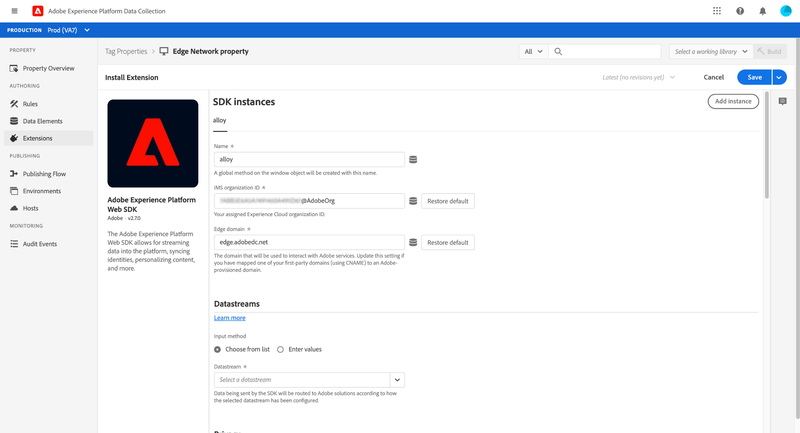
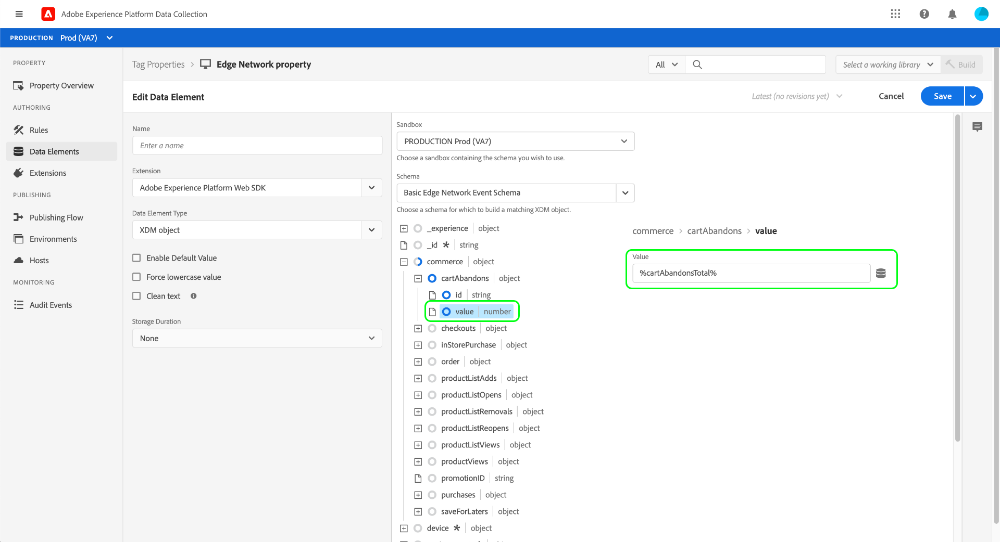
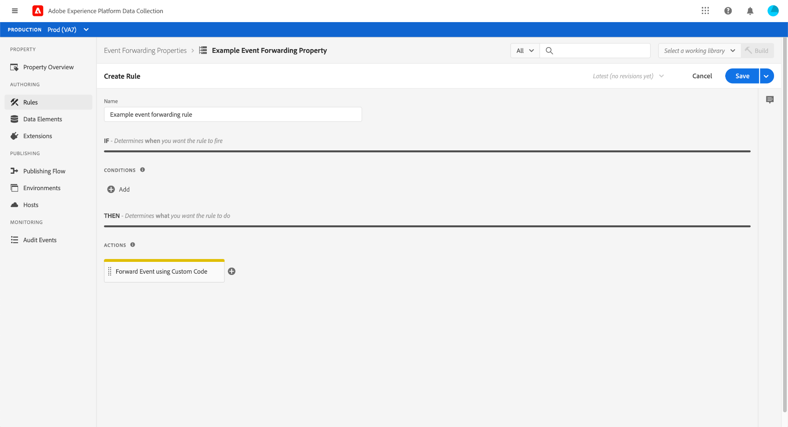

# Visão geral completa da coleta de dados

No Adobe Experience Platform, a coleta de dados se refere a várias tecnologias que trabalham juntas para coletar e transferir seus dados para outros produtos de Adobe ou destinos de terceiros. Para enviar dados de evento do seu aplicativo para a Rede de borda da Adobe Experience Platform, é importante entender essas tecnologias principais e configurá-las para fornecer os dados aos destinos necessários, quando necessário.

Este guia fornece um tutorial de alto nível sobre como enviar um evento por meio da Edge Network usando tecnologias de coleta de dados. Especificamente, o tutorial percorre as etapas de instalação e configuração da extensão de tag do SDK da Web da Adobe Experience Platform na interface do usuário da coleta de dados (antigo Adobe Experience Platform Launch).

>[!NOTE]
>
>Você também pode optar por instalar e configurar o SDK manualmente se não quiser usar tags, mas as etapas subjacentes ainda devem ser concluídas conforme descrito abaixo.

## Pré-requisitos

Este tutorial usa a interface do usuário da coleta de dados para criar um esquema, configurar um conjunto de dados e instalar o SDK da Web. Para executar essas ações na interface do usuário, você deve ter acesso a pelo menos uma propriedade da Web, juntamente com o seguinte [direitos de propriedade](../tags/ui/administration/user-permissions.md#property-rights):

* Desenvolver
* Gerenciar extensões

Consulte o guia sobre [gerenciamento de permissões para tags](../tags/ui/administration/manage-permissions.md) para saber como conceder acesso a propriedades e direitos de propriedade.

Para usar os vários produtos de Coleta de dados mencionados neste guia, você também deve ter acesso aos datastreams e a capacidade de criar e gerenciar schemas. Se você precisar acessar qualquer um desses recursos, entre em contato com seu CSM para ajudá-lo a obter o acesso necessário. Observe que, se você não tiver comprado o Adobe Experience Platform, o Adobe fornecerá o acesso necessário para usar o SDK sem custos adicionais.

Se você já tiver acesso à Platform, deve garantir que tenha o [permissões](../access-control/home.md#permissions) nas seguintes categorias ativadas:

* Modelagem de dados
* Identidades

Consulte a [visão geral da interface do usuário de controle de acesso](../access-control/ui/overview.md) para saber como conceder permissões para recursos da plataforma aos usuários.

## Resumo do processo

O processo de configuração da coleta de dados para seu site pode ser resumido da seguinte maneira:

1. [Criar um esquema](#schema) para determinar como seus dados serão estruturados ao serem enviados para a rede de borda.
1. [Criar um conjunto de dados](#datastream) para configurar para quais destinos você deseja que seus dados sejam enviados.
1. [Instalar e configurar o SDK da Web](#sdk) para enviar dados para o armazenamento de dados quando determinados eventos ocorrerem em seu site.

Depois de poder enviar dados para a Rede de Borda, você também pode, opcionalmente, [configurar o encaminhamento de eventos](#event-forwarding) se sua organização tiver uma licença para isso.

## Criar um esquema {#schema}

[Experience Data Model (XDM)](../xdm/home.md) é uma especificação de fonte aberta que fornece estruturas e definições comuns para dados na forma de schemas. Em outras palavras, o XDM é uma maneira de estruturar e formatar seus dados de uma maneira que seja acionável pela Edge Network e por outros aplicativos da Adobe Experience Cloud.

A primeira etapa na configuração das operações de coleta de dados é criar um esquema XDM para representar seus dados. Em uma etapa posterior deste tutorial, você mapeará os dados que deseja enviar para a estrutura deste schema.

>[!NOTE]
>
>Os esquemas XDM são muito personalizáveis. Em vez de serem excessivamente normativas, as etapas descritas abaixo focam especificamente nos requisitos de esquema do SDK da Web. Fora desses parâmetros, você pode definir a estrutura restante dos seus dados da maneira que desejar.

Na interface do usuário da coleta de dados, selecione **[!UICONTROL Esquemas]** no painel de navegação esquerdo. Aqui, você pode ver uma lista de esquemas criados anteriormente pertencentes à sua organização. Para continuar, selecione **[!UICONTROL Criar esquema]**, em seguida selecione **[!UICONTROL ExperiênciaEvento XDM]** no menu suspenso.


Uma caixa de diálogo é exibida solicitando que você comece a adicionar grupos de campos ao esquema. Para enviar eventos usando o SDK da Web, você deve adicionar o grupo de campos **[!UICONTROL Mistura AEP Web SDK ExperienceEvent]**. Esse grupo de campos contém definições para atributos de dados que são coletados automaticamente pela biblioteca do SDK da Web.

Use a barra de pesquisa para restringir a lista e ajudar a localizar este grupo de campos mais facilmente. Depois de encontrá-lo, selecione-o na lista antes de selecionar **[!UICONTROL Adicionar grupos de campos]**.


A tela do esquema é exibida mostrando uma estrutura em árvore do esquema XDM incluindo os campos fornecidos pelo grupo de campos do SDK da Web.


Selecione o campo raiz na árvore a ser aberta **[!UICONTROL Propriedades do schema]** no painel direito, onde é possível fornecer um nome e uma descrição opcional para o schema.


Para adicionar mais campos ao schema, selecione **[!UICONTROL Adicionar]** nos termos do **[!UICONTROL Grupos de campos]** no painel esquerdo.


>[!NOTE]
>
>Consulte o guia sobre [adição de grupos de campos](../xdm/ui/resources/schemas.md#add-field-groups) na documentação do XDM para obter etapas detalhadas sobre como pesquisar por grupos de campos diferentes para atender aos casos de uso.
>
>A prática recomendada é adicionar apenas campos de dados que você planeja enviar por meio da Edge Network. Depois de adicionar campos a um schema e salvá-lo, somente alterações aditivas podem ser feitas ao schema posteriormente. Consulte a seção sobre o [regras de evolução do schema](../xdm/schema/composition.md#evolution) para obter mais informações.

Depois de ter adicionado os campos necessários, selecione **[!UICONTROL Salvar]** para salvar o schema .


## Criar um fluxo de dados {#datastream}

Um armazenamento de dados é uma configuração que informa à Rede de borda onde deseja que seus dados sejam enviados. Especificamente, um armazenamento de dados especifica para quais produtos do Experience Cloud você deseja enviar os dados e como deseja que eles sejam manipulados e armazenados em cada produto.

>[!NOTE]
>
>Se quiser usar [encaminhamento de eventos](../tags/ui/event-forwarding/overview.md) (supondo que sua organização esteja licenciada para a funcionalidade), você deve habilitá-la para um armazenamento de dados da mesma forma que habilita os produtos Adobe. Os detalhes desse processo são abordados em uma [seção posterior](#event-forwarding).

Na interface do usuário da coleta de dados, selecione **[!UICONTROL Datastreams]**. Aqui, você pode selecionar um armazenamento de dados existente na lista para editar ou criar uma nova configuração selecionando **[!UICONTROL Novo fluxo de dados]**.


Os requisitos de configuração de um armazenamento de dados dependem dos produtos e recursos para os quais você está enviando dados. Para obter informações detalhadas sobre as opções de configuração de cada produto, consulte [visão geral dos datastreams](../edge/fundamentals/datastreams.md).

## Instalar e configurar o SDK da Web {#install}

Depois de criar um esquema e um conjunto de dados, a próxima etapa é instalar e configurar o SDK da Web da plataforma para iniciar o envio de dados para a Edge Network.

>[!NOTE]
>
>Esta seção usa a interface do usuário da Coleta de dados para configurar a extensão de tag do SDK da Web, mas você também pode instalá-la e configurá-la usando o código bruto. Consulte os seguintes guias para obter mais informações:
>
>* [Instalar o SDK](../edge/fundamentals/installing-the-sdk.md)
>* [Configurar o SDK](../edge/fundamentals/configuring-the-sdk.md)
>
>Observe também que, mesmo que você queira usar apenas o encaminhamento de eventos, ainda é necessário instalar e configurar o SDK conforme descrito antes de configurar o encaminhamento de eventos em um [etapa posterior](#event-forwarding).

O processo pode ser resumido da seguinte maneira:

1. [Instalar o SDK da Web do Adobe Experience Platform em uma propriedade de tag](#install-sdk) para obter acesso aos seus recursos.
1. [Criar um elemento de dados do objeto XDM](#data-element) para mapear variáveis no seu site para a estrutura do esquema XDM criado anteriormente.
1. [Criar uma regra](#rule) para informar ao SDK quando ele deve enviar dados para a rede de borda.
1. [Criar e instalar uma biblioteca](#library) para implementar a regra em seu site.

### Instalar o SDK em uma propriedade de tag {#install-sdk}

Selecionar **[!UICONTROL Tags]** no painel de navegação esquerdo para mostrar uma lista de propriedades de tags. Você pode escolher uma propriedade existente para editar, se desejar, ou pode selecionar **[!UICONTROL Nova propriedade]** em vez disso.


Se estiver criando uma nova propriedade, forneça um nome descritivo e defina a variável [!UICONTROL Plataforma] para **[!UICONTROL Web]**. Forneça o domínio completo da propriedade da Web e selecione **[!UICONTROL Salvar]**.


A página de visão geral da propriedade é exibida. Aqui, selecione **[!UICONTROL Extensões]** na navegação à esquerda, selecione **[!UICONTROL Catálogo]**. Encontre a listagem para o SDK da Web da plataforma (opcionalmente usando a barra de pesquisa para restringir os resultados) e selecione **[!UICONTROL Instalar]**.


A página de configuração do SDK é exibida. A maioria dos valores necessários é preenchida automaticamente com padrões que você pode optar por alterar se desejar.



No entanto, antes de poder instalar o SDK, você deve selecionar um armazenamento de dados para que ele saiba para onde enviar seus dados. Em **[!UICONTROL Datastreams]**, use o menu suspenso para selecionar o armazenamento de dados configurado em um [etapa anterior](#datastream). Depois de definir o armazenamento de dados, selecione **[!UICONTROL Salvar]** para concluir a instalação do SDK na propriedade .


### Criar um elemento de dados XDM {#data-element}

Para que o SDK envie dados para a Rede de borda, esses dados devem ser mapeados para o esquema XDM criado em um [etapa anterior](#schema). Esse mapeamento é feito por meio do uso de um elemento de dados.

Na interface do usuário, selecione **[!UICONTROL Elementos de dados]**, em seguida selecione **[!UICONTROL Criar novo elemento de dados]**.


Na próxima tela, selecione **[!UICONTROL Adobe Experience Platform Web SDK]** nos termos do [!UICONTROL Extensão] lista suspensa e selecione **[!UICONTROL Objeto XDM]** para o tipo de elemento de dados.


A caixa de diálogo de configuração é exibida para o tipo de objeto XDM. A caixa de diálogo seleciona automaticamente a sandbox da Platform e, a partir daí, é possível visualizar todos os esquemas que foram criados nessa sandbox. Selecione o esquema XDM criado anteriormente na lista.


A estrutura do schema é exibida. Todos os campos com um asterisco (**\***) indica campos que serão preenchidos automaticamente quando os eventos forem acionados. Para todos os outros campos, é possível explorar a estrutura do schema e preencher o restante dos dados.



>[!NOTE]
>
>A captura de tela acima demonstra como mapear uma variável globalmente acessível do lado do cliente do seu site (`cartAbandonsTotal`) para um campo XDM, fazendo referência ao seu nome na [!UICONTROL Valor] , rodeado por sinais de porcentagem (`%`).
>
>Também é possível usar outros elementos de dados criados anteriormente para preencher esses campos. Consulte a referência em [elementos de dados](../tags/ui/managing-resources/data-elements.md) na documentação das tags para obter mais informações.

Depois de concluir o mapeamento dos dados para o schema, forneça um nome para o elemento de dados antes de selecionar **[!UICONTROL Salvar]**.


### Criar uma regra

Depois de salvar o elemento de dados, a próxima etapa é criar uma regra que o envie para a Edge Network sempre que um determinado evento ocorrer em seu site (como quando um cliente adiciona um produto a um carrinho).

Você pode configurar regras para praticamente qualquer evento que possa ocorrer em seu site. Como exemplo, esta seção mostra como criar uma regra que será acionada quando um cliente enviar um formulário. O HTML a seguir representa uma página da Web simples com um formulário &quot;Adicionar ao carrinho&quot;, que será o assunto da regra:

```html
<!DOCTYPE html>
<html>
<body>

  <form id="add-to-cart-form">
    <label for="item">Product:</label><br>
    <input type="text" id="item" name="item"><br>
    <label for="amount">Amount:</label><br>
    <input type="number" id="amount" name="amount" value="1"><br><br>
    <input type="submit" value="Add to Cart">
  </form> 

</body>
</html>
```

Na interface do usuário da coleta de dados, selecione **[!UICONTROL Regras]** na navegação à esquerda, selecione **[!UICONTROL Criar nova regra]**.


Na próxima tela, forneça um nome para a regra. A partir daqui, o próximo passo é determinar o evento para a regra (em outras palavras, quando a regra será acionada). Selecionar **[!UICONTROL Adicionar]** under [!UICONTROL Eventos].


A página de configuração do evento é exibida. Para configurar um evento, primeiro selecione o tipo de evento. Os tipos de evento são fornecidos por extensões. Para configurar um evento de &quot;envio de formulário&quot;, por exemplo, selecione a variável **[!UICONTROL Núcleo]** e selecione a **[!UICONTROL Enviar]** tipo de evento na variável **[!UICONTROL Formulário]** categoria .

>[!NOTE]
>
>Para obter mais informações sobre os diferentes tipos de eventos fornecidos pelas extensões da Web do Adobe, incluindo como configurá-los, consulte o [Referência de extensões Adobe](../tags/extensions/web/overview.md) na documentação das tags.

O evento de envio de formulário permite usar um [Seletor de CSS](https://www.w3schools.com/css/css_selectors.asp) para fazer referência a um elemento específico para a regra ser ativada. No exemplo abaixo, a ID `add-to-cart-form` é usada para que essa regra seja acionada somente para o formulário &quot;Adicionar ao carrinho&quot;. Selecionar **[!UICONTROL Manter alterações]** para adicionar o evento à regra.


A página de configuração da regra é exibida novamente, mostrando que o evento foi adicionado. Você pode restringir o &quot;[!UICONTROL If]&quot; acrescentando mais condições à regra.

Caso contrário, a próxima etapa é adicionar uma ação que a regra deve executar quando for acionada. Selecionar **[!UICONTROL Adicionar]** under **[!UICONTROL Ações]** para continuar.


A página de configuração da ação é exibida. Para obter a regra para enviar dados para a Rede de Borda, selecione **[!UICONTROL Adobe Experience Platform Web SDK]** para a extensão, e **[!UICONTROL Enviar evento]** para o tipo de ação.


A tela é atualizada para mostrar opções adicionais para configurar a ação enviar evento. Em **[!UICONTROL Tipo]**, é possível fornecer um valor do tipo personalizado para preencher a variável `eventType` Campo XDM. Em **[!UICONTROL Dados XDM]**, forneça o nome do tipo de dados XDM criado anteriormente (rodeado por sinais de porcentagem) ou selecione o ícone do banco de dados () para selecioná-lo em uma lista. Esses são os dados que serão enviados para a Edge Network.

Selecionar **[!UICONTROL Manter alterações]** quando terminar.


Depois de concluir a configuração da regra, selecione **[!UICONTROL Salvar]** para concluir o processo.


### Criar e instalar uma biblioteca {#library}

Depois que a regra for configurada, você estará pronto para adicioná-la a uma biblioteca de tags, criar essa biblioteca em um ambiente e instalá-la em seu site.

>[!NOTE]
>
>Se ainda não tiver configurado um ambiente na interface do usuário da coleta de dados, é necessário fazê-lo antes de criar uma criação. Consulte a seção sobre [configuração de um ambiente para uma propriedade da Web](../tags/ui/publishing/environments.md#web-configuration) na documentação das tags para obter mais informações.

Para saber como criar uma biblioteca, adicionar extensões e regras à biblioteca e criar essa biblioteca em um ambiente, consulte o guia em [gerenciamento de bibliotecas](../tags/ui/publishing/libraries.md) na documentação das tags. Ao criar a biblioteca, inclua a extensão SDK da Web da plataforma e as regras de coleta de dados criadas anteriormente.

Depois de criar a biblioteca e sua build tiver sido atribuída a um ambiente, você poderá instalar esse ambiente no lado do cliente do site. Consulte a seção sobre [instalação de ambientes](../tags/ui/publishing/environments.md#installation) para obter mais informações.

Depois de ter instalado o ambiente em seu site, você pode [testar sua implementação](../tags/ui/publishing/embed-code-testing.md) usando o Adobe Experience Platform Debugger.

## Configurar o encaminhamento de eventos (opcional) {#event-forwarding}

>[!NOTE]
>
>O encaminhamento de eventos só está disponível para organizações que foram licenciadas para ele.

Depois de configurar o SDK para enviar dados à Edge Network, você pode configurar o encaminhamento de eventos para informar à Edge Network onde deseja que os dados sejam entregues.

Para usar o encaminhamento de eventos, primeiro crie uma propriedade de encaminhamento de eventos. Selecionar **[!UICONTROL Encaminhamento de evento]** na navegação à esquerda, selecione **[!UICONTROL Nova propriedade]**. Forneça um nome para a propriedade antes de selecionar **[!UICONTROL Salvar]**.

Depois de criar uma propriedade de encaminhamento de evento, a próxima etapa é criar uma regra que determine para onde os dados devem ser enviados. As regras para propriedades de encaminhamento de eventos são construídas da mesma forma que as propriedades de tags, com a exceção de que nenhum evento pode ser especificado (já que o encaminhamento de eventos lida apenas com eventos que recebe diretamente do conjunto de dados). Para a ação da regra, você pode usar uma das extensões de encaminhamento de eventos disponíveis ou usar o código personalizado para entregar o evento.



Semelhante a antes, depois de configurar a regra, você deve adicioná-la a uma biblioteca e criar essa biblioteca em um ambiente.

Após a conclusão da build, a etapa final é atualizar o armazenamento de dados [configurado anteriormente](#datastream) e ativar o encaminhamento de eventos. Para iniciar, navegue até **[!UICONTROL Datastreams]** e selecione o armazenamento de dados em questão na lista. A partir daqui, ative a alternância para encaminhamento de eventos e forneça os nomes da propriedade e do ambiente que você acabou de configurar.


## Próximas etapas

Este guia forneceu uma visão geral completa de alto nível de como enviar dados para a Edge Network usando o SDK da Web da plataforma. Consulte a documentação vinculada a este guia para obter mais informações sobre os vários componentes e serviços envolvidos.
