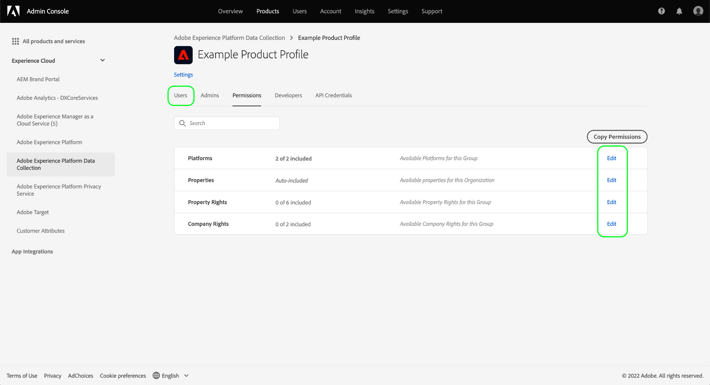
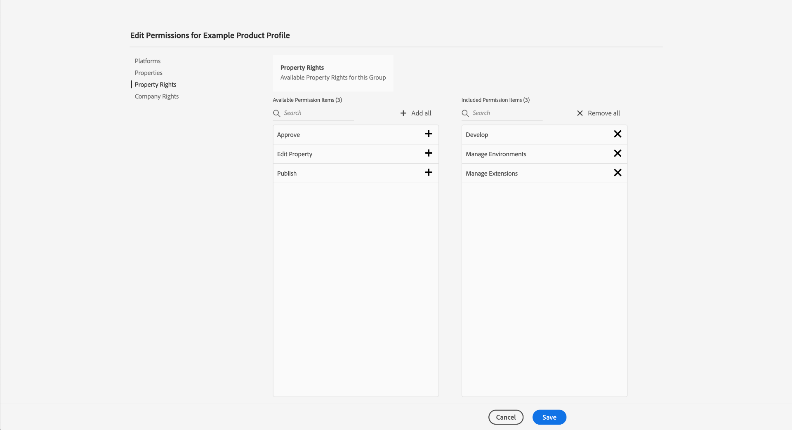
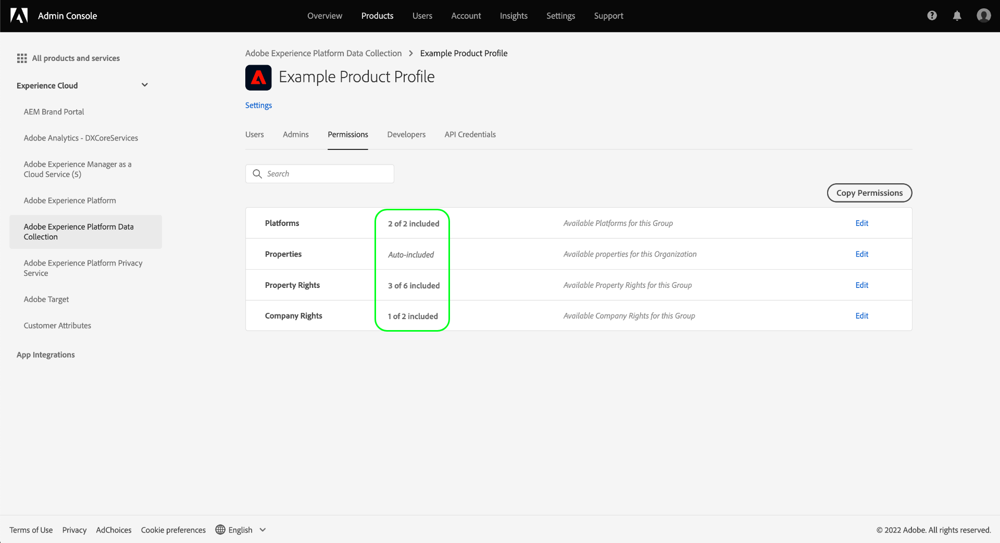

# Gerenciamento de permissões para coleção de dados na Experience Platform {#permission-management}

>[!CONTEXTUALHELP]
>id="platform_tags_permissions"
>title="Permissões"
>abstract="Entenda as principais permissões necessárias para trabalhar com fluxos de dados, esquemas, identidades e sandboxes na Adobe Experience Platform."

[A coleta de dados no Adobe Experience Platform](./home.md) é composta por várias tecnologias diferentes que trabalham juntas para coletar e transferir seus dados. O acesso a essas tecnologias é controlado por meio de permissões granulares baseadas em funções no Adobe Admin Console.

Este guia mostra como gerenciar permissões para recursos de coleção de dados.

## Introdução

Para configurar o controle de acesso para a coleta de dados, é necessário ter privilégios de administrador para uma organização que tenha uma integração de produto com a Coleção de dados da Adobe Experience Platform. A função mínima que pode conceder ou suspender permissões é a de **administrador de perfil de produto**. Outras funções de administrador que podem gerenciar permissões são **administradores de produtos** (pode gerenciar todos os perfis em um produto) e **administradores de sistema** (sem restrições). Consulte o artigo sobre [funções administrativas](https://helpx.adobe.com/br/enterprise/using/admin-roles.html), no manual de administração do Adobe Enterprise, para obter mais informações.

Este manual supõe que você já esteja familiarizado com conceitos básicos do Admin Console, como perfis de produtos, e como eles concedem permissões de produto a usuários individuais e grupos. Para obter mais informações, consulte o [Manual do usuário do Admin Console](https://helpx.adobe.com/br/enterprise/using/admin-console.html).

## Permissões disponíveis

As permissões relevantes para a Coleção de dados são fornecidas por meio de duas designações de produto no Admin Console: **Adobe Experience Platform** e **Coleção de dados do Adobe Experience Platform**. As seções abaixo descrevem as permissões fornecidas em cada produto, juntamente com descrições dos recursos específicos aos quais eles concedem acesso.

### Permissões do Adobe Experience Platform

As permissões no Adobe Experience Platform incluem acesso a sequências de dados, identidades, esquemas e sandboxes. Para obter etapas sobre como configurar permissões do Adobe Experience Platform, consulte o [guia do usuário do controle de acesso](../access-control/ui/overview.md).

| Categoria | Permissão | Descrição |
| --- | --- | --- |
| Sandboxes | (N/D) | Dependendo das [sandboxes](../sandboxes/home.md) que foram criadas em sua organização, você pode controlar o acesso a cada uma delas por meio desta categoria de permissão no Admin Console. |
| Modelagem de dados | Gerenciar esquemas | Concede a capacidade de exibir, criar e editar [esquemas do Experience Data Model (XDM)](../xdm/home.md). |
| Modelagem de dados | Exibir esquemas | Concede acesso somente leitura a esquemas. |
| Identity Management | Gerenciar namespaces de identidade | Concede a capacidade de exibir, criar e editar [namespaces de identidade](../identity-service/features/namespaces.md). |
| Identity Management | Exibir namespaces de identidade | Concede acesso somente leitura a namespaces de identidade. |
| Coleção de dados | Gerenciar fluxos de dados | Concede a capacidade de exibir, criar e editar [sequências de dados](../datastreams/overview.md). |
| Coleção de dados | Exibir fluxos de dados | Concede acesso somente leitura a sequências de dados. |

{style="table-layout:auto"}

### Permissões de coleção de dados do Adobe Experience Platform

As permissões em Coleta de dados da Adobe Experience Platform controlam o acesso a recursos de encaminhamento de tags e eventos, incluindo propriedades, extensões e ambientes. Para obter etapas sobre como configurar permissões de Coleta de dados do Adobe Experience Platform, consulte a [seção abaixo](#manage).

| Categoria | Permissão | Descrição |
| --- | --- | --- |
| Plataformas | Web | Concede acesso a [propriedades da Web](../tags/ui/administration/companies-and-properties.md) quando combinado com outros direitos de propriedade. |
| Plataformas | Dispositivo móvel | Concede acesso a [propriedades móveis](../tags/ui/administration/companies-and-properties.md) quando combinado com outros direitos de propriedade. |
| Plataformas | Edge | Concede acesso às [propriedades do Edge para encaminhamento de eventos](../tags/ui/event-forwarding/getting-started.md) quando combinadas com outros direitos de propriedade. |
| Propriedades | (N/D) | Dependendo das propriedades criadas em sua organização, você pode controlar o acesso a cada uma delas por meio desta categoria de permissão no Admin Console.  Os direitos de propriedade atribuídos a um usuário se aplicam apenas às propriedades às quais ele recebeu acesso por meio desta categoria de permissão. |
| Direitos de propriedade | Aprovar | Concede a capacidade de aprovar uma build de biblioteca como parte do [fluxo de publicação](../tags/ui/publishing/publishing-flow.md). |
| Direitos de propriedade | Desenvolver | Concede a capacidade de desenvolver uma build de biblioteca como parte do [fluxo de publicação](../tags/ui/publishing/publishing-flow.md). |
| Direitos de propriedade | Editar propriedade | Concede a capacidade de editar a configuração básica das propriedades às quais um usuário tem acesso. |
| Direitos de propriedade | Gerenciar ambientes | Concede a capacidade de gerenciar os [ambientes](../tags/ui/publishing/environments.md) das propriedades às quais um usuário tem acesso. |
| Direitos de propriedade | Gerenciar extensões | Concede a capacidade de gerenciar as [extensões](../tags/ui/managing-resources/extensions/overview.md) das propriedades às quais um usuário tem acesso. |
| Direitos de propriedade | Publicação | Concede a capacidade de publicar uma build de biblioteca como parte do [fluxo de publicação](../tags/ui/publishing/publishing-flow.md). |
| Direitos da empresa | Desenvolver extensões | Concede a capacidade de criar e modificar pacotes de extensão de propriedade de sua organização, incluindo versões privadas e solicitações de lançamento de versão pública. |
| Direitos da empresa | Gerenciar configurações do aplicativo | Essa permissão só é aplicável se você tiver uma licença do Adobe Journey Optimizer ou outra solução que conceda acesso a mensagens móveis no aplicativo e por push. Isso permite gerenciar os aplicativos que o Adobe Experience Cloud conhece, juntamente com as credenciais de push necessárias para se comunicar com o serviço Firebase Cloud Messaging e o serviço Apple Push Notification. |
| Direitos da empresa | Gerenciar propriedades | Concede a capacidade de criar e gerenciar tags (propriedade da Web), encaminhamento de eventos (propriedade de borda) e propriedades móveis. |

{style="table-layout:auto"}

>[!NOTE]
>
>Para obter mais informações sobre como essas permissões afetam os recursos nas tags, incluindo estratégias administrativas para cenários comuns, consulte a documentação das tags em [permissões de usuário](../tags/ui/administration/user-permissions.md).

## Gerenciar permissões {#manage}

As permissões para coleta de dados são gerenciadas por meio de duas designações de produto: **Adobe Experience Platform** e **Coleção de dados da Adobe Experience Platform**.

Consulte as subseções abaixo para obter as etapas sobre como gerenciar as permissões relevantes em cada produto no Admin Console:

* [Permissões do Adobe Experience Platform](#manage-platform)
* [Permissões de coleção de dados do Adobe Experience Platform](#manage-collection)

### Gerenciar permissões no Adobe Experience Platform {#manage-platform}

>[!NOTE]
>
>Para gerenciar permissões para uma função, serão necessários direitos de administrador. Se você não tiver privilégios de administrador, entre em contato com o administrador do sistema.

A seção **[!UICONTROL Permissions]** da Experience Cloud permite definir funções e políticas de usuário para gerenciar o acesso a recursos e objetos em um aplicativo de produto.

Através do [!UICONTROL Permissions], você pode criar e gerenciar funções e atribuir as permissões de recurso desejadas para essas funções.

Para acessar os recursos de coleção de dados, você deve habilitar todas as permissões nas categorias **[!UICONTROL Sandboxes]**, **[!UICONTROL Data Modeling]**, **[!UICONTROL Identity Management]** e **[!UICONTROL Data Collection]**.

Consulte o [guia da interface do usuário de controle de acesso](../access-control/ui/overview.md) para obter instruções detalhadas sobre como gerenciar permissões do Experience Platform.

>[!NOTE]
>
>Dependendo das SKUs do produto às quais sua organização tem acesso, talvez você não tenha todas as permissões do Experience Platform disponíveis.

### Gerenciar permissões na Coleção de dados da Adobe Experience Platform {#manage-collection}

Para gerenciar essas permissões, faça logon no Admin Console, selecione **[!UICONTROL Products]** na navegação superior e selecione **[!UICONTROL Adobe Experience Platform Data Collection]**.

#### Selecionar ou criar um perfil de produto

A próxima tela mostra uma lista de perfis de produto disponíveis para a Coleção de dados em sua organização. O perfil padrão é **[!DNL Default Data Collection All Access]**. Você pode optar por editar o perfil de produto padrão, se desejar, ou pode selecionar **[!UICONTROL New Profile]** para criar um. Se possuir várias funções ou grupos de usuários em sua organização que precisam de diferentes níveis de acesso, crie um perfil de produto separado para cada um deles.

Depois de selecionar ou criar um perfil de produto, você pode usar os ícones **[!UICONTROL Edit]** para iniciar a edição de [permissões](#edit-permissions) para o perfil ou selecionar a guia **[!UICONTROL Users]** para iniciar a atribuição de [usuários](#assign-users) ao perfil.

#### Editar permissões para o perfil de produto {#edit-permissions}

Ao editar as permissões de um perfil, as permissões disponíveis são listadas na coluna à esquerda e as permissões incluídas no perfil são listadas na coluna à direita. Selecione as permissões listadas para movê-las entre as duas colunas.

As permissões são organizadas em categorias. Para alternar entre categorias, selecione a categoria desejada na painel de navegação à esquerda.

Selecione **[!UICONTROL Save]** quando terminar de configurar as permissões.

A visualização do perfil de produto será exibida novamente com as permissões adicionadas.

#### Atribuir usuários ao perfil de produto {#assign-users}

Para atribuir usuários ao perfil de produto (e conceder a eles as permissões configuradas do perfil), selecione a guia **[!UICONTROL Users]**, seguida de **[!UICONTROL Add user]**.

Para obter mais informações sobre como gerenciar usuários em um perfil de produto, consulte a [Documentação do Admin Console](https://helpx.adobe.com/br/enterprise/using/manage-product-profiles.html).

## Próximas etapas

Este guia abordou as permissões disponíveis para a Coleção de dados e como gerenciá-las por meio do Admin Console. Para obter mais informações sobre como gerenciar as permissões para outros recursos da Adobe Experience Platform, consulte a [documentação de controle de acesso](../access-control/home.md).
