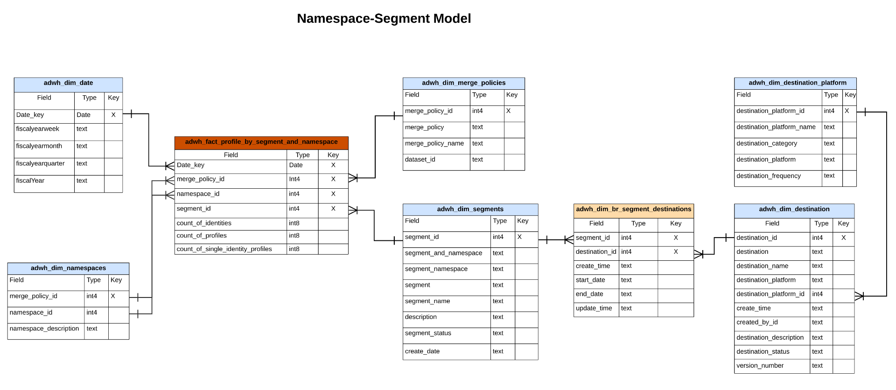

# Modelo de dados do Real-time Customer Data Platform Insights

O recurso Modelo de dados do Real-time Customer Data Platform Insights expõe os modelos de dados e o SQL que alimenta os insights de vários perfis, destinos e widgets de segmentação. Você pode personalizar esses modelos de consulta SQL para criar relatórios do Real-Time CDP para seus casos de uso de KPI (indicador de desempenho principal) e de marketing. Esses insights podem ser usados como widgets personalizados para seus painéis definidos pelo usuário. Consulte a documentação de insights de relatório de loja acelerada de query para saber mais [como criar um modelo de dados de insights de relatórios por meio do Serviço de query para uso com dados de armazenamento acelerados e painéis definidos pelo usuário](../query-service/query-accelerated-store/reporting-insights-data-model.md).

## Pré-requisitos

Este guia requer um entendimento prático do [recurso de painéis definidos pelo usuário](./user-defined-dashboards.md). Leia a documentação antes de continuar com este guia.

## Relatórios e casos de uso do Real-Time CDP Insight

Os relatórios do Real-Time CDP fornecem informações sobre seus dados de perfil e seu relacionamento com segmentos e destinos. Vários modelos de esquema de estrela foram desenvolvidos para responder a uma variedade de casos de uso de marketing comuns e cada modelo de dados pode suportar vários casos de uso.

>[!IMPORTANT]
>
>Os dados usados para os relatórios do Real-Time CDP são precisos para uma política de mesclagem escolhida e do instantâneo diário mais recente.

### Modelo de perfil {#profile-model}

O modelo de perfil é composto de três conjuntos de dados:

- `adwh_dim_date`
- `adwh_fact_profile`
- `adwh_dim_merge_policies`

A imagem abaixo contém os campos de dados relevantes em cada conjunto de dados.


#### Caso de uso de contagem de perfis

A lógica usada para o widget de contagem de perfis retorna o número total de perfis mesclados na Loja de perfis no momento em que o instantâneo foi tirado. Consulte a [[!UICONTROL Contagem de perfis] documentação do widget](./guides/profiles.md#profile-count) para obter mais informações.

O SQL que gera a variável [!UICONTROL Contagem de perfis] O widget é visto na seção que pode ser recolhida abaixo.

consulta +++SQL

```sql
SELECT adwh_dim_merge_policies.merge_policy_name,
  sum(adwh_fact_profile.count_of_profiles) CNT
FROM qsaccel.profile_agg.adwh_fact_profile
LEFT OUTER JOIN qsaccel.profile_agg.adwh_dim_merge_policies ON adwh_dim_merge_policies.merge_policy_id=adwh_fact_profile.merge_policy_id
WHERE adwh_fact_profile.date_key='${lastProcessDate}'
AND adwh_fact_profile.merge_policy_id=${mergePolicyId}
GROUP BY adwh_dim_merge_policies.merge_policy_name;
```

+++

#### Caso de uso de Perfis de identidade únicos

A lógica usada para a variável [!UICONTROL Perfis de identidade única] O widget fornece uma contagem dos perfis de sua organização que têm apenas um tipo de ID que cria sua identidade. Consulte a[[!UICONTROL Perfis de identidade única] documentação do widget](./guides/profiles.md#single-identity-profiles) para obter mais informações.

O SQL que gera a variável [!UICONTROL Perfis de identidade única] O widget é visto na seção que pode ser recolhida abaixo.

consulta +++SQL

```sql
SELECT adwh_dim_merge_policies.merge_policy_name,
  sum(adwh_fact_profile.count_of_Single_Identity_profiles) CNT
FROM QSAccel.profile_agg.adwh_fact_profile
LEFT OUTER JOIN QSAccel.profile_agg.adwh_dim_merge_policies ON adwh_dim_merge_policies.merge_policy_id=adwh_fact_profile.merge_policy_id
WHERE adwh_fact_profile.date_key='${lastProcessDate}'
  AND adwh_fact_profile.merge_policy_id =${mergePolicyId}
GROUP BY adwh_dim_merge_policies.merge_policy_name;
```

+++

### Modelo de namespace {#namespace-model}

O modelo de namespace é composto dos seguintes conjuntos de dados:

- `adwh_fact_profile_by_namespace`
- `adwh_dim_date`
- `adwh_dim_namespaces`
- `adwh_dim_merge_policies`

A imagem abaixo contém os campos de dados relevantes em cada conjunto de dados.


#### Perfis por caso de uso de identidade

O [!UICONTROL Perfis por identidade] O widget exibe o detalhamento das identidades em todos os perfis mesclados na Loja de perfis. Consulte a [[!UICONTROL Perfis por identidade] documentação do widget](./guides/profiles.md#profiles-by-identity) para obter mais informações.

O SQL que gera a variável [!UICONTROL Perfis por identidade] O widget é visto na seção que pode ser recolhida abaixo.

consulta +++SQL

```sql
SELECT adwh_dim_namespaces.namespace_description,
    sum(adwh_fact_profile_by_namespace.count_of_profiles) count_of_profiles
FROM qsaccel.profile_agg.adwh_fact_profile_by_namespace
JOIN qsaccel.profile_agg.adwh_dim_namespaces ON adwh_fact_profile_by_namespace.namespace_id = adwh_dim_namespaces.namespace_id
AND adwh_fact_profile_by_namespace.merge_policy_id = adwh_dim_namespaces.merge_policy_id
WHERE adwh_fact_profile_by_namespace.merge_policy_id =${mergePolicyId}
AND adwh_fact_profile_by_namespace.date_key = '${lastProcessDate}'
GROUP BY adwh_fact_profile_by_namespace.date_key,
        adwh_fact_profile_by_namespace.merge_policy_id,
        adwh_dim_namespaces.namespace_description
ORDER BY count_of_profiles DESC
LIMIT 5;
```

+++

#### Perfis de identidade únicos por caso de uso de identidade

A lógica usada para a variável [!UICONTROL Perfis de identidade únicos por identidade] O widget ilustra o número total de perfis identificados com apenas um único identificador exclusivo. Consulte a [Perfis de identidade única por documentação do widget de identidade](./guides/profiles.md#single-identity-profiles-by-identity) para obter mais informações.

O SQL que gera a variável [!UICONTROL Perfis de identidade únicos por identidade] O widget é visto na seção que pode ser recolhida abaixo.

consulta +++SQL

```sql
SELECT
  adwh_dim_namespaces.namespace_description,
  sum(adwh_fact_profile_by_namespace.count_of_Single_Identity_profiles) count_of_Single_Identity_profiles
FROM
  qsaccel.profile_agg.adwh_fact_profile_by_namespace
  LEFT OUTER JOIN
    qsaccel.profile_agg.adwh_dim_namespaces
    ON adwh_fact_profile_by_namespace.namespace_id = adwh_dim_namespaces.namespace_id
AND adwh_fact_profile_by_namespace.merge_policy_id = adwh_dim_namespaces.merge_policy_id
WHERE
  adwh_fact_profile_by_namespace.merge_policy_id=${mergePolicyId}
  AND adwh_fact_profile_by_namespace.date_key='${lastProcessDate}'
GROUP BY
  adwh_fact_profile_by_namespace.date_key,
  adwh_fact_profile_by_namespace.merge_policy_id,
  adwh_dim_namespaces.namespace_description;
```

+++

### Modelo de segmento {#segment-model}

O modelo de segmento é composto pelos seguintes conjuntos de dados:

- `adwh_dim_date`
- `adwh_dim_merge_policies`
- `adwh_dim_segments`
- `adwh_fact_profile_by_segment`
- `adwh_dim_br_segment_destinations`
- `adwh_dim_destination`
- `adwh_dim_destination_platform`

A imagem abaixo contém os campos de dados relevantes em cada conjunto de dados.


#### Caso de uso de tamanho de público-alvo

A lógica usada para a variável [!UICONTROL Tamanho do público-alvo] o widget retorna o número total de perfis mesclados no segmento selecionado no momento do instantâneo mais recente. Consulte a [[!UICONTROL Tamanho do público-alvo] documentação do widget](./guides/segments.md#audience-size) para obter mais informações.

O SQL que gera a variável [!UICONTROL Tamanho do público-alvo] O widget é visto na seção que pode ser recolhida abaixo.

consulta +++SQL

```sql
SELECT adwh_fact_profile_by_segment.date_key,
       adwh_dim_merge_policies.merge_policy_name,
       adwh_dim_segments.segment,
       adwh_dim_segments.segment_name,
       sum(adwh_fact_profile_by_segment.count_of_profiles)count_of_profiles
FROM qsaccel.profile_agg.adwh_fact_profile_by_segment
LEFT OUTER JOIN qsaccel.profile_agg.adwh_dim_segments ON adwh_fact_profile_by_segment.segment_id = adwh_dim_segments.segment_id
LEFT OUTER JOIN qsaccel.profile_agg.adwh_dim_merge_policies ON adwh_fact_profile_by_segment.merge_policy_id=adwh_dim_merge_policies.merge_policy_id
WHERE adwh_fact_profile_by_segment.date_key ='${lastProcessDate}'
  AND adwh_fact_profile_by_segment.merge_policy_id=${mergePolicyId}
GROUP BY adwh_fact_profile_by_segment.date_key,
         adwh_dim_merge_policies.merge_policy_name,
         adwh_dim_segments.segment,
         adwh_dim_segments.segment_name
ORDER BY count_of_profiles DESC
LIMIT 20;
```

+++

#### Caso de uso de tendência de alteração de tamanho de público-alvo

A lógica usada para a variável [!UICONTROL Tendência de alteração do tamanho do público-alvo] O widget fornece um gráfico de linhas que ilustra a diferença no número total de perfis que se qualificaram para um determinado segmento entre os instantâneos diários mais recentes. Consulte a [[!UICONTROL Tendência de alteração do tamanho do público-alvo] documentação do widget](./guides/segments.md#audience-size-change-trend) para obter mais informações.

O SQL que gera a variável [!UICONTROL Tendência de alteração do tamanho do público-alvo] O widget é visto na seção que pode ser recolhida abaixo.

consulta +++SQL

```sql
SELECT DISTINCT cast(adwh_dim_segments.create_date AS Date) Date_key, adwh_dim_merge_policies.merge_policy_name,
  count(DISTINCT adwh_dim_segments.segment_id)Segments_Added
FROM qsaccel.profile_agg.adwh_fact_profile_by_segment
JOIN qsaccel.profile_agg.adwh_dim_segments ON adwh_fact_profile_by_segment.segment_id = adwh_dim_segments.segment_id
JOIN qsaccel.profile_agg.adwh_dim_merge_policies ON adwh_fact_profile_by_segment.merge_policy_id=adwh_dim_merge_policies.merge_policy_id
WHERE Cast(adwh_dim_segments.create_date AS date) >= dateadd(DAY, - ${dayRange}, '${lastProcessDate}')
AND adwh_fact_profile_by_segment.merge_policy_id=${mergePolicyId}
GROUP BY cast(adwh_dim_segments.create_date AS date), adwh_dim_merge_policies.merge_policy_name ;
```

+++

#### Caso de uso de destinos mais usados

A lógica usada na variável [!UICONTROL Destinos mais usados] O widget lista os destinos mais usados de sua organização de acordo com o número de segmentos mapeados para eles. Essa classificação fornece informações sobre quais destinos estão sendo utilizados, além de mostrar potencialmente aqueles que podem ser subutilizados. Consulte a documentação no [[!UICONTROL Destinos mais usados] widget](./guides/destinations.md#most-used-destinations) para obter mais informações.

O SQL que gera a variável [!UICONTROL Destinos mais usados] O widget é visto na seção que pode ser recolhida abaixo.

consulta +++SQL

```sql
SELECT
   adwh_dim_destination.destination_name, adwh_dim_destination.destination_id,
   count( distinct adwh_dim_br_segment_destinations.segment_id ) segment_count
FROM
   qsaccel.profile_agg.adwh_dim_destination
   join qsaccel.profile_agg.adwh_dim_br_segment_destinations
 ON
   adwh_dim_destination.destination_id = adwh_dim_br_segment_destinations.destination_id
 WHERE
   adwh_dim_destination.destination_name is not null
 group by
   adwh_dim_destination.destination_name,
   adwh_dim_destination.destination_id
   order by segment_count desc limit 5;
```

+++

#### Caso de uso de segmentos ativados recentemente

A lógica da [!UICONTROL Segmentos ativados recentemente] fornece uma lista dos segmentos mapeados mais recentemente para um destino. Esta lista fornece um instantâneo dos segmentos e destinos que estão sendo usados ativamente no sistema e pode ajudar na solução de problemas de mapeamentos incorretos. Consulte a [[!UICONTROL Segmentos ativados recentemente] documentação do widget](./guides/destinations.md#recently-activated-segments) para obter mais informações.

O SQL que gera a variável [!UICONTROL Segmentos ativados recentemente] O widget é visto na seção que pode ser recolhida abaixo.

consulta +++SQL

```sql
SELECT segment_name, segment, destination_name, a.create_time create_time
FROM qsaccel.profile_agg.adwh_dim_br_segment_destinations a
INNER JOIN qsaccel.profile_agg.adwh_dim_segments b ON a.segment_id = b.segment_id
INNER JOIN qsaccel.profile_agg.adwh_dim_destination c ON a.destination_id = c.destination_id
ORDER BY create_time desc, segment LIMIT 5;
```

+++

### Modelo de segmento de namespace

O modelo namespace-segment é composto pelos seguintes conjuntos de dados:

- `adwh_dim_date`
- `adwh_dim_merge_policies`
- `adwh_dim_namespaces`
- `adwh_fact_profile_by_segment_and_namespace`
- `adwh_dim_segments`
- `adwh_dim_br_segment_destinations`
- `adwh_dim_destination`
- `adwh_dim_destination_platform`

A imagem abaixo contém os campos de dados relevantes em cada conjunto de dados.



#### Perfis por identidade para um caso de uso de segmento

A lógica usada na variável [!UICONTROL Perfis por identidade] O widget fornece um detalhamento de identidades em todos os perfis mesclados na Loja de perfis para um determinado segmento. Consulte a [[!UICONTROL Perfis por identidade] documentação do widget](./guides/segments.md#profiles-by-identity) para obter mais informações.

O SQL que gera a variável [!UICONTROL Perfis por identidade] O widget é visto na seção que pode ser recolhida abaixo.

consulta +++SQL

```sql
SELECT adwh_dim_namespaces.namespace_description,
  sum( adwh_fact_profile_by_segment_and_namespace.count_of_profiles) count_of_profiles
FROM qsaccel.profile_agg.adwh_fact_profile_by_segment_and_namespace
LEFT OUTER JOIN qsaccel.profile_agg.adwh_dim_namespaces
ON adwh_fact_profile_by_segment_and_namespace.namespace_id = adwh_dim_namespaces.namespace_id
AND adwh_fact_profile_by_segment_and_namespace.merge_policy_id = adwh_dim_namespaces.merge_policy_id
WHERE adwh_fact_profile_by_segment_and_namespace.segment_id = {segment_id}
AND adwh_fact_profile_by_segment_and_namespace.merge_policy_id = {merge_policy_id}
AND adwh_fact_profile_by_segment_and_namespace.date_key = '{date}'
GROUP BY adwh_dim_namespaces.namespace_description;
```

+++

### Modelo de namespace de sobreposição

O modelo de namespace de sobreposição é composto pelos seguintes conjuntos de dados:

- `adwh_dim_date`
- `adwh_dim_namespaces`
- `adwh_fact_profile_overlap_of_namespace`
- `adwh_dim_merge_policies`

A imagem abaixo contém os campos de dados relevantes em cada conjunto de dados.


#### Caso de uso de sobreposição de identidade (perfis)

A lógica usada na variável [!UICONTROL Sobreposição de identidade] o widget exibe a sobreposição de perfis em seu **Loja de perfis** que contêm as duas identidades selecionadas. Para obter mais informações, consulte o [[!UICONTROL Sobreposição de identidade] seção de widget do [!UICONTROL Perfis] documentação do painel](./guides/profiles.md#identity-overlap).

O SQL que gera a variável [!UICONTROL Sobreposição de identidade] O widget é visto na seção que pode ser recolhida abaixo.

consulta +++SQL

```sql
SELECT Sum(overlap_col1) overlap_col1,
       Sum(overlap_col2) overlap_col2,
       coalesce(Sum(overlap_count), 0) overlap_count
  FROM
    (SELECT 0 overlap_col1,
            0 overlap_col2,
            Sum(count_of_profiles) overlap_count
     FROM qsaccel.profile_agg.adwh_fact_profile_overlap_of_namespace
     WHERE adwh_fact_profile_overlap_of_namespace.merge_policy_id = ${mergePolicyId}
       AND adwh_fact_profile_overlap_of_namespace.date_key = '${lastProcessDate}'
       AND adwh_fact_profile_overlap_of_namespace.overlap_id IN
         (SELECT adwh_dim_overlap_namespaces.overlap_id
          FROM qsaccel.profile_agg.adwh_dim_overlap_namespaces
          WHERE adwh_dim_overlap_namespaces.merge_policy_id=${mergePolicyId}
            AND adwh_dim_overlap_namespaces.overlap_namespaces IN ('${namespace1}',
                                                                   '${namespace2}')
          GROUP BY adwh_dim_overlap_namespaces.overlap_id
          HAVING Count(*) > 1)
     UNION ALL SELECT count_of_profiles overlap_col1,
                      0 overlap_col2,
                      0 overlap_count
     FROM qsaccel.profile_agg.adwh_fact_profile_by_namespace
     JOIN qsaccel.profile_agg.adwh_dim_namespaces ON
     adwh_fact_profile_by_namespace.namespace_id = adwh_dim_namespaces.namespace_id
     AND adwh_fact_profile_by_namespace.merge_policy_id = adwh_dim_namespaces.merge_policy_id
     WHERE adwh_fact_profile_by_namespace.merge_policy_id = ${mergePolicyId}
       AND adwh_fact_profile_by_namespace.date_key = '${lastProcessDate}'
       AND adwh_dim_namespaces.namespace_description = '${namespace1}'
     UNION ALL SELECT 0 overlap_col1,
                      count_of_profiles overlap_col2,
                      0 Overlap_count
     FROM qsaccel.profile_agg.adwh_fact_profile_by_namespace
     JOIN qsaccel.profile_agg.adwh_dim_namespaces ON
     adwh_fact_profile_by_namespace.namespace_id = adwh_dim_namespaces.namespace_id
     AND adwh_fact_profile_by_namespace.merge_policy_id = adwh_dim_namespaces.merge_policy_id
     WHERE adwh_fact_profile_by_namespace.merge_policy_id = ${mergePolicyId}
       AND adwh_fact_profile_by_namespace.date_key = '${lastProcessDate}'
       AND adwh_dim_namespaces.namespace_description = '${namespace2}' ) a;
```

+++

### Sobrepor namespace por modelo de segmento

O namespace de sobreposição por modelo de segmento é composto pelos seguintes conjuntos de dados:

- `adwh_dim_date`
- `adwh_dim_namespaces`
- `adwh_fact_profile_overlap_of_namespace_by_segment`
- `adwh_dim_merge_policies`
- `adwh_dim_segments`
- `adwh_dim_br_segment_destinations`
- `adwh_dim_destination`
- `adwh_dim_destination_platform`

A imagem abaixo contém os campos de dados relevantes em cada conjunto de dados.


#### Caso de uso de sobreposição de identidade (segmentos)

A lógica usada na variável [!UICONTROL Segmentos] painel [!UICONTROL Sobreposição de identidade] O widget ilustra a sobreposição de perfis que contêm as duas identidades selecionadas para um segmento específico. Para obter mais informações, consulte o [[!UICONTROL Sobreposição de identidade] seção de widget do [!UICONTROL Segmentação] documentação do painel](./guides/segments.md#identity-overlap).

O SQL que gera a variável [!UICONTROL Sobreposição de identidade] O widget é visto na seção que pode ser recolhida abaixo.

consulta +++SQL

```sql
SELECT
   Sum(overlap_col1) overlap_col1,
   Sum( overlap_col2) overlap_col2,
   Sum(overlap_count) Overlap_count
FROM
   (
      SELECT
         0 overlap_col1,
         0 overlap_col2,
         Sum(count_of_profiles) Overlap_count
      FROM
         qsaccel.profile_agg.adwh_fact_profile_overlap_of_namespace_by_segment
      WHERE
         adwh_fact_profile_overlap_of_namespace_by_segment.segment_id = $ {segmentId}
         and adwh_fact_profile_overlap_of_namespace_by_segment.merge_policy_id =$ {mergePolicyId}
         and adwh_fact_profile_overlap_of_namespace_by_segment.date_key = '${lastProcessDate}'
         and adwh_fact_profile_overlap_of_namespace_by_segment.overlap_id IN
         (
            SELECT
               adwh_dim_overlap_namespaces.overlap_id
            FROM
               qsaccel.profile_agg.adwh_dim_overlap_namespaces
            WHERE
               adwh_dim_overlap_namespaces.merge_policy_id =$ {mergePolicyId}
               AND adwh_dim_overlap_namespaces.overlap_namespaces IN
               (
                  '${namespace1}',
                  '${namespace2}'
               )
            GROUP BY
               adwh_dim_overlap_namespaces.overlap_id
            HAVING
               Count(*) > 1
         )
      UNION ALL
      SELECT
         count_of_profiles overlap_col1,
         0 overlap_col2,
         0 Overlap_count
      FROM
         qsaccel.profile_agg.adwh_fact_profile_by_segment_and_namespace
         LEFT OUTER JOIN
            qsaccel.profile_agg.adwh_dim_namespaces
            ON adwh_fact_profile_by_segment_and_namespace.namespace_id = adwh_dim_namespaces.namespace_id
            and adwh_fact_profile_by_segment_and_namespace.merge_policy_id = adwh_dim_namespaces.merge_policy_id
      WHERE
         adwh_dim_namespaces.namespace_description = '${namespace1}'
         and adwh_fact_profile_by_segment_and_namespace.segment_id = $ {segmentId}
         and adwh_fact_profile_by_segment_and_namespace.merge_policy_id =$ {mergePolicyId}
         and adwh_fact_profile_by_segment_and_namespace.date_key = '${lastProcessDate}'
      UNION ALL
      SELECT
         0 overlap_col1,
         count_of_profiles overlap_col2,
         0 Overlap_count
      FROM
         qsaccel.profile_agg.adwh_fact_profile_by_segment_and_namespace
         LEFT OUTER JOIN
            qsaccel.profile_agg.adwh_dim_namespaces
            ON adwh_fact_profile_by_segment_and_namespace.namespace_id = adwh_dim_namespaces.namespace_id
            and adwh_fact_profile_by_segment_and_namespace.merge_policy_id = adwh_dim_namespaces.merge_policy_id
      WHERE
         adwh_dim_namespaces.namespace_description = '${namespace2}'
         and adwh_fact_profile_by_segment_and_namespace.segment_id = $ {segmentId}
         and adwh_fact_profile_by_segment_and_namespace.merge_policy_id =$ {mergePolicyId}
         and adwh_fact_profile_by_segment_and_namespace.date_key = '${lastProcessDate}'
   )
   a;
```

+++
