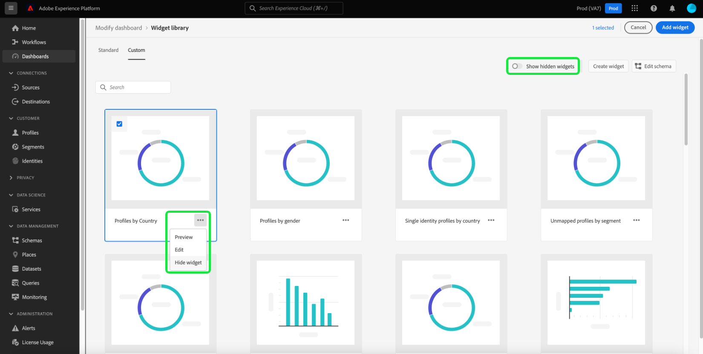

# Criação de widgets personalizados para painéis

No Adobe Experience Platform, você pode visualizar e interagir com os dados de sua organização usando vários painéis. Você também pode atualizar determinados painéis adicionando novos widgets à visualização do painel. Além dos widgets padrão fornecidos pelo Adobe, você também pode criar widgets personalizados e compartilhá-los em toda a organização.

Este guia fornece instruções passo a passo para criar e adicionar widgets personalizados aos painéis [!UICONTROL Perfis], [!UICONTROL Segmentos] e [!UICONTROL Destinos] na interface do usuário da plataforma.

Para saber mais sobre widgets padrão, consulte o guia para [adicionar widgets padrão a seus painéis](standard-widgets.md).

>[!NOTE]
>
>Os widgets mostrados no painel de uso da licença [!UICONTROL Não podem ser personalizados. ] Para saber mais sobre esse painel exclusivo, leia a [documentação do painel de uso da licença](../guides/license-usage.md).

## Biblioteca de widgets {#widget-library}

Este guia requer acesso à [!UICONTROL biblioteca de widgets] no Experience Platform. Para saber mais sobre a biblioteca de widgets e como acessá-la na interface do usuário, comece lendo a [visão geral da biblioteca de widgets](widget-library.md).

## Introdução aos widgets personalizados

Na biblioteca de widgets, a guia **[!UICONTROL Custom]** permite criar widgets e compartilhá-los com outros usuários na organização para personalizar a aparência dos painéis.

>[!IMPORTANT]
>
>Sua organização pode criar no máximo 20 widgets personalizados na biblioteca de widgets.

Selecione a guia **[!UICONTROL Personalizado]** para começar a criar widgets personalizados ou exibir widgets personalizados que sua organização já criou.

## Criar um widget personalizado

Para criar um widget personalizado, selecione **[!UICONTROL Criar widget]** no canto superior direito da biblioteca de widgets ou, se esse for o primeiro widget personalizado de sua organização, selecione **[!UICONTROL Criar]** no centro da biblioteca de widgets.

Na caixa de diálogo **[!UICONTROL Criar widget]**, forneça um título e uma descrição para o novo widget e escolha o atributo que deseja que o widget exiba.

>[!NOTE]
>
>A lista de atributos disponíveis depende do esquema que foi configurado para sua organização. Para saber mais sobre a seleção de atributos e a configuração de esquema, leia o guia em [editar o esquema para criar widgets personalizados](edit-schema.md).

Para escolher um atributo, selecione o botão de opção ao lado do atributo que deseja adicionar.

>[!NOTE]
>
>Somente um atributo pode ser selecionado por widget e apenas um widget pode ser criado por atributo. Se um widget já tiver sido criado para um atributo, o atributo aparecerá esmaecido.

## Selecionar uma visualização

Após selecionar um atributo, uma visualização do novo widget é exibida na caixa de diálogo. A inteligência artificial é usada para selecionar automaticamente uma visualização que melhor se ajuste aos dados do atributo e fornecer opções de visualização adicionais que você pode selecionar manualmente.

Dependendo do atributo , a AI recomenda opções de visualização diferentes. A lista completa de visualizações inclui:

* Gráfico de barras horizontal: As linhas horizontais são usadas para representar valores.
* Gráfico de barras vertical: Linhas verticais são usadas para representar valores.
* Gráfico de rosca: Semelhante a um gráfico de pizza, os valores são mostrados como partes ou partes de um todo.
* Gráfico de dispersão: Usa um eixo horizontal e vertical para indicar valores.
* Gráfico de linhas: Os valores são exibidos usando uma única linha para mostrar as alterações em um período.
* Cartão de número: Exibe um número de resumo para representar um único valor de chave.
* Tabela de dados: Os valores são exibidos como linhas em uma tabela.

>[!NOTE]
>
>A única métrica atualmente suportada para todos os atributos é a contagem de perfis.
>
>Os dados mostrados no widget de exemplo são apenas para fins ilustrativos. A visualização não exibe os dados reais da organização.

Para salvar seu novo widget e retornar à guia [!UICONTROL Personalizado], selecione **[!UICONTROL Criar]**.

O novo widget agora está disponível para ser adicionado a um painel ao escolher o widget da biblioteca e selecionar **[!UICONTROL Adicionar widget]**.

## Ocultar um widget personalizado

Depois que um widget é adicionado à biblioteca, ele pode ser oculto selecionando as reticências (`...`) no cartão de widget e depois selecionando **[!UICONTROL Ocultar widget]**. Também é possível visualizar e editar o widget na mesma lista suspensa.

Para exibir widgets ocultos, selecione **[!UICONTROL Mostrar widgets ocultos]** no canto superior direito da biblioteca de widgets.

>[!WARNING]
>
>Ocultar um widget na biblioteca não remove o widget dos painéis de usuários individuais. Se um widget não deve mais ser usado em sua organização, certifique-se de comunicar isso diretamente a todos os usuários da plataforma, pois eles precisarão remover o widget de seus painéis.

## Editar um widget personalizado

Você pode editar widgets personalizados na biblioteca de widgets selecionando os elipses (`...`) no cartão de widget e depois selecionando **[!UICONTROL Editar]** no menu suspenso.

Na caixa de diálogo **[!UICONTROL Editar widget]**, é possível editar o título e a descrição do widget, bem como visualizar e selecionar visualizações diferentes. Depois que as edições forem feitas, selecione **[!UICONTROL Save]** para salvar as alterações e retornar à guia de widgets personalizados.

>[!WARNING]
>
>Editar um widget na biblioteca não atualiza o widget para usuários individuais. Se um widget tiver sido atualizado, certifique-se de comunicar isso diretamente a todos os usuários da plataforma, pois eles precisarão remover o widget desatualizado de seus painéis e, em seguida, selecionar e adicionar o widget atualizado da biblioteca de widgets.

## Próximas etapas

Após a leitura deste documento, você poderá acessar a biblioteca de widgets e usá-la para criar e adicionar widgets personalizados à sua organização. Para modificar o tamanho e o local dos widgets exibidos no painel, consulte o [guia modificar painéis](modify.md).
