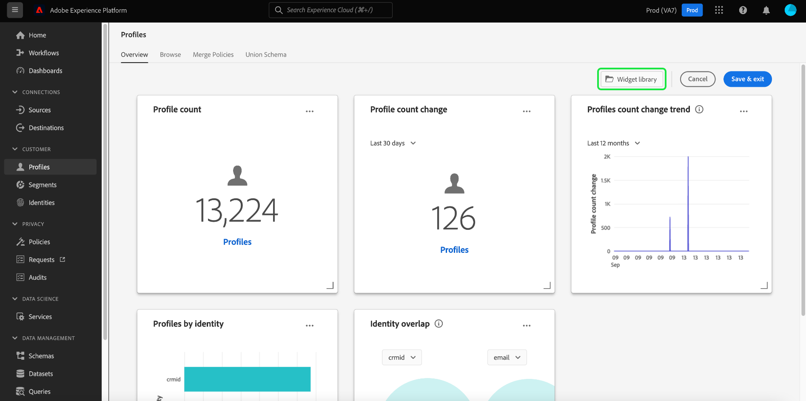

# Visão geral da personalização do painel

Os perfis, segmentos e painéis de destino disponíveis no Adobe Experience Platform podem ser personalizados de várias maneiras diferentes. Este guia fornece uma visão geral das personalizações disponíveis, com links para instruções passo a passo que orientam você sobre como personalizar quais widgets são exibidos em seus painéis, bem como o tamanho, a forma e o local desses widgets.

>[!NOTE]
>
>Os widgets exibidos na [!UICONTROL Uso da licença] painel não pode ser personalizado. Para saber mais sobre esse painel exclusivo, leia o [documentação do painel de uso da licença](../guides/license-usage.md).

## Modificar painel

Selecionar **[!UICONTROL Modificar painel]** nos painéis de perfis, segmentos ou destinos, você pode ajustar o tamanho, a ordem e o local dos widgets que estão visíveis no seu painel. Para obter informações sobre como modificar a aparência dos widgets em seus painéis, consulte o [guia de modificação de painéis](modify.md).

## A biblioteca de widgets

A biblioteca de widgets no Experience Platform é onde você pode visualizar todas as [padrão](#standard-widgets) e [custom](#custom-widgets) widgets disponíveis para a sua organização. Em seus painéis (por exemplo, no painel de perfis), você pode selecionar **[!UICONTROL Modificar painel]** para exibir a variável **[!UICONTROL Biblioteca de widgets]** botão.

Selecionar **[!UICONTROL Biblioteca de widgets]** para abrir a biblioteca de widgets e exibir todas as métricas padrão disponíveis ou começar a criar widgets personalizados.

### Widgets padrão {#standard-widgets}

Os widgets padrão se referem aos widgets fornecidos pelo Adobe para uso em seus painéis. Esses widgets são somente leitura e não podem ser editados por sua organização.

Na biblioteca de widgets, a variável **[!UICONTROL Padrão]** contém todos os widgets padrão disponíveis fornecidos pelo Adobe. Você pode atualizar seus painéis usando qualquer uma dessas métricas padrão. Para saber mais sobre como adicionar widgets padrão ao painel, consulte o guia para [uso de widgets padrão em painéis](standard-widgets.md).

### Widgets personalizados {#custom-widgets}

Os widgets personalizados se referem a widgets criados e compartilhados pelos membros de sua organização. Esses widgets são criados por meio da variável **[!UICONTROL Personalizado]** da biblioteca de widgets e exija que sua organização especifique as métricas disponíveis por meio do uso de um [schema](#edit-schema)

Para obter as etapas completas para criar seus próprios widgets, consulte [widgets personalizados para guia de painéis](custom-widgets.md).

#### Editar esquema {#edit-schema}

Para criar um [widget personalizado](#custom-widgets) para seus painéis, primeiro você deve identificar o atributo de Perfil do cliente em tempo real no qual o widget será baseado.

Para obter instruções passo a passo sobre como editar o esquema da sua organização para criar widgets de painel personalizados, visite o guia para [edição do esquema do painel](edit-schema.md).

## Próximas etapas

Após a leitura deste documento, você está pronto para começar a personalizar seus painéis de Experience Platform modificando o tamanho, a forma e a ordem dos widgets existentes, adicionando widgets padrão fornecidos pelo Adobe ou criando e compartilhando widgets personalizados com sua organização.
