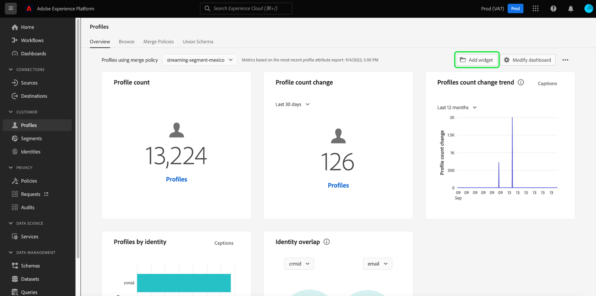

# Visão geral da biblioteca de widgets

Na interface do usuário do Adobe Experience Platform, você pode visualizar e interagir com os dados de sua organização usando vários painéis. Você também pode atualizar determinados painéis adicionando widgets à visualização de painel.

Este guia fornece instruções passo a passo para acessar o [!UICONTROL Biblioteca de widgets] no Experience Platform, onde você pode selecionar widgets padrão e criar widgets personalizados para personalizar as informações exibidas em seus painéis.

Para obter informações sobre como modificar a localização e o tamanho dos widgets já exibidos em seus painéis, consulte o [modificar guia de painéis](modify.md).

>[!NOTE]
>
>Os widgets mostrados no [!UICONTROL Uso da licença] o painel não pode ser personalizado. Para saber mais sobre esse painel exclusivo, leia o [documentação do painel de uso da licença](../guides/license-usage.md).

## Acessar a biblioteca de widgets {#access}

Em qualquer painel (por exemplo, o painel Perfis ), selecione **[!UICONTROL Adicionar widget]** para navegar diretamente para a biblioteca de widgets, onde você pode [adicionar widgets](#add-widgets) ao painel.

Selecionar **[!UICONTROL Modificar painel]** para mover, redimensionar ou remover widgets do painel. Nessa exibição, também é possível selecionar **[!UICONTROL Biblioteca de widgets]** para procurar e [adicionar widgets](#add-widgets). Para saber como editar tamanhos e layout de widgets, consulte [Modificar a documentação dos painéis](./modify.md).

Selecionar **[!UICONTROL Biblioteca de widgets]** para abrir a biblioteca de widgets e exibir todas as métricas padrão disponíveis ou começar a criar widgets personalizados.

## Adicionar widgets {#add-widgets}

No [!UICONTROL Biblioteca de widgets], selecione qualquer widget na lista de widgets padrão ou personalizados disponíveis. Uma marca de seleção no canto do widget indica sua seleção.

### Rótulo em uso {#in-use-label}

Os widgets já adicionados a um painel têm um [!UICONTROL Em uso] rótulo anexado a eles quando visualizado na biblioteca de widgets. Esse rótulo destaca widgets que já foram adicionados ao painel para evitar duplicação. Embora seja possível adicionar o mesmo widget mais de uma vez se desejar.

Depois de selecionar todos os widgets necessários, selecione **[!UICONTROL Adicionar widgets]** para confirmar sua escolha e adicionar os widgets ao painel.

## Widgets padrão e personalizados {#standard-and-custom}

A variável [!UICONTROL Biblioteca de widgets] contém duas guias:

* **[!UICONTROL Padrão]:** A guia padrão contém widgets fornecidos pelo Adobe. Você pode atualizar seus painéis usando qualquer uma dessas métricas padrão. Para saber mais sobre como adicionar widgets padrão ao painel, consulte o guia para [uso de widgets padrão em painéis](standard-widgets.md).
* **[!UICONTROL Personalizado]:** A guia personalizada permite criar e compartilhar widgets em sua organização. Para obter as etapas completas para criar seus próprios widgets, consulte [guia de widgets personalizados para painéis](custom-widgets.md).

## Próximas etapas

Depois de ler este documento, você poderá acessar a biblioteca de widgets na interface de usuário do Experience Platform. Para modificar o tamanho e a localização dos widgets exibidos no painel, consulte o [modificar guia de painéis](modify.md).
