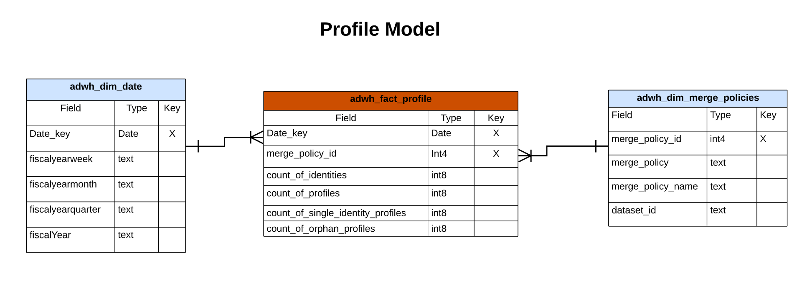
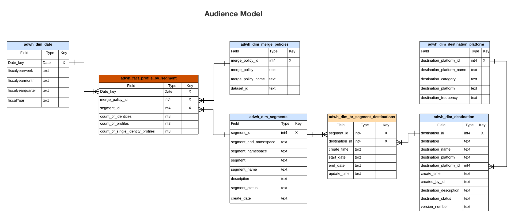

# Edição B2C do modelo de dados do Real-time Customer Data Platform Insights

O modelo de dados do Real-time Customer Data Platform Insights para o [Edição B2C](../../rtcdp/overview.md#rtcdp-b2c) expõe os modelos de dados e o SQL que potencializam os insights para vários widgets de perfil, destino e segmentação. Você pode personalizar esses modelos de consulta SQL para criar relatórios do Real-Time CDP para seus casos de uso de marketing e KPI (indicador chave de desempenho). Esses insights podem ser usados como widgets personalizados para seus painéis definidos pelo usuário. Consulte a documentação dos insights de relatório da loja acelerada de consulta para saber mais [como criar um modelo de dados de insights de relatórios por meio do Serviço de consulta para uso com dados de armazenamento acelerados e painéis definidos pelo usuário](../../query-service/data-distiller/customizable-insights/reporting-insights-data-model.md).

>[!NOTE]
>
>O termo &quot;segmento&quot; foi atualizado para &quot;público-alvo&quot; em todos os sistemas Adobe Experience Platform. Algumas referências a segmentos permanecem em uso para caminhos de arquivos e convenções de nomenclatura de conjuntos de dados.

## Pré-requisitos

Este guia requer uma compreensão funcional do [recurso de painéis definido pelo usuário](../user-defined-dashboards.md). Leia a documentação antes de continuar com este guia.

## Relatórios e casos de uso do Real-Time CDP Insights

Os relatórios do Real-Time CDP fornecem insights sobre os dados do perfil e sua relação com públicos e destinos. Vários modelos de esquema estrela foram desenvolvidos para responder a uma variedade de casos de uso comuns de marketing e cada modelo de dados pode suportar vários casos de uso.

>[!IMPORTANT]
>
>Os dados usados para os relatórios do Real-Time CDP são precisos para uma política de mesclagem escolhida e do instantâneo diário mais recente.

### Modelo de perfil {#profile-model}

O modelo de perfil é composto de três conjuntos de dados:

- `adwh_dim_date`
- `adwh_fact_profile`
- `adwh_dim_merge_policies`

A imagem abaixo contém os campos de dados relevantes em cada conjunto de dados.



#### O caso de uso de contagem de perfis {#profile-count}

A lógica usada para o [!UICONTROL Contagem de perfis] O widget retorna o número total de perfis mesclados no Armazenamento de perfis no momento em que o instantâneo foi tirado. Consulte a [[!UICONTROL Contagem de perfis] documentação do widget](../guides/profiles.md#profile-count) para obter mais informações.

O SQL que gera a variável [!UICONTROL Contagem de perfis] o widget está na seção recolhível abaixo.

Consulta +++SQL

```sql
SELECT qsaccel.profile_agg.adwh_dim_merge_policies.merge_policy_name,
       sum(qsaccel.profile_agg.adwh_fact_profile.count_of_profiles) CNT
  FROM qsaccel.profile_agg.adwh_fact_profile
  LEFT OUTER JOIN qsaccel.profile_agg.adwh_dim_merge_policies ON qsaccel.profile_agg.adwh_dim_merge_policies.merge_policy_id=adwh_fact_profile.merge_policy_id
  WHERE qsaccel.profile_agg.adwh_fact_profile.date_key='2024-01-10'
    AND qsaccel.profile_agg.adwh_fact_profile.merge_policy_id = 2027892989
  GROUP BY qsaccel.profile_agg.adwh_dim_merge_policies.merge_policy_name;
```

+++

#### O caso de uso de perfis de identidade únicos {#single-identity-profiles}

A lógica usada para o [!UICONTROL Perfis de identidade única] O widget fornece uma contagem dos perfis da sua organização que têm apenas um tipo de ID que cria a identidade. Consulte a [[!UICONTROL Perfis de identidade única] documentação do widget](../guides/profiles.md#single-identity-profiles) para obter mais informações.

O SQL que gera a variável [!UICONTROL Perfis de identidade única] o widget está na seção recolhível abaixo.

Consulta +++SQL

```sql
SELECT qsaccel.profile_agg.adwh_dim_merge_policies.merge_policy_name,
       sum(qsaccel.profile_agg.adwh_fact_profile.count_of_Single_Identity_profiles) CNT
  FROM qsaccel.profile_agg.adwh_fact_profile
  LEFT OUTER JOIN qsaccel.profile_agg.adwh_dim_merge_policies ON qsaccel.profile_agg.adwh_dim_merge_policies.merge_policy_id=adwh_fact_profile.merge_policy_id
  WHERE qsaccel.profile_agg.adwh_fact_profile.date_key='2024-01-10'
    AND qsaccel.profile_agg.adwh_fact_profile.merge_policy_id = 2027892989
  GROUP BY qsaccel.profile_agg.adwh_dim_merge_policies.merge_policy_name;
```

+++

### Modelo de namespace {#namespace-model}

O modelo de namespace é composto pelos seguintes conjuntos de dados:

- `adwh_dim_date`
- `adwh_fact_profile_by_namespace`
- `adwh_dim_merge_policies`
- `adwh_dim_namespaces`

A imagem abaixo contém os campos de dados relevantes em cada conjunto de dados.


#### Caso de uso de perfis por identidade {#profiles-by-identity}

A variável [!UICONTROL Perfis por identidade] O widget exibe o detalhamento das identidades em todos os perfis mesclados na sua Loja de perfis. Consulte a [[!UICONTROL Perfis por identidade] documentação do widget](../guides/profiles.md#profiles-by-identity) para obter mais informações.

O SQL que gera a variável [!UICONTROL Perfis por identidade] o widget está na seção recolhível abaixo.

Consulta +++SQL

```sql
SELECT qsaccel.profile_agg.adwh_dim_namespaces.namespace_description,
        sum(qsaccel.profile_agg.adwh_fact_profile_by_namespace_trendlines.count_of_profiles) count_of_profiles
  FROM qsaccel.profile_agg.adwh_fact_profile_by_namespace_trendlines
  LEFT OUTER JOIN qsaccel.profile_agg.adwh_dim_namespaces ON qsaccel.profile_agg.adwh_fact_profile_by_namespace_trendlines.namespace_id = qsaccel.profile_agg.adwh_dim_namespaces.namespace_id
  AND qsaccel.profile_agg.adwh_fact_profile_by_namespace_trendlines.merge_policy_id = qsaccel.profile_agg.adwh_dim_namespaces.merge_policy_id
  WHERE qsaccel.profile_agg.adwh_fact_profile_by_namespace_trendlines.merge_policy_id = 2027892989
    AND qsaccel.profile_agg.adwh_fact_profile_by_namespace_trendlines.date_key = '2024-01-10'
  GROUP BY qsaccel.profile_agg.adwh_fact_profile_by_namespace_trendlines.date_key,
          qsaccel.profile_agg.adwh_fact_profile_by_namespace_trendlines.merge_policy_id,
          qsaccel.profile_agg.adwh_dim_namespaces.namespace_description
  ORDER BY count_of_profiles DESC;
```

+++

#### Caso de uso de perfis de identidade únicos por identidade {#single-identity-profiles-by-identity}

A lógica usada para o [!UICONTROL Perfis de identidade únicos por identidade] O widget ilustra o número total de perfis identificados com apenas um identificador exclusivo. Consulte a [Documentação do widget Perfis de identidade únicos por identidade](../guides/profiles.md#single-identity-profiles-by-identity) para obter mais informações.

O SQL que gera a variável [!UICONTROL Perfis de identidade únicos por identidade] o widget está na seção recolhível abaixo.

Consulta +++SQL

```sql
SELECT qsaccel.profile_agg.adwh_dim_namespaces.namespace_description,
        sum(qsaccel.profile_agg.adwh_fact_profile_by_namespace_trendlines.count_of_Single_Identity_profiles) count_of_Single_Identity_profiles
  FROM qsaccel.profile_agg.adwh_fact_profile_by_namespace_trendlines
  LEFT OUTER JOIN qsaccel.profile_agg.adwh_dim_namespaces ON qsaccel.profile_agg.adwh_fact_profile_by_namespace_trendlines.namespace_id = qsaccel.profile_agg.adwh_dim_namespaces.namespace_id
  AND qsaccel.profile_agg.adwh_fact_profile_by_namespace_trendlines.merge_policy_id = qsaccel.profile_agg.adwh_dim_namespaces.merge_policy_id
  WHERE qsaccel.profile_agg.adwh_fact_profile_by_namespace_trendlines.merge_policy_id = 2027892989
    AND qsaccel.profile_agg.adwh_fact_profile_by_namespace_trendlines.date_key = '2024-01-10'
  GROUP BY qsaccel.profile_agg.adwh_fact_profile_by_namespace_trendlines.date_key,
          qsaccel.profile_agg.adwh_fact_profile_by_namespace_trendlines.merge_policy_id,
          qsaccel.profile_agg.adwh_dim_namespaces.namespace_description;
```

+++

### Modelo de público {#audience-model}

O modelo de público-alvo é composto pelos seguintes conjuntos de dados:

- `adwh_dim_date`
- `adwh_fact_profile_by_segment`
- `adwh_dim_merge_policies`
- `adwh_dim_segments`
- `adwh_dim_br_segment_destinations`
- `adwh_dim_destination`
- `adwh_dim_destination_platform`

A imagem abaixo contém os campos de dados relevantes em cada conjunto de dados.



#### Caso de uso de tamanho do público {#audience-size}

A lógica usada para o [!UICONTROL Tamanho do público] O widget retorna o número total de perfis mesclados no público selecionado no momento do instantâneo mais recente. Consulte a [[!UICONTROL Tamanho do público] documentação do widget](../guides/audiences.md#audience-size) para obter mais informações.

O SQL que gera a variável [!UICONTROL Tamanho do público] o widget está na seção recolhível abaixo.

Consulta +++SQL

```sql
SELECT
  sum(
    qsaccel.profile_agg.adwh_fact_profile_by_segment_trendlines.count_of_profiles
  ) count_of_profiles
FROM
  qsaccel.profile_agg.adwh_fact_profile_by_segment_trendlines
  LEFT OUTER JOIN qsaccel.profile_agg.adwh_dim_segments ON qsaccel.profile_agg.adwh_fact_profile_by_segment_trendlines.segment_id = qsaccel.profile_agg.adwh_dim_segments.segment_id
WHERE
  qsaccel.profile_agg.adwh_fact_profile_by_segment_trendlines.segment_id = -1323307941
  AND qsaccel.profile_agg.adwh_fact_profile_by_segment_trendlines.merge_policy_id = 1914917902
  AND qsaccel.profile_agg.adwh_fact_profile_by_segment_trendlines.date_key = '2024-01-12';
```

+++

#### Caso de uso de tendência de alteração de tamanho do público {#audience-size-change-trend}

A lógica usada para o [!UICONTROL Tendência de alteração de tamanho do público] O widget fornece uma ilustração de gráfico de linhas da diferença no número total de perfis qualificados para um determinado público-alvo entre os instantâneos diários mais recentes. Consulte a [[!UICONTROL Tendência de alteração de tamanho do público] documentação do widget](../guides/audiences.md#audience-size-change-trend) para obter mais informações.

O SQL que gera a variável [!UICONTROL Tendência de alteração de tamanho do público] o widget está na seção recolhível abaixo.

Consulta +++SQL

```sql
SELECT date_key,
      Profiles_added
  FROM
    (SELECT rn_num,
            date_key,
            (count_of_profiles-lag(count_of_profiles, 1, 0) over(
                                                                ORDER BY date_key))Profiles_added
    FROM
      (SELECT date_key,
              sum(x.count_of_profiles)count_of_profiles,
              row_number() OVER (
                                  ORDER BY date_key) rn_num
        FROM qsaccel.profile_agg.adwh_fact_profile_by_segment_trendlines x
        INNER JOIN
          (SELECT MAX(process_date) last_process_date,
                  merge_policy_id
          FROM qsaccel.profile_agg.adwh_lkup_process_delta_log
          WHERE process_name = 'FACT_TABLES_PROCESSING'
            AND process_status = 'SUCCESSFUL'
          GROUP BY merge_policy_id) y ON x.merge_policy_id = y.merge_policy_id
        WHERE segment_id = 1333234510
          AND x.date_key >= dateadd(DAY, -30 -1, y.last_process_date)
        GROUP BY x.date_key) a)b
  WHERE rn_num > 1;
```

+++

#### Caso de uso de destinos mais usados {#most-used-destinations}

A lógica usada no [!UICONTROL Destinos mais usados] O widget lista os destinos mais usados de sua organização de acordo com o número de públicos-alvo mapeados para eles. Essa classificação fornece insight sobre quais destinos estão sendo utilizados, além de mostrar os que podem estar subutilizados. Consulte a documentação no [[!UICONTROL Destinos mais usados] widget](../guides/destinations.md#most-used-destinations) para obter mais informações.

O SQL que gera a variável [!UICONTROL Destinos mais usados] o widget está na seção recolhível abaixo.

Consulta +++SQL

```sql
SELECT qsaccel.profile_agg.adwh_dim_destination.destination_name,
       qsaccel.profile_agg.adwh_dim_destination.destination_id,
       qsaccel.profile_agg.adwh_dim_destination.destination,
       count(DISTINCT qsaccel.profile_agg.adwh_dim_br_segment_destinations.segment_id) segment_count
  FROM qsaccel.profile_agg.adwh_dim_destination
  JOIN qsaccel.profile_agg.adwh_dim_br_segment_destinations ON qsaccel.profile_agg.adwh_dim_destination.destination_id = qsaccel.profile_agg.adwh_dim_br_segment_destinations.destination_id
  WHERE qsaccel.profile_agg.adwh_dim_destination.destination_name IS NOT NULL
  GROUP BY qsaccel.profile_agg.adwh_dim_destination.destination_name,
           qsaccel.profile_agg.adwh_dim_destination.destination,
           qsaccel.profile_agg.adwh_dim_destination.destination_id
  ORDER BY segment_count DESC
  LIMIT 20;
```

+++

#### Caso de uso de públicos ativado recentemente {#recently-activated-audiences}

A lógica para o [!UICONTROL Públicos ativados recentemente] O widget fornece uma lista dos públicos-alvo mapeados mais recentemente para um destino. Esta lista fornece um instantâneo dos públicos-alvo e destinos que estão ativamente em uso no sistema e pode ajudar a solucionar problemas de mapeamentos incorretos. Consulte a [[!UICONTROL Públicos ativados recentemente] documentação do widget](../guides/destinations.md#recently-activated-audiences) para obter mais informações.

O SQL que gera a variável [!UICONTROL Públicos ativados recentemente] o widget está na seção recolhível abaixo.

Consulta +++SQL

```sql
SELECT
  segment_name,
  segment,
  destination_name,
  a.create_time create_time
FROM
  qsaccel.profile_agg.adwh_dim_br_segment_destinations a
  INNER JOIN qsaccel.profile_agg.adwh_dim_segments b ON a.segment_id = b.segment_id
  INNER JOIN qsaccel.profile_agg.adwh_dim_destination c ON a.destination_id = c.destination_id
ORDER BY
  create_time DESC,
  segment
LIMIT
  20;
```

+++

### Modelo de namespace-público {#namespace-audience-model}

O modelo de namespace-público é composto pelos seguintes conjuntos de dados:

- `adwh_dim_date`
- `adwh_dim_namespaces`
- `adwh_fact_profile_by_segment_and_namespace`
- `adwh_dim_merge_policies`
- `adwh_dim_segments`
- `adwh_dim_br_segment_destinations`
- `adwh_dim_destination`
- `adwh_dim_destination_platform`

A imagem abaixo contém os campos de dados relevantes em cada conjunto de dados.


#### Perfis por identidade para um caso de uso de público-alvo {#audience-profiles-by-identity}

A lógica usada no [!UICONTROL Perfis por identidade] O widget fornece um detalhamento de identidades em todos os perfis mesclados na sua Loja de perfis para um determinado público-alvo. Consulte a [[!UICONTROL Perfis por identidade] documentação do widget](../guides/audiences.md#profiles-by-identity) para obter mais informações.

O SQL que gera a variável [!UICONTROL Perfis por identidade] o widget está na seção recolhível abaixo.

Consulta +++SQL

```sql
SELECT qsaccel.profile_agg.adwh_dim_namespaces.namespace_description,
        sum(qsaccel.profile_agg.adwh_fact_profile_by_segment_and_namespace_trendlines.count_of_profiles) count_of_profiles
  FROM qsaccel.profile_agg.adwh_fact_profile_by_segment_and_namespace_trendlines
  LEFT OUTER JOIN qsaccel.profile_agg.adwh_dim_namespaces ON qsaccel.profile_agg.adwh_fact_profile_by_segment_and_namespace_trendlines.namespace_id = qsaccel.profile_agg.adwh_dim_namespaces.namespace_id
  AND qsaccel.profile_agg.adwh_fact_profile_by_segment_and_namespace_trendlines.merge_policy_id = qsaccel.profile_agg.adwh_dim_namespaces.merge_policy_id
  WHERE qsaccel.profile_agg.adwh_fact_profile_by_segment_and_namespace_trendlines.segment_id = 1333234510
    AND qsaccel.profile_agg.adwh_fact_profile_by_segment_and_namespace_trendlines.merge_policy_id = 1709997014
    AND qsaccel.profile_agg.adwh_fact_profile_by_segment_and_namespace_trendlines.date_key = '2024-01-10'
  GROUP BY qsaccel.profile_agg.adwh_dim_namespaces.namespace_description
  ORDER BY count_of_profiles DESC;
```

+++

### Sobrepor modelo de namespace

O modelo de namespace de sobreposição é composto pelos seguintes conjuntos de dados:

- `adwh_dim_date`
- `adwh_dim_overlap_namespaces`
- `adwh_fact_profile_overlap_of_namespace`
- `adwh_dim_merge_policies`

A imagem abaixo contém os campos de dados relevantes em cada conjunto de dados.


#### Caso de uso de sobreposição de identidade (perfis) {#profiles-identity-overlap}

A lógica usada no [!UICONTROL Sobreposição de identidade] exibe a sobreposição de perfis no seu **Loja de perfis** que contêm as duas identidades selecionadas. Para obter mais informações, consulte [[!UICONTROL Sobreposição de identidade] seção widget do [!UICONTROL Perfis] documentação do painel](../guides/profiles.md#identity-overlap).

O SQL que gera a variável [!UICONTROL Sobreposição de identidade] o widget está na seção recolhível abaixo.

Consulta +++SQL

```sql
SELECT Sum(overlap_col1) overlap_col1,
        Sum(overlap_col2) overlap_col2,
        coalesce(Sum(overlap_count), 0) overlap_count
  FROM
    (SELECT 0 overlap_col1,
            0 overlap_col2,
            Sum(count_of_profiles) overlap_count
    FROM qsaccel.profile_agg.adwh_fact_profile_overlap_of_namespace
    WHERE qsaccel.profile_agg.adwh_fact_profile_overlap_of_namespace.merge_policy_id = 2027892989
      AND qsaccel.profile_agg.adwh_fact_profile_overlap_of_namespace.date_key = '2024-01-10'
      AND qsaccel.profile_agg.adwh_fact_profile_overlap_of_namespace.overlap_id IN
        (SELECT a.overlap_id
          FROM
            (SELECT qsaccel.profile_agg.adwh_dim_overlap_namespaces.overlap_id overlap_id,
                    count(*) cnt_num
            FROM qsaccel.profile_agg.adwh_dim_overlap_namespaces
            WHERE qsaccel.profile_agg.adwh_dim_overlap_namespaces.merge_policy_id = 2027892989
              AND qsaccel.profile_agg.adwh_dim_overlap_namespaces.overlap_namespaces in ('avid',
                                                                                          'crmid')
            GROUP BY qsaccel.profile_agg.adwh_dim_overlap_namespaces.overlap_id)a
          WHERE a.cnt_num>1 )
    UNION ALL SELECT count_of_profiles overlap_col1,
                      0 overlap_col2,
                      0 overlap_count
    FROM qsaccel.profile_agg.adwh_fact_profile_by_namespace_trendlines
    JOIN qsaccel.profile_agg.adwh_dim_namespaces ON qsaccel.profile_agg.adwh_fact_profile_by_namespace_trendlines.namespace_id = qsaccel.profile_agg.adwh_dim_namespaces.namespace_id
    AND qsaccel.profile_agg.adwh_fact_profile_by_namespace_trendlines.merge_policy_id = qsaccel.profile_agg.adwh_dim_namespaces.merge_policy_id
    WHERE qsaccel.profile_agg.adwh_fact_profile_by_namespace_trendlines.merge_policy_id = 2027892989
      AND qsaccel.profile_agg.adwh_fact_profile_by_namespace_trendlines.date_key = '2024-01-10'
      AND qsaccel.profile_agg.adwh_dim_namespaces.namespace_description = 'avid'
    UNION ALL SELECT 0 overlap_col1,
                      count_of_profiles overlap_col2,
                      0 Overlap_count
    FROM qsaccel.profile_agg.adwh_fact_profile_by_namespace_trendlines
    JOIN qsaccel.profile_agg.adwh_dim_namespaces ON qsaccel.profile_agg.adwh_fact_profile_by_namespace_trendlines.namespace_id = qsaccel.profile_agg.adwh_dim_namespaces.namespace_id
    AND qsaccel.profile_agg.adwh_fact_profile_by_namespace_trendlines.merge_policy_id = qsaccel.profile_agg.adwh_dim_namespaces.merge_policy_id
    WHERE qsaccel.profile_agg.adwh_fact_profile_by_namespace_trendlines.merge_policy_id = 2027892989
      AND qsaccel.profile_agg.adwh_fact_profile_by_namespace_trendlines.date_key = '2024-01-10'
      AND qsaccel.profile_agg.adwh_dim_namespaces.namespace_description = 'crmid' )a;
```

+++

### Sobrepor namespace por modelo de público {#overlap-namespace-by-audience-model}

O namespace de sobreposição por modelo de público é composto pelos seguintes conjuntos de dados:

- `adwh_dim_date`
- `adwh_dim_overlap_namespaces`
- `adwh_fact_profile_overlap_of_namespace_by_segment`
- `adwh_dim_merge_policies`
- `adwh_dim_segments`
- `adwh_dim_br_segment_destinations`
- `adwh_dim_destination`
- `adwh_dim_destination_platform`

A imagem abaixo contém os campos de dados relevantes em cada conjunto de dados.


#### Caso de uso de sobreposição de identidade (públicos-alvo) {#audiences-identity-overlap}

A lógica usada no [!UICONTROL Públicos-alvo] painel [!UICONTROL Sobreposição de identidade] O widget ilustra a sobreposição de perfis que contém as duas identidades selecionadas para um público em particular. Para obter mais informações, consulte [[!UICONTROL Sobreposição de identidade] seção widget do [!UICONTROL Públicos-alvo] documentação do painel](../guides/audiences.md#identity-overlap).

O SQL que gera a variável [!UICONTROL Sobreposição de identidade] o widget está na seção recolhível abaixo.

Consulta +++SQL

```sql
SELECT Sum(overlap_col1) overlap_col1,
        Sum(overlap_col2) overlap_col2,
        Sum(overlap_count) Overlap_count
  FROM
    (SELECT 0 overlap_col1,
            0 overlap_col2,
            Sum(count_of_profiles) Overlap_count
    FROM qsaccel.profile_agg.adwh_fact_profile_overlap_of_namespace_by_segment
    WHERE qsaccel.profile_agg.adwh_fact_profile_overlap_of_namespace_by_segment.segment_id = 1333234510
      AND qsaccel.profile_agg.adwh_fact_profile_overlap_of_namespace_by_segment.merge_policy_id = 1709997014
      AND qsaccel.profile_agg.adwh_fact_profile_overlap_of_namespace_by_segment.date_key = '2024-01-10'
      AND qsaccel.profile_agg.adwh_fact_profile_overlap_of_namespace_by_segment.overlap_id IN
        (SELECT a.overlap_id
          FROM
            (SELECT qsaccel.profile_agg.adwh_dim_overlap_namespaces.overlap_id overlap_id,
                    count(*) cnt_num
            FROM qsaccel.profile_agg.adwh_dim_overlap_namespaces
            WHERE qsaccel.profile_agg.adwh_dim_overlap_namespaces.merge_policy_id = 1709997014
              AND qsaccel.profile_agg.adwh_dim_overlap_namespaces.overlap_namespaces in ('crmid',
                                                                                          'email')
            GROUP BY qsaccel.profile_agg.adwh_dim_overlap_namespaces.overlap_id)a
          WHERE a.cnt_num>1 )
    UNION ALL SELECT count_of_profiles overlap_col1,
                      0 overlap_col2,
                      0 Overlap_count
    FROM qsaccel.profile_agg.adwh_fact_profile_by_segment_and_namespace_trendlines
    LEFT OUTER JOIN qsaccel.profile_agg.adwh_dim_namespaces ON qsaccel.profile_agg.adwh_fact_profile_by_segment_and_namespace_trendlines.namespace_id = qsaccel.profile_agg.adwh_dim_namespaces.namespace_id
    AND qsaccel.profile_agg.adwh_fact_profile_by_segment_and_namespace_trendlines.merge_policy_id = qsaccel.profile_agg.adwh_dim_namespaces.merge_policy_id
    WHERE qsaccel.profile_agg.adwh_dim_namespaces.namespace_description = 'crmid'
      AND qsaccel.profile_agg.adwh_fact_profile_by_segment_and_namespace_trendlines.segment_id = 1333234510
      AND qsaccel.profile_agg.adwh_fact_profile_by_segment_and_namespace_trendlines.merge_policy_id = 1709997014
      AND qsaccel.profile_agg.adwh_fact_profile_by_segment_and_namespace_trendlines.date_key = '2024-01-10'
    UNION ALL SELECT 0 overlap_col1,
                      count_of_profiles overlap_col2,
                      0 Overlap_count
    FROM qsaccel.profile_agg.adwh_fact_profile_by_segment_and_namespace_trendlines
    LEFT OUTER JOIN qsaccel.profile_agg.adwh_dim_namespaces ON qsaccel.profile_agg.adwh_fact_profile_by_segment_and_namespace_trendlines.namespace_id = qsaccel.profile_agg.adwh_dim_namespaces.namespace_id
    AND qsaccel.profile_agg.adwh_fact_profile_by_segment_and_namespace_trendlines.merge_policy_id = qsaccel.profile_agg.adwh_dim_namespaces.merge_policy_id
    WHERE qsaccel.profile_agg.adwh_dim_namespaces.namespace_description = 'email'
      AND qsaccel.profile_agg.adwh_fact_profile_by_segment_and_namespace_trendlines.segment_id = 1333234510
      AND qsaccel.profile_agg.adwh_fact_profile_by_segment_and_namespace_trendlines.merge_policy_id = 1709997014
      AND qsaccel.profile_agg.adwh_fact_profile_by_segment_and_namespace_trendlines.date_key = '2024-01-10' ) a;
```

+++

<!-- Commented out as Anil wanted to add something but did not provide information yet:
### Overlap Namespace-Audience model {#overlap-namespace-audience-model}

The overlap namespace-audience model is comprised of the following datasets: 

- `adwh_fact_profile_overlap_by_namespace_and_segment`
- `adwh_dim_date`
- `adwh_dim_namespace`
- `adwh_dim_overlap_namespaces`
- `adwh_dim_merge_policies`
- `adwh_dim_segments`
- `adwh_dim_br_segment_destinations`
- `adwh_dim_destination`
- `adwh_dim_destination_platform`

 -->

<!-- What insights are gathered from this particular data model? -->

<!-- Commented out as Anil wanted to add something but did not provide information yet:
### AI model {#ai-model}

The AI model is comprised of the following datasets: 

- `adwh_fact_profile_ai_models`
- `adwh_dim_date`
- `adwh_dim_merge_policies`
- `adwh_dim_ai_models`

 -->

<!-- What insights are gathered from this particular data model? -->

