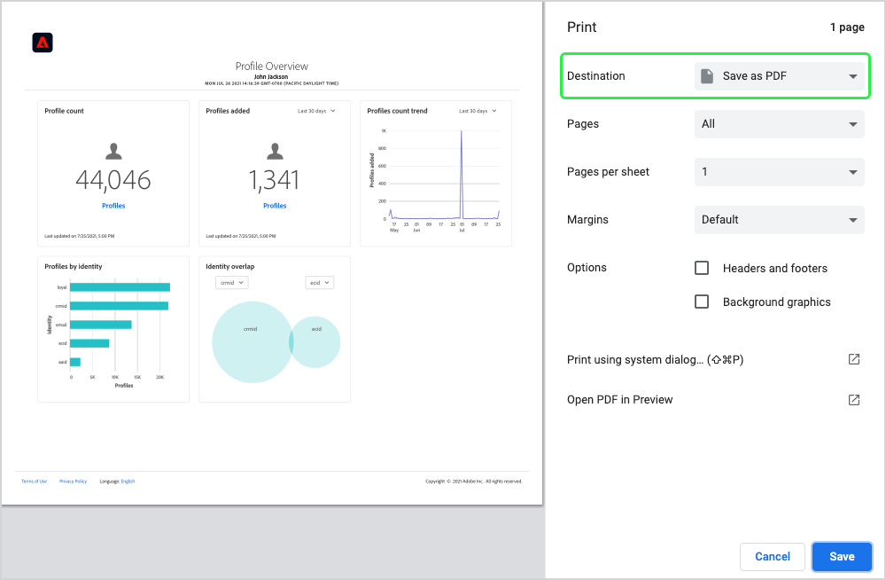

# Baixar painéis em PDF

Os painéis no Adobe Experience Platform podem ser baixados para PDF na interface do usuário da plataforma para facilitar o compartilhamento de informações com membros da organização.

Este documento fornece um resumo de como baixar painéis usando a interface do usuário da plataforma e salvar o painel em PDF usando o menu de impressão padrão do navegador.

>[!WARNING]
>
>Os dados contidos em seus painéis podem incluir informações de identificação pessoal (PII) sobre seus clientes ou dados confidenciais relacionados à sua organização. Todos os dados de painel salvos em PDF devem ser tratados adequadamente de acordo com as diretrizes de privacidade de dados de sua organização.

## Baixar painel

Para começar a baixar um painel, navegue até o painel que deseja baixar (por exemplo, o painel [!UICONTROL Profiles]) e selecione o menu de mais opções (**`...`**) no canto superior direito do painel. Em seguida, selecione **[!UICONTROL Download]**.

## Visualizar PDF

Após selecionar **[!UICONTROL Download]**, o menu de impressão padrão do seu navegador será aberto. Neste exemplo, o menu de impressão do Google Chrome é exibido.

O menu Imprimir permite que você visualize o PDF que será salvo. O PDF é uma representação real dos widgets de painel, conforme aparecem na interface do usuário da plataforma, e o tamanho do PDF é ajustado automaticamente para exibir todos os widgets de painel visíveis no momento em uma única página.

O PDF inclui um cabeçalho gerado automaticamente contendo o logotipo do Experience Platform, o nome do painel, seu nome e a data e hora em que o painel foi baixado. Essas informações são somente leitura e não podem ser editadas no PDF.

## Salvar como PDF

Depois de visualizar o PDF, selecione **Save** para escolher o local no qual deseja salvar o PDF.

>[!NOTE]
>
>Se necessário, você pode usar a lista suspensa **Destino** para selecionar **Salvar como PDF** se essa opção não estiver selecionada automaticamente para você.

## Personalizar PDFs de painel

O PDF gerado corresponde ao painel que você pode ver na interface do usuário e inclui apenas os widgets que estão visíveis no momento no painel. Determinados painéis podem ser personalizados para alterar o tamanho e o local dos widgets ou para adicionar e remover widgets da exibição. Personalizar a aparência do painel na interface do usuário da plataforma também altera a aparência do PDF gerado.

Por exemplo, você pode modificar a aparência do painel de perfis para incluir vários widgets de largura total empilhados acima de três widgets padrão.

Selecionar para baixar o painel atualizado resulta em uma nova visualização em PDF que corresponde à aparência do painel de perfis personalizados. Ele também ajusta automaticamente o tamanho do PDF para garantir que todos os widgets visíveis sejam incluídos em um PDF de uma página.

Para saber mais sobre como personalizar painéis, comece lendo a [visão geral de personalização do painel](customize/overview.md).

## Próximas etapas

Depois de baixar o painel e salvá-lo como um PDF, repita essas etapas para baixar painéis adicionais ou compartilhar o PDF com membros de sua organização.