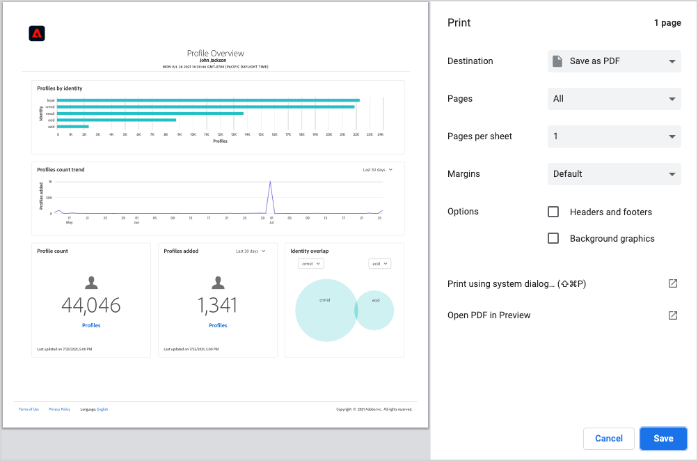

# Baixar painéis para o PDF

É possível baixar painéis na Adobe Experience Platform para a PDF na interface do usuário da Experience Platform para facilitar o compartilhamento de informações com membros da organização.

Este documento fornece um resumo de como baixar painéis usando a interface do usuário do Experience Platform e salvar o painel no PDF usando o menu de impressão padrão do navegador.

>[!WARNING]
>
>Os dados contidos nos painéis podem incluir informações de identificação pessoal (PII) sobre os clientes ou dados confidenciais relacionados à organização. Todos os dados do painel salvos no PDF devem ser tratados adequadamente de acordo com as diretrizes de privacidade de dados da organização.

## Baixar painel

Para começar a baixar um painel, navegue até o painel que deseja baixar (por exemplo, o painel [!UICONTROL Perfis]) e selecione o menu de mais opções (**`...`**) no canto superior direito do painel. Em seguida, selecione **[!UICONTROL Baixar]**.

## Visualizar PDF

Depois de selecionar **[!UICONTROL Baixar]**, o menu de impressão padrão do seu navegador será aberto. Neste exemplo, o menu de impressão do Google Chrome é exibido.

O menu de impressão permite visualizar o PDF que será salvo. O PDF é uma representação real dos widgets de painel conforme aparecem na interface do usuário do Experience Platform, e o tamanho do PDF é ajustado automaticamente para exibir todos os widgets de painel visíveis no momento em uma única página.

O PDF inclui um cabeçalho gerado automaticamente contendo o logotipo do Experience Platform, o nome do painel, seu nome e a data e hora em que o painel foi baixado. Essas informações são somente leitura e não podem ser editadas no PDF.

## Salvar como PDF

Depois de visualizar a PDF, selecione **Salvar** para escolher o local em que deseja salvar sua PDF.

>[!NOTE]
>
>Se necessário, você pode usar a lista suspensa **Destino** para selecionar **Salvar como PDF** se essa opção não for selecionada automaticamente para você.

## Personalizar PDFs do painel

A PDF gerada corresponde ao painel que você pode ver na interface do usuário e inclui apenas os widgets que estão visíveis no painel no momento. Determinados painéis podem ser personalizados para alterar o tamanho e a localização de widgets ou para adicionar e remover widgets da exibição. Personalizar a aparência do painel na interface do usuário do Experience Platform também altera a aparência do PDF gerado.

Por exemplo, você pode modificar a aparência do painel de perfis para incluir vários widgets de largura total empilhados acima de três widgets padrão.

Selecionar para baixar o painel atualizado resulta em uma nova visualização do PDF que corresponde à aparência do painel de perfis personalizados. Ele também ajusta automaticamente o tamanho do PDF para garantir que todos os widgets visíveis sejam incluídos em um PDF de uma página.

Para saber mais sobre como personalizar painéis, comece lendo a [visão geral de personalização de painel](customize/overview.md).

## Próximas etapas

Agora que você baixou seu painel e o salvou como um PDF, é possível repetir essas etapas para baixar painéis adicionais ou compartilhar a PDF com membros de sua organização.
