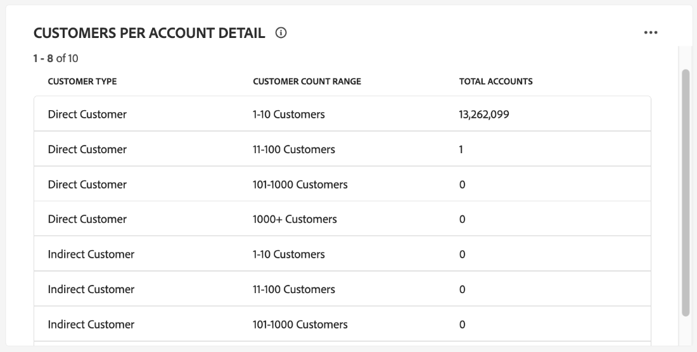

# Painel de perfis de conta

A interface do usuário (UI) do Adobe Experience Platform fornece um painel por meio do qual você pode visualizar informações importantes sobre os perfis de conta, conforme capturados durante um instantâneo diário. Este guia descreve como acessar e trabalhar com o painel [!UICONTROL Account Profiles] na interface do usuário e fornece mais informações sobre as visualizações exibidas no painel.

Este documento fornece uma visão geral dos recursos no painel do [!UICONTROL Account Profiles] e detalha os insights padrão disponíveis. Consulte o [[!UICONTROL Account Profiles] Guia da Interface do Usuário](../../rtcdp/accounts/account-profile-ui-guide.md) para obter detalhes abrangentes sobre seus recursos disponíveis.

## Introdução

Você deve ter direito ao [Adobe Real-Time Customer Data Platform B2B edition](../../rtcdp/b2b-overview.md) para acessar o painel B2B [!UICONTROL Account Profiles].

## Dados de perfis de conta {#data}

O painel do [!UICONTROL Account Profiles] exibe um instantâneo das informações unificadas da sua conta. Essas informações de conta vêm de várias fontes em seus canais de marketing e dos diversos sistemas que sua organização usa atualmente para armazenar informações de conta do cliente.

Os dados do perfil no instantâneo mostram os dados exatamente como aparecem no momento específico em que o instantâneo foi tirado. Em outras palavras, o instantâneo não é uma aproximação ou amostra dos dados, e o painel [!UICONTROL Account Profiles] não é atualizado em tempo real.

>[!NOTE]
>
>Quaisquer alterações ou atualizações feitas nos dados desde que o instantâneo foi tirado não serão refletidas no painel até que o próximo instantâneo seja tirado.

## Explorar o painel [!UICONTROL Account Profiles] {#explore}

Para navegar até o painel [!UICONTROL Account Profiles] na interface do usuário do Experience Platform, selecione **[!UICONTROL Profiles]** em [!UICONTROL Accounts], no painel de navegação esquerdo.

No painel do [!UICONTROL Account Profiles], você pode [navegar pelos perfis de conta assimilados na sua organização](#browse-account-profiles) ou [visualizar todos os dados do perfil da conta rapidamente usando widgets](#standard-widgets).

### Filtro de data {#date-filter}

A guia [!UICONTROL Overview] é composta por widgets que fornecem métricas somente leitura para transmitir informações importantes sobre os perfis da sua conta. Selecione o ícone ou as datas do calendário para alterar o filtro de datas global dos seus widgets.

>[!IMPORTANT]
>
>O intervalo de datas selecionado no calendário suspenso afeta todos os insights, exceto os dois widgets de pontuação preditiva ([distribuição](#predictive-scoring-distribution) e [principais fatores influentes](#predictive-scoring-top-influential-factors)).

### Configurar o cliente potencial para o serviço de correspondência de contas {#lead-to-account-matching-service}

Selecione **[!UICONTROL Settings]** para configurar o cliente potencial para o serviço de correspondência de contas na caixa de diálogo [!UICONTROL Account settings]. Para obter detalhes completos sobre como configurar seu lead para correspondência de contas, consulte o [guia da interface](../../rtcdp/accounts/account-profile-ui-guide.md#configure-lead-to-account-matching). Para saber mais sobre correspondência entre lead e conta, consulte o [lead para correspondência entre contas na documentação B2B do Real-Time CDP](../../rtcdp/b2b-ai-ml-services/lead-to-account-matching.md).

## Procurar perfis de conta {#browse-account-profiles}

Na guia [!UICONTROL Browse], pesquise e visualize os perfis de conta somente leitura assimilados em sua organização. Use uma ID de conta de uma fonte corporativa conectada ou insira os detalhes da fonte diretamente. Nesse espaço de trabalho, você pode ver informações importantes pertencentes ao perfil da conta, incluindo nome, setor, receita e público-alvo, entre outros.

Selecione o [!UICONTROL Profile ID] nos resultados exibidos na guia [!UICONTROL Browse] para abrir a guia [!UICONTROL Details] para o perfil de conta.

As informações de perfil da conta exibidas na guia [!UICONTROL Details] foram mescladas de vários fragmentos de perfil para formar uma única visualização da conta individual. Consulte a documentação sobre [navegação de perfis de conta no Adobe Real-Time Customer Data Platform](../../rtcdp/accounts/account-profile-ui-guide.md#browse-account-profiles) para saber mais sobre os recursos de visualização de perfis de conta na interface do usuário do Experience Platform.

## Widgets padrão {#standard-widgets}

>[!CONTEXTUALHELP]
>id="platform_dashboards_accountprofiles_customersperaccountoverview"
>title="Visão geral de clientes por conta"
>abstract="Este widget de detalhamento fornece insights sobre a estrutura dos seus dados B2B. Ele ajuda a identificar quantos perfis de conta não têm perfis de cliente vinculados ou têm um ou mais perfis de cliente associados a si.<ul><li>Clientes diretos: são perfis de clientes diretamente vinculados a uma conta por meio da rota `personComponents`.</li><li>Clientes indiretos: são perfis de clientes vinculados a uma conta por meio da rota `Account-Person`.</li></ul>"

O Adobe fornece widgets padrão que você pode usar para visualizar métricas diferentes relacionadas aos seus perfis de conta.

>[!IMPORTANT]
>
>Se você não fornecer um filtro de datas, o comportamento padrão dos insights analisará os dados adicionados do ano anterior até hoje.

Para saber mais sobre cada um dos widgets padrão disponíveis, selecione o nome de um widget na lista a seguir:

* [Perfis de conta adicionados](#account-profiles-added)
* [Visão geral de clientes por conta](#customers-per-account-overview)
   * [Visão geral de oportunidades por conta](#opportunities-per-account-overview)
   * [Detalhes de oportunidades por conta](#opportunities-per-account-detail)
   * [Detalhes de clientes por conta](#customers-per-account-detail)
* [Novas contas por setor](#accounts-by-industry)
* [Novas contas por tipo](#accounts-by-type)
* [Novas oportunidades por função de pessoa](#opportunities-by-person-role)
* [Novas oportunidades por receita](#opportunities-by-revenue)
* [Novas oportunidades por status e estágio](#opportunities-by-status-&-stage)
* [Novas oportunidades conquistadas](#opportunities-won)
* [Oportunidades adicionadas](#opportunities-added)
* [Distribuição de pontuação preditiva](#predictive-scoring-distribution)
* [Principais fatores influentes da pontuação preditiva](#predictive-scoring-top-influential-factors)

### Perfis de conta adicionados {#account-profiles-added}

O widget [!UICONTROL Account profiles added] usa um gráfico de linhas para exibir o número de perfis de conta adicionados a cada dia durante um período. Use o filtro de data global localizado na parte superior do painel para determinar o período de análise. Se nenhum filtro de data for fornecido, o comportamento padrão listará os perfis de conta adicionados para o ano anterior a hoje. Os resultados podem ser usados para inferir uma tendência no número de perfis de conta adicionados.

### Visão geral de clientes por conta {#customers-per-account-overview}

>[!NOTE]
>
>O insight [!UICONTROL Customers per account overview] e seus gráficos de detalhamento ([!UICONTROL Customers per account detail], [!UICONTROL Opportunities per account overview], [!UICONTROL Opportunities per account detail]) não são afetados por nenhum filtro de data global que você tenha definido.

O gráfico [!UICONTROL Customers per account overview] fornece um resumo das contas com base em seus tipos de clientes. Ela exibe uma tabela de quatro linhas que categoriza as contas como tendo clientes diretos ou indiretos ou aqueles sem clientes. Ele fornece o número total de contas para cada categoria. O gráfico ajuda a identificar a distribuição de contas que têm clientes diretos ou indiretos.

Clientes diretos são perfis de clientes que estão diretamente vinculados a uma conta através da rota `personComponents`. Essa relação é mais simples e envolve uma conexão direta e explícita entre o cliente e a conta.

Clientes indiretos são perfis de clientes vinculados a uma conta através da rota `Account-Person`. Esse relacionamento é menos simples e envolve uma entidade intermediária ou uma conexão mais complexa entre o cliente e a conta, normalmente por meio de outras contas ou relacionamentos.

Para acessar insights mais detalhados, selecione a elipse (**...**) no gráfico [!UICONTROL Customers per account overview] e escolha **[!UICONTROL Drill through]** no menu suspenso.

A view de drill-through é exibida. Em seguida, explore os gráficos de drill-through disponíveis para obter uma compreensão mais profunda da estrutura de seus dados B2B. Você pode usar esses gráficos de drill-through para identificar quantos perfis de conta não têm perfis de cliente vinculados ou têm um ou mais perfis de cliente associados a eles. Você também pode usá-los para identificar quantos clientes diretos ou indiretos estão associados às suas contas.

* [[!UICONTROL Customers per account detail]](#customers-per-account-detail)
* [[!UICONTROL Accounts per opportunity overview]](#accounts-per-opportunity-overview)
* [[!UICONTROL Opportunities per account detail]](#accounts-per-opportunity-detail)

### [!UICONTROL Navigate between dashboard views] {#dashboard-view-navigation}

Para alternar entre o drill-through e o painel Perfis de Conta, selecione o ícone de pasta () seguido da exibição correta no menu suspenso.

Para saber mais sobre detalhes na interface do usuário do Experience Platform, consulte o [Guia de Drill-Through](../sql-insights-query-pro-mode/drill-through.md).

#### [!UICONTROL Customers per account detail] {#customers-per-account-detail}

O gráfico [!UICONTROL Customers per account detail] fornece detalhes mais granulares sobre o número de contas associadas a diferentes tipos de clientes. Ele exibe uma tabela de três colunas detalhando o número de contas por tipo de cliente (direto ou indireto) e o intervalo de clientes associados a elas. Este gráfico ajuda você a entender como os clientes são distribuídos em diferentes categorias de clientes e o número total de contas associadas a cada uma.

#### [!UICONTROL Opportunities per account overview] {#opportunities-per-account-overview}

O gráfico [!UICONTROL Opportunities per account overview] apresenta um resumo das contas que têm ou não têm oportunidades. Essa tabela de duas linhas ajuda a determinar rapidamente o número de contas associadas a oportunidades, fornecendo um instantâneo do engajamento da oportunidade entre as contas.

#### [!UICONTROL Opportunities per account detail] {#opportunities-per-account-detail}

O gráfico [!UICONTROL Opportunities per account detail] oferece um detalhamento mais detalhado das contas com base no número de oportunidades que elas têm. A tabela exibe o número de contas agrupadas por faixas de contagem de oportunidades, como 1-10 oportunidades ou mais de 100 oportunidades. Este gráfico ajuda a identificar como as contas são distribuídas pelo número de oportunidades que estão gerenciando.

### Novas contas por setor {#accounts-by-industry}

O widget [!UICONTROL New accounts by industry] exibe o número total de contas em uma única métrica dentro de um gráfico de rosca. O gráfico de rosca ilustra a composição relativa de diferentes setores que compõem esse total. Uma chave codificada por cores fornece um detalhamento de todos os setores incluídos. As contagens individuais de cada setor são exibidas em uma caixa de diálogo quando o cursor passa o mouse sobre a respectiva seção do gráfico de rosca.

### Novas contas por tipo {#accounts-by-type}

O widget [!UICONTROL New accounts by type] exibe o número total de contas em uma única métrica dentro de um gráfico de rosca. O gráfico de rosca ilustra a composição relativa de diferentes tipos de conta que compõem esse total. Uma chave com código de cores fornece um detalhamento de todos os tipos de conta incluídos. As contagens individuais de cada tipo de conta são exibidas em uma caixa de diálogo quando o cursor passa o mouse sobre a respectiva seção do gráfico de rosca.

### Novas oportunidades por função de pessoa {#opportunities-by-person-role}

O widget [!UICONTROL New opportunities by person role] exibe o número total de suas oportunidades em uma única métrica dentro de um gráfico de rosca. O gráfico de rosca ilustra a composição relativa de funções que compõem esse número total de oportunidades. Uma chave codificada por cores fornece um detalhamento de todas as funções incluídas. As contagens individuais de cada função são exibidas em uma caixa de diálogo quando o cursor passa o mouse sobre a respectiva seção do gráfico de rosca.

>[!NOTE]
>
>O erro [!UICONTROL No data found] ou [!UICONTROL Unable to load] é causado quando a tabela de ponte &#39;Opportunity-Person&#39; não é usada no esquema. Se o insight exibir um desses erros, verifique o esquema de união e verifique se o grupo de campos &quot;Oportunidade-Pessoa&quot; está assimilando dados.

### Novas oportunidades por receita {#opportunities-by-revenue}

O widget [!UICONTROL New opportunities by revenue] usa um gráfico de barras para ilustrar a quantidade total estimada de receita gerada por suas oportunidades. O widget suporta até seis oportunidades.

Para ver uma caixa de diálogo que contém o total de receita específico de uma oportunidade, use o cursor para passar o mouse sobre barras individuais.

### Novas oportunidades por status e estágio {#opportunities-by-status-&-stage}

Este widget usa um gráfico de barras para ilustrar o número de oportunidades que estão abertas ou fechadas em todos os estágios do funnel de marketing/vendas. O widget usa cores para diferenciar o estágio das oportunidades. Uma chave codificada por cores indica os estágios disponíveis para oportunidades.

### Novas oportunidades conquistadas {#opportunities-won}

O widget [!UICONTROL New opportunities won] exibe o número total de suas oportunidades que foram finalizadas com êxito em uma única métrica dentro de um gráfico de rosca. O gráfico de rosca ilustra a composição relativa de oportunidades que são ganhas ou não. Uma chave codificada por cores distingue entre oportunidades ganhas e não ganhas. As contagens individuais de cada função são exibidas em uma caixa de diálogo quando o cursor passa o mouse sobre a respectiva seção do gráfico de rosca.

### Oportunidades adicionadas {#opportunities-added}

O widget [!UICONTROL Opportunities added] usa um gráfico de linhas para exibir o número de oportunidades adicionadas a cada dia durante um período. Use o filtro de data global localizado na parte superior do painel para determinar o período de análise. Se nenhum filtro de data for fornecido, o comportamento padrão listará as oportunidades adicionadas para o ano anterior a hoje. Os resultados podem ser usados para inferir uma tendência no número de oportunidades adicionadas.

<!-- Link to date filter documentation from Annamalai -->

### Distribuição de pontuação preditiva {#predictive-scoring-distribution}

O widget [!UICONTROL Predictive scoring distribution] mostra a distribuição de pontuação de todos os perfis de conta para ajudar você a entender rapidamente a integridade do seu pipeline de vendas. Os dados de pontuação são transmitidos por um gráfico de rosca e um gráfico de coluna.

O gráfico de rosca ilustra a proporção do total de perfis de conta em cada um dos segmentos de alta, média e baixa propensão para compra. A tecla fornece mais detalhes sobre as seções codificadas por cores, incluindo os intervalos do intervalo de classificação de pontuação e o número de perfis de conta nesse intervalo.

O gráfico de colunas fornece um detalhamento de pontuação mais granular. Cada coluna mostra o número de perfis de conta em cada um dos 20 intervalos de incremento de cinco pontos.

O menu suspenso no widget permite selecionar o modelo de pontuação da conta.

>[!NOTE]
>
>Os filtros de intervalo de datas global não se aplicam aos insights de pontuação preditiva. Os widgets de pontuação preditiva analisam dados com base no modelo de pontuação de conta selecionado na lista suspensa.

### Principais fatores influentes da pontuação preditiva {#predictive-scoring-top-influential-factors}

O widget [!UICONTROL Predictive scoring top influential factors] ajuda você a entender os fatores mais significativos que determinam as pontuações para cada classe de propensão.

Este widget mostra os principais fatores influentes para cada um dos intervalos de alta, média e baixa propensão. Uma barra para cada fator influente indica a porcentagem dos perfis de conta nesse intervalo de propensão que contém o fator influente específico.

O menu suspenso no widget permite selecionar o modelo de pontuação da conta.

>[!NOTE]
>
>Os filtros de intervalo de datas global não se aplicam aos insights de pontuação preditiva. Os widgets de pontuação preditiva analisam dados com base no modelo de pontuação de conta selecionado na lista suspensa.

## Erro Não é possível carregar dados {#errors}

Se um widget exibir *[!UICONTROL Unable to load. Try again.]*, isso ocorre porque não há dados disponíveis para a entidade B2B. Por exemplo, o widget exibido abaixo de [!UICONTROL New opportunities by person role] mostra a mensagem &quot;[!UICONTROL Unable to load. Try again.]&quot;, pois esta sandbox não tem dados de oportunidade disponíveis.

Para resolver o problema, você deve assimilar dados da entidade B2B, como dados da *pessoa da oportunidade*, na sandbox. Após 48 horas, os dados são refletidos nos widgets.

## Próximas etapas

Ao seguir este documento, você agora deve saber como localizar o painel [!UICONTROL Account Profiles] e também entender as métricas exibidas nos widgets disponíveis. Para saber mais sobre como trabalhar com perfis de conta como parte de seus dados B2B na interface do usuário do Experience Platform, consulte a [visão geral dos perfis de conta](../../rtcdp/accounts/account-profile-overview.md) para o Adobe Real-Time CDP, B2B edition.
