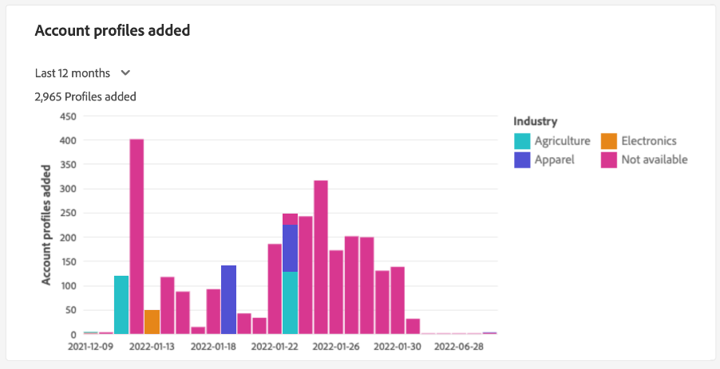

# [!UICONTROL Perfis de conta] painel

A interface do usuário (UI) do Adobe Experience Platform fornece um painel por meio do qual você pode visualizar informações importantes sobre os perfis de conta, conforme capturados durante um instantâneo diário. Este guia descreve como acessar e trabalhar com a [!UICONTROL Perfis de conta] painel na interface do usuário e fornece mais informações sobre as visualizações exibidas no painel.

Para obter uma visão geral de todos os recursos na interface do usuário do perfil da conta, visite o [guia da interface do usuário do perfil da conta](../../rtcdp/accounts/account-profile-ui-guide.md).

## Introdução

Você deve ter direito a [Adobe Real-time Customer Data Platform B2B Edition](../../rtcdp/b2b-overview.md) para acessar o B2B [!UICONTROL Perfis de conta] painel.

## Dados de perfis de conta

A variável [!UICONTROL Perfis de conta] o painel exibe um instantâneo das informações unificadas da conta de várias fontes em seus canais de marketing e dos diversos sistemas que sua organização usa atualmente para armazenar informações de conta do cliente.

Os dados do perfil no instantâneo mostram os dados exatamente como aparecem no momento específico em que o instantâneo foi tirado. Em outras palavras, o instantâneo não é uma aproximação ou uma amostra dos dados, e o [!UICONTROL Perfis de conta] O painel do não é atualizado em tempo real.

>[!NOTE]
>
>Quaisquer alterações ou atualizações feitas nos dados desde que o instantâneo foi tirado não serão refletidas no painel até que o próximo instantâneo seja tirado.

## Explore o [!UICONTROL Perfis de conta] painel

Para navegar até o [!UICONTROL Perfis de conta] no painel da interface do Platform, selecione **[!UICONTROL Perfis]** em [!UICONTROL Contas] no painel de navegação esquerdo.

No [!UICONTROL Perfis de conta] painel que você pode [procure os perfis de conta assimilados em sua organização](#browse-account-profiles)ou [visualizar todos os dados do perfil da sua conta rapidamente usando widgets](#standard-widgets) que visualizam aspectos dos dados.

## Procurar perfis de conta {#browse-account-profiles}

A variável [!UICONTROL Procurar] A guia permite pesquisar e visualizar os perfis de conta somente leitura assimilados em sua organização usando uma ID de conta de uma origem corporativa conectada ou inserindo os detalhes da origem diretamente. Aqui você pode ver informações importantes pertencentes ao perfil da conta, incluindo nome, setor, receita e público-alvo, entre outros.

Selecione o [!UICONTROL ID do perfil] a partir dos resultados exibidos no [!UICONTROL Procurar] para abrir a guia [!UICONTROL Detalhes] para o perfil da conta.

As informações de perfil da conta exibidas na variável [!UICONTROL Detalhes] A guia foi mesclada de vários fragmentos de perfil para formar uma única visualização da conta individual. Consulte a documentação em [procurar perfis de conta no Adobe Real-time Customer Data Platform](../../rtcdp/accounts/account-profile-ui-guide.md#browse-account-profiles) para saber mais sobre os recursos de visualização de perfil da conta na interface do usuário da plataforma.

## A variável [!UICONTROL Perfis de conta] [!UICONTROL Visão geral] {#overview}

A variável [!UICONTROL Visão geral] A guia é composta de widgets que fornecem métricas somente leitura para transmitir informações importantes sobre os perfis da sua conta. Selecionar **[!UICONTROL Modificar painel]** para alterar a aparência da variável [!UICONTROL Visão geral] movendo e redimensionando widgets.

Consulte o documento sobre [modificação de painéis](../customize/modify.md) e a variável [Visão geral da biblioteca de widgets](../customize/widget-library.md) para saber mais.

## Widgets padrão {#standard-widgets}

O Adobe fornece widgets padrão que você pode usar para visualizar métricas diferentes relacionadas aos seus perfis de conta.

Para saber mais sobre cada um dos widgets padrão disponíveis, selecione o nome de um widget na lista a seguir:

* [Total de contas por setor](#total-accounts-by-industry)
* [Perfis de conta adicionados](#account-profiles-added)
* [Distribuição de pontuação preditiva](#predictive-scoring-distribution)
* [Principais fatores influentes da pontuação preditiva](#predictive-scoring-top-influential-factors)

### Total de contas por setor {#total-accounts-by-industry}

Este widget exibe o número total de contas em uma única métrica e usa um gráfico de rosca para ilustrar os tamanhos proporcionais das contagens para os setores que compõem o número geral. A chave fornece informações de codificação de cores para os diferentes setores que compõem o gráfico de rosca.

As contagens individuais para os diferentes setores são exibidas em uma caixa de diálogo quando o cursor passa sobre a respectiva seção do gráfico de rosca.

### Perfis de conta adicionados {#account-profiles-added}

Este widget usa um gráfico de barras codificado por cores para ilustrar a contagem de perfis adicionados a uma conta em um determinado período e a proporção de diferentes setores que constituem esses perfis adicionados. Os setores são codificados por cores, e uma tecla fornece as informações de codificação por cores para os diferentes setores que compõem o gráfico de barras. O período de análise é selecionado no menu suspenso widget. O gráfico de barras pode ser visualizado em um período de 30 dias, 90 dias e 12 meses.

>[!NOTE]
>
>Como os perfis são adicionados somente a uma conta e nunca são removidos, o menor número possível de perfis adicionados em um período é zero.

### Distribuição de pontuação preditiva {#predictive-scoring-distribution}

A variável [!UICONTROL Distribuição de pontuação preditiva] O widget mostra a distribuição de pontuação de todos os perfis de conta para ajudar você a entender rapidamente a integridade do pipeline de vendas. Os dados de pontuação são transmitidos por um gráfico de rosca e um gráfico de coluna.

O gráfico de rosca ilustra a proporção do total de perfis de conta em cada um dos segmentos de alta, média e baixa propensão para compra. A tecla fornece mais detalhes sobre as seções codificadas por cores, incluindo os intervalos do intervalo de classificação de pontuação e o número de perfis de conta nesse intervalo.

O gráfico de colunas fornece um detalhamento de pontuação mais granular. Cada coluna mostra o número de perfis de conta em cada um dos 20 intervalos de incremento de cinco pontos.

O menu suspenso no widget permite selecionar o modelo de pontuação da conta.

### Principais fatores influentes da pontuação preditiva {#predictive-scoring-top-influential-factors}

A variável [!UICONTROL Principais fatores influentes da pontuação preditiva] O widget ajuda você a entender os fatores mais significativos que determinam as pontuações para cada intervalo de propensão.

Este widget mostra os principais fatores influentes para cada um dos intervalos de alta, média e baixa propensão. Uma barra para cada fator influente indica a porcentagem dos perfis de conta nesse intervalo de propensão que contém o fator influente específico.

O menu suspenso no widget permite selecionar o modelo de pontuação da conta.

## Próximas etapas

Ao seguir este documento, agora você deve saber como localizar o [!UICONTROL Perfis de conta] painel. Você também deve entender as métricas exibidas nos widgets disponíveis. Para saber mais sobre como trabalhar com perfis de conta como parte de seus dados B2B na interface do usuário do Experience Platform, consulte o [visão geral dos perfis de conta](../../rtcdp/accounts/account-profile-overview.md) para o Adobe Real-Time CDP, B2B Edition.
